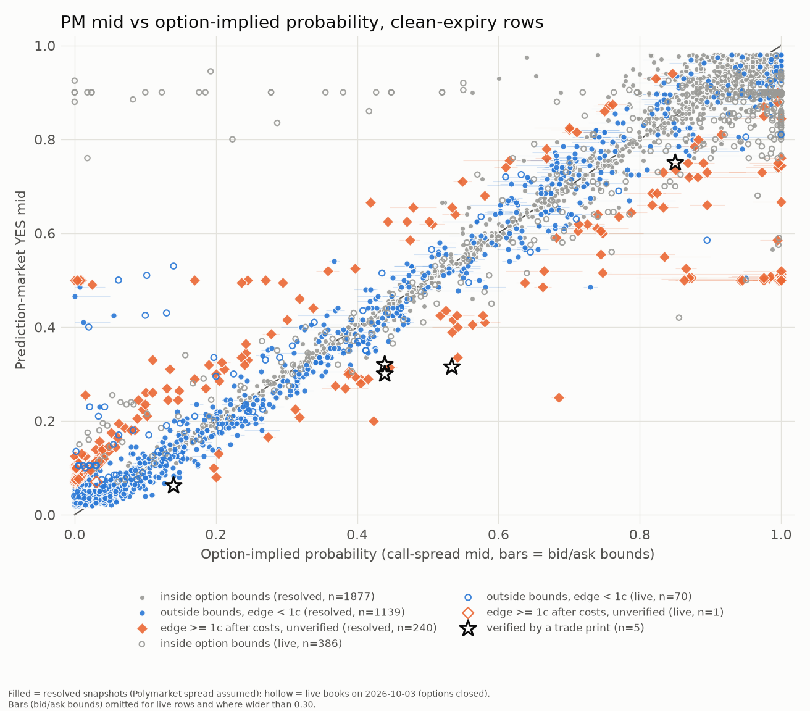

# Options-arbitrage scan: prediction-market probability vs option-implied probability

Run date 2026-10-03 (Saturday; US options closed). Window of resolved markets: 2026-08-15 to 2026-10-12. Method, pre-registered before any scan data was fetched: [`research/arb/METHOD.md`](../../arb/METHOD.md). Rows: [`arb_gaps.csv`](arb_gaps.csv). Chart: [`arb_gap_chart.png`](arb_gap_chart.png). Run log: [`RUN_LOG.md`](RUN_LOG.md).

## Answer

**5 genuine gap(s) survive costs and verification** (5 resolved, 0 live; 0 executable). Before verification the pre-registered cost screen alone passes 224 rows (`gap_robust`) and 246 clear one cent on the narrow spread (`gap_net`), but those all rest on an *assumed* Polymarket spread, and only 5 of 224 resolved Polymarket candidates have a public trade print at the price they need (section 'Verification'). Of the 5 verified, 5 had a print smaller than the 200+ PM shares one option contract hedges, so none could be hedged cleanly at the size that actually traded. The 5 verified rows are 4 distinct (underlying, date, strike) gaps, each backed by a single print of 5 to 100 shares, within 10 minutes of the snapshot, not at it. 1 of them is flagged `coarse` (narrow and wide call spreads disagree by more than 5 points), so its option-implied probability is the least reliable of the five.

A descriptive scan of listed threshold contracts against call spreads built from Massive NBBO quotes; nothing was traded and 'zero' would have been an acceptable answer. Read the counts below with the caveats at the end: the hedge is an approximation, the resolved Polymarket spread is assumed, and the live rows are weekend-stale.

## Correction to the earlier version of this report

An earlier version of this report said one verified gap (NVDA > $215, 2026-09-02, YES bought at 0.71) survived. That was a bug, now fixed. The snapshot time was an America/New_York wall-clock written with a 'Z' (UTC) suffix, so the trade-print window of the verification step (amendment 3) was centred 4 hours too early (08:00 ET instead of 12:00 ET; 11:45 ET instead of 15:45 ET). The NVDA > $215 print it matched was a pre-market trade at 07:55 ET, and no print near 12:00 ET qualifies, so that row no longer verifies. Scoring itself was unaffected (it used the aware timestamp). The CSV now has a true-UTC `snap_utc` and an exact `snap_epoch`, and a test pins the conversion. Every candidate was re-verified at the right time. The candidate count also moved from 247 to 224 because the assumed Polymarket half-spread is the median of the live books at run time, and the live books were re-read (0.045 then, 0.050 now). A second fix: index option legs now use only the PM-settled roots (SPXW, NDXP); on monthly expiry days the contract listing also holds the AM-settled SPX and NDX roots, which could have been picked for a duplicated strike. The Kalshi counts did not change from that fix.

## Funnel (rows are market x snapshot)

Polymarket: 9814 markets seen in 1457 equity-tag events; 3136 are 'close above $K' thresholds (excluded: 5612 up/down, hit, range, market-cap, earnings or crypto; 1066 other). 2936 have ended, 200 are live. Kalshi: only 16:00 ET close markets of the S&P 500 and Nasdaq-100 (544 settled markets selected by volume, 460 open).

| group | rows | no PM price | PM stale | PM extreme (<2% or >98%) | no usable chain | scored | scored and clean expiry | expiry mismatch |
|---|---|---|---|---|---|---|---|---|
| Resolved Polymarket (PM spread assumed) | 5872 | 0 | 0 | 1822 | 400 | 3650 | 2761 | 889 |
| Resolved Kalshi (real bid/ask, sizes unknown) | 544 | 16 | 0 | 28 | 0 | 500 | 500 | 0 |
| Live Polymarket (real book; options closed) | 156 | 0 | 0 | 2 | 2 | 152 | 152 | 0 |
| Live Kalshi (real book; options closed) | 349 | 0 | 0 | 44 | 0 | 305 | 305 | 0 |

## Gaps by strictness (clean-expiry rows; each row counted at its strictest label and below)

| group | clean scored rows | gap_mid (>=) | gap_beyond_bounds (>=) | gap_net (>=) | gap_robust (>=) | gap_verified (>=) | gap_executable (>=) | distinct events at gap_robust | edge>=1c if PM spread were 1 tick |
|---|---|---|---|---|---|---|---|---|---|
| Resolved Polymarket (PM spread assumed) | 2761 | 1658 | 1300 | 245 | 224 | 5 | 0 | 111 | 517 |
| Resolved Kalshi (real bid/ask, sizes unknown) | 500 | 124 | 84 | 0 | 0 | 0 | 0 | 0 |  |
| Live Polymarket (real book; options closed) | 152 | 91 | 49 | 1 | 0 | 0 | 0 | 0 |  |
| Live Kalshi (real book; options closed) | 305 | 255 | 22 | 0 | 0 | 0 | 0 | 0 |  |

PM half-spread assumed on resolved Polymarket rows: 0.050 (median of 154 live books with mid in [2%, 98%]).

## Verification of the resolved Polymarket candidates

| set | rows | events |
|---|---|---|
| candidates (cost screen passed, spread assumed) | 224 | 111 |
| ...of which PM mid is exactly 0.50 (typically an unquoted placeholder midpoint) | 14 | 7 |
| ...with a trade print at the needed price within 10 min of the snapshot | 5 | 5 |

Why this step exists (amendment 3 in METHOD.md): the first full run produced hundreds of resolved Polymarket 'gaps' that were an artifact. The CLOB history is a regularly sampled series (a point every ~minute whether or not anything traded, so the age check is vacuous), and for thin markets its value is the midpoint of a book that can be 0.01 bid / 0.99 ask. Putting an assumed +/-4.5 cent spread around such a midpoint manufactures an edge against the options. A candidate is therefore promoted to `gap_verified` only if a public trade print (data-api trades, Yes-equivalent price and side) within 10 minutes of the snapshot shows a price at least as good as the breakeven.

Verified rows:

| market | res_date | snapshot | trade | pm_mid | p_lo | p_hi | need | verify_n | verify_size | hedge_shares_per_contract | edge | outcome |
|---|---|---|---|---|---|---|---|---|---|---|---|---|
| GOOGL > 350 | 2026-08-28 | S2 | B_buy_yes_sell_spread | 0.062 | 0.134 | 0.146 | 0.117 | 1.000 | 5.160 | 500.000 | 0.015 | 0.000 |
| SPY > 765 | 2026-08-31 | S1 | B_buy_yes_sell_spread | 0.750 | 0.830 | 0.870 | 0.807 | 1.000 | 100.000 | 200.000 | 0.017 | 1.000 |
| GOOGL > 345 | 2026-09-25 | S2 | B_buy_yes_sell_spread | 0.320 | 0.424 | 0.454 | 0.401 | 1.000 | 5.100 | 500.000 | 0.042 | 0.000 |
| GOOGL > 345 | 2026-09-25 | S2 | B_buy_yes_sell_spread | 0.300 | 0.424 | 0.454 | 0.401 | 1.000 | 5.100 | 500.000 | 0.062 | 0.000 |
| NVDA > 225 | 2026-09-25 | S2 | B_buy_yes_sell_spread | 0.315 | 0.530 | 0.538 | 0.507 | 1.000 | 5.100 | 500.000 | 0.153 | 1.000 |

## Largest gaps (all groups, strictest label first, then edge)

`edge` = best of the two trades after every cost, per $1 payoff; `strip_loss` = worst-case unhedged loss per share inside the spread strip.

| market | res_date | where | PM bid/ask | opt lo/mid/hi | edge | strip_loss | clean | label | outcome |
|---|---|---|---|---|---|---|---|---|---|
| NVDA > 225 | 2026-09-25 | S2 poly | 0.27/0.36 | 0.53/0.53/0.54 | 0.153 | 0.500 | y | gap_verified | 1.000 |
| GOOGL > 345 | 2026-09-25 | S2 poly | 0.25/0.35 | 0.42/0.44/0.45 | 0.062 | 0.500 | y | gap_verified | 0.000 |
| GOOGL > 345 | 2026-09-25 | S2 poly | 0.27/0.37 | 0.42/0.44/0.45 | 0.042 | 0.500 | y | gap_verified | 0.000 |
| SPY > 765 | 2026-08-31 | S1 poly | 0.70/0.80 | 0.83/0.85/0.87 | 0.017 | 0.500 | y | gap_verified | 1.000 |
| GOOGL > 350 | 2026-08-28 | S2 poly | 0.01/0.11 | 0.13/0.14/0.15 | 0.015 | 0.500 | y | gap_verified | 0.000 |
| TSLA > 390 | 2026-09-21 | S1 poly | 0.45/0.55 | 0.00/0.00/0.01 | 0.431 | 0.500 | y | gap_robust | 0.000 |
| SPY > 775 | 2026-09-03 | S1 poly | 0.45/0.55 | 0.01/0.01/0.02 | 0.419 | 0.500 | y | gap_robust | 0.000 |
| SPY > 745 | 2026-09-03 | S1 poly | 0.45/0.55 | 0.98/1.00/1.00 | 0.414 | 0.500 | y | gap_robust | 1.000 |
| SPY > 735 | 2026-09-03 | S1 poly | 0.46/0.56 | 0.98/1.00/1.00 | 0.407 | 0.500 | y | gap_robust | 1.000 |
| SPY > 740 | 2026-09-03 | S1 poly | 0.46/0.56 | 0.98/1.00/1.00 | 0.405 | 0.500 | y | gap_robust | 1.000 |
| SPY > 750 | 2026-09-03 | S1 poly | 0.45/0.55 | 0.97/1.00/1.00 | 0.404 | 0.500 | y | gap_robust | 1.000 |
| SPY > 755 | 2026-09-03 | S1 poly | 0.45/0.55 | 0.96/0.98/0.99 | 0.394 | 0.500 | y | gap_robust | 1.000 |
| SPY > 770 | 2026-09-02 | S1 poly | 0.44/0.54 | 0.02/0.03/0.03 | 0.394 | 0.500 | y | gap_robust | 0.000 |
| AMZN > 250 | 2026-09-02 | S2 poly | 0.45/0.55 | 0.95/0.98/1.00 | 0.386 | 0.500 | y | gap_robust | 1.000 |
| OPEN > 1.5 | 2026-09-25 | S1 poly | 0.45/0.55 | 0.95/1.00/1.00 | 0.377 | 0.500 | y | gap_robust | 1.000 |

## Size of the raw gap (PM mid minus option-implied mid)

| grp | median_pm_spread | n | mean_gap | median_gap | mean_abs_gap | share_abs_ge_5pt | share_inside_bounds |
|---|---|---|---|---|---|---|---|
| live kalshi | 0.230 | 305 | 0.014 | -0.073 | 0.153 | 0.833 | 0.928 |
| live polymarket | 0.100 | 152 | -0.002 | -0.000 | 0.061 | 0.428 | 0.678 |
| resolved kalshi | 0.040 | 500 | -0.001 | -0.003 | 0.023 | 0.102 | 0.832 |
| resolved polymarket | 0.100 | 2761 | -0.009 | -0.004 | 0.045 | 0.314 | 0.529 |

Resolved rows by PM mid (positive = PM above options):

| bucket | n | mean_gap | mean_abs_gap |
|---|---|---|---|
| (0.019, 0.2] | 891 | 0.013 | 0.025 |
| (0.2, 0.4] | 305 | -0.002 | 0.038 |
| (0.4, 0.6] | 338 | -0.029 | 0.080 |
| (0.6, 0.8] | 359 | -0.007 | 0.050 |
| (0.8, 0.98] | 1368 | -0.018 | 0.042 |

## Calibration on resolved rows

| venue | n | events | brier_pm | brier_options | diff_pm_minus_options |
|---|---|---|---|---|---|
| kalshi | 500 | 68 | 0.2029 | 0.2033 | -0.0004 |
| polymarket | 2761 | 272 | 0.0843 | 0.0789 | 0.0054 |

Pooled: mean(Brier_PM - Brier_options) = +0.0045 over 3261 rows in 340 events; event-cluster bootstrap 95% interval [+0.0033, +0.0081]. Negative means the PM mid was closer to the realised result. Descriptive only (strikes of one ladder share one price path), and the PM mid of a thin market is sometimes the midpoint of a very wide book, which handicaps it against options quotes.

## Caveats

- **The hedge is not riskless.** A call spread replicates the PM digital only outside the strip [K1, K2]. Inside it a short YES against a long spread can lose up to `strip_loss` per share (0.5 for a centred spread). Every "edge" here is against an approximating hedge.
- **Timing mismatch.** PM points are last trades (resolved) or the live book; option legs are NBBO at the same wall-clock second, not the same tick. PM resolves on the Pyth 1-minute close of 16:00 ET; options settle to the official close; Kalshi uses the index value at 16:00 ET.
- **Expiry mismatch.** Rows whose nearest listed expiry is after the resolution date are kept in the CSV (`clean = False`) and excluded from every count above; the option then prices a later date.
- **Index vs ETF proxy.** Kalshi index contracts use SPX/NDX options directly (European, PM-settled). Polymarket's SPY contracts use SPY options (American, small dividend effect). No proxy was substituted anywhere.
- **Assumed PM spread.** Historical Polymarket books are not published. Resolved Polymarket rows use YES mid -/+ the median half-spread of the live books of the same run, so they can show a screening gap, not an executable edge. The `edge>=1c if PM spread were 1 tick` column shows how much of the result depends on that assumption (it is a best case, not an observation).
- **Kalshi history** comes from 1-minute candlestick bid/ask closes (real quotes, no sizes). Kalshi markets were chosen by trading volume (top 8 per event), a liquidity filter, not by outcome.
- **Live rows are stale by construction.** The run happened on Saturday 2026-10-03: equity and index options were closed, so option quotes are Friday-close NBBO against weekend PM books. No live row can be `gap_executable`; the live part is a structural look at the books, not a trade signal. The command in RUN_LOG.md re-runs it when the market is open.
- **Size.** One option contract hedges `100 * w` PM shares (w = spread width in dollars); live PM books show 5 to a few hundred shares at the touch, so a whole spread is usually not fillable and any edge is worth a few cents.
- **Overlapping rows.** A ladder of strikes on one underlying and day shares one price path and one option chain, and S1 and S2 rows of the same market are not independent. Counts are rows, not independent trials; no significance test is claimed.
- **Smoothing.** The spread is an average of the risk-neutral probability over [K1, K2]; `width_sens` and `coarse` show where narrow and wide spreads disagree by more than 5 points.
- **Fees** are the venues' published formulas as read from market metadata (Polymarket `feeSchedule`) or assumed at the standard Kalshi rate; option commission is an assumed $0.65 per contract per leg.

