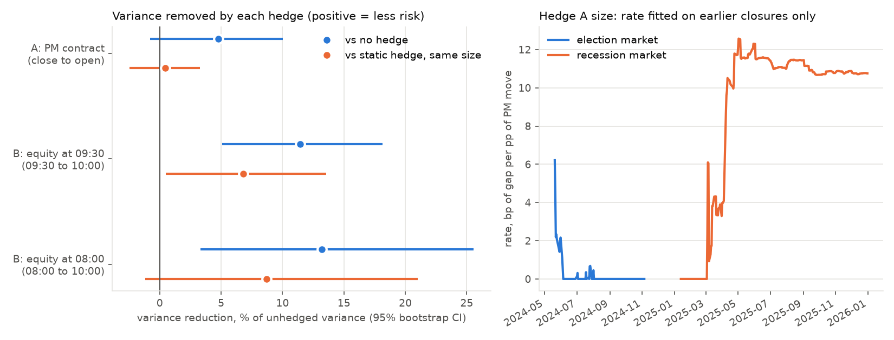

# R1: does closed-market hedging reduce the loss at the open?

Rules fixed in [METHOD.md](../../closed_hedge/METHOD.md) and committed before the run (pre-registered analysis of an already-seen closure panel; the only new data are today's live Polymarket books for the cost assumption). A long SPY holder at the close; two hedges from the product spec; each judged on the variance of its P&L against no hedge and against a static hedge of the same average size.

## Headline

- Over 346 unselected closures, holding the adverse prediction-market contract through the closure (hedge A) gave a variance reduction of the open-gap P&L of +4.76% vs no hedge (95% CI -0.80% to +10.01%) and +0.47% vs a static hedge of the same average size (CI -2.46% to +3.27%): **no evidence**. The equity hedge staged for the 09:30 open (hedge B) gave +11.42% on the post-open P&L (CI +5.10% to +18.14%) and +6.82% vs static (CI +0.50% to +13.54%): **reduces the loss variance**. Positive = less variance.
- Sample: 346 of 380 placebo closures (the first 34 have no rate yet: fewer than 20 earlier closures). Rate source: {'market': 324, '': 34, 'pooled': 22}.
- Pre-set criterion (both bootstrap CIs above 0): hedge A **no evidence**, hedge B (09:30) **reduces the loss variance**; secondary 08:00 variant: **partial**.
- In-sample ceiling (look-ahead, full-panel slope per market election 0.00, recession 10.75 bp/pp): a PM-sized gap hedge could have removed at most +6.9% of the gap variance on these closures.
- Cost: PM half-spread 0.05 pp (median of 21 usable live books out of the 100 top markets by lifetime volume; the rest were one-sided or priced outside [2%, 98%]; fetched 2026-10-03T16:52:46+00:00). Hedge A costs 0.60 bp per closure on average; hedge B hedges 2.3% of the position on average and is active in 20% of closures.
- Replication panel: not available (results.csv not committed when this study ran).

## Primary tests (METHOD.md section 4)

Variance reduction `VR0 = 1 - Var(hedged)/Var(unhedged)`; gain over static `VRS = (Var(static) - Var(hedged))/Var(unhedged)`. Point estimate [95% iid bootstrap CI, 10,000 paired resamples].

| Hedge | Window | n | sd unhedged (bp) | sd hedged (bp) | sd static (bp) | VR0 | VRS | static vs none | verdict |
|---|---|---|---|---|---|---|---|---|---|
| Hedge A: PM contract over the closure | close to open (the gap) | 346 | 60.32 | 58.86 | 59.01 | +4.76% [-0.80%, +10.01%] | +0.47% [-2.46%, +3.27%] | +4.29% | no evidence |
| Hedge B: equity hedge at the 09:30 open | 09:30 to 10:00 ET | 346 | 27.49 | 25.87 | 26.85 | +11.42% [+5.10%, +18.14%] | +6.82% [+0.50%, +13.54%] | +4.60% | reduces the loss variance |
| Hedge B variant: equity hedge at 08:00 ET | 08:00 to 10:00 ET | 345 | 37.07 | 34.53 | 36.22 | +13.21% [+3.34%, +25.54%] | +8.69% [-1.18%, +21.02%] | +4.52% | partial |

Static sizes: hedge A 5.96 bp/pp (= 0.0596 adverse contracts per $ of SPY); hedge B fraction 0.0233; 08:00 variant 0.0229.

## P&L per $ of position (bp)

**Hedge A: PM contract over the closure** (close to open (the gap))

| strategy | mean | sd | 5th pct | worst | mean on bad opens (n) |
|---|---|---|---|---|---|
| no hedge | +5.74 | 60.32 | -99.4 | -400.4 | -110.5 (35) |
| hedge | +4.73 | 58.86 | -99.1 | -400.4 | -108.5 (35) |
| static, same average size | +5.00 | 59.01 | -95.9 | -401.0 | -106.9 (35) |

**Hedge B: equity hedge at the 09:30 open** (09:30 to 10:00 ET)

| strategy | mean | sd | 5th pct | worst | mean on bad opens (n) |
|---|---|---|---|---|---|
| no hedge | +0.46 | 27.49 | -50.8 | -102.8 | -64.6 (18) |
| hedge | +0.35 | 25.87 | -48.5 | -74.0 | -59.8 (18) |
| static, same average size | +0.36 | 26.85 | -49.7 | -100.5 | -63.2 (18) |

**Hedge B variant: equity hedge at 08:00 ET** (08:00 to 10:00 ET)

| strategy | mean | sd | 5th pct | worst | mean on bad opens (n) |
|---|---|---|---|---|---|
| no hedge | +0.95 | 37.07 | -55.9 | -187.6 | -74.7 (22) |
| hedge | +0.49 | 34.53 | -55.9 | -187.6 | -72.8 (22) |
| static, same average size | +0.84 | 36.22 | -54.7 | -183.4 | -73.1 (22) |

"Bad opens" = closures where the unhedged P&L in that window was worse than -50 bp.

## Secondary (METHOD.md section 5; not part of the verdict)

**Block bootstrap** (moving blocks of 10 consecutive closures):

| Hedge | VR0 | VRS | verdict under block CIs |
|---|---|---|---|
| A | +4.76% [-1.33%, +9.74%] | +0.47% [-2.46%, +3.08%] | no evidence |
| B | +11.42% [+3.89%, +19.20%] | +6.82% [-0.71%, +14.60%] | partial |
| B08 | +13.21% [+2.63%, +25.37%] | +8.69% [-1.89%, +20.85%] | partial |

**Costs:**

| Variant | VR0 | VRS | mean hedged P&L (bp) |
|---|---|---|---|
| hs=0.1pp | +4.73% [-0.90%, +9.98%] | +0.44% [-2.51%, +3.23%] | +4.14 |
| hs=5.0pp | -74.15% [-123.83%, -42.65%] | -78.44% [-126.22%, -47.28%] | -54.27 |
| pre-market equity 10.0bp/side | +13.56% [+3.17%, +26.47%] | +9.04% [-1.34%, +21.95%] | n/a |

The 5.0 pp case is the median half-spread of thin live equity-threshold books in the arb run (5.0 pp). Hedge A's cost is 2 x hs x rate bp per closure, so at a wide spread it varies with the fitted rate from closure to closure: it then adds variance as well as lowering the mean.

**Hedge B scale K** (expected loss that hedges the whole position):

| K (bp) | B at 09:30 VR0 | VRS | B at 08:00 VR0 | VRS |
|---|---|---|---|---|
| 50 | +19.14% [+8.81%, +30.20%] | +10.05% [-0.28%, +21.11%] | +21.18% [+5.90%, +39.70%] | +12.34% [-2.94%, +30.85%] |
| 200 | +6.17% [+2.70%, +9.86%] | +3.86% [+0.39%, +7.55%] | +7.26% [+1.76%, +14.21%] | +4.99% [-0.51%, +11.93%] |

**Hedge A per market** (static size = that market's mean rate):

| Market | n | mean rate (bp/pp) | VR0 | VRS |
|---|---|---|---|---|
| election | 115 | 0.25 | -0.39% [-1.36%, -0.08%] | -0.30% [-1.16%, -0.02%] |
| recession | 231 | 8.80 | +7.19% [-0.81%, +13.72%] | -2.57% [-7.68%, +2.01%] |

**Whole path, close to 10:00 ET** (unhedged sd 66.8 bp): VR0 hedge A alone +4.28%, hedge B alone +2.35%, A then B (the product's handoff) +6.84%.

**All 397 closures** (17 hindsight-selected news closures added; n evaluated 363): hedge A VR0 +13.78% [+4.39%, +23.14%], VRS +1.04% [-5.00%, +6.85%] (partial); hedge B VR0 +18.51% [+6.93%, +30.21%], VRS +10.85% [-0.74%, +22.55%] (partial).

**Replication panel:** not available (results.csv not committed when this study ran).

**Concentration check, exploratory** (METHOD.md Amendment 1, added after the run): the gain over the static hedge after dropping the k closures that contribute most to it.

| Hedge | all | drop 1 | drop 3 | drop 5 | top contributors (closure day) |
|---|---|---|---|---|---|
| A | VRS +0.47% | -0.01% | -0.58% | -1.07% | 2025-04-22, 2025-04-30, 2025-04-09, 2025-04-29, 2025-05-22 |
| B | VRS +6.82% | +4.11% | +1.06% | -0.78% | 2025-04-08, 2025-04-29, 2025-04-10, 2025-03-03, 2025-07-31 |
| B08 | VRS +8.69% | +1.24% | -0.49% | -1.57% | 2025-04-08, 2025-06-05, 2025-04-09, 2025-03-03, 2025-04-14 |

## What this means for the product

- **Hedge A (no evidence).** It is the only hedge that can touch the gap itself, because it is on while equities are shut. Its ceiling is how much of the gap the PM move explains: +6.9% with hindsight on these closures; the rate fitted without hindsight got +4.76% (CI -0.80% to +10.01%). In the app it should be labelled as an estimate with a wide band, never as protection.
- **Hedge B at 09:30 (reduces the loss variance).** It cannot reduce the gap; it changes the risk after the open. Its measured gain comes from timing, not direction: it is active only after an adverse expected gap (69 closures), and the first 30 minutes after those closures were more volatile (sd 36.5 bp vs 24.8 bp otherwise) while the hedge size did not predict the direction (correlation of size with the 30-minute return +0.00). The concentration check above shows how much of that rests on a few closures, and the block bootstrap is weaker; treat it as a supporting signal for staging an order at the first tradable moment, not as a protection against the gap.
- **Costs.** At today's top-book spread hedge A costs 0.60 bp per closure on average; at thin-book spreads (5.0 pp) it would cost far more than it saves.

## Caveats

- Pre-registered analysis of data already analysed in the closed-market study; not a fresh sample.
- Two markets, one per period, loosely tied to SPY; rates differ a lot between them.
- PM fills are simulated at mid plus or minus today's median half-spread; historical books are not published, and a large hedge would walk the book. No financing or capital charge for the cash paid for contracts.
- Closures are not independent; the block bootstrap is the check.
- Hedge B is measured to 10:00 ET only (the first-30-minute horizon of the panel).

## Files

`closures_hedged.csv` (every closure: inputs, rate, sizes, each strategy's P&L, exclusion reason), `results.json` (every statistic), `chart.png`, `books_live.json` (the live books behind the spread), `RUN_LOG.md`. Code in `research/closed_hedge/`, synthetic tests in `research/closed_hedge/tests/`.
