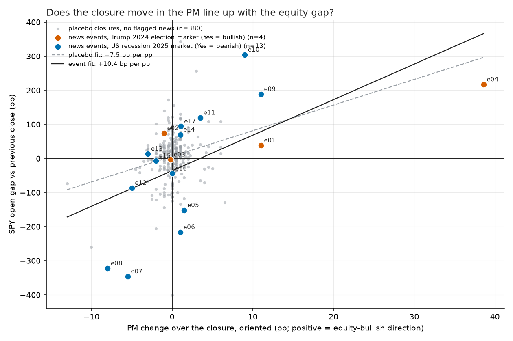
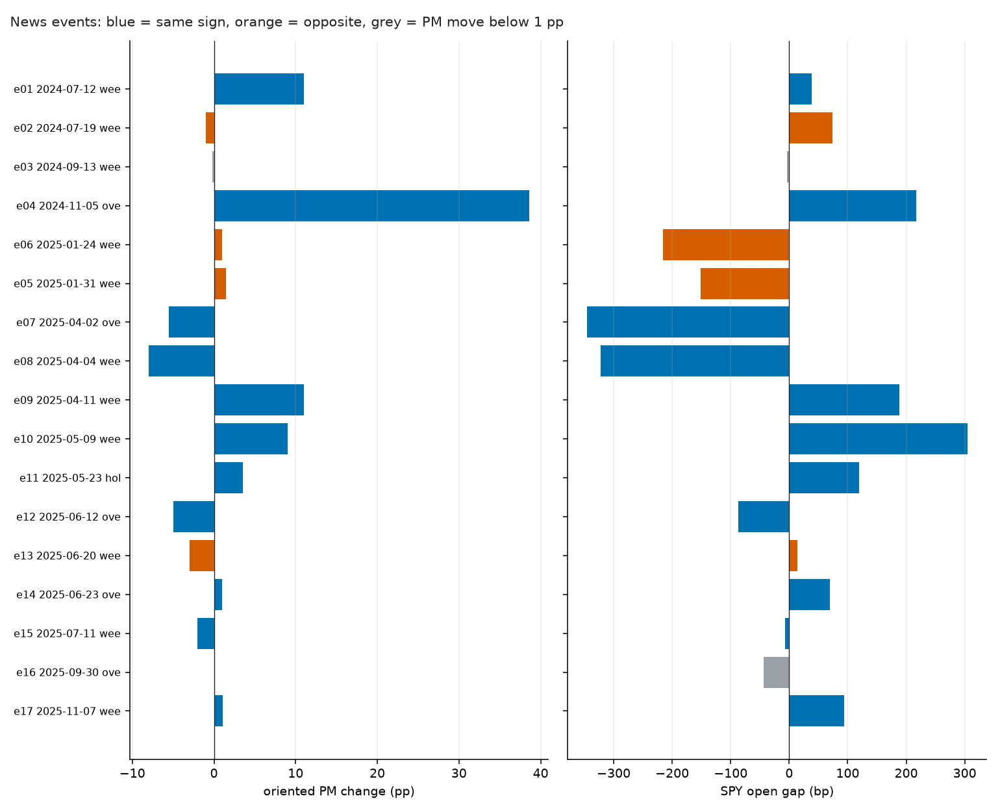
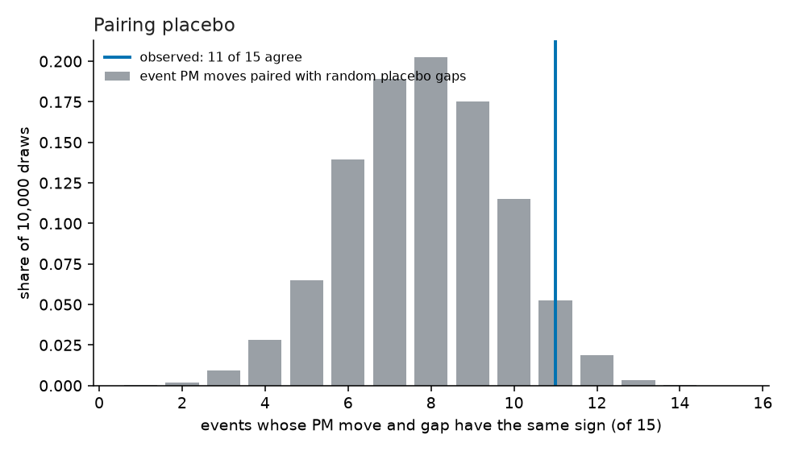

# Closed-market lead-lag: does a prediction-market move during a US equity closure predict the equity gap?

Narrow claim, tested after the wave-1 study found no PM lead during market hours: when news breaks while the regular equity session is closed (nights, weekends, holidays), the PM move from the last close to the next open predicts the SPY opening gap. Rules were fixed in [METHOD.md](../../leadlag_closed/METHOD.md) and committed before any event-window price was fetched. **Hindsight-selected case studies plus an unselected placebo panel: supporting evidence at best, not proof, and co-movement rather than a proven lead.**

## Headline

- Events: 17 pre-registered news closures, **17 usable** (PM quote and SPY bars at both ends). Placebo closures: 380 usable of 380 (every closure of two fixed date ranges, minus the event closures).
- Under the pre-set rule (METHOD.md section 4) the verdict is **mixed**.
- The three conditions: sign test significant with agreement above 50% = not met; slope positive with permutation p < 0.05 = met; pairing placebo p < 0.05 = not met.
- In the events, the PM and the equity gap pointed the same way in 11 of 15 closures where the PM moved at least 1 pp (73%, exact p = 0.118). With so few events, even a clear tilt may fall short of significance; a count that high or low would be needed to reject 50/50 at n = 15: at least 12 agreeing or disagreeing.
- The slope is +10.43 bp of gap per pp of PM change (HC3 t = +0.84, R-squared 0.38, permutation p = 0.005, Spearman rho +0.73).
- On the placebo closures the same PM-vs-gap relation shows 89 of 149 agreeing (60%, p = 0.021) and a slope of +7.52 bp per pp (permutation p = 0.001). A relation of this kind in the unflagged closures means the PM-equity co-movement is not special to the selected news days.
- Pairing each event's PM move with a random placebo gap gives 7.8 agreeing events on average against the observed 11 (p = 0.075); slope p = <0.001.
- The interaction term (extra response per pp on news closures) is +2.91 bp per pp (HC3 t = +0.23); the baseline response over all closures is +7.52 (t = +2.58).
- **Bottom line:** the PM closure move and the equity gap are positively related across the selected news events (rank correlation significant); the same relation also appears in closures with no flagged news, and news closures do not show an extra response; the PM move up to 08:00 ET does not predict the SPY move from 08:00 ET to the open. This is co-movement over the closure, not by itself evidence that the PM leads equities.

## Event table

PM columns are the Yes-price in percentage points at the closure start and end; `oriented` multiplies the change by the market's pre-set sign (+1 Trump-wins market, -1 recession market) so that positive means the equity-bullish direction. Gaps are in basis points. `news ET` is approximate and decides only which closure the event belongs to.

| Event | Closure (close day to open day) | Type | Market | News ET (approx) | PM close | PM open | PM change | Oriented | SPY gap (bp) | SPY first 30 min (bp) | QQQ gap (bp) | Same sign? |
|---|---|---|---|---|---|---|---|---|---|---|---|---|
| Trump assassination attempt (Saturday evening) | 2024-07-12 to 2024-07-15 | weekend | election | 2024-07-13 18:11 | 59.5 | 70.5 | +11.0 | +11.0 | +38 | -2 | +36 | yes |
| Biden withdraws from the race (Sunday afternoon) | 2024-07-19 to 2024-07-22 | weekend | election | 2024-07-21 13:46 | 65.5 | 64.5 | -1.0 | -1.0 | +74 | -6 | +125 | no |
| Second Trump assassination attempt (Sunday afternoon) | 2024-09-13 to 2024-09-16 | weekend | election | 2024-09-15 14:00 | 49.2 | 49.0 | -0.2 | -0.2 | -4 | +13 | -45 | PM move below 1 pp |
| Election called for Trump overnight | 2024-11-05 to 2024-11-06 | overnight | election | 2024-11-06 02:30 | 61.2 | 99.8 | +38.6 | +38.6 | +217 | -52 | +169 | yes |
| DeepSeek AI model shock (Sunday night) | 2025-01-24 to 2025-01-27 | weekend | recession | 2025-01-26 18:00 | 25.5 | 24.5 | -1.0 | +1.0 | -216 | +64 | -352 | no |
| Canada/Mexico/China tariff orders signed (Saturday) | 2025-01-31 to 2025-02-03 | weekend | recession | 2025-02-01 17:00 | 25.0 | 23.5 | -1.5 | +1.5 | -152 | -11 | -169 | no |
| Liberation Day tariff announcement (Wednesday 16:00 ET) | 2025-04-02 to 2025-04-03 | overnight | recession | 2025-04-02 16:15 | 39.5 | 45.0 | +5.5 | -5.5 | -346 | -3 | -414 | yes |
| Weekend tariff turmoil, Sunday take-medicine remarks | 2025-04-04 to 2025-04-07 | weekend | recession | 2025-04-06 18:00 | 55.5 | 63.5 | +8.0 | -8.0 | -323 | +133 | -344 | yes |
| Electronics tariff exemption notice (Friday night) | 2025-04-11 to 2025-04-14 | weekend | recession | 2025-04-11 22:00 | 61.5 | 50.5 | -11.0 | +11.0 | +189 | -66 | +225 | yes |
| US-China Geneva tariff truce statement (Monday pre-market) | 2025-05-09 to 2025-05-12 | weekend | recession | 2025-05-12 05:00 | 50.5 | 41.5 | -9.0 | +9.0 | +304 | -46 | +388 | yes |
| EU 50 pct tariff postponed (Sunday, Memorial Day weekend) | 2025-05-23 to 2025-05-27 | holiday | recession | 2025-05-25 07:00 | 40.5 | 37.0 | -3.5 | +3.5 | +119 | +1 | +135 | yes |
| Israel strikes Iran (Thursday night) | 2025-06-12 to 2025-06-13 | overnight | recession | 2025-06-12 20:00 | 22.5 | 27.5 | +5.0 | -5.0 | -86 | -6 | -112 | yes |
| US strikes Iranian nuclear sites (Saturday night) | 2025-06-20 to 2025-06-23 | weekend | recession | 2025-06-21 19:50 | 28.5 | 31.5 | +3.0 | -3.0 | +14 | +27 | +2 | no |
| Israel-Iran ceasefire announced (Monday evening) | 2025-06-23 to 2025-06-24 | overnight | recession | 2025-06-23 18:02 | 27.5 | 26.5 | -1.0 | +1.0 | +70 | -5 | +98 | yes |
| 30 pct tariff letters to EU and Mexico (Saturday) | 2025-07-11 to 2025-07-14 | weekend | recession | 2025-07-12 12:00 | 19.5 | 21.5 | +2.0 | -2.0 | -7 | -8 | -4 | yes |
| Government shutdown begins at midnight | 2025-09-30 to 2025-10-01 | overnight | recession | 2025-10-01 00:00 | 6.5 | 6.5 | +0.0 | -0.0 | -44 | +9 | -53 | PM move below 1 pp |
| Senate advances bill to end shutdown (Sunday night) | 2025-11-07 to 2025-11-10 | weekend | recession | 2025-11-09 21:00 | 4.6 | 3.5 | -1.1 | +1.1 | +94 | +19 | +150 | yes |

## Tests on the news events (METHOD.md section 4)

**T1 sign agreement** (exact two-sided binomial against 50%; headline threshold 1.0 pp):

| Min PM move | Events | Agree | Rate | p |
|---|---|---|---|---|
| 1.0 pp (headline) | 15 | 11 | 73% | 0.118 |
| 0.5 pp | 15 | 11 | 73% | 0.118 |
| 2.0 pp | 10 | 9 | 90% | 0.021 |

**T2 regression** `gap = a + b * oriented PM change`, n = 17: b = +10.43 bp per pp, HC3 t = +0.84, R-squared = 0.381, permutation p = 0.005 (10,000 shuffles). Spearman rho = +0.73 (permutation p = 0.002).

**Leverage check, exploratory (METHOD.md Amendment 2, added after the first run).** Leave-one-event-out slope: +9.0 (without e08) to +22.7 (without e04), positive in 17 of 17. Only the 13 recession-market events: slope +28.51 bp per pp (HC3 t = +4.16, permutation p = 0.001), Spearman rho +0.77 (p = 0.002). The election call (e04) is a very large, high-leverage point: it inflates the HC3 standard error (hence a low HC3 t next to a small permutation p). It does not carry the slope, since dropping it makes the slope larger, not smaller; the two markets simply have different bp-per-pp scales (a Trump-odds point and a recession-odds point are not the same unit of news).

Secondary (not part of the decision rule):

- **T3 first 30 minutes after the open**: sign agreement at 1 pp: 7 of 15 agree (47%), p = 1.000. Slope -2.44 bp per pp (t = -0.93, permutation p = 0.044, n = 17). Gap vs first-30-minute direction: the move continued the gap's direction in 7 of 17 events.
- **T4 residual gap** (PM change up to 08:00 ET against the SPY move from 08:00 ET to the open): sign agreement 7 of 16 agree (44%), p = 0.804; slope +0.62 bp per pp (t = +0.22, permutation p = 0.278, n = 17). A slope near zero here would mean pre-market SPY had already absorbed the PM move by 08:00 ET.
- Subset, overnight closures: 4 of 4 agree (100%), p = 0.125; slope +8.64 bp per pp (permutation p = 0.178, n = 5).
- Subset, weekend and holiday closures: 7 of 11 agree (64%), p = 0.549; slope +20.35 bp per pp (permutation p = 0.014, n = 12).
- Subset, election market: 2 of 3 agree (67%), p = 1.000.
- Subset, recession market: 9 of 12 agree (75%), p = 0.146.

## Placebo (METHOD.md section 5)

Median absolute SPY gap: events 94 bp, placebo closures 28 bp. Closure types, events: {'weekend': 11, 'overnight': 5, 'holiday': 1}; placebo: {'overnight': 305, 'weekend': 63, 'holiday': 12}.

**P1 the same tests on closures with no flagged news**

| Min PM move | Closures | Agree | Rate | p |
|---|---|---|---|---|
| 1.0 pp (headline) | 149 | 89 | 60% | 0.021 |
| 0.5 pp | 207 | 122 | 59% | 0.012 |
| 2.0 pp | 59 | 37 | 63% | 0.067 |

Slope on all 380 placebo closures: b = +7.52 bp per pp, HC3 t = +2.58, R-squared = 0.042, permutation p = 0.001. By panel at 1 pp: election: 31 of 66 agree (47%), p = 0.712 (n closures 149); recession: 58 of 83 agree (70%), p = <0.001 (n closures 231).

**P2 pairing placebo** (events with PM move >= 1 pp, n = 15): each event's PM move paired with the gap of a random placebo closure from the same panel, 10,000 draws. Observed agreeing events 11 vs 7.8 on average under pairing; p = 0.075. Observed slope +10.49 vs +0.10 on average; p = <0.001.

**P3 interaction** (events plus placebo, n = 397): `gap = a + b*dpm + c*news + d*dpm*news`; b = +7.52 (t = +2.58), d = +2.91 (t = +0.23).

## Caveats

- **Hindsight selection.** The 17 events were chosen after the fact, knowing they were big news days. Large gaps are therefore likely by construction, and the sign agreement is a statement about these days, not about a forecast made in advance. The placebo panels are unselected and are the guard against this, not a cure.
- **Shared markets.** 13 events use the same recession market and 4 use the Trump market. Events are not independent draws; the binomial and slope p-values are somewhat too optimistic.
- **Co-movement, not lead.** PM change and gap cover the same window. A positive relation says they moved together over the closure, not that the PM moved first. Only the residual-gap test (T4) looks at timing.
- **Equities are not literally closed.** SPY trades after hours and pre-market, and futures trade almost around the clock. The gap is measured against regular-session prints. The PM is therefore not the only price during the closure.
- **Loose market-to-news fit and a fixed sign.** A recession market is an imperfect mirror of tariff, strike or shutdown news. Using one market and one sign per period was chosen to avoid picking favourable markets per event; it costs relevance, and the 2025-10-01 and 2025-11-09 shutdown events and the DeepSeek weekend fit especially loosely.
- **Level dependence.** A 1 pp PM move is large at 3% and small at 50%. The recession market fell toward the low single digits in late 2025, so late-2025 closures rarely pass the 1 pp threshold.
- **Small n.** The sign test has little power; a null does not show absence of an effect, and a significant result would be driven by few events.
- **Not tested.** A tradeable lead (a PM move at time t inside the closure predicting the *remaining* equity move) would need an intra-closure timing design; T4 is the closest piece here.
- **Placebo is not news-free.** Scheduled releases at 08:30 ET (CPI, jobs) and unflagged news sit in the placebo closures.

## Files

`closures_all.csv` (every closure: PM close/open, change, SPY gap, first-30-minute return, residual, QQQ gap, flags), `events.csv` (the table above), `tests.json` (every statistic), `charts/`, `RUN_LOG.md`. Code in `research/leadlag_closed/`, tests in `research/leadlag_closed/tests/`.
