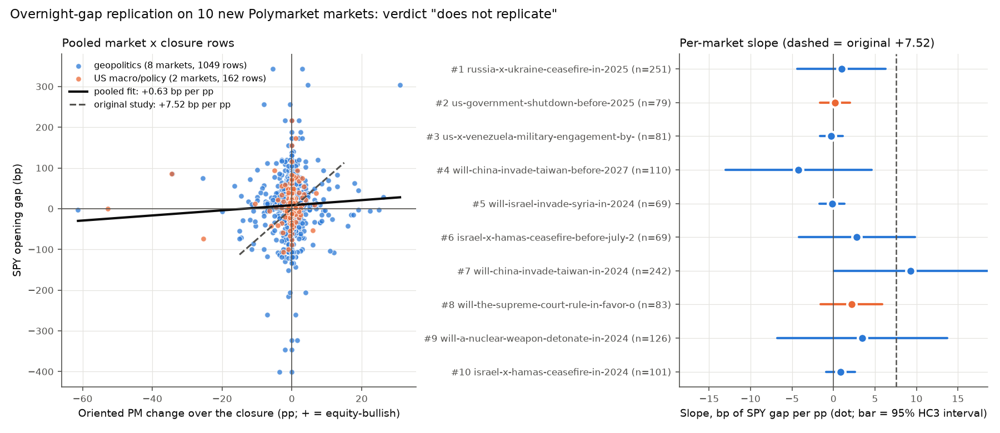

# Overnight-gap replication: does the closed-market PM move predict the SPY gap on new markets?

Confirmatory test of the closed-market finding. The original result: on 380 unselected closures of two markets, the Polymarket move while equities were closed went with the SPY opening gap, +7.52 bp per pp, HC3 t +2.58, permutation p 0.001. Market selection, sign rule, measures, tests and the success criterion were fixed in [METHOD.md](../../leadlag_replication/METHOD.md), committed at `7a780b5` before any price series was fetched. This is the single run.

## Headline

- **Verdict under the pre-set criterion: does not replicate.** It requires slope > 0 (met), date-permutation p < 0.05 (not met) and HC3 t > 2 (not met).
- **Pooled slope (S1):** b = +0.63 bp per pp (HC3 t = +1.20, date-permutation p = 0.126, n = 1211), R-squared 0.002. Pooled over 10 markets and 492 distinct closure dates. The original study found +7.52 (t +2.58, p 0.001, n 380).
- **Sign test at 1 pp (S2):** 310 of 620 agree (50%), p = 1.000. The original: 89 of 149 (60%), p 0.021. S2 does not confirm a positive relation (rate above 50% with p < 0.05).
- **Dependence checks:** with errors clustered by closure date, t = +1.09 (492 dates). With one observation per date (mean oriented PM change across markets), b = +2.72, HC3 t = +1.14, permutation p = 0.034, n = 492.
- Rows: 1211 usable of 1212 market x closure rows. Excluded: no PM quote 1.

## Markets (selected by the frozen rule)

The frozen ranking was walked in order. A market was taken if at least 40 of its closures had a PM quote at both ends (PM data only, before any equity bar was fetched).

| Rank | Market | Class | Sign | Closures | Quoted both ends | Selected |
|---|---|---|---|---|---|---|
| 1 | `russia-x-ukraine-ceasefire-in-2025` | geopolitics | +1 | 251 | 251 | yes |
| 2 | `us-government-shutdown-before-2025` | US macro/policy | -1 | 79 | 79 | yes |
| 3 | `us-x-venezuela-military-engagement-by-december-31-391-819-722-945-174-285-817-971-353-859-836-598-255-382-192-983` | geopolitics | -1 | 81 | 81 | yes |
| 4 | `will-china-invade-taiwan-before-2027` | geopolitics | -1 | 110 | 110 | yes |
| 5 | `will-israel-invade-syria-in-2024` | geopolitics | -1 | 69 | 69 | yes |
| 6 | `israel-x-hamas-ceasefire-before-july-2025` | geopolitics | +1 | 70 | 69 | yes |
| 7 | `will-china-invade-taiwan-in-2024` | geopolitics | -1 | 242 | 242 | yes |
| 8 | `will-the-supreme-court-rule-in-favor-of-trumps-tariffs` | US macro/policy | -1 | 83 | 83 | yes |
| 9 | `will-a-nuclear-weapon-detonate-in-2024` | geopolitics | -1 | 126 | 126 | yes |
| 10 | `israel-x-hamas-ceasefire-in-2024` | geopolitics | +1 | 101 | 101 | yes |

## Per market (SPY)

| Rank | Market | Median PM level (pp) | Rows | Slope (bp/pp) | HC3 t | Date-perm p | Sign test at 1 pp | Slope without this market |
|---|---|---|---|---|---|---|---|---|
| 1 | `russia-x-ukraine-ceasefire-in-2025` | 25.5 | 251 | +0.96 | +0.35 | 0.636 | 95 of 168 agree (57%), p = 0.105 | +0.60 |
| 2 | `us-government-shutdown-before-2025` | 10.5 | 79 | +0.19 | +0.21 | 0.712 | 20 of 30 agree (67%), p = 0.099 | +0.75 |
| 3 | `us-x-venezuela-military-engagement-by-december-31-391-819-722-945-174-285-817-971-353-859-836-598-255-382-192-983` | 38.5 | 81 | -0.26 | -0.36 | 0.687 | 30 of 75 agree (40%), p = 0.105 | +0.83 |
| 4 | `will-china-invade-taiwan-before-2027` | 16.5 | 110 | -4.21 | -0.94 | 0.321 | 16 of 34 agree (47%), p = 0.864 | +0.65 |
| 5 | `will-israel-invade-syria-in-2024` | 11.5 | 69 | -0.18 | -0.24 | 0.711 | 17 of 42 agree (40%), p = 0.280 | +0.92 |
| 6 | `israel-x-hamas-ceasefire-before-july-2025` | 44.0 | 69 | +2.83 | +0.79 | 0.160 | 28 of 61 agree (46%), p = 0.609 | +0.26 |
| 7 | `will-china-invade-taiwan-in-2024` | 8.5 | 242 | +9.30 | +1.97 | 0.110 | 25 of 37 agree (68%), p = 0.047 | +0.59 |
| 8 | `will-the-supreme-court-rule-in-favor-of-trumps-tariffs` | 40.0 | 83 | +2.17 | +1.14 | 0.316 | 22 of 41 agree (54%), p = 0.755 | +0.60 |
| 9 | `will-a-nuclear-weapon-detonate-in-2024` | 9.0 | 126 | +3.47 | +0.66 | 0.107 | 23 of 54 agree (43%), p = 0.341 | +0.55 |
| 10 | `israel-x-hamas-ceasefire-in-2024` | 34.0 | 101 | +0.85 | +0.94 | 0.314 | 34 of 78 agree (44%), p = 0.308 | +0.59 |

## Secondary (not part of the verdict)

- **QQQ gap:** b = +0.77 bp per pp (HC3 t = +1.17, date-permutation p = 0.144, n = 1211); sign test 305 of 621 agree (49%), p = 0.688.
- **IWM gap:** b = +0.83 bp per pp (HC3 t = +1.13, date-permutation p = 0.162, n = 1211); sign test 320 of 621 agree (52%), p = 0.470.
- Sign test at 0.5 pp: 414 of 804 agree (51%), p = 0.417.
- Sign test at 2.0 pp: 163 of 326 agree (50%), p = 1.000.
- Sign test at 1 pp with a one-sided date-permutation p (agreement at least as high): p = 0.316.
- Row-level permutation of the pooled slope (ignores shared dates): p = 0.099; Spearman rho +0.03 (p = 0.278).
- **US macro/policy** (2 markets): b = +0.33 bp per pp (HC3 t = +0.38, date-permutation p = 0.539, n = 162); sign test 42 of 71 agree (59%), p = 0.154.
- **geopolitics** (8 markets): b = +0.72 bp per pp (HC3 t = +1.14, date-permutation p = 0.097, n = 1049); sign test 268 of 549 agree (49%), p = 0.609.
- overnight closures: b = -0.01 bp per pp (HC3 t = -0.01, date-permutation p = 0.990, n = 937); sign test 230 of 445 agree (52%), p = 0.507.
- weekend and holiday closures: b = +1.30 bp per pp (HC3 t = +1.32, date-permutation p = 0.059, n = 274); sign test 80 of 175 agree (46%), p = 0.290.
- **Fresh-date subset** (closure dates outside both original panels, so the SPY gap is new too; 96 dates): b = -0.04 bp per pp (HC3 t = -0.10, date-permutation p = 0.921, n = 239); sign test 52 of 101 agree (51%), p = 0.842.

## How to read this

On these 10 markets the pooled slope is +0.63 bp per pp (date-permutation p = 0.126, HC3 t = +1.20). The original relation does not carry over to this rule-selected set of mostly geopolitical markets. One secondary check leans positive: with one observation per closure date, the slope is +2.72 with permutation p = 0.034 but HC3 t = +1.14. It is outside the pre-set criterion and does not change the verdict. In every case this is co-movement over the closure, not a demonstrated lead (see the futures caveat).

## Caveats

- **Futures proxy.** E-mini S&P 500 and Nasdaq futures trade almost around the clock, and SPY trades pre-market. By 09:30 the equity side has already priced overnight news through futures, which this study does not observe (Massive equity bars only). A PM-gap relation is co-movement over the closure, both prices reacting to the same news. It is not a tradeable lead: the gap cannot be captured once futures have moved. A lead claim would need the PM move up to time t against the futures move after t.
- **Same calendar as the original.** Most closure dates lie inside the original panels' date ranges. The PM series are new, but the SPY gaps on those dates are the numbers the original used. The fresh-date subset is the only part where both are new, and it is small.
- **The rule picks mostly geopolitical markets.** By volume, ceasefire, invasion and military markets dominate the eligible pool. Few are US macro/policy markets. The original relation came mainly from a US recession market, and Fed markets are excluded because their sign is ambiguous. A null on this pool would not rule out the relation for US macro markets.
- **Low-probability markets.** Many markets trade at a few percent, so 1 pp moves are rare and the sign test has few rows.
- **Shared dates.** Rows on one date share a gap. The binomial test and HC3 t treat rows as independent and are optimistic. The date permutation (primary), the date-clustered t and the date-collapsed regression address this.
- **Rule revisions before data.** The selection rule was revised three times after reading candidate question texts (metadata only, no prices). METHOD.md section 0 lists each revision.

## Files

`results.csv` (every market x closure row: PM at close and open, oriented change, SPY/QQQ/IWM gaps, flags). `coverage.csv` (the coverage check for every candidate examined). `tests.json` (every statistic). `chart.png`. `RUN_LOG.md`. Code: `research/leadlag_replication/`. Synthetic tests: `research/leadlag_replication/tests/`.
