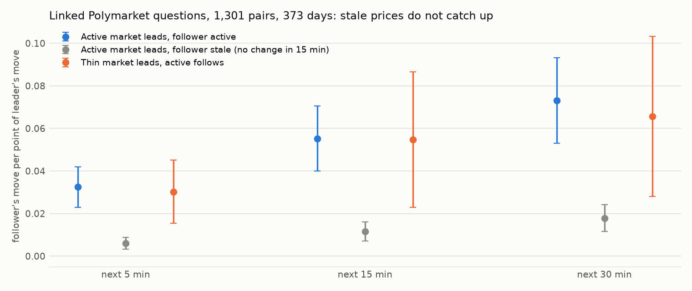
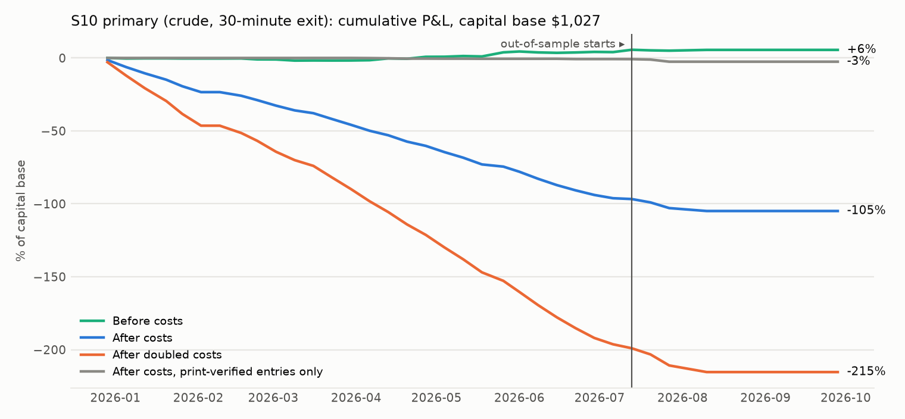
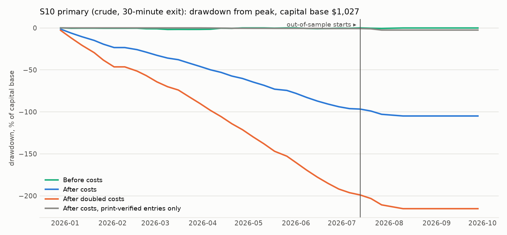
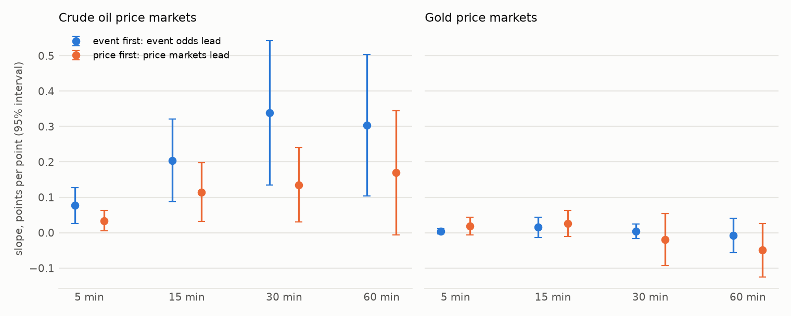

# S10: who moves first, and why the move cannot be taken

Method, pre-registered before any price was read: [`research/s10_weekend_lag/METHOD.md`](../../s10_weekend_lag/METHOD.md)
(commit `b376c9b`; runner and tests `e3bd9c6`). Data: 44 oil-linked event questions and 192 crude oil and 77 gold price
markets on Polymarket, one-minute prices, 36 weekends from 2025-12-29 to 2026-09-28, each from 20:00 on the last
session day to Sunday 17:55 New York time, while oil futures are shut. Files: [`leadlag.csv`](leadlag.csv),
[`event_summary.csv`](event_summary.csv), [`events.csv`](events.csv), [`metrics.csv`](metrics.csv),
[`trades.csv`](trades.csv), [`robust.csv`](robust.csv), [`capacity.md`](capacity.md), [`RUN_LOG.md`](RUN_LOG.md).

## Part 2, the mechanism (pre-registered in amendment 1, commit `9b198db`, before any of these prices was read)

Theo asked to stop looking at one asset and look at the mechanism. Part 2 takes every pair of Polymarket questions
linked to the same ticker: **128 questions, 1,301 pairs, all hours, 373 days** (2025-09-26 to 2026-10-03). It adds
every question paired with a price market on its asset (8,978 pairs, weekends). Files: [`mechanism/`](mechanism/).

**What holds up: linked questions follow each other over minutes, everywhere there is news flow.** When one question
moves, a question linked to the same ticker keeps moving the same way for the next half hour. The follower moves
0.017 points per point in the next 5 minutes (t = 5.70), 0.030 in 15 (t = 6.01) and 0.041 in 30 (t = 6.22),
on top of 0.035 in the same five minutes (t = 6.30). Errors are clustered by date, 373 dates. Oil-linked pairs carry
most of it (0.019 at 5 minutes, t = 5.20). Pairs linked through rate ETFs (SHY, IEF, TLT) show nothing (every |t|
< 1.5).

**The mechanism is not "stale prices catch up". It is the reverse: stale prices stay stale.** Both pre-registered
tests failed, and both failed the other way round:

- **M1, does the active market lead the thin one?** No. The thin market's moves predict the active market at least
  as well: 0.030 at 5 minutes (t = 4.00) against 0.017 the other way. The difference is −0.013 [−0.028, −0.001]; for
  oil-linked pairs −0.018 [−0.027, −0.008]. A move in a quiet market carries news, and the active market takes it up.
- **M2, is the lag carried by stale followers?** No. A follower whose price had not changed for 15 minutes moves only
  0.006 per point in the next 5 minutes and 0.018 in 30. A follower that was trading moves 0.032 and 0.073. The
  difference at 15 minutes is −0.044 [−0.059, −0.028]. The question–price-market pairs show the same: −0.061
  [−0.093, −0.015].



**So the follow-through lives in markets that are already trading, and those are the ones where a taker pays the
full spread.** The pre-registered pick-off trade buys the stale side after the active side jumps. It earns **+0.07
points per trade before costs** [+0.03, +0.11] and **−2.23 after** [−2.28, −2.18] on 2,340 trades over 297 days.
Out-of-sample it is −1.90 [−2.09, −1.66] on 218 trades. 116 of 664 checkable entries were print-verified, and those
lost −2.12 [−2.35, −1.89]. The question–price-market version is the same: +0.03 before costs, −2.27 after on 387
trades.

**What this explains across the studies.** S4 and S5: the linked stock opens where the odds moved. That is a market
that was shut taking up the news when it opens, so the news is gone by the first trade. S8 and S9: the odds
over-react by about the cost of a round trip. Here: linked questions take up each other's news over 5 to 30 minutes,
but only where people are already trading, so a taker pays the spread to get it. In every case the information
travels; it arrives either at a moment you cannot trade, or in a market where taking it costs what it is worth.

**Verdict on Part 2's criteria:** M1 not held (reversed); M2 not held (reversed); the pick-off trade not a pass.

**Disclosed flaw in Part 2's design.** The pre-registered "same-bin" comparison in M2 is mechanical: a stale follower
did not move in the last 15 minutes by definition, so its same-bin response is zero. That row is reported in
`mechanism/tests.csv` and not used. A slope also mixes how often a market moves with how far it follows. Some of the
stale group's low slope is simply that quiet markets move less. That does not rescue the trade, which looks at
exactly those markets and finds +0.07 points before costs.

| Pairs | Which leads | 5 min | 15 min | 30 min |
|---|---|---|---|---|
| Question pairs, all | active leads thin | 0.017 (t 5.70) | 0.030 (t 6.01) | 0.041 (t 6.22) |
| Question pairs, all | thin leads active | 0.030 (t 4.00) | 0.055 (t 3.37) | 0.066 (t 3.42) |
| Question pairs, all | active leads, follower stale | 0.006 (t 4.26) | 0.012 (t 5.11) | 0.018 (t 5.52) |
| Question pairs, all | active leads, follower trading | 0.032 (t 6.66) | 0.055 (t 7.08) | 0.073 (t 7.13) |
| Question pairs, oil | active leads thin | 0.019 (t 5.20) | 0.033 (t 5.32) | 0.045 (t 5.51) |
| Question pairs, rates | active leads thin | −0.003 (t −0.95) | −0.001 (t −0.68) | 0.002 (t 0.88) |
| Question–price market, crude | active leads thin | 0.011 (t 2.12) | 0.029 (t 2.34) | 0.046 (t 2.32) |
| Question–price market, crude | thin leads active | 0.017 (t 2.68) | 0.046 (t 2.86) | 0.058 (t 2.75) |

| Pick-off trade | Segment | Costs | Trades | Days / weekends traded | Net, points | 95% interval | Before costs | Costs, points | Costs, bp | Verified (of checkable) | Verified net |
|---|---|---|---|---|---|---|---|---|---|---|---|
| Question pairs | IS | 1× | 2,122 | 237 | −2.26 | [−2.31, −2.22] | +0.06 | 2.32 | 753 | 97 of 533 | −2.25 |
| Question pairs | OOS | 1× | 218 | 60 | −1.90 | [−2.09, −1.66] | +0.18 | 2.08 | 805 | 19 of 131 | −1.40 |
| Question pairs | ALL | 2× | 2,340 | 297 | −4.53 | [−4.59, −4.46] | +0.07 | 4.60 | 1,468 | 174 of 664 | −4.39 |
| Question–price market | IS | 1× | 308 | 32 | −2.42 | [−2.60, −2.27] | +0.02 | 2.44 | 778 | 17 of 148 | −2.28 |
| Question–price market | OOS | 1× | 79 | 9 | −1.71 | [−1.85, −1.57] | +0.03 | 1.74 | 976 | 2 of 67 | −1.68 |

Every row, with Sharpe, drawdown, worst month and turnover, is in `mechanism/metrics.csv`.

## Part 4, hold the stale side to the result (pre-registered in amendment 3, commit `e661545`, before any result was read)

**A null.** Part 2's 2,340 stale-side entries, held until the question resolves instead of 30 minutes. 2,154 have a
result in the catalogue (70 questions; 186 entries on 23 questions not resolved yet, left out). Before costs the
stale side earns **−0.96 points** per entry (95% interval resampling questions [−3.09, +1.27]); after costs **−2.12**
[−4.28, +0.13]; −3.28 at 2×. Out-of-sample (entries from 2026-05-22): +0.37 [−2.82, +4.59] on 332 entries but 19
questions, and in-sample −2.58. **Not a pass.** A stale price that ignored its linked question's jump was not wrong in
that direction when the question resolved. Files: [`hold/`](hold/).

# Part 1: oil, inside the weekend

## Answer

**What holds up: the oil event questions move first, and the oil price markets follow over the next half hour.** A
move in the event odds in one five-minute bin predicts a move the same way in Polymarket's crude oil price markets
over the next 5 minutes (slope 0.077, t = 2.98), 15 minutes (0.204, t = 3.42), 30 minutes (0.339, t = 3.25) and 60
minutes (0.304, t = 2.98). Errors are clustered by weekend, 36 weekends. The same-bin slope is only 0.052, so most of
the price markets' response comes after the news, not with it. It is not one weekend's doing: dropping any single
weekend leaves t of at least 2.65 at 5 to 30 minutes. It is still there out-of-sample at 15, 30 and 60 minutes (t =
2.05, 2.57, 2.95) with about half the size, though not at 5 minutes (t = 0.38). These two checks were looked at after
the run.

**It runs both ways, and it is small.** By the pre-registered rule the answer is "both lead": the price markets also
lead the event odds, more weakly (0.033 at 5 minutes, t = 2.29; 0.135 at 30 minutes, t = 2.54). In the event study,
after a jump of 3+ points in 5 minutes (or 5+ in 15) in one event question, the crude price markets move only a
further **+0.05 points in 5 minutes** [+0.02, +0.08] and +0.09 in 30 [−0.02, +0.19]. The jumps average 5.3 points.
Before those jumps the price markets had not moved (−0.01 over 15 minutes). Before a jump in a price market the event
odds had already moved +0.09 [+0.03, +0.17]. **Gold shows nothing** in either direction (every |t| < 1.5).

**It cannot be traded: the follow-through is a few hundredths of a point and a round trip costs 2.7.** Buying the
side the jump implies at the next minute and selling 30 minutes later earns +0.11 points per trade before costs and
**−2.60 after** [−2.80, −2.39] on 379 in-sample trades. Out-of-sample it is −2.14 on 42 trades over only 4 traded
weekends, too few for an interval. Every one of the six variants loses at 1× costs.

**The print check says many of these prices were not there to trade.** Only 17 of 421 primary entries (4%) have a
public print within five minutes after the signal at the assumed price or better, on the side that proves the fill.
Those 17 lost −2.78 points each [−3.59, −1.79]. 68% of entries were in a market whose price had not changed in the 15
minutes before the entry. A stale price that catches up later looks like a lag, so part of the lead above may be
exactly that.

**Verdict on the pre-registered criteria.** Who moves first: both, with the event questions the stronger lead. The
trade: **not a pass.**

## Headline numbers (primary V0: crude oil, 30-minute exit)

| Segment | Costs | Trades | Weekends traded | Net, points per trade | 95% interval | Before costs | Costs, points | Costs, bp of capital | Winners | Net P&L | Sharpe | Max DD | Worst month | Turnover / yr | Print-verified | Verified, net points |
|---|---|---|---|---|---|---|---|---|---|---|---|---|---|---|---|---|
| IS | 1× | 379 | 27 of 28 | −2.60 | [−2.80, −2.39] | +0.11 | 2.71 | 588 | 4% | −$987 | −21.2 | 96% | −19.4% | 34.9× | 10 of 341 checkable | −2.44 |
| OOS | 1× | 42 | 4 of 8 | −2.14 | n/a (4 weekends) | +0.37 | 2.51 | 650 | 12% | −$90 | −5.4 | 9% | −6.8% | 13.8× | 7 of 42 checkable | −3.26 |
| ALL | 1× | 421 | 31 of 36 | −2.56 | [−2.75, −2.33] | +0.14 | 2.69 | 595 | 5% | −$1,077 | −13.4 | 105% | −19.4% | 30.2× | 17 of 383 checkable | −2.78 |
| IS | 2× | 379 | 27 of 28 | −5.32 | [−5.60, −5.00] | +0.11 | 5.43 | 1,162 | 1% | −$2,015 | −23.2 | 195% | −38.9% | 35.0× | 22 of 341 checkable | −4.42 |
| OOS | 2× | 42 | 4 of 8 | −4.66 | n/a | +0.37 | 5.03 | 1,277 | 2% | −$196 | −6.0 | 19% | −14.4% | 13.8× | 10 of 42 checkable | −4.86 |
| ALL | 2× | 421 | 31 of 36 | −5.25 | [−5.53, −4.94] | +0.14 | 5.39 | 1,173 | 1% | −$2,211 | −14.3 | 214% | −38.9% | 30.3× | 32 of 383 checkable | −4.55 |

100 contracts per trade; a point is one cent per contract. Capital base $1,027 (1×), the largest amount deployed on
one weekend. Sharpe on weekend returns, 52 a year. No Sharpe is above +3. The very negative ones come from steady
losses: costs are paid on every trade and the price rarely moves in 30 minutes. No trade was settled at a market's
result and none was dropped. The deflated Sharpe probability is 0.000 for V0 in every
segment.





## T1, lead and lag slopes (before costs)



| Prices | Which leads | Horizon | Slope, points per point | t | Bins | Weekends |
|---|---|---|---|---|---|---|
| Crude | event odds lead | 5 min | +0.077 | 2.98 | 20,560 | 36 |
| Crude | event odds lead | 15 min | +0.204 | 3.42 | 20,484 | 36 |
| Crude | event odds lead | 30 min | +0.339 | 3.25 | 20,374 | 36 |
| Crude | event odds lead | 60 min | +0.304 | 2.98 | 20,157 | 36 |
| Crude | price markets lead | 5 min | +0.033 | 2.29 | 20,560 | 36 |
| Crude | price markets lead | 15 min | +0.115 | 2.69 | 20,484 | 36 |
| Crude | price markets lead | 30 min | +0.135 | 2.54 | 20,374 | 36 |
| Crude | price markets lead | 60 min | +0.169 | 1.90 | 20,157 | 36 |
| Crude | same bin | 5 min | +0.052 | 2.37 | 20,600 | 36 |
| Gold | event odds lead | 5 / 15 / 30 / 60 min | +0.004 / +0.015 / +0.004 / −0.008 | 1.00 / 1.04 / 0.40 / −0.34 | | 36 |
| Gold | price markets lead | 5 / 15 / 30 / 60 min | +0.018 / +0.025 / −0.020 / −0.050 | 1.42 / 1.35 / −0.53 / −1.29 | | 36 |

"Event odds lead" is the change of the price-market index over the next h minutes on the change of the event index
in the five minutes just ended. Each index is the average move of its live markets, signed so that up means "oil up".
The two slopes are on different indexes, so their sizes compare only roughly; the t values compare directly.

## T2, event study (crude, before costs)

| After a jump in | Jumps | Weekends | Mean jump | Other side, 15 min before | +5 min | +15 min | +30 min | +60 min |
|---|---|---|---|---|---|---|---|---|
| an event question | 340 | 31 | 5.3 | −0.01 [−0.07, +0.05] | +0.05 [+0.02, +0.08] | +0.05 [−0.02, +0.12] | +0.09 [−0.02, +0.19] | +0.13 [+0.02, +0.25] |
| a crude price market | 639 | 33 | 5.6 | +0.09 [+0.03, +0.17] | +0.03 [+0.01, +0.04] | +0.09 [+0.03, +0.16] | +0.14 [+0.03, +0.27] | +0.19 [−0.00, +0.44] |

Points, signed by the jump (positive = the other side moved the same way). From the tradeable entry, one minute
after the signal, the event-first response is +0.03, +0.04, +0.08 and +0.12. Gold's responses are all within ±0.06
(`event_summary.csv`).

## Looked at after the run (not pre-registered)

| Which leads | Horizon | Slope | t | Lowest slope dropping one weekend (t) | In-sample slope (t) | Out-of-sample slope (t) |
|---|---|---|---|---|---|---|
| event odds | 5 min | 0.077 | 2.98 | 0.053 (2.72) | 0.092 (3.16) | 0.011 (0.38) |
| event odds | 15 min | 0.204 | 3.42 | 0.162 (2.65) | 0.227 (3.31) | 0.101 (2.05) |
| event odds | 30 min | 0.339 | 3.25 | 0.254 (2.71) | 0.379 (3.17) | 0.157 (2.57) |
| event odds | 60 min | 0.304 | 2.98 | 0.223 (2.48) | 0.335 (2.77) | 0.161 (2.95) |
| price markets | 5 min | 0.033 | 2.29 | 0.024 (2.18) | 0.056 (2.73) | 0.003 (0.22) |
| price markets | 30 min | 0.135 | 2.54 | 0.099 (2.44) | 0.186 (2.06) | 0.068 (2.01) |

From [`robust.csv`](robust.csv) (`python -m s10_weekend_lag.robust`). Out-of-sample is the last 8 weekends, from
2026-07-13.

## Every variant tried (1× costs; 2× in `metrics.csv`)

| Variant | Prices | Exit | Segment | Trades | Net, points per trade | 95% interval | Before costs | Costs, points | Sharpe | Print-verified |
|---|---|---|---|---|---|---|---|---|---|---|
| V0 (primary) | crude | 30 min | IS | 379 | −2.60 | [−2.80, −2.39] | +0.11 | 2.71 | −21.2 | 10 |
| V0 (primary) | crude | 30 min | OOS | 42 | −2.14 | n/a | +0.37 | 2.51 | −5.4 | 7 |
| V1 | crude | 60 min | IS | 379 | −2.46 | [−2.77, −2.14] | +0.25 | 2.71 | −16.0 | 10 |
| V1 | crude | 60 min | OOS | 42 | −1.51 | n/a | +0.99 | 2.50 | −3.6 | 7 |
| V2 | crude | Sunday 17:55 | IS | 379 | −2.01 | [−3.71, −0.32] | +0.67 | 2.68 | −3.0 | 10 |
| V2 | crude | Sunday 17:55 | OOS | 42 | −0.65 | n/a | +1.81 | 2.46 | −0.7 | 7 |
| V3 | gold | 30 min | IS | 355 | −4.49 | [−4.86, −4.22] | −0.31 | 4.18 | −17.2 | 3 |
| V3 | gold | 30 min | OOS | 29 | −3.89 | n/a | +0.01 | 3.90 | −5.3 | 0 |
| V4 | gold | 60 min | IS | 355 | −4.39 | [−4.84, −4.02] | −0.21 | 4.18 | −15.8 | 3 |
| V4 | gold | 60 min | OOS | 29 | −4.01 | n/a | −0.11 | 3.90 | −5.3 | 0 |
| V5 | gold | Sunday 17:55 | IS | 355 | −4.35 | [−5.43, −3.05] | −0.19 | 4.16 | −8.7 | 3 |
| V5 | gold | Sunday 17:55 | OOS | 29 | −4.04 | n/a | −0.16 | 3.89 | −5.8 | 0 |

The deflated Sharpe ratio uses 6 trials.

## Pre-registered success criteria

| Criterion | Result | Evidence |
|---|---|---|
| Who moves first: event-first slope at 5 minutes positive with t ≥ 2 | yes | +0.077, t = 2.98 |
| Who moves first: price-first slope at 5 minutes positive with t ≥ 2 | yes | +0.033, t = 2.29 → "both lead" |
| Trade: at least 30 OOS trades on at least 5 OOS weekends | **fail** | 42 trades on 4 weekends |
| Trade: OOS mean net above zero, interval excluding zero (1×) | **fail** | −2.14 points |
| Trade: OOS above zero at 2× | **fail** | −4.66 |
| Trade: in-sample above zero at 1× | **fail** | −2.60 [−2.80, −2.39] |
| Trade: print-verified entries above zero | **fail** | −2.78 on 17 entries |

**Verdict: the event questions lead (and the price markets lead them too, less); the trade is not a pass.**

## What didn't work

- **The trade, every variant.** The follow-through is +0.1 to +0.4 points over 30 minutes after a 5-point jump; the
  round trip is 2.7 points on crude (half-spread 0.5 point a side, the taker fee about 1 point a side near 50%) and
  4.2 on gold.
- **Holding to Sunday 17:55 (V2)** comes closest: +0.67 before costs, −2.01 after.
- **Gold.** No lead either way, no follow-through.
- **Fills.** 4% of entries print-verified; 68% of entries in a price that had not changed for 15 minutes.

## Caveats

- One year, one theme: most oil moves are March to June 2026. The out-of-sample trade has only 4 weekends with a
  signal.
- Prices are one-minute mids. A mid that does not change for 15 minutes is most likely nobody trading, and when it
  moves later it looks like a lag. The lead in T1 can be partly this.
- Both legs are Polymarket prices; neither is oil itself. Several strikes after one signal are one bet.
- Half-spreads are from one night of much smaller markets (S9). Link directions are model judgements (S4, S5).

## Reproduce

```
cd research
python -m s10_weekend_lag.run          # reads the S5, S4 and S9 caches; pulls public prints for the check
python -m s10_weekend_lag.report       # charts and capacity.md
python -m s10_weekend_lag.robust       # the after-the-run checks
python -m pytest s10_weekend_lag/tests -q
```
