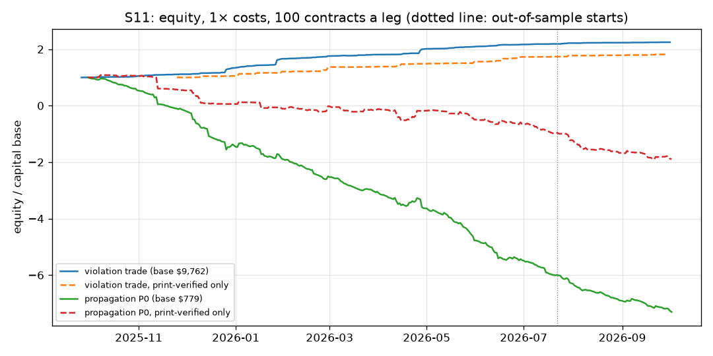
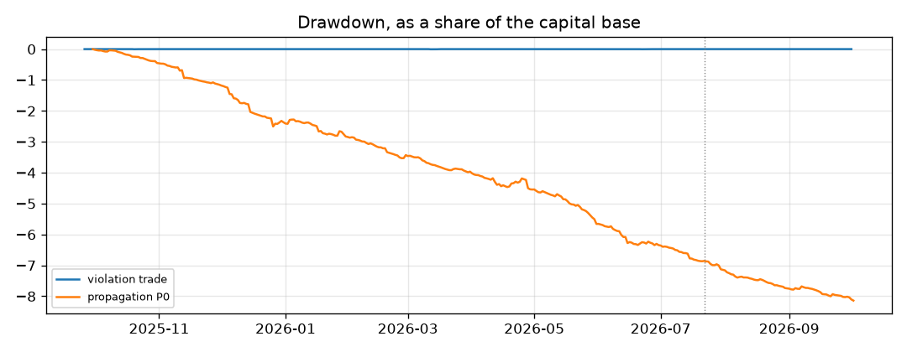

# S11: questions that belong together are one book

Method, pre-registered before any price of these markets was read:
[`research/s11_bundles/METHOD.md`](../../s11_bundles/METHOD.md) (commit `26af862`; amendment 1 `8804b3d`, amendment 2
`001f1b6`). Bundles were built from catalogue text by rule: [`bundles.json`](../../s11_bundles/bundles.json) for the history
(50 strike ladders, 100 date ladders, 83 one-of-many sets) and [`live_bundles.json`](../../s11_bundles/live_bundles.json) for
tonight (12 strike ladders, 21 date ladders, 57 one-of-many sets). Files: [`metrics.csv`](metrics.csv),
[`trades.csv`](trades.csv), [`episodes.csv`](episodes.csv), [`jumps.csv`](jumps.csv), [`tables.md`](tables.md) (every
row), [`capacity.md`](capacity.md), [`RUN_LOG.md`](RUN_LOG.md), live: [`live_totals.json`](live_totals.json),
[`live_arbitrages.csv`](live_arbitrages.csv).

## Answer

**What holds up 1: when a ladder is out of order and the prices can be proven by trade prints, the trade makes money.**
A ladder is out of order when, for example, "US strikes Iran by Jan 15" trades above "... by Jan 16", which can never
be right. The fix is to sell the rich rung and buy the cheap one. That pair cannot lose if held to the result.
99 such trades in the year had public trade prints on both legs at our prices. They earned **+3.89 points per trade**
at 1× costs (95% interval over dates [+2.49, +5.43], 71 dates), and +4.34 [+2.62, +6.20] at 2× costs. Out-of-sample
(from 2026-07-22) the result was +3.24 [+0.62, +7.09], but on only 11 trades.

**What holds up 2: a sibling rung follows a jump late, a little.** After one rung moves 3+ points in 5 minutes, its
neighbour moves another **+0.45 points** in the jump's direction over the next hour (interval [+0.24, +0.61],
43,199 jumps on 368 dates). Out-of-sample it is +0.38 [+0.13, +0.63]. It is stronger in date ladders (+0.64) than in
strike ladders (+0.27). Meanwhile the jumping rung gives back 0.93 points.

**Neither is a strategy.**
- **Too small.** The proven violations total **$385 a year** at 100 contracts a leg ($214 of it locked in at entry).
  Out-of-sample there are 11 trades, short of the 30 the criterion needs.
- **Mostly not real.** Of the 1,425 violations a mid-price backtest would trade, 965 fail the print check: no trade
  happened at that price. Another 361 cannot be checked.
- **The follow is smaller than the cost.** A round trip costs at least 1 point plus fees, and the sibling moves +0.45.
  The trade loses **−1.75 points per trade** at 1× costs [−2.13, −1.40] and −1.46 out-of-sample.

**Tonight's live books** (real bid and ask, after fees, every 3 minutes; interim, Sat 22:55 to Sun 00:38, 31 snapshots of 241 pairs and sets): 2 arbitrages, $0.14 locked in in all. The larger is a Bitcoin "dip to" pair in the tails: 0.02 cents a contract on 482 contracts ($0.11), present in every snapshot. The other is a soccer match's three outcomes for one snapshot: 0.04 cents on 69 contracts ($0.03). The typical book is 4 to 9 points (ladders) or 5 points (one-of-many) away from an arbitrage.

**Verdict on the pre-registered criteria: not a pass.** Violations: the in-sample interval is above zero, but there are
only 11 out-of-sample trades against the 30 required. Propagation: negative in-sample, out-of-sample and at 2× costs.

## Headline numbers

100 contracts a leg; a point is one cent per contract. Costs: a half-spread of 0.5 points per fill for every kind of
bundle. That is the median of each market's median half-spread on this study's own live books, Sat 22:55 to 23:55
New York time (`calibration.json`: strike 31 markets, date 45, one-of-many 118; 75th percentile 0.5 to 1.0 points),
plus each market's own taker fee. These are tonight's liquid books, so they are generous for older, thinner markets.
The 2× rows (1 point per fill) are the safer reading. "bp" is basis points of the capital the trade ties up. Sharpe
uses daily P&L over every calendar day. The capital base is the most capital opened on one day.

| Trade | Segment | Costs | Entries | Trades | Dates | Net, points per trade | 95% interval | Net, bp of capital | Winners | Net P&L | Sharpe | Max DD (of capital base) | Worst month | Turnover / yr |
|---|---|---|---|---|---|---|---|---|---|---|---|---|---|---|
| Violation, exit at the gap close or result (primary) | IS | 1× | print-verified | 88 | 62 | +3.97 | [+2.49, +5.52] | +461 | 70% | $349 | 4.94 | 0.5% | +0.3% | 27.9× |
| | OOS | 1× | print-verified | 11 | 9 | +3.24 | [+0.62, +7.09] | +364 | 55% | $36 | 4.29 | 0.8% | +1.8% | 20.6× |
| | ALL | 1× | print-verified | 99 | 71 | +3.89 | [+2.49, +5.43] | +451 | 69% | $385 | 4.64 | 0.5% | +0.3% | 24.1× |
| | ALL | 2× | print-verified | 79 | 62 | +4.34 | [+2.62, +6.20] | +523 | 66% | $343 | 4.36 | 0.9% | −0.1% | 20.4× |
| | ALL | 1× | all (mid prices) | 1,425 | 326 | +8.54 | [+5.99, +11.61] | +836 | 62% | $12,168 | 5.38 | 0.5% | −0.0% | 21.9× |
| Propagation P0 (primary) | IS | 1× | all | 2,944 | 295 | −1.82 | [−2.28, −1.38] | −507 | 19% | −$5,365 | −9.22 | 687% | −122% | 225× |
| | OOS | 1× | all | 679 | 73 | −1.46 | [−2.02, −0.89] | −565 | 21% | −$992 | −11.45 | 149% | −70% | 233× |
| | ALL | 2× | all | 3,623 | 368 | −3.46 | [−3.84, −3.09] | −1,079 | 13% | −$12,547 | −17.90 | 1,598% | −198% | 221× |
| | ALL | 1× | print-verified | 930 | 294 | −1.57 | [−2.40, −0.77] | −531 | 28% | −$1,459 | −3.80 | 291% | −56% | 84× |

The Sharpe above 3 on the verified violation trades was checked for a bug before it was reported. A monotone pair
held to its result can only win or break even, so a high Sharpe is what a real arbitrage of this kind looks like.
The trades were read one by one (`trades.csv`, `prints = verified`). Most are 1 to 4 point inversions between
neighbouring dates or levels during fast news: Iran strikes, Hormuz, Venezuela, the silver and oil spikes. The money
is small: the capital base is $470 and the year's P&L is $385. Each leg's print was within 10 minutes, so the check
does not prove that both legs could be filled at the same moment. The maximum drawdown of the propagation trade is
several times its capital base because the 60-minute trade recycles the same capital up to 10 times a day and loses
on most of them.

## Part (a): how often bundles break, and for how long (history)

| Kind | Costs | Episodes | Weekend | Weekday | Per 1,000 pair-hours, weekend | Per 1,000 pair-hours, weekday | Median gap, points | Median minutes beyond costs | Median minutes to the gap closing |
|---|---|---|---|---|---|---|---|---|---|
| Strike ladder | 1× | 1,261 | 408 | 853 | 2.81 | 2.84 | 3.0 | 29 | 29 |
| Strike ladder | 2× | 697 | 198 | 499 | 1.36 | 1.66 | 6.0 | 21 | 23 |
| Date ladder | 1× | 904 | 234 | 670 | 2.36 | 2.73 | 2.5 | 12 | 4 |
| Date ladder | 2× | 640 | 160 | 480 | 1.61 | 1.95 | 4.6 | 10 | 5 |
| One-of-many | 1× | 538 | 133 | 405 | 14.68 | 18.43 | 3.0 | 38 | 370 |
| One-of-many | 2× | 162 | 28 | 134 | 3.09 | 6.10 | 4.7 | 28 | 565 |

- **Weekends are no worse than weekdays.** The rate of violations per hour watched is the same or lower on weekends,
  for every kind. Of the 99 print-verified trades, 33 began on a weekend. That is about the weekend's share of hours
  watched (30%).
- **Violations are short.** Half of the ladder violations are gone within 12 minutes (date) or 29 minutes (strike).
- **One-of-many sets barely test.** Only 10 of the 83 sets had a price history for every member; the others have
  members that never traded. Their "violations" last hours, which looks like stale members rather than mispricing.
  1 of 238 was print-verified.
- **Print check, 1× entries:** 99 verified, 965 not verified (no print at that price), 361 uncheckable (only the latest
  20,000 prints of a market are served). As S1 and S6 found, most out-of-order mids are midpoints of thin books, not
  prices anyone traded.
- **4 trades broke the rule.** The earlier date resolved YES and the later one NO. Total −1.95 points a contract over
  4 trades, all unverified or uncheckable. Rules about creation windows and resolution sources can differ between
  rungs that look the same.

## Part (b): does a sibling follow late? (before costs, points, signed so that + follows the jump)

| Ladders | Segment | Jumps | Dates | During the jump's 5 min | Next 5 min | Next 15 min | Next 30 min | Next 60 min [95% interval] | The jumper's own next 60 min |
|---|---|---|---|---|---|---|---|---|---|
| All | IS | 40,386 | 295 | +0.78 | +0.27 | +0.31 | +0.38 | +0.45 [+0.24, +0.63] | −0.95 |
| All | OOS | 2,813 | 73 | +1.06 | +0.45 | +0.45 | +0.40 | +0.38 [+0.13, +0.63] | −0.63 |
| Strike | ALL | 22,697 | 352 | +0.65 | +0.20 | +0.19 | +0.25 | +0.27 [+0.00, +0.45] | −1.25 |
| Date | ALL | 20,502 | 368 | +0.95 | +0.38 | +0.47 | +0.53 | +0.64 [+0.40, +0.88] | −0.58 |
| Weekend | ALL | 10,933 | 157 | +0.99 | +0.27 | +0.14 | +0.23 | +0.36 [−0.45, +0.93] | −0.97 |
| Weekday | ALL | 32,266 | 315 | +0.73 | +0.29 | +0.39 | +0.44 | +0.48 [+0.38, +0.56] | −0.92 |

Most of the sibling's follow happens during the jump itself (+0.80) and in the next 5 minutes (+0.28). By the time the
jump is seen and the sibling can be traded, under half a point is left, and crossing the spread twice costs at least
1 point. A jump is a few points on a rung that is itself partly an
over-reaction (it gives back about a point), so there is no laggard worth trading.

## What didn't work

- **Propagation P0** (trade the sibling one minute after the jump, exit 60 minutes later): −1.75 points per trade at
  1× [−2.13, −1.40], −3.46 at 2×. Out-of-sample −1.46 at 1×. Print-verified entries only: −1.57.
- **Propagation P1** (only siblings that had moved less than half the jump): −1.32 at 1× [−1.56, −1.06], −3.07 at 2×.
  Out-of-sample −1.31.
- **Mid-price violations.** At mid prices with half-spreads the violation trade looks like +8.54 points per trade on
  1,425 trades, Sharpe 5.4. That figure is false: 965 of those entries have no print at the price.
- **One-of-many sets** in the history: not testable for 73 of 83 sets (members with no price), and 1 verified trade.
- **Variant H** (always hold to the result): print-verified +5.40 at 1× [+2.82, +8.72] and +9.37 at 2× on 99 and 79
  trades. It does better than the primary because a few cheap legs resolved YES while the rich leg resolved NO, which
  is allowed and pays $1. It is the same 99 trades, so it adds nothing to the out-of-sample count.

## Every variant tried

Violation trade: primary (exit at the gap close or the result) and H (hold to the result). Propagation: P0 (primary)
and P1. Each at 1× and 2× costs, all entries and print-verified entries, in-sample, out-of-sample and the whole year.
Every row is in [`metrics.csv`](metrics.csv) and [`tables.md`](tables.md).
