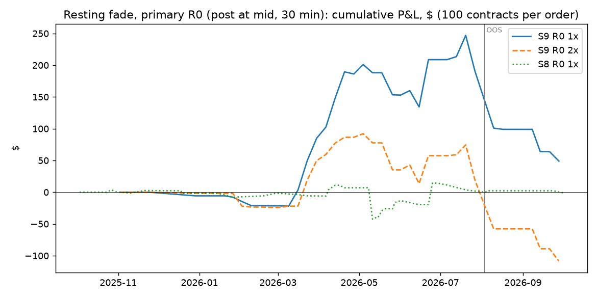
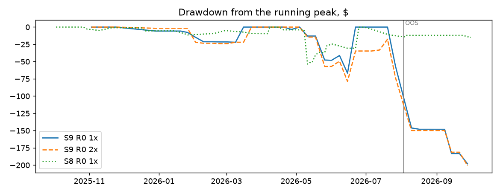

# S12: could a resting order have earned the give-back?

Method, pre-registered before any print was pulled: [`research/s12_resting_orders/METHOD.md`](../../s12_resting_orders/METHOD.md)
(commit `d0c680e`; runner and tests `e2cc281`; two amendments, neither touching the primary). Data: S9's 307 primary
weekend orders and S8's 221 market-mornings after an overnight move of 10+ points, judged against public Polymarket
trade prints (data API, taker side). Files: [`metrics.csv`](metrics.csv), [`trades.csv`](trades.csv),
[`criterion.csv`](criterion.csv), [`capacity.md`](capacity.md), [`RUN_LOG.md`](RUN_LOG.md).

**What this is:** evidence on whether those prices were reachable by someone waiting in the book, judged strictly
against trades that really printed. **It is not a live market-making record.** We had no orders in the book, we
cannot see the queue, and our order would have changed what others did.

## Answer

**What holds up: waiting in the book cuts the cost by two thirds, but the orders that get filled are the wrong
ones, and out-of-sample that is clear.** A resting fade pays no fee and no spread on the way in. Its cost falls from
3.29 points per round trip (S9, a taker both ways) to 1.11 points per filled order, all of it from exits that had to
cross. But out-of-sample (9 weekends from 2026-08-03), the 20 orders that filled lost 6.84 points at mid, while the 22
that never filled would have earned 4.18. Difference: **-11.02 points, weekend-bootstrap 95% interval [-20.79,
-5.16]**. The traders who bought what we were selling were right. That is adverse selection, and it is the result.

**In-sample there is no such effect, and the resting fade makes money that is not significant.** 70 of 259 orders
fill (27%). They earn +3.28 points per filled order after costs, interval [-1.16, +8.56], Sharpe 1.64. Filled orders
did no worse at mid than unfilled ones: +5.13 against +3.44, difference +1.70 [-2.60, +6.83].

**Over the whole year it does not pay.** 90 of 301 reachable S9 orders fill (30%; 68 fully). Net per filled order:
+0.65 points [-3.28, +5.36]; per order posted, +0.16 [-0.89, +1.22]; -2.05 [-5.95, +2.97] at doubled costs.
The out-of-sample loss is -8.07 per filled order [-11.24, -5.36], with 1 winner in 20.

**Verdict on the pre-registered criterion: not a pass,** on both samples.

## Headline numbers (primary R0: post at the mid, rest 30 minutes, S9 weekend sample)

| Segment | Costs | Reachable | Filled | Fill rate | Net per filled order, points | 95% interval | Before costs | Costs, points | Net per order posted | Sharpe | Max DD | Worst month |
|---|---|---|---|---|---|---|---|---|---|---|---|---|
| IS | 1× | 259 | 70 | 27% | +3.28 | [-1.16, +8.56] | +4.26 | +0.98 | +0.73 | +1.64 | 33% | -16.2% |
| OOS | 1× | 42 | 20 | 48% | -8.07 | [-11.24, -5.36] | -6.54 | +1.53 | -3.36 | -5.63 | 70% | -45.2% |
| ALL | 1× | 301 | 90 | 30% | +0.65 | [-3.28, +5.36] | +1.75 | +1.11 | +0.16 | +0.33 | 98% | -45.2% |
| IS | 2× | 259 | 51 | 20% | +0.45 | [-4.08, +6.89] | +2.70 | +2.25 | +0.07 | +0.21 | 55% | -35.6% |
| OOS | 2× | 42 | 13 | 31% | -11.02 | [-12.27, -9.90] | -8.69 | +2.33 | -3.03 | -5.79 | 88% | -53.1% |
| ALL | 2× | 301 | 64 | 21% | -2.05 | [-5.95, +2.97] | +0.22 | +2.27 | -0.36 | -0.93 | 139% | -53.1% |

100 contracts per order; a point is one cent per contract. Capital base $202, the most deployed on one weekend.
Sharpe on weekend returns, 52 a year. Max drawdown and worst month in % of the capital base.

## The deciding check: do filled orders do worse? (1× rule)

"At mid" is what the order would have earned from the mid at entry to the mid at exit, with no costs. If filled
orders do worse at mid than orders that never filled, the fills are selected against us. Intervals resample weekends
(S9) or dates (S8).

| Sample | Segment | Filled | Never filled | At mid, filled | At mid, never filled | Difference | 95% interval |
|---|---|---|---|---|---|---|---|
| S9 | IS | 70 | 189 | +5.13 | +3.44 | +1.70 | [-2.60, +6.83] |
| S9 | OOS | 20 | 22 | -6.84 | +4.18 | -11.02 | [-20.79, -5.16] |
| S9 | ALL | 90 | 211 | +2.47 | +3.51 | -1.04 | [-5.07, +3.70] |
| S8 | IS | 38 | 24 | +0.65 | +3.62 | -2.97 | [-7.12, +1.35] |
| S8 | OOS | 4 | 14 | -1.00 | +0.98 | -1.98 | [-5.14, +0.49] |
| S8 | ALL | 42 | 38 | +0.49 | +2.65 | -2.16 | [-5.48, +1.13] |

Only S9 out-of-sample is significant. Over the whole year the sign is the same on both samples (S9 -1.04, S8 -2.16),
but the intervals include zero.

## Pre-registered success criterion

| Sample | Criterion | Result | Evidence |
|---|---|---|---|
| S9 | enough OOS fills | pass | 20 filled on 6 weekends |
| S9 | IS net per filled > 0, interval excludes 0 | **fail** | +3.28 [-1.16, +8.56] |
| S9 | OOS net per filled > 0 | **fail** | -8.07 |
| S9 | ALL net per filled > 0 at 2x | **fail** | -2.05 |
| S9 | VERDICT | **fail** |  |
| S8 | enough OOS fills | **fail** | 4 filled on 4 dates |
| S8 | IS net per filled > 0, interval excludes 0 | **fail** | +0.10 [-4.20, +3.63] |
| S8 | OOS net per filled > 0 | **fail** | -0.97 |
| S8 | ALL net per filled > 0 at 2x | **fail** | -2.14 |
| S8 | VERDICT | **fail** |  |

## What didn't work

- **S8 (the overnight give-back, 10+ points):** only 80 of 221 orders are reachable (the data API serves the
  latest 20,000 prints of a market). 42 fill (52%). Net per filled order: -0.02 points [-3.94, +3.23]. Out-of-sample:
  4 fills, too few to judge. Filled orders did worse at mid (+0.49 against +2.65), not significantly.
- **Resting longer or one cent closer to the market** fills more orders (S9: 30% to 55%). It does not help: at 1×, every S9
  variant is above zero in-sample and between -7.2 and -8.1 points per filled order out-of-sample.
- **Resting exits:** for S9's 90 filled orders, the exit order filled in full only 32 times. 46 were not filled and
  crossed at the deadline, 8 were partly filled, and 4 markets settled before the exit. An exit that rests until the
  price comes to it gets filled less often when the market keeps moving against the position.

## Costs (source)

- **Entry:** a resting fill pays no fee and no spread. Polymarket charges fees to takers only (feeSchedule.takerOnly).
  No maker rebate is counted.
- **Exit, when it has to cross:** half-spread S9 by asset class (oil 0.5, S&P 500 1.0, gold 1.25, silver 2.0,
  stocks 2.5 points; S9's live-book snapshot of 2026-10-03), S8 0.5 point (S8's snapshot), plus the market's taker fee
  (S9: each market's catalogue schedule; S8: 0.04 × P × (1 − P)).
- **Per filled order (S9, R0):** 1.11 points, 312 bp of the capital of a trade at 1×; 2.27 points, 668 bp at 2×
  (fills judged one cent stricter, every exit crosses with double spread and fee). A taker round trip in S9 cost 3.29
  points.

## Capacity

Small. In 30 minutes, 23% of reachable S9 orders would have filled at 100 contracts, 9% at 2,000 and 1% at 10,000
(median qualifying volume: 0 contracts). See [`capacity.md`](capacity.md).

## Every variant tried

R0 primary (mid, 30 min); R1 (mid, 120 min); R2 (one cent better, 30 min); R3 (one cent better, 120 min). Each on
both samples, at 1× and 2×. Nothing else was run.

| Sample | Segment | Variant | Costs | Reachable | Filled | Fill rate | Net per filled order, points | 95% interval | Before costs | Costs, points | Costs, bp | Net per order posted | Winners | Net P&L | Sharpe | Max DD | Worst month | Turnover / yr |
|---|---|---|---|---|---|---|---|---|---|---|---|---|---|---|---|---|---|---|
| S9 | IS | R0 (primary) | 1× | 259 | 70 | 27% | +3.28 | [-1.16, +8.56] | +4.26 | +0.98 | 270 | +0.73 | 61% | $190 | +1.64 | 33% | -16.2% | 15.5× |
| S9 | OOS | R0 (primary) | 1× | 42 | 20 | 48% | -8.07 | [-11.24, -5.36] | -6.54 | +1.53 | 465 | -3.36 | 5% | $-141 | -5.63 | 70% | -45.2% | 16.5× |
| S9 | ALL | R0 (primary) | 1× | 301 | 90 | 30% | +0.65 | [-3.28, +5.36] | +1.75 | +1.11 | 312 | +0.16 | 49% | $49 | +0.33 | 98% | -45.2% | 15.7× |
| S9 | IS | R0 (primary) | 2× | 259 | 51 | 20% | +0.45 | [-4.08, +6.89] | +2.70 | +2.25 | 679 | +0.07 | 51% | $19 | +0.21 | 55% | -35.6% | 14.2× |
| S9 | OOS | R0 (primary) | 2× | 42 | 13 | 31% | -11.02 | [-12.27, -9.90] | -8.69 | +2.33 | 636 | -3.03 | 0% | $-127 | -5.79 | 88% | -53.1% | 17.0× |
| S9 | ALL | R0 (primary) | 2× | 301 | 64 | 21% | -2.05 | [-5.95, +2.97] | +0.22 | +2.27 | 668 | -0.36 | 41% | $-109 | -0.93 | 139% | -53.1% | 14.8× |
| S9 | IS | R1 | 1× | 259 | 100 | 39% | +2.33 | [-1.51, +6.82] | +3.65 | +1.32 | 361 | +0.73 | 53% | $189 | +1.37 | 31% | -11.9% | 14.5× |
| S9 | OOS | R1 | 1× | 42 | 24 | 57% | -7.27 | [-11.09, -3.41] | -5.56 | +1.72 | 502 | -3.80 | 8% | $-159 | -6.19 | 52% | -38.1% | 14.2× |
| S9 | ALL | R1 | 1× | 301 | 124 | 41% | +0.29 | [-3.15, +4.11] | +1.69 | +1.41 | 390 | +0.10 | 44% | $30 | +0.17 | 74% | -38.1% | 14.5× |
| S9 | IS | R1 | 2× | 259 | 75 | 29% | -0.17 | [-4.03, +4.55] | +2.29 | +2.46 | 721 | -0.04 | 45% | $-10 | -0.10 | 51% | -25.4% | 14.9× |
| S9 | OOS | R1 | 2× | 42 | 16 | 38% | -10.20 | [-12.16, -8.81] | -7.94 | +2.25 | 645 | -3.64 | 0% | $-153 | -6.42 | 75% | -42.8% | 14.8× |
| S9 | ALL | R1 | 2× | 301 | 91 | 30% | -2.18 | [-5.52, +1.85] | +0.24 | +2.42 | 705 | -0.54 | 37% | $-163 | -1.20 | 104% | -42.8% | 14.9× |
| S9 | IS | R2 | 1× | 259 | 101 | 39% | +2.70 | [-1.40, +7.13] | +3.69 | +0.99 | 261 | +0.79 | 58% | $206 | +1.49 | 32% | -11.8% | 15.9× |
| S9 | OOS | R2 | 1× | 42 | 26 | 62% | -7.57 | [-10.04, -3.26] | -6.14 | +1.44 | 399 | -3.63 | 19% | $-153 | -5.22 | 57% | -37.8% | 15.5× |
| S9 | ALL | R2 | 1× | 301 | 127 | 42% | +0.55 | [-3.15, +4.58] | +1.63 | +1.08 | 288 | +0.18 | 50% | $53 | +0.30 | 81% | -37.8% | 15.8× |
| S9 | IS | R2 | 2× | 259 | 70 | 27% | +0.85 | [-3.43, +6.03] | +3.26 | +2.41 | 646 | +0.19 | 53% | $49 | +0.43 | 44% | -24.8% | 15.4× |
| S9 | OOS | R2 | 2× | 42 | 20 | 48% | -9.81 | [-11.60, -8.00] | -7.54 | +2.27 | 671 | -4.09 | 0% | $-172 | -5.76 | 82% | -52.6% | 16.4× |
| S9 | ALL | R2 | 2× | 301 | 90 | 30% | -1.62 | [-5.32, +2.89] | +0.75 | +2.38 | 652 | -0.41 | 41% | $-123 | -0.82 | 111% | -52.6% | 15.6× |
| S9 | IS | R3 | 1× | 259 | 135 | 52% | +2.18 | [-1.43, +6.09] | +3.41 | +1.24 | 323 | +0.86 | 57% | $222 | +1.37 | 26% | -12.5% | 14.6× |
| S9 | OOS | R3 | 1× | 42 | 30 | 71% | -7.20 | [-10.36, -3.41] | -5.67 | +1.53 | 405 | -4.22 | 20% | $-177 | -6.15 | 45% | -31.8% | 13.5× |
| S9 | ALL | R3 | 1× | 301 | 165 | 55% | +0.35 | [-2.98, +3.82] | +1.65 | +1.29 | 339 | +0.15 | 50% | $45 | +0.22 | 62% | -31.8% | 14.4× |
| S9 | IS | R3 | 2× | 259 | 100 | 39% | +0.04 | [-3.52, +4.27] | +2.65 | +2.61 | 695 | +0.01 | 46% | $3 | +0.02 | 43% | -20.5% | 14.6× |
| S9 | OOS | R3 | 2× | 42 | 24 | 57% | -8.99 | [-10.97, -5.72] | -6.56 | +2.43 | 692 | -4.69 | 4% | $-197 | -6.91 | 64% | -41.3% | 14.4× |
| S9 | ALL | R3 | 2× | 301 | 124 | 41% | -1.88 | [-5.00, +1.65] | +0.69 | +2.57 | 694 | -0.64 | 38% | $-194 | -1.17 | 88% | -41.3% | 14.6× |
| S8 | IS | R0 (primary) | 1× | 62 | 38 | 61% | +0.10 | [-4.20, +3.63] | +1.46 | +1.36 | 378 | +0.05 | 42% | $3 | +0.11 | 41% | -17.3% | 49.5× |
| S8 | OOS | R0 (primary) | 1× | 18 | 4 | 22% | -0.97 | n/a | -0.62 | +0.34 | 122 | -0.22 | 25% | $-4 | -3.94 | 3% | -2.2% | 15.4× |
| S8 | ALL | R0 (primary) | 1× | 80 | 42 | 52% | -0.02 | [-3.94, +3.23] | +1.23 | +1.25 | 355 | -0.01 | 40% | $-1 | -0.02 | 41% | -17.3% | 41.4× |
| S8 | IS | R0 (primary) | 2× | 62 | 14 | 23% | -1.82 | [-4.78, +2.15] | +0.65 | +2.47 | 730 | -0.41 | 14% | $-25 | -2.32 | 42% | -10.4% | 30.5× |
| S8 | OOS | R0 (primary) | 2× | 18 | 2 | 11% | -4.36 | n/a | -1.75 | +2.61 | 803 | -0.48 | 0% | $-9 | -6.24 | 10% | -5.1% | 13.4× |
| S8 | ALL | R0 (primary) | 2× | 80 | 16 | 20% | -2.14 | [-4.68, +1.40] | +0.35 | +2.49 | 739 | -0.43 | 12% | $-34 | -2.66 | 42% | -14.7% | 26.5× |
| S8 | IS | R1 | 1× | 62 | 45 | 73% | +0.23 | [-2.85, +3.06] | +1.07 | +0.84 | 240 | +0.15 | 47% | $9 | +0.37 | 40% | -11.1% | 60.7× |
| S8 | OOS | R1 | 1× | 18 | 12 | 67% | +0.67 | [-1.48, +3.70] | +0.94 | +0.26 | 77 | +0.39 | 42% | $7 | +2.10 | 6% | -1.5% | 49.1× |
| S8 | ALL | R1 | 1× | 80 | 57 | 71% | +0.32 | [-2.19, +2.55] | +1.04 | +0.72 | 207 | +0.21 | 46% | $17 | +0.55 | 40% | -11.1% | 57.9× |
| S8 | IS | R1 | 2× | 62 | 26 | 42% | -1.96 | [-4.63, +1.51] | +0.47 | +2.44 | 702 | -0.69 | 12% | $-43 | -2.85 | 49% | -10.7% | 32.3× |
| S8 | OOS | R1 | 2× | 18 | 7 | 39% | -3.33 | [-4.05, -2.43] | -0.71 | +2.61 | 690 | -1.29 | 0% | $-23 | -13.85 | 18% | -11.1% | 36.1× |
| S8 | ALL | R1 | 2× | 80 | 33 | 41% | -2.29 | [-4.32, +0.41] | +0.19 | +2.48 | 699 | -0.83 | 9% | $-66 | -3.77 | 50% | -11.1% | 33.2× |
| S8 | IS | R2 | 1× | 62 | 51 | 82% | -0.45 | [-3.87, +2.51] | +0.74 | +1.19 | 343 | -0.33 | 35% | $-21 | -0.66 | 49% | -29.5% | 66.3× |
| S8 | OOS | R2 | 1× | 18 | 6 | 33% | -1.46 | [-3.14, +0.22] | -1.22 | +0.25 | 64 | -0.43 | 33% | $-8 | -6.14 | 6% | -2.2% | 27.3× |
| S8 | ALL | R2 | 1× | 80 | 57 | 71% | -0.55 | [-3.69, +2.08] | +0.54 | +1.10 | 311 | -0.35 | 35% | $-28 | -0.80 | 49% | -29.5% | 57.1× |
| S8 | IS | R2 | 2× | 62 | 38 | 61% | -2.03 | [-4.95, +0.88] | +0.46 | +2.49 | 674 | -1.06 | 24% | $-66 | -3.23 | 61% | -13.9% | 50.1× |
| S8 | OOS | R2 | 2× | 18 | 4 | 22% | -4.14 | n/a | -1.62 | +2.51 | 859 | -0.92 | 0% | $-17 | -8.84 | 12% | -5.2% | 15.7× |
| S8 | ALL | R2 | 2× | 80 | 42 | 52% | -2.26 | [-4.91, +0.36] | +0.23 | +2.49 | 690 | -1.03 | 21% | $-82 | -3.49 | 63% | -13.9% | 41.9× |
| S8 | IS | R3 | 1× | 62 | 54 | 87% | -0.42 | [-3.19, +2.17] | +0.41 | +0.83 | 241 | -0.34 | 39% | $-21 | -0.72 | 49% | -16.9% | 71.8× |
| S8 | OOS | R3 | 1× | 18 | 14 | 78% | -0.31 | [-2.62, +2.64] | -0.08 | +0.23 | 69 | -0.22 | 36% | $-4 | -0.96 | 10% | -5.4% | 58.7× |
| S8 | ALL | R3 | 1× | 80 | 68 | 85% | -0.39 | [-2.69, +1.76] | +0.31 | +0.70 | 206 | -0.31 | 38% | $-25 | -0.73 | 49% | -16.9% | 68.7× |
| S8 | IS | R3 | 2× | 62 | 45 | 73% | -2.43 | [-4.85, +0.08] | +0.07 | +2.50 | 696 | -1.61 | 22% | $-100 | -4.61 | 82% | -16.0% | 61.5× |
| S8 | OOS | R3 | 2× | 18 | 12 | 67% | -2.64 | [-4.38, +0.06] | -0.06 | +2.58 | 732 | -1.54 | 17% | $-28 | -8.55 | 22% | -16.6% | 49.8× |
| S8 | ALL | R3 | 2× | 80 | 57 | 71% | -2.47 | [-4.47, -0.49] | +0.04 | +2.52 | 703 | -1.59 | 21% | $-127 | -4.99 | 96% | -17.2% | 58.7× |

Adverse-selection check, every variant (1× rule):

| Sample | Segment | Variant | Filled | Not filled | At mid, filled | At mid, never filled | Difference | 95% interval | Filled orders' actual net minus never-filled at mid | 95% interval |
|---|---|---|---|---|---|---|---|---|---|---|
| S9 | IS | R0 | 70 | 189 | +5.13 | +3.44 | +1.70 | [-2.60, +6.83] | +1.05 | [-3.43, +6.41] |
| S9 | OOS | R0 | 20 | 22 | -6.84 | +4.18 | -11.02 | [-20.79, -5.16] | -12.19 | [-22.35, -6.18] |
| S9 | ALL | R0 | 90 | 211 | +2.47 | +3.51 | -1.04 | [-5.07, +3.70] | -1.81 | [-6.02, +3.16] |
| S9 | IS | R1 | 100 | 159 | +3.82 | +3.94 | -0.12 | [-3.27, +3.60] | -1.05 | [-4.47, +2.95] |
| S9 | OOS | R1 | 24 | 18 | -6.00 | +5.50 | -11.49 | [-20.06, -6.29] | -12.78 | [-21.47, -7.58] |
| S9 | ALL | R1 | 124 | 177 | +1.92 | +4.10 | -2.18 | [-5.27, +1.37] | -3.17 | [-6.43, +0.52] |
| S9 | IS | R2 | 101 | 158 | +4.83 | +3.30 | +1.53 | [-2.19, +5.79] | -0.05 | [-3.96, +4.41] |
| S9 | OOS | R2 | 26 | 16 | -3.30 | +2.56 | -5.86 | [-13.31, +0.79] | -7.94 | [-15.38, -1.18] |
| S9 | ALL | R2 | 127 | 174 | +3.16 | +3.23 | -0.07 | [-3.53, +3.81] | -1.75 | [-5.38, +2.35] |
| S9 | IS | R3 | 135 | 124 | +4.10 | +3.67 | +0.44 | [-2.66, +3.98] | -1.41 | [-4.76, +2.35] |
| S9 | OOS | R3 | 30 | 12 | -3.41 | +4.79 | -8.20 | [-15.42, -1.64] | -10.11 | [-17.79, -3.54] |
| S9 | ALL | R3 | 165 | 136 | +2.74 | +3.77 | -1.03 | [-3.92, +2.23] | -2.88 | [-5.98, +0.57] |
| S8 | IS | R0 | 38 | 24 | +0.65 | +3.62 | -2.97 | [-7.12, +1.35] | -3.88 | [-8.85, +0.93] |
| S8 | OOS | R0 | 4 | 14 | -1.00 | +0.98 | -1.98 | [-5.14, +0.49] | -1.95 | [-4.90, +0.99] |
| S8 | ALL | R0 | 42 | 38 | +0.49 | +2.65 | -2.16 | [-5.48, +1.13] | -2.98 | [-7.07, +0.73] |
| S8 | IS | R1 | 45 | 17 | +0.82 | +4.37 | -3.55 | [-8.33, +1.51] | -3.96 | [-8.91, +1.29] |
| S8 | OOS | R1 | 12 | 6 | +1.02 | -0.42 | +1.45 | [-1.64, +5.57] | +1.60 | [-1.65, +6.07] |
| S8 | ALL | R1 | 57 | 23 | +0.87 | +3.12 | -2.25 | [-6.27, +1.76] | -2.55 | [-6.66, +1.58] |
| S8 | IS | R2 | 51 | 11 | +1.09 | +5.08 | -3.99 | [-9.11, +1.13] | -5.73 | [-11.13, -0.35] |
| S8 | OOS | R2 | 6 | 12 | -0.67 | +1.15 | -1.81 | [-5.30, +0.78] | -2.79 | [-6.18, +0.13] |
| S8 | ALL | R2 | 57 | 23 | +0.90 | +3.03 | -2.13 | [-5.43, +0.98] | -3.78 | [-7.52, -0.45] |
| S8 | IS | R3 | 54 | 8 | +0.95 | +7.49 | -6.53 | [-12.39, -0.15] | -7.90 | [-13.85, -1.47] |
| S8 | OOS | R3 | 14 | 4 | +0.45 | +0.86 | -0.41 | [-3.22, +2.46] | -1.31 | [-4.12, +1.90] |
| S8 | ALL | R3 | 68 | 12 | +0.85 | +5.28 | -4.43 | [-8.84, -0.05] | -5.70 | [-10.22, -1.25] |

## Limits

- Prints are takers' trades, not the book. The 500-contract queue allowance at our price is a guess; prints
  through our price, which count in full, are the strong evidence.
- The entry mid is one-minute history, not a quote; orders are posted on the cent, on the passive side.
- 6 of 307 S9 orders and 141 of 221 S8 orders could not be judged (beyond the 20,000-print limit).
- In-sample and out-of-sample are S9's and S8's own splits. The out-of-sample stretch is also where S9 found no
  give-back even at mid; the adverse-selection result is measured inside it.
