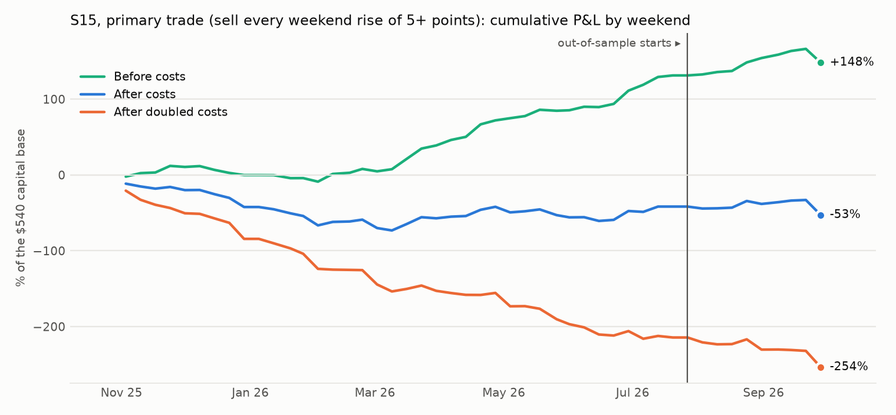
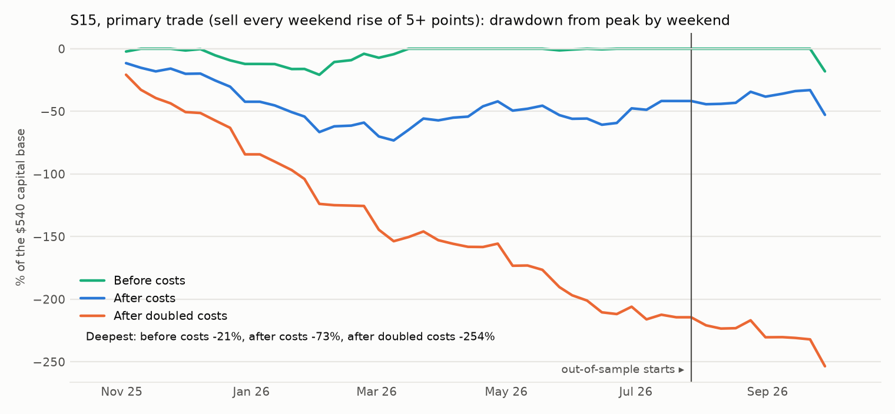

# S15: do price markets that rise over the weekend fall back on Monday? A test on markets S9 did not use

Method, pre-registered before any price of these markets was pulled: [`research/s15_weekend_scare/METHOD.md`](../../s15_weekend_scare/METHOD.md) (commit `c1a41ea`). Data: 871 price markets that S9 never used (710 live on at least one weekend), 2,158 market-weekends on 48 weekends from 2025-11-03 to 2026-09-28. Files: [`tests.csv`](tests.csv), [`metrics.csv`](metrics.csv), [`trades.csv`](trades.csv), [`weekends.csv`](weekends.csv), [`capacity.md`](capacity.md), [`RUN_LOG.md`](RUN_LOG.md).

## Answer

**Does the pattern replicate on fresh markets? In quoted mid prices, yes. In prices someone traded at, it cannot be shown: 9 of the 201 entries that can be checked have a print.** S9's markets that rose over a weekend fell 4.90 points by Monday. On 256 fresh market-weekends with a rise of 5 points or more (46 weekends), the change to the next session's 09:40 is -3.20 points, weekend-bootstrap 95% interval [-5.13, -1.51] (H1: holds). Quiet markets drift -0.89 over the same window; risers minus quiet markets: -2.31 [-4.41, -0.37] (H2: holds).

**By how far the markets are from S9's.** Markets in events S9 did not use at all: -3.87 [-5.82, -2.15] on 232 market-weekends, -2.89 [-5.06, -0.76] against quiet markets. Oil "hit high" markets, the group that fell 7.85 points in S9: -1.49 [-11.64, +7.71] on 11. After a rise of 10 points or more: -3.20 [-5.90, -0.78] on 141.

**The other side.** Markets that fell 5 points or more change by +1.32 [-0.02, +2.82] on 480 market-weekends; against quiet markets +2.21 [+0.74, +3.65]. Once the drift is removed the reversal is the same size on both sides. It is S9's give-back again, not something special to rises.

**Selling the rise (the trade): not a pass.** +3.40 points per trade before costs, -1.21 after [-3.01, +0.73] on 235 trades; -5.82 at doubled costs. In-sample -1.10 [-2.83, +0.72]; out-of-sample (10 weekends from 2026-07-27) -1.92 [-10.08, +6.05] on 31 trades.

**How much of it was a real price.** 201 of the 235 entries are recent enough for their prints to be served; 9 have a print at the assumed price or better within 10 minutes of Sunday 17:55. Those earn +2.96 points before costs [-7.70, +13.45] and -0.55 after [-10.42, +9.47].

## The test (before costs)

The change in the price from Sunday 17:55 to the next session's 09:40, in points. "Quiet markets" moved less than 2 points over the weekend and carry the ordinary drift. Intervals resample weekends.

| Weekend move | Markets | Side | Market-weekends | Weekends | Change to the next session 09:40 | 95% interval | Quiet markets | Difference | 95% interval  |
|---|---|---|---|---|---|---|---|---|---|
| 5+ points | all fresh markets | risers | 256 | 46 | -3.20 | [-5.13, -1.51] | -0.89 | -2.31 | [-4.41, -0.37] |
| 5+ points | all fresh markets | fallers | 480 | 46 | +1.32 | [-0.02, +2.82] | -0.89 | +2.21 | [+0.74, +3.65] |
| 5+ points | class: crude | risers | 34 | 20 | -3.53 | [-8.38, +0.52] | -0.16 | -3.37 | [-8.08, +0.55] |
| 5+ points | class: crude | fallers | 56 | 19 | -0.09 | [-2.27, +2.36] | -0.16 | +0.06 | [-2.79, +3.32] |
| 5+ points | class: gold | risers | 14 | 13 | -4.42 | [-8.99, +0.45] | -4.61 | +0.19 | [-8.54, +8.70] |
| 5+ points | class: gold | fallers | 40 | 15 | +0.13 | [-4.44, +4.28] | -4.61 | +4.75 | [-3.73, +12.22] |
| 5+ points | class: silver | risers | 32 | 16 | +0.73 | [-3.49, +6.85] | -0.57 | +1.31 | [-3.42, +7.56] |
| 5+ points | class: silver | fallers | 50 | 20 | +1.31 | [-1.64, +5.87] | -0.57 | +1.88 | [-1.61, +6.83] |
| 5+ points | class: sp500 | risers | 56 | 29 | -5.37 | [-7.65, -3.16] | -1.15 | -4.21 | [-7.17, -1.30] |
| 5+ points | class: sp500 | fallers | 98 | 29 | +1.14 | [-1.18, +3.24] | -1.15 | +2.29 | [+0.26, +4.58] |
| 5+ points | class: natgas | risers | 8 | 8 | +2.26 | [-2.81, +6.82] | -1.60 | +3.85 | [-2.26, +9.40] |
| 5+ points | class: natgas | fallers | 14 | 10 | -1.32 | [-7.40, +2.28] | -1.60 | +0.27 | [-6.79, +5.92] |
| 5+ points | class: stock | risers | 112 | 32 | -3.37 | [-6.87, -0.98] | -0.27 | -3.10 | [-6.92, -0.15] |
| 5+ points | class: stock | fallers | 222 | 32 | +2.15 | [+0.32, +4.32] | -0.27 | +2.41 | [+0.11, +4.70] |
| 5+ points | tag: other event | risers | 224 | 46 | -3.56 | [-5.40, -1.91] | -0.88 | -2.68 | [-4.76, -0.60] |
| 5+ points | tag: other event | fallers | 423 | 44 | +1.13 | [-0.26, +2.70] | -0.88 | +2.01 | [+0.46, +3.53] |
| 5+ points | tag: weekly | risers | 8 | 6 | -12.38 | [-25.31, +1.62] | -8.25 | -4.13 | [-33.57, +21.81] |
| 5+ points | tag: weekly | fallers | 33 | 7 | +1.25 | [-0.79, +3.80] | -8.25 | +9.50 | [-8.40, +23.15] |
| 5+ points | tag: leftover of an S9 event | risers | 24 | 14 | +3.26 | [-1.03, +7.08] | +0.56 | +2.71 | [-2.10, +7.24] |
| 5+ points | tag: leftover of an S9 event | fallers | 24 | 14 | +4.91 | [+0.31, +11.69] | +0.56 | +4.35 | [-1.20, +12.00] |
| 5+ points | not in an S9 event (other and weekly) | risers | 232 | 46 | -3.87 | [-5.82, -2.15] | -0.98 | -2.89 | [-5.06, -0.76] |
| 5+ points | not in an S9 event (other and weekly) | fallers | 456 | 45 | +1.13 | [-0.18, +2.50] | -0.98 | +2.11 | [+0.65, +3.57] |
| 5+ points | oil "hit high" markets | risers | 11 | 8 | -1.49 | [-11.64, +7.71] | -2.23 | +0.74 | [-7.42, +8.26] |
| 5+ points | oil "hit high" markets | fallers | 23 | 8 | +0.30 | [-1.26, +1.99] | -2.23 | +2.53 | [-3.83, +11.01] |
| 10+ points | all fresh markets | risers | 141 | 39 | -3.20 | [-5.90, -0.78] | -0.89 | -2.31 | [-5.27, +0.17] |
| 10+ points | all fresh markets | fallers | 295 | 43 | +2.32 | [+0.54, +4.36] | -0.89 | +3.21 | [+1.32, +5.16] |
| 10+ points | class: crude | risers | 21 | 13 | -3.78 | [-10.48, +1.88] | -0.16 | -3.63 | [-11.02, +2.14] |
| 10+ points | class: crude | fallers | 44 | 14 | -0.66 | [-2.89, +2.16] | -0.16 | -0.50 | [-3.34, +3.09] |
| 10+ points | class: gold | risers | 5 | 5 | -9.08 | [-17.82, +0.51] | -4.61 | -4.47 | [-15.71, +8.15] |
| 10+ points | class: gold | fallers | 22 | 10 | +5.62 | [+0.76, +10.15] | -4.61 | +10.23 | [+1.72, +17.78] |
| 10+ points | class: silver | risers | 17 | 9 | -0.15 | [-7.58, +11.31] | -0.57 | +0.43 | [-7.34, +13.35] |
| 10+ points | class: silver | fallers | 29 | 13 | +1.17 | [-2.47, +8.05] | -0.57 | +1.74 | [-2.59, +8.73] |
| 10+ points | class: sp500 | risers | 29 | 18 | -4.53 | [-8.09, -0.69] | -1.15 | -3.38 | [-7.68, +1.19] |
| 10+ points | class: sp500 | fallers | 51 | 18 | +2.85 | [+0.34, +5.84] | -1.15 | +4.00 | [+1.49, +7.05] |
| 10+ points | class: natgas | risers | 3 | 3 | +6.02 | n/a | -1.60 | +7.61 | [+1.86, +14.80] |
| 10+ points | class: natgas | fallers | 8 | 6 | -1.69 | [-11.21, +3.33] | -1.60 | -0.09 | [-11.79, +7.06] |
| 10+ points | class: stock | risers | 66 | 22 | -3.19 | [-7.62, -0.35] | -0.27 | -2.92 | [-8.34, +0.47] |
| 10+ points | class: stock | fallers | 141 | 26 | +3.02 | [+0.55, +6.35] | -0.27 | +3.28 | [+0.50, +6.46] |
| 10+ points | tag: other event | risers | 116 | 38 | -4.05 | [-6.90, -1.69] | -0.88 | -3.16 | [-6.28, -0.45] |
| 10+ points | tag: other event | fallers | 249 | 38 | +2.35 | [+0.57, +4.55] | -0.88 | +3.23 | [+1.23, +5.32] |
| 10+ points | tag: weekly | risers | 5 | 4 | -9.70 | n/a | -8.25 | -1.45 | [-40.25, +26.25] |
| 10+ points | tag: weekly | fallers | 30 | 7 | +0.26 | [-2.11, +3.28] | -8.25 | +8.51 | [-8.40, +21.84] |
| 10+ points | tag: leftover of an S9 event | risers | 20 | 13 | +3.34 | [-1.41, +7.11] | +0.56 | +2.78 | [-2.00, +6.77] |
| 10+ points | tag: leftover of an S9 event | fallers | 16 | 11 | +5.76 | [-1.26, +14.63] | +0.56 | +5.20 | [-2.23, +15.64] |
| 10+ points | not in an S9 event (other and weekly) | risers | 121 | 39 | -4.28 | [-7.29, -1.74] | -0.98 | -3.30 | [-6.40, -0.65] |
| 10+ points | not in an S9 event (other and weekly) | fallers | 279 | 41 | +2.13 | [+0.32, +4.13] | -0.98 | +3.10 | [+1.21, +5.01] |
| 10+ points | oil "hit high" markets | risers | 6 | 4 | +4.77 | n/a | -2.23 | +7.01 | [-7.20, +18.54] |
| 10+ points | oil "hit high" markets | fallers | 17 | 6 | -0.09 | [-1.89, +2.58] | -2.23 | +2.14 | [-4.33, +10.45] |

## The trade (V0: sell YES on every rise of 5+ points at Sunday 17:55, buy back at the next session's 09:40)

| Segment | Variant | Costs | Trades | Weekends | Net, points per trade | 95% interval | Before costs | Costs, points | Winners | Net P&L | Sharpe | Deflated Sharpe prob. | Max DD | Worst month | Turnover / yr | Print-verified | Verified, before costs |
|---|---|---|---|---|---|---|---|---|---|---|---|---|---|---|---|---|---|
| IS | V0 (primary trade) | 1× | 204 | 37 | -1.10 | [-2.83, +0.72] | +3.47 | 4.58 | 40% | -$225 | -1.35 | 0.027 | 73.2% | -26.5% | 24.6× | 6 of 179 checkable | +8.18 |
| OOS | V0 (primary trade) | 1× | 31 | 9 | -1.92 | [-10.08, +6.05] | +2.95 | 4.88 | 45% | -$60 | -1.08 | 0.221 | 19.8% | -14.5% | 14.8× | 3 of 22 checkable | -7.47 |
| ALL | V0 (primary trade) | 1× | 235 | 46 | -1.21 | [-3.01, +0.73] | +3.40 | 4.62 | 41% | -$285 | -1.29 | 0.032 | 73.2% | -26.5% | 22.6× | 9 of 201 checkable | +2.96 |
| IS | V0 (primary trade) | 2× | 204 | 37 | -5.67 | [-7.44, -3.77] | +3.47 | 9.15 | 28% | -$1,157 | -5.70 | 0.000 | 211.5% | -42.7% | 25.0× | 7 of 179 checkable | +6.08 |
| OOS | V0 (primary trade) | 2× | 31 | 9 | -6.81 | [-14.09, +0.67] | +2.95 | 9.77 | 32% | -$211 | -3.51 | 0.012 | 38.3% | -22.7% | 15.0× | 4 of 22 checkable | -3.22 |
| ALL | V0 (primary trade) | 2× | 235 | 46 | -5.82 | [-7.58, -3.85] | +3.40 | 9.23 | 29% | -$1,368 | -5.23 | 0.000 | 248.1% | -42.7% | 22.9× | 11 of 201 checkable | +2.70 |

100 contracts per trade. Capital base $540, the largest amount deployed on one weekend. Sharpe on weekend returns, 52 a year.





## Pre-registered criteria

| Criterion | Result | Evidence |
|---|---|---|
| H1: risers fall, interval excluding zero | pass | -3.20 [-5.13, -1.51] |
| H2: risers fall more than quiet markets, interval excluding zero | pass | -2.31 [-4.41, -0.37] |
| Trade: At least 30 OOS trades on at least 5 OOS weekends | pass | 31 trades on 9 weekends |
| Trade: OOS mean net P&L per trade above zero, weekend-bootstrap interval excluding zero (1× costs) | **fail** | -1.92 points [-10.08, +6.05] |
| Trade: OOS above zero at 2× costs | **fail** | -6.81 points |
| Trade: In-sample above zero at 1× costs | **fail** | -1.10 points [-2.83, +0.72] on 204 trades |

**The pattern replicates; the trade: not a pass.**

## Costs

- **Half-spread per fill:** S9's by asset class (crude oil 0.5 point, S&P 500 1.0, gold 1.25, silver 2.0, stocks 2.5), natural gas 2.0, and 3.0 for every market of a weekly event. From the live books of Sat 2026-10-03 22:13 New York time.
- **Fee:** each market's own schedule.
- **Round trip:** 4.62 points per trade on average; 1,209 bp of the capital of a trade at 1×, 2,247 bp at 2×.

## Capacity

See [`capacity.md`](capacity.md).

## Every variant tried

| Segment | Variant | Costs | Trades | Weekends | Net, points per trade | 95% interval | Before costs | Costs, points | Winners | Net P&L | Sharpe | Deflated Sharpe prob. | Max DD | Worst month | Turnover / yr | Print-verified | Verified, before costs |
|---|---|---|---|---|---|---|---|---|---|---|---|---|---|---|---|---|---|
| IS | V0 (primary trade) | 1× | 204 | 37 | -1.10 | [-2.83, +0.72] | +3.47 | 4.58 | 40% | -$225 | -1.35 | 0.027 | 73.2% | -26.5% | 24.6× | 6 of 179 checkable | +8.18 |
| OOS | V0 (primary trade) | 1× | 31 | 9 | -1.92 | [-10.08, +6.05] | +2.95 | 4.88 | 45% | -$60 | -1.08 | 0.221 | 19.8% | -14.5% | 14.8× | 3 of 22 checkable | -7.47 |
| ALL | V0 (primary trade) | 1× | 235 | 46 | -1.21 | [-3.01, +0.73] | +3.40 | 4.62 | 41% | -$285 | -1.29 | 0.032 | 73.2% | -26.5% | 22.6× | 9 of 201 checkable | +2.96 |
| IS | V0 (primary trade) | 2× | 204 | 37 | -5.67 | [-7.44, -3.77] | +3.47 | 9.15 | 28% | -$1,157 | -5.70 | 0.000 | 211.5% | -42.7% | 25.0× | 7 of 179 checkable | +6.08 |
| OOS | V0 (primary trade) | 2× | 31 | 9 | -6.81 | [-14.09, +0.67] | +2.95 | 9.77 | 32% | -$211 | -3.51 | 0.012 | 38.3% | -22.7% | 15.0× | 4 of 22 checkable | -3.22 |
| ALL | V0 (primary trade) | 2× | 235 | 46 | -5.82 | [-7.58, -3.85] | +3.40 | 9.23 | 29% | -$1,368 | -5.23 | 0.000 | 248.1% | -42.7% | 22.9× | 11 of 201 checkable | +2.70 |
| IS | V1 | 1× | 107 | 32 | -1.04 | [-3.16, +1.57] | +3.38 | 4.42 | 39% | -$112 | -0.95 | 0.043 | 57.0% | -21.2% | 15.0× | 4 of 94 checkable | +7.76 |
| OOS | V1 | 1× | 19 | 7 | -0.27 | [-14.56, +12.26] | +4.71 | 4.99 | 53% | -$5 | -0.10 | 0.396 | 24.5% | -16.7% | 10.6× | 1 of 13 checkable | -24.45 |
| ALL | V1 | 1× | 126 | 39 | -0.93 | [-3.57, +1.85] | +3.58 | 4.50 | 41% | -$117 | -0.67 | 0.100 | 57.0% | -21.2% | 14.1× | 5 of 107 checkable | +1.32 |
| IS | V1 | 2× | 107 | 32 | -5.45 | [-7.58, -2.79] | +3.38 | 8.82 | 30% | -$583 | -3.57 | 0.000 | 138.0% | -30.9% | 14.9× | 5 of 94 checkable | +4.91 |
| OOS | V1 | 2× | 19 | 7 | -5.28 | [-18.38, +6.37] | +4.71 | 9.99 | 47% | -$100 | -1.88 | 0.088 | 29.4% | -22.5% | 10.5× | 1 of 13 checkable | -24.45 |
| ALL | V1 | 2× | 126 | 39 | -5.42 | [-7.92, -2.68] | +3.58 | 9.00 | 33% | -$683 | -3.17 | 0.000 | 155.6% | -30.9% | 14.0× | 6 of 107 checkable | +0.02 |
| IS | V2 | 1× | 26 | 16 | +2.00 | [-1.43, +6.22] | +5.41 | 3.41 | 31% | +$52 | 1.19 | 0.598 | 13.4% | -7.8% | 8.2× | 1 of 24 checkable | -5.50 |
| OOS | V2 | 1× | 5 | 3 | -5.83 | n/a | -2.66 | 3.17 | 20% | -$29 | -1.58 | 0.134 | 17.3% | -10.6% | 3.3× | 1 of 4 checkable | -24.45 |
| ALL | V2 | 1× | 31 | 19 | +0.74 | [-3.10, +5.09] | +4.11 | 3.37 | 29% | +$23 | 0.36 | 0.417 | 17.3% | -10.6% | 7.2× | 2 of 28 checkable | -14.97 |
| IS | V2 | 2× | 26 | 16 | -1.42 | [-4.48, +2.19] | +5.41 | 6.84 | 27% | -$37 | -0.93 | 0.016 | 31.0% | -19.7% | 8.3× | 1 of 24 checkable | -5.50 |
| OOS | V2 | 2× | 5 | 3 | -9.02 | n/a | -2.66 | 6.36 | 20% | -$45 | -2.27 | 0.024 | 20.4% | -17.0% | 3.4× | 1 of 4 checkable | -24.45 |
| ALL | V2 | 2× | 31 | 19 | -2.65 | [-6.12, +1.14] | +4.11 | 6.76 | 26% | -$82 | -1.33 | 0.001 | 37.2% | -19.7% | 7.2× | 2 of 28 checkable | -14.97 |

V1: rises of 10 points or more. V2: crude oil only. The deflated Sharpe probability uses 3 trials.

## Caveats

- **Thin books.** These markets traded $10,000 to $50,000 in their life. A riser is chosen on a high Sunday reading; if that reading is noise in a thin book, the next one is lower by construction, and nobody could have sold at it. The print-verified rows are the guard. 11% of live market-weekends show exactly the same price on Sunday as on Friday.
- **The same weekends as S9.** Different markets, not a different period.
- Half-spreads come from one night's books.

## Reproduce

```
cd research
python -m s15_weekend_scare.universe      # catalogue only; already committed
python -m s15_weekend_scare.run --pull --gentle
python -m s15_weekend_scare.run
python -m s15_weekend_scare.report
python -m pytest s15_weekend_scare/tests -q
```
