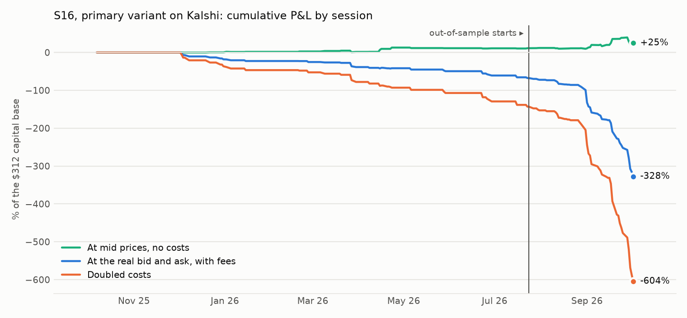
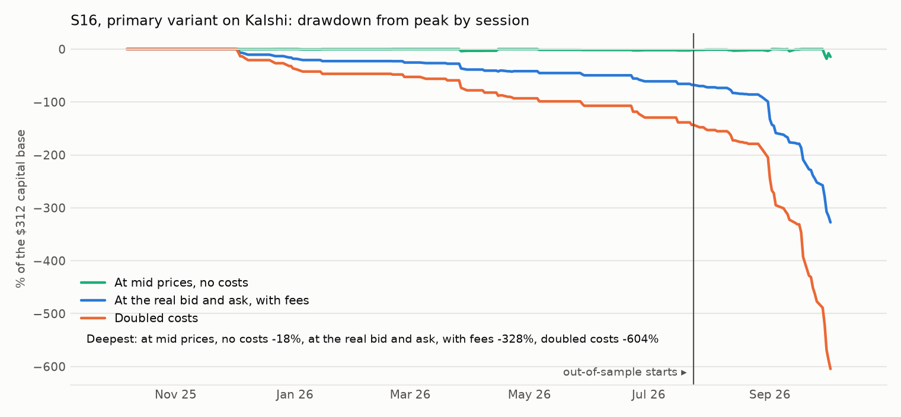

# S16: the give-back at real quotes, on Kalshi

Method, pre-registered before any give-back or P&L was computed on Kalshi's quotes: [`research/s16_kalshi_quotes/METHOD.md`](../../s16_kalshi_quotes/METHOD.md) (commit `f7ce87e`, amendment 1 `31c20aa`). Data: S1's cache, nothing pulled: 31 Kalshi markets with their best bid and ask, and their Polymarket twins, 249 sessions from 2025-10-07 to 2026-10-02. Files: [`tests.csv`](tests.csv), [`metrics.csv`](metrics.csv), [`trades.csv`](trades.csv), [`sessions.csv`](sessions.csv), [`capacity.md`](capacity.md), [`RUN_LOG.md`](RUN_LOG.md).

## Answer

**What holds up: each venue gives back the large moves measured on itself, and the other venue's price for the same question does not move. The give-back is noise in one venue's price, not the event's odds overshooting.**

- Nights picked on **Kalshi's** overnight move of 10 points or more (32 market-sessions): Kalshi's quoted mid changes by -3.55 points by the close [-6.88, -0.66]. Polymarket's price for the same question: -0.47 [-2.42, +1.33]. Difference +3.08 [+0.73, +5.90].
- Nights picked on **Polymarket's** overnight move of 10 points or more (28 market-sessions): Polymarket's price changes by -4.30 [-8.00, -0.52]. Kalshi's quoted mid: -0.27 [-4.00, +2.28]. Difference -4.04 [-7.71, +0.22].
- At 5 points the same signs with intervals through zero (differences +1.00 [-0.39, +2.42] and -0.83 [-2.55, +0.92]). The samples are small: about 30 market-sessions at 10 points.

This is the likeliest reading of the give-back that S5, S8, S9 and S15 found on Polymarket: a large move in one venue's price that the same question elsewhere did not share is mostly that venue's quote moving, and it comes back. It is the size of the spread because it is the spread.

**At Kalshi's real bid and ask the fade loses 10.43 points per trade** [-12.91, -8.09] on 98 trades; 3% winners. At mid prices it earns +0.80. Crossing the quoted spread costs 8.68 points and the fee 2.54. The quoted spread is 1.0 point at the median over all sessions, but after a large overnight move in the mid it is wide: the "move" was largely the quote widening.

**Verdict on the pre-registered criterion: not a pass.** Out-of-sample (50 sessions from 2026-07-24): -12.28 points per trade [-15.43, -9.36] on 66 trades.

## Headline numbers (primary V0: overnight move of 5+ points in Kalshi's mid, faded at 09:40 at the bid or ask, closed at the close)

| Segment | Variant | Costs | Trades | Dates | Net, points per trade | 95% interval | At mid, no costs | Spread, points | Fee, points | Winners | Net P&L | Sharpe | Deflated Sharpe prob. | Max DD | Worst month | Turnover / yr |
|---|---|---|---|---|---|---|---|---|---|---|---|---|---|---|---|---|
| IS | V0 (primary) | 1× | 32 | 29 | -6.60 | [-8.92, -4.63] | +1.09 | 5.00 | 2.69 | 9% | -$211 | -4.80 | 0.000 | 67.7% | -18.2% | 6.2× |
| OOS | V0 (primary) | 1× | 66 | 35 | -12.28 | [-15.43, -9.36] | +0.65 | 10.47 | 2.47 | 0% | -$811 | -10.72 | 0.000 | 259.8% | -208.1% | 55.1× |
| ALL | V0 (primary) | 1× | 98 | 64 | -10.43 | [-12.91, -8.09] | +0.80 | 8.68 | 2.54 | 3% | -$1,022 | -5.14 | 0.000 | 327.5% | -208.1% | 16.0× |
| IS | V0 (primary) | 2× | 32 | 29 | -13.96 | [-17.57, -11.05] | +1.09 | 9.77 | 5.29 | 3% | -$447 | -5.48 | 0.000 | 129.9% | -33.1% | 6.0× |
| OOS | V0 (primary) | 2× | 66 | 35 | -21.81 | [-25.68, -17.94] | +0.65 | 17.78 | 4.68 | 0% | -$1,439 | -11.74 | 0.000 | 418.4% | -330.1% | 54.0× |
| ALL | V0 (primary) | 2× | 98 | 64 | -19.25 | [-22.40, -16.04] | +0.80 | 15.16 | 4.88 | 1% | -$1,886 | -5.69 | 0.000 | 548.3% | -330.1% | 15.6× |

100 contracts per trade. Capital base $312, the largest amount deployed in one session. Sharpe on session returns, 252 a year. Most of the sessions fall out-of-sample because most twins began trading on both venues in 2026.





## The tests (before costs)

K1: Kalshi's quoted mid after its own overnight move. K2: the same nights on Polymarket. K3 (amendment 1): nights picked on Polymarket's own move, and Kalshi's quoted mid on those nights. Negative = the move was given back. Intervals resample dates.

| Test | Kalshi quote age allowed | Overnight move | Market-sessions | Dates | Markets | Change from 09:40 to the close, signed by the move | 95% interval |
|---|---|---|---|---|---|---|---|
| K1 give-back on Kalshi's quoted mid | 6 hours | 5+ points | 98 | 64 | 17 | -0.80 | [-2.25, +0.74] |
| K2 the same nights, Polymarket's history price | 6 hours | 5+ points | 98 | 64 | 17 | +0.21 | [-0.48, +0.91] |
| K2 the same nights, Kalshi's quoted mid | 6 hours | 5+ points | 98 | 64 | 17 | -0.80 | [-2.25, +0.74] |
| K2 Polymarket minus Kalshi, paired | 6 hours | 5+ points | 98 | 64 | 17 | +1.00 | [-0.39, +2.42] |
| K1 give-back on Kalshi's quoted mid | 6 hours | 3+ points | 192 | 104 | 22 | -0.77 | [-1.88, +0.27] |
| K2 the same nights, Polymarket's history price | 6 hours | 3+ points | 192 | 104 | 22 | +0.26 | [-0.21, +0.74] |
| K2 the same nights, Kalshi's quoted mid | 6 hours | 3+ points | 192 | 104 | 22 | -0.77 | [-1.88, +0.27] |
| K2 Polymarket minus Kalshi, paired | 6 hours | 3+ points | 192 | 104 | 22 | +1.02 | [+0.01, +2.14] |
| K1 give-back on Kalshi's quoted mid | 6 hours | 10+ points | 32 | 21 | 11 | -3.55 | [-6.88, -0.66] |
| K2 the same nights, Polymarket's history price | 6 hours | 10+ points | 32 | 21 | 11 | -0.47 | [-2.42, +1.33] |
| K2 the same nights, Kalshi's quoted mid | 6 hours | 10+ points | 32 | 21 | 11 | -3.55 | [-6.88, -0.66] |
| K2 Polymarket minus Kalshi, paired | 6 hours | 10+ points | 32 | 21 | 11 | +3.08 | [+0.73, +5.90] |
| K1 give-back on Kalshi's quoted mid | 15 minutes | 5+ points | 28 | 22 | 9 | -0.43 | [-2.02, +1.26] |
| K2 the same nights, Polymarket's history price | 15 minutes | 5+ points | 28 | 22 | 9 | +0.88 | [-1.10, +2.76] |
| K2 the same nights, Kalshi's quoted mid | 15 minutes | 5+ points | 28 | 22 | 9 | -0.43 | [-2.02, +1.26] |
| K2 Polymarket minus Kalshi, paired | 15 minutes | 5+ points | 28 | 22 | 9 | +1.30 | [-0.12, +2.97] |
| K1 give-back on Kalshi's quoted mid | 15 minutes | 3+ points | 67 | 52 | 13 | -0.75 | [-2.39, +0.61] |
| K2 the same nights, Polymarket's history price | 15 minutes | 3+ points | 67 | 52 | 13 | +0.67 | [-0.38, +1.82] |
| K2 the same nights, Kalshi's quoted mid | 15 minutes | 3+ points | 67 | 52 | 13 | -0.75 | [-2.39, +0.61] |
| K2 Polymarket minus Kalshi, paired | 15 minutes | 3+ points | 67 | 52 | 13 | +1.42 | [+0.23, +2.75] |
| K1 give-back on Kalshi's quoted mid | 15 minutes | 10+ points | 7 | 5 | 4 | -0.57 | [-2.40, +1.00] |
| K2 the same nights, Polymarket's history price | 15 minutes | 10+ points | 7 | 5 | 4 | +0.57 | [-6.90, +5.50] |
| K2 the same nights, Kalshi's quoted mid | 15 minutes | 10+ points | 7 | 5 | 4 | -0.57 | [-2.40, +1.00] |
| K2 Polymarket minus Kalshi, paired | 15 minutes | 10+ points | 7 | 5 | 4 | +1.14 | [-5.20, +5.64] |
| K3 nights picked on Polymarket's move: Polymarket's history price | 6 hours | 5+ points | 104 | 76 | 17 | -0.91 | [-2.11, +0.25] |
| K3 nights picked on Polymarket's move: Kalshi's quoted mid | 6 hours | 5+ points | 104 | 76 | 17 | -0.08 | [-1.36, +1.15] |
| K3 Polymarket minus Kalshi, paired | 6 hours | 5+ points | 104 | 76 | 17 | -0.83 | [-2.55, +0.92] |
| K3 nights picked on Polymarket's move: Polymarket's history price | 6 hours | 3+ points | 181 | 118 | 23 | -0.77 | [-1.49, +0.00] |
| K3 nights picked on Polymarket's move: Kalshi's quoted mid | 6 hours | 3+ points | 181 | 118 | 23 | +0.09 | [-0.76, +0.97] |
| K3 Polymarket minus Kalshi, paired | 6 hours | 3+ points | 181 | 118 | 23 | -0.86 | [-2.09, +0.28] |
| K3 nights picked on Polymarket's move: Polymarket's history price | 6 hours | 10+ points | 28 | 22 | 9 | -4.30 | [-8.00, -0.52] |
| K3 nights picked on Polymarket's move: Kalshi's quoted mid | 6 hours | 10+ points | 28 | 22 | 9 | -0.27 | [-4.00, +2.28] |
| K3 Polymarket minus Kalshi, paired | 6 hours | 10+ points | 28 | 22 | 9 | -4.04 | [-7.71, +0.22] |

## Pre-registered success criterion

| Criterion | Result | Evidence |
|---|---|---|
| At least 30 OOS trades on at least 10 OOS dates | pass | 66 trades on 35 dates |
| OOS mean net P&L per trade above zero, date-bootstrap interval excluding zero (1× costs) | **fail** | -12.28 points [-15.43, -9.36] |
| OOS above zero at 2× costs | **fail** | -21.81 points |
| In-sample above zero | **fail** | -6.60 points [-8.92, -4.63] on 32 trades |

**Verdict: not a pass.**

## Costs

- **Spread:** the real quoted bid and ask of each fill, from Kalshi's candles.
- **Fee:** Kalshi's taker formula, 0.07 × multiplier × contracts × P × (1 − P), rounded up to the cent, on each fill (multipliers in this sample: 1.0).
- **Per trade:** spread 8.68 points and fee 2.54 points at 1×; 2,515 bp of capital. At 2×: 4,157 bp.
- **Trades dropped for want of a quote at the exit:** 5 for the primary.

## Capacity

See [`capacity.md`](capacity.md).

## Every variant tried

| Segment | Variant | Costs | Trades | Dates | Net, points per trade | 95% interval | At mid, no costs | Spread, points | Fee, points | Winners | Net P&L | Sharpe | Deflated Sharpe prob. | Max DD | Worst month | Turnover / yr |
|---|---|---|---|---|---|---|---|---|---|---|---|---|---|---|---|---|
| IS | V0 (primary) | 1× | 32 | 29 | -6.60 | [-8.92, -4.63] | +1.09 | 5.00 | 2.69 | 9% | -$211 | -4.80 | 0.000 | 67.7% | -18.2% | 6.2× |
| OOS | V0 (primary) | 1× | 66 | 35 | -12.28 | [-15.43, -9.36] | +0.65 | 10.47 | 2.47 | 0% | -$811 | -10.72 | 0.000 | 259.8% | -208.1% | 55.1× |
| ALL | V0 (primary) | 1× | 98 | 64 | -10.43 | [-12.91, -8.09] | +0.80 | 8.68 | 2.54 | 3% | -$1,022 | -5.14 | 0.000 | 327.5% | -208.1% | 16.0× |
| IS | V0 (primary) | 2× | 32 | 29 | -13.96 | [-17.57, -11.05] | +1.09 | 9.77 | 5.29 | 3% | -$447 | -5.48 | 0.000 | 129.9% | -33.1% | 6.0× |
| OOS | V0 (primary) | 2× | 66 | 35 | -21.81 | [-25.68, -17.94] | +0.65 | 17.78 | 4.68 | 0% | -$1,439 | -11.74 | 0.000 | 418.4% | -330.1% | 54.0× |
| ALL | V0 (primary) | 2× | 98 | 64 | -19.25 | [-22.40, -16.04] | +0.80 | 15.16 | 4.88 | 1% | -$1,886 | -5.69 | 0.000 | 548.3% | -330.1% | 15.6× |
| IS | V1 | 1× | 76 | 63 | -5.63 | [-6.65, -4.73] | +0.64 | 3.64 | 2.63 | 5% | -$428 | -7.94 | 0.000 | 102.9% | -19.9% | 11.7× |
| OOS | V1 | 1× | 116 | 41 | -10.90 | [-13.50, -8.48] | +0.84 | 9.28 | 2.46 | 4% | -$1,264 | -12.22 | 0.000 | 303.8% | -205.0% | 76.5× |
| ALL | V1 | 1× | 192 | 104 | -8.81 | [-10.65, -7.17] | +0.77 | 7.05 | 2.53 | 5% | -$1,692 | -6.09 | 0.000 | 406.7% | -205.0% | 24.8× |
| IS | V1 | 2× | 76 | 63 | -11.72 | [-13.28, -10.29] | +0.64 | 7.16 | 5.20 | 1% | -$890 | -8.60 | 0.000 | 189.7% | -35.2% | 10.8× |
| OOS | V1 | 2× | 116 | 41 | -19.85 | [-23.48, -16.50] | +0.84 | 16.03 | 4.66 | 1% | -$2,302 | -13.39 | 0.000 | 490.3% | -321.5% | 72.4× |
| ALL | V1 | 2× | 192 | 104 | -16.63 | [-19.20, -14.26] | +0.77 | 12.52 | 4.88 | 1% | -$3,193 | -6.70 | 0.000 | 680.0% | -321.5% | 23.2× |
| IS | V2 | 1× | 5 | 5 | -4.29 | [-7.46, -0.73] | +6.60 | 7.80 | 3.09 | 20% | -$21 | -1.87 | 0.000 | 10.4% | -4.3% | 1.7× |
| OOS | V2 | 1× | 27 | 16 | -16.29 | [-22.42, -10.24] | +2.98 | 16.94 | 2.33 | 0% | -$440 | -6.64 | 0.000 | 191.2% | -175.0% | 34.0× |
| ALL | V2 | 1× | 32 | 21 | -14.42 | [-19.89, -8.87] | +3.55 | 15.52 | 2.45 | 3% | -$461 | -2.94 | 0.000 | 200.6% | -175.0% | 8.2× |
| IS | V2 | 2× | 5 | 5 | -13.69 | [-17.76, -9.17] | +6.60 | 14.40 | 5.89 | 0% | -$68 | -2.39 | 0.000 | 25.8% | -9.8% | 1.5× |
| OOS | V2 | 2× | 27 | 16 | -27.86 | [-36.47, -19.70] | +2.98 | 26.65 | 4.19 | 0% | -$752 | -7.37 | 0.000 | 283.9% | -254.9% | 32.5× |
| ALL | V2 | 2× | 32 | 21 | -25.65 | [-32.71, -18.26] | +3.55 | 24.73 | 4.46 | 0% | -$821 | -3.33 | 0.000 | 309.7% | -254.9% | 7.8× |
| IS | V3 | 1× | 12 | 12 | -4.34 | [-6.27, -1.98] | +1.54 | 3.04 | 2.85 | 17% | -$52 | -2.97 | 0.000 | 30.7% | -9.1% | 4.4× |
| OOS | V3 | 1× | 16 | 10 | -8.00 | [-10.07, -5.02] | -0.41 | 5.09 | 2.50 | 0% | -$128 | -5.37 | 0.000 | 75.3% | -40.1% | 20.3× |
| ALL | V3 | 1× | 28 | 22 | -6.43 | [-8.14, -4.26] | +0.43 | 4.21 | 2.65 | 7% | -$180 | -3.10 | 0.000 | 106.0% | -40.1% | 7.6× |
| IS | V3 | 2× | 12 | 12 | -10.21 | [-13.13, -6.84] | +1.54 | 6.08 | 5.67 | 8% | -$123 | -3.48 | 0.000 | 69.2% | -17.4% | 4.3× |
| OOS | V3 | 2× | 16 | 10 | -15.51 | [-18.23, -11.04] | -0.41 | 10.19 | 4.92 | 0% | -$248 | -5.79 | 0.000 | 140.2% | -79.6% | 20.6× |
| ALL | V3 | 2× | 28 | 22 | -13.24 | [-15.74, -10.03] | +0.43 | 8.43 | 5.24 | 4% | -$371 | -3.49 | 0.000 | 209.4% | -79.6% | 7.6× |

V1: 3 points or more. V2: 10 points or more. V3: quotes at most 15 minutes old. The deflated Sharpe probability uses 4 trials.

## What didn't work

- **The fade at real quotes**, in every variant and both segments. The best is V3 at -6.43 points per trade.
- **Kalshi's mid after a move of 5 points or more** is not significantly given back: -0.80 [-2.25, +0.74]. Only the moves of 10 points or more are (-3.55 [-6.88, -0.66]).

## Caveats

- 31 markets on a few themes, and about 30 market-sessions behind each 10-point figure.
- K3 was added after the first run, before it was computed (amendment 1).
- A quote allowed to stand for 6 hours may not be fillable; the strict 15-minute rule (V3) has 28 trades.
- This shows that the give-back on these twin questions is venue noise. It suggests, and does not prove, the same for the Polymarket-only samples of S8, S9 and S15.

## Reproduce

```
cd research
python -m s16_kalshi_quotes.run
python -m s16_kalshi_quotes.report
python -m pytest s16_kalshi_quotes/tests -q
```
