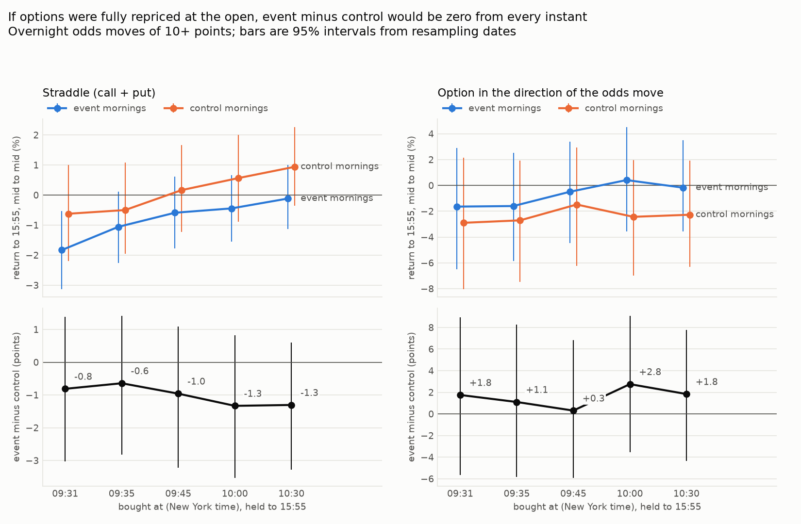
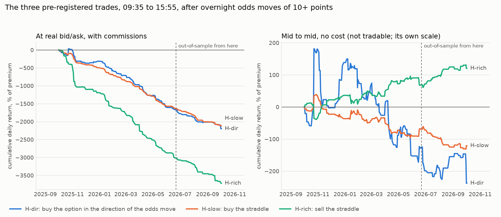
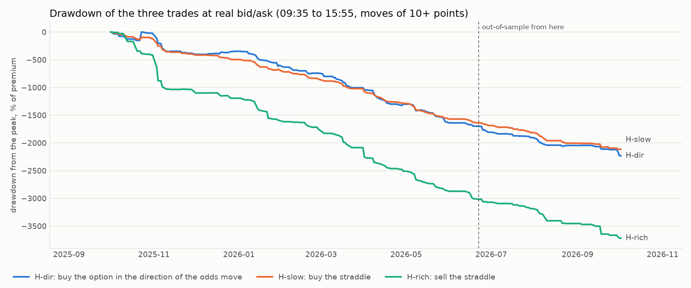

# S16 (overnight options): after a big overnight move in the odds, are options on the linked asset mispriced in the first minutes?

Method, pre-registered before any option quote was pulled: [`research/s16_overnight_options/METHOD.md`](../../s16_overnight_options/METHOD.md) (commit `1185abb`; amendments in METHOD.md, the label is S16: amendment 3). 253 sessions, 2025-10-01 to 2026-10-02; out-of-sample is every session from 2026-06-22. Files: [`metrics.csv`](metrics.csv), [`trades.csv`](trades.csv), [`observations.csv`](observations.csv), [`speed_curve.csv`](speed_curve.csv), [`spreads.csv`](spreads.csv), [`verdicts.csv`](verdicts.csv), [`top_moves.csv`](top_moves.csv), [`equity.csv`](equity.csv), [`capacity.md`](capacity.md), [`RUN_LOG.md`](RUN_LOG.md).

> **INTERIM.** The pull is still running. The main sample (tier 1) is complete and its numbers below are final; the Brazil and Fed-and-banks case files, the day volumes and variant V3 are not pulled yet and will change.

## Answer

**The overnight move is already in the option's price at the first reading of the day.** At 09:31, one minute into the session, the option that points the way the odds moved (a call if the odds said up, a put if down) was worth +33.4% more than at 15:55 the day before (95% interval [+23.2%, +45.0%], 279 ticker-days, mid prices; the interval excludes zero). The stock itself had opened +125 bp in the direction of the odds (S5 found +137 bp).

**After that first reading there is nothing left that shows up against ordinary mornings.** Bought at the mid price at 09:31, 09:35, 09:45, 10:00 or 10:30 and held to 15:55, the options on event mornings did no better and no worse than the same options on quiet mornings of the same ticker. All ten intervals include zero. The first three:

| Bought at | Option in the direction of the odds: event minus control | Straddle: event minus control |
|---|---|---|
| 09:31 | +1.8% [-5.6%, +8.9%] (216 pairs) | -0.8% [-3.0%, +1.4%] (215 pairs) |
| 09:35 | +1.1% [-5.8%, +8.3%] (220 pairs) | -0.6% [-2.8%, +1.4%] (220 pairs) |
| 09:45 | +0.3% [-5.9%, +6.8%] (220 pairs) | -1.0% [-3.2%, +1.1%] (220 pairs) |

(Return from that instant to 15:55, mid price to mid price, event morning minus its matched quiet morning. A straddle is a call plus a put at the same strike: it gains from a large move either way.) After 09:35 the stock moved +5 bp in the direction of the odds by 15:55, which is nothing, as S5 found for shares.

**Options are 2.9 times as wide in the first minute as an hour later.** The median straddle is quoted 30.5% wide at 09:31, as a share of its own price; 16.6% at 09:35; 12.7% at 09:45; 10.4% at 10:30; 13.0% at the previous close. For the single option in the direction of the odds: 28.6% at 09:31 and 14.4% at 09:35. Quiet mornings are just as wide (28.3% at 09:31, 16.7% at 09:35), so the width is the open, not the event. Whatever is not yet priced in the first minutes is smaller than the cost of crossing that spread twice.

**The three pre-registered trades, in at the 09:35 quote and out at the 15:55 quote, at real bid and ask:**

- **H-dir. Theo's literal claim: buy the option in the direction of the odds move. Verdict: fail (lines not met: (b), (c), (d)).** Out-of-sample: -23.0% of the premium per trade [-32.1%, -15.0%] on 52 trades and 22 dates; at doubled costs -36.1% (median -34.3%); in-sample -17.9% on 233 trades. Whole sample: -18.8% [-22.9%, -14.7%] on 285 trades, median -18.8%, 22% winners; before any cost (mid to mid) -1.6% [-5.9%, +2.5%]. Against matched control mornings, at real quotes: +1.6% [-4.6%, +8.0%] (220 pairs).
- **H-slow. Options too cheap at the open: buy the straddle. Verdict: fail (lines not met: (b), (c), (d)).** Out-of-sample: -20.9% of the premium per trade [-24.4%, -17.8%] on 52 trades and 22 dates; at doubled costs -34.7% (median -34.7%); in-sample -18.4% on 233 trades. Whole sample: -18.9% [-20.5%, -17.2%] on 285 trades, median -16.5%, 6% winners; before any cost (mid to mid) -1.1% [-2.3%, +0.1%]. Against matched control mornings, at real quotes: -0.5% [-2.4%, +1.1%] (220 pairs).
- **H-rich. Options too dear at the open: sell the straddle. Verdict: fail (lines not met: (b), (c), (d)).** Out-of-sample: -27.2% of the premium per trade [-35.7%, -20.4%] on 52 trades and 22 dates; at doubled costs -621.1% (median -41.6%); in-sample -29.9% on 233 trades. Whole sample: -29.4% [-34.6%, -24.9%] on 285 trades, median -17.7%, 8% winners; before any cost (mid to mid) +1.1% [-0.1%, +2.3%]. Against matched control mornings, at real quotes: +1.1% [-5.1%, +7.3%] (220 pairs).

**No hypothesis passes, and at real quotes all three trades lose with intervals that exclude zero.** H-slow and H-rich are mirror trades: before costs one earns what the other loses, and at real quotes both pay the spread. The mean of H-rich at doubled costs is driven by a few quotes whose bid falls to almost nothing when the spread is doubled; its median is the fairer figure.

**Counts.** 300 event ticker-days at 10+ points on 109 dates; 285 had valid quotes at 09:35 and 15:55 (15 dropped: no valid quote at 09:35: 10, no valid quote at 15:55: 5). Controls: 241 matched, 224 with valid quotes (59 events had no quiet session within 30 trading days). Out-of-sample event trades: 52 (the pass line needs 30).

**One variant gets a flag, not a claim.** After weekends and holidays (V4, 113 trades), the option in the direction of the odds returned +2.9% mid to mid [-2.5%, +8.5%] against -4.6% for the same side on quiet mornings: a difference of +7.9% [+0.5%, +15.5%] (91 pairs). In-sample +7.6% [+0.2%, +15.7%]; out-of-sample +9.0% [-11.8%, +27.6%] on 19 pairs, which includes zero. At real quotes the trade returned -16.0% [-21.4%, -10.5%]. It is one of 15 looks, its own return before costs is not distinguishable from zero, its controls are mostly weekday mornings, and it does not survive the spread.

**Case files (exploratory, details below).**
- Brazil, EWZ options, 13 of 13 mornings with a 5+ point move in a first-round question had quotes. Option in the direction of the odds: +3.4% net [-9.8%, +16.0%], +13.2% mid to mid, but the same option on quiet mornings did as well (event minus control -2.4% [-27.3%, +20.1%]). Straddle: -3.1% mid to mid against +2.7% on quiet mornings, a difference of -5.7% [-9.1%, -2.6%], an interval that excludes zero: EWZ straddles were dearer at 09:35 on those mornings than they turned out to be worth. Selling that straddle at real quotes returned -6.6% [-9.4%, -4.2%]; buying it returned -12.1%. 13 mornings, one of many looks: an observation for the forward test, not a finding.
- Oil (USO, XLE, XOP), 123 ticker-days: directional option -18.6% net [-24.2%, -12.7%], -1.7% mid to mid [-8.1%, +4.7%]; straddle -18.2% net, -0.5% mid to mid; against controls mid to mid: directional -0.3% [-14.5%, +12.9%], straddle -0.3% [-3.8%, +2.9%].
- Fed and banks (TLT, KRE, XLF straddles on mornings when a Fed question moved 5+ points), 9 ticker-days (incomplete pull): bought at 09:35, -6.0% net [-11.3%, -0.6%], -0.6% mid to mid [-6.0%, +4.9%]; against controls mid to mid -17.6% [n/a] (1 pairs).

**What this does and does not say about the claim.** The claim was that the whole overnight move cannot be perfectly priced into the options in the first moments of the session. This study's first reading is at 09:31, sixty seconds in. It does not see the first second, and at 09:31 the quotes are so wide that "the price" is a band, not a number. What it does say: inside that band the options had already moved with the odds, and from 09:31 onward event mornings cannot be told apart from quiet mornings, before costs. If part of the move is still unpriced at 09:31, it is smaller than this sample can see: the interval on the directional option is [-5.6%, +8.9%] and on the straddle [-3.0%, +1.4%], against a spread of 30.5%.

## The pre-registered pass line, hypothesis by hypothesis

**H-dir: buy the option in the direction of the odds move, 09:35 quote to 15:55 quote. Verdict: fail.**

| Line | Met | Evidence |
|---|---|---|
| (a) at least 30 out-of-sample trades | yes | 52 trades |
| (b) out-of-sample mean net return above zero, interval excluding zero (1x costs) | **no** | -23.0%, interval from -32.1% |
| (c) out-of-sample mean above zero at 2x costs | **no** | -36.1% |
| (d) in-sample mean net return above zero | **no** | -17.9% |

**H-slow: buy the straddle, 09:35 quote to 15:55 quote. Verdict: fail.**

| Line | Met | Evidence |
|---|---|---|
| (a) at least 30 out-of-sample trades | yes | 52 trades |
| (b) out-of-sample mean net return above zero, interval excluding zero (1x costs) | **no** | -20.9%, interval from -24.4% |
| (c) out-of-sample mean above zero at 2x costs | **no** | -34.7% |
| (d) in-sample mean net return above zero | **no** | -18.4% |
| Supporting line (not part of the pass): event minus control above zero, interval excluding zero, whole sample | **no** | -0.5% [-2.4%, +1.1%], 220 pairs |

**H-rich: sell the straddle, 09:35 quote to 15:55 quote. Verdict: fail.**

| Line | Met | Evidence |
|---|---|---|
| (a) at least 30 out-of-sample trades | yes | 52 trades |
| (b) out-of-sample mean net return above zero, interval excluding zero (1x costs) | **no** | -27.2%, interval from -35.7% |
| (c) out-of-sample mean above zero at 2x costs | **no** | -621.1% |
| (d) in-sample mean net return above zero | **no** | -29.9% |
| Supporting line (not part of the pass): event minus control above zero, interval excluding zero, whole sample | **no** | +1.1% [-5.1%, +7.3%], 220 pairs |

## Headline numbers (primary V0: moves of 10+ points, in at 09:35, out at 15:55)

| Trade | Segment | Costs | Trades | Dates | Mean return | 95% interval | Median | Winners | Control mean | Event minus control | Sharpe | Max DD | Worst month |
|---|---|---|---|---|---|---|---|---|---|---|---|---|---|
| H-dir | IS | mid | 233 | 87 | -0.8% | [-5.6%, +3.9%] | -2.1% | 47% | -3.9% (n 171) | +3.5% [-4.8%, +11.6%] (pairs 169) | -0.54 | 354% | -183% |
| H-dir | IS | 1x | 233 | 87 | -17.9% | [-22.5%, -13.4%] | -18.5% | 24% | -21.7% (n 171) | +3.2% [-4.1%, +10.4%] (pairs 169) | -6.09 | 1695% | -360% |
| H-dir | IS | 2x | 233 | 87 | -30.2% | [-34.8%, -25.6%] | -31.2% | 13% | -34.5% (n 171) | +3.6% [-3.1%, +10.0%] (pairs 169) | -8.54 | 2685% | -506% |
| H-dir | OOS | mid | 52 | 22 | -5.1% | [-14.4%, +3.4%] | -3.0% | 42% | +1.1% (n 53) | -6.9% [-22.6%, +7.0%] (pairs 51) | -1.82 | 113% | -69% |
| H-dir | OOS | 1x | 52 | 22 | -23.0% | [-32.1%, -15.0%] | -21.6% | 13% | -20.3% (n 53) | -3.8% [-16.9%, +8.1%] (pairs 51) | -7.37 | 535% | -143% |
| H-dir | OOS | 2x | 52 | 22 | -36.1% | [-45.1%, -28.1%] | -34.3% | 6% | -35.0% (n 53) | -2.5% [-14.6%, +8.7%] (pairs 51) | -8.73 | 838% | -261% |
| H-dir | ALL | mid | 285 | 109 | -1.6% | [-5.9%, +2.5%] | -2.1% | 46% | -2.7% (n 224) | +1.1% [-5.8%, +8.3%] (pairs 220) | -0.78 | 419% | -183% |
| H-dir | ALL | 1x | 285 | 109 | -18.8% | [-22.9%, -14.7%] | -18.8% | 22% | -21.4% (n 224) | +1.6% [-4.6%, +8.0%] (pairs 220) | -6.27 | 2230% | -360% |
| H-dir | ALL | 2x | 285 | 109 | -31.2% | [-35.3%, -27.2%] | -31.7% | 12% | -34.6% (n 224) | +2.2% [-3.4%, +8.0%] (pairs 220) | -8.52 | 3522% | -506% |
| H-slow | IS | mid | 233 | 87 | -0.8% | [-2.1%, +0.6%] | -1.8% | 39% | +0.0% (n 171) | -0.8% [-3.5%, +1.8%] (pairs 169) | -1.08 | 135% | -57% |
| H-slow | IS | 1x | 233 | 87 | -18.4% | [-20.3%, -16.5%] | -16.2% | 6% | -18.4% (n 171) | -0.8% [-3.0%, +1.2%] (pairs 169) | -9.97 | 1627% | -279% |
| H-slow | IS | 2x | 233 | 87 | -31.2% | [-33.7%, -28.8%] | -28.0% | 2% | -31.5% (n 171) | -0.6% [-2.8%, +1.5%] (pairs 169) | -11.35 | 2707% | -449% |
| H-slow | OOS | mid | 52 | 22 | -2.2% | [-4.6%, +0.2%] | -2.5% | 31% | -2.1% (n 53) | -0.0% [-3.1%, +2.8%] (pairs 51) | -3.33 | 70% | -27% |
| H-slow | OOS | 1x | 52 | 22 | -20.9% | [-24.4%, -17.8%] | -20.0% | 4% | -21.9% (n 53) | +0.4% [-2.2%, +2.9%] (pairs 51) | -8.58 | 489% | -192% |
| H-slow | OOS | 2x | 52 | 22 | -34.7% | [-39.2%, -30.7%] | -34.7% | 0% | -35.9% (n 53) | +0.2% [-3.0%, +3.6%] (pairs 51) | -9.17 | 798% | -305% |
| H-slow | ALL | mid | 285 | 109 | -1.1% | [-2.3%, +0.1%] | -2.0% | 37% | -0.5% (n 224) | -0.6% [-2.8%, +1.4%] (pairs 220) | -1.51 | 170% | -57% |
| H-slow | ALL | 1x | 285 | 109 | -18.9% | [-20.5%, -17.2%] | -16.5% | 6% | -19.2% (n 224) | -0.5% [-2.4%, +1.1%] (pairs 220) | -9.58 | 2117% | -279% |
| H-slow | ALL | 2x | 285 | 109 | -31.9% | [-34.1%, -29.7%] | -29.4% | 2% | -32.6% (n 224) | -0.4% [-2.3%, +1.4%] (pairs 220) | -10.73 | 3505% | -449% |
| H-rich | IS | mid | 233 | 87 | +0.8% | [-0.6%, +2.1%] | +1.8% | 61% | -0.0% (n 171) | +0.8% [-1.8%, +3.5%] (pairs 169) | 1.08 | 51% | -35% |
| H-rich | IS | 1x | 233 | 87 | -29.9% | [-35.6%, -24.6%] | -17.6% | 9% | -32.4% (n 171) | -0.5% [-8.2%, +6.6%] (pairs 169) | -7.26 | 3004% | -622% |
| H-rich | IS | 2x | 226 | 83 | -168.3% | [-277.1%, -77.3%] | -35.7% | 2% | -182.7% (n 168) | -37.4% [-193.8%, +119.1%] (pairs 161) | -3.85 | 12603% | -6259% |
| H-rich | OOS | mid | 52 | 22 | +2.2% | [-0.2%, +4.6%] | +2.5% | 67% | +2.1% (n 53) | +0.0% [-2.8%, +3.1%] (pairs 51) | 3.33 | 11% | -11% |
| H-rich | OOS | 1x | 52 | 22 | -27.2% | [-35.7%, -20.4%] | -20.1% | 4% | -35.1% (n 53) | +6.5% [-3.1%, +16.9%] (pairs 51) | -6.63 | 713% | -269% |
| H-rich | OOS | 2x | 52 | 22 | -621.1% | [-1995.1%, -61.1%] | -41.6% | 0% | -175.5% (n 52) | +79.5% [-8.2%, +182.7%] (pairs 50) | -2.04 | 30245% | -27812% |
| H-rich | ALL | mid | 285 | 109 | +1.1% | [-0.1%, +2.3%] | +2.0% | 62% | +0.5% (n 224) | +0.6% [-1.4%, +2.8%] (pairs 220) | 1.51 | 51% | -35% |
| H-rich | ALL | 1x | 285 | 109 | -29.4% | [-34.6%, -24.9%] | -17.7% | 8% | -33.0% (n 224) | +1.1% [-5.1%, +7.3%] (pairs 220) | -7.00 | 3717% | -622% |
| H-rich | ALL | 2x | 278 | 105 | -253.0% | [-502.7%, -101.2%] | -36.7% | 2% | -181.0% (n 220) | -9.7% [-135.7%, +115.5%] (pairs 211) | -1.54 | 42848% | -27812% |

Returns are a share of the premium traded at entry (for H-rich the premium received, not the margin). `mid` is mid price to mid price with no cost and is not tradable. `1x` buys at the ask and sells at the bid, with $0.65 per contract per leg each way. `2x` doubles every half-spread and commission. Intervals resample dates. Sharpe is on the daily book over every session of the segment (a day with no trade is zero), times √252.

## The speed curve: mean mid-to-mid return from each instant to 15:55

| Instrument | Bought at | Event mornings | 95% interval | n | Control mornings | n | Event minus control | 95% interval | Pairs |
|---|---|---|---|---|---|---|---|---|---|
| straddle | 09:31 | -1.8% | [-3.1%, -0.5%] | 282 | -0.6% | 221 | -0.8% | [-3.0%, +1.4%] | 215 |
| straddle | 09:35 | -1.1% | [-2.3%, +0.1%] | 285 | -0.5% | 224 | -0.6% | [-2.8%, +1.4%] | 220 |
| straddle | 09:45 | -0.6% | [-1.8%, +0.6%] | 285 | +0.2% | 224 | -1.0% | [-3.2%, +1.1%] | 220 |
| straddle | 10:00 | -0.4% | [-1.6%, +0.7%] | 281 | +0.6% | 221 | -1.3% | [-3.5%, +0.8%] | 217 |
| straddle | 10:30 | -0.1% | [-1.1%, +1.0%] | 281 | +0.9% | 219 | -1.3% | [-3.3%, +0.6%] | 213 |
| directional | 09:31 | -1.6% | [-6.5%, +2.9%] | 283 | -2.9% | 221 | +1.8% | [-5.6%, +8.9%] | 216 |
| directional | 09:35 | -1.6% | [-5.9%, +2.5%] | 285 | -2.7% | 224 | +1.1% | [-5.8%, +8.3%] | 220 |
| directional | 09:45 | -0.5% | [-4.5%, +3.4%] | 285 | -1.5% | 224 | +0.3% | [-5.9%, +6.8%] | 220 |
| directional | 10:00 | +0.4% | [-3.6%, +4.5%] | 282 | -2.4% | 223 | +2.8% | [-3.5%, +9.1%] | 218 |
| directional | 10:30 | -0.2% | [-3.6%, +3.5%] | 282 | -2.3% | 220 | +1.8% | [-4.3%, +7.8%] | 215 |

The directional option on a control morning is the same side (call or put) as its event's. Mid prices at 09:31 sit inside wide quotes (next table), so the 09:31 row is a measurement, not a price anyone could trade.

While the market was shut (previous 15:55 to 09:31, events only, mid to mid): the straddle changed by -6.8% [-8.7%, -5.0%] (n 277); the option in the direction of the odds move by +33.4% [+23.2%, +45.0%] (n 279).

## How wide options are in the first minutes (quoted spread as a share of the mid premium)

| Instant | Straddle, event (median) | Straddle, control (median) | Directional option, event (median) | Middle half of event straddles | n event |
|---|---|---|---|---|---|
| prev 15:55 | 13.0% | not pulled | 12.7% | 6.5% to 20.5% | 280 |
| 09:31 | 30.5% | 28.3% | 28.6% | 16.9% to 45.1% | 282 |
| 09:35 | 16.6% | 16.7% | 14.4% | 9.1% to 35.2% | 285 |
| 09:45 | 12.7% | 11.7% | 11.1% | 6.8% to 27.3% | 285 |
| 10:00 | 12.0% | 10.0% | 11.1% | 6.2% to 24.3% | 281 |
| 10:30 | 10.4% | 9.7% | 9.7% | 5.7% to 20.3% | 281 |
| 15:55 | 12.9% | 11.1% | 11.3% | 6.8% to 20.2% | 285 |

## Variants (all reported; none of them is the test)

**V1: entry at 09:31.**

| Trade | Segment | Costs | Trades | Dates | Mean return | 95% interval | Median | Winners | Control mean | Event minus control | Sharpe | Max DD | Worst month |
|---|---|---|---|---|---|---|---|---|---|---|---|---|---|
| H-dir | OOS | mid | 52 | 22 | -3.1% | [-13.3%, +6.7%] | -4.5% | 38% | +1.6% (n 52) | -4.6% [-21.1%, +10.2%] (pairs 50) | -1.29 | 108% | -75% |
| H-dir | OOS | 1x | 52 | 22 | -25.1% | [-34.7%, -16.3%] | -23.0% | 17% | -22.7% (n 52) | -2.6% [-16.1%, +9.6%] (pairs 50) | -7.59 | 599% | -161% |
| H-dir | ALL | mid | 283 | 109 | -1.6% | [-6.5%, +2.9%] | -4.0% | 45% | -2.9% (n 221) | +1.8% [-5.6%, +8.9%] (pairs 216) | -0.96 | 417% | -186% |
| H-dir | ALL | 1x | 283 | 109 | -22.3% | [-26.7%, -18.2%] | -23.6% | 20% | -24.4% (n 221) | +1.9% [-4.6%, +8.1%] (pairs 216) | -7.03 | 2550% | -397% |
| H-slow | OOS | mid | 52 | 22 | -2.2% | [-5.1%, +0.8%] | -1.9% | 29% | -2.4% (n 52) | +0.5% [-2.8%, +4.2%] (pairs 50) | -3.13 | 66% | -28% |
| H-slow | OOS | 1x | 52 | 22 | -24.9% | [-28.8%, -21.4%] | -25.2% | 2% | -25.1% (n 52) | -0.1% [-2.8%, +2.8%] (pairs 50) | -9.07 | 577% | -221% |
| H-slow | ALL | mid | 282 | 109 | -1.8% | [-3.1%, -0.5%] | -2.8% | 35% | -0.6% (n 221) | -0.8% [-3.0%, +1.4%] (pairs 215) | -2.57 | 261% | -63% |
| H-slow | ALL | 1x | 282 | 109 | -22.8% | [-24.6%, -21.1%] | -22.2% | 4% | -22.3% (n 221) | -0.7% [-2.5%, +0.9%] (pairs 215) | -10.16 | 2550% | -333% |
| H-rich | OOS | mid | 52 | 22 | +2.2% | [-0.8%, +5.1%] | +1.9% | 69% | +2.4% (n 52) | -0.5% [-4.2%, +2.8%] (pairs 50) | 3.13 | 15% | -9% |
| H-rich | OOS | 1x | 52 | 22 | -37.4% | [-48.8%, -28.8%] | -28.1% | 2% | -42.9% (n 52) | +4.3% [-7.1%, +16.4%] (pairs 50) | -7.03 | 959% | -359% |
| H-rich | ALL | mid | 282 | 109 | +1.8% | [+0.5%, +3.1%] | +2.8% | 65% | +0.6% (n 221) | +0.8% [-1.4%, +3.0%] (pairs 215) | 2.57 | 44% | -23% |
| H-rich | ALL | 1x | 282 | 109 | -39.1% | [-47.0%, -32.9%] | -24.0% | 5% | -42.1% (n 221) | -0.2% [-9.6%, +8.5%] (pairs 215) | -5.83 | 5096% | -1155% |

**V2: exit at 10:30.**

| Trade | Segment | Costs | Trades | Dates | Mean return | 95% interval | Median | Winners | Control mean | Event minus control | Sharpe | Max DD | Worst month |
|---|---|---|---|---|---|---|---|---|---|---|---|---|---|
| H-dir | OOS | mid | 52 | 22 | -3.9% | [-10.5%, +2.6%] | -4.0% | 42% | +4.9% (n 52) | -9.1% [-18.5%, -0.0%] (pairs 50) | -2.13 | 90% | -51% |
| H-dir | OOS | 1x | 52 | 22 | -21.3% | [-27.9%, -14.6%] | -23.8% | 13% | -14.3% (n 52) | -7.5% [-16.5%, +1.0%] (pairs 50) | -7.99 | 502% | -184% |
| H-dir | ALL | mid | 282 | 109 | -1.4% | [-4.1%, +1.4%] | -1.8% | 44% | -0.7% (n 220) | -0.5% [-5.2%, +4.1%] (pairs 215) | -1.67 | 316% | -106% |
| H-dir | ALL | 1x | 282 | 109 | -19.2% | [-22.3%, -16.4%] | -19.5% | 17% | -18.7% (n 220) | -1.1% [-5.2%, +3.0%] (pairs 215) | -8.86 | 2291% | -333% |
| H-slow | OOS | mid | 52 | 22 | -0.4% | [-2.1%, +1.5%] | +0.0% | 48% | -1.3% (n 52) | +1.1% [-1.4%, +3.5%] (pairs 50) | -1.01 | 25% | -6% |
| H-slow | OOS | 1x | 52 | 22 | -18.4% | [-22.0%, -15.4%] | -16.2% | 2% | -19.2% (n 52) | +0.7% [-2.5%, +3.7%] (pairs 50) | -8.44 | 436% | -173% |
| H-slow | ALL | mid | 281 | 108 | -0.8% | [-1.6%, +0.1%] | -0.6% | 43% | -1.3% (n 219) | +0.8% [-0.6%, +2.1%] (pairs 213) | -2.53 | 125% | -42% |
| H-slow | ALL | 1x | 281 | 108 | -18.5% | [-20.3%, -16.9%] | -15.1% | 2% | -19.1% (n 219) | +0.1% [-1.7%, +1.8%] (pairs 213) | -9.84 | 2058% | -274% |
| H-rich | OOS | mid | 52 | 22 | +0.4% | [-1.5%, +2.1%] | +0.0% | 48% | +1.3% (n 52) | -1.1% [-3.5%, +1.4%] (pairs 50) | 1.01 | 9% | -5% |
| H-rich | OOS | 1x | 52 | 22 | -28.3% | [-37.0%, -21.3%] | -17.9% | 6% | -33.0% (n 52) | +4.2% [-4.5%, +15.6%] (pairs 50) | -6.68 | 746% | -294% |
| H-rich | ALL | mid | 281 | 108 | +0.8% | [-0.1%, +1.6%] | +0.6% | 55% | +1.3% (n 219) | -0.8% [-2.1%, +0.6%] (pairs 213) | 2.53 | 17% | -12% |
| H-rich | ALL | 1x | 281 | 108 | -29.3% | [-34.2%, -24.9%] | -16.1% | 4% | -31.1% (n 219) | -2.2% [-8.2%, +3.4%] (pairs 213) | -6.89 | 3473% | -459% |

**V3: moves of 5+ points (**incomplete**: the pull stopped before tier 5 finished; extra events with quotes: 0 of 508, not pulled: 508; a seeded random subsample).**

| Trade | Segment | Costs | Trades | Dates | Mean return | 95% interval | Median | Winners | Control mean | Event minus control | Sharpe | Max DD | Worst month |
|---|---|---|---|---|---|---|---|---|---|---|---|---|---|
| H-dir | OOS | mid | 52 | 22 | -5.1% | [-14.4%, +3.4%] | -3.0% | 42% | +1.1% (n 53) | -6.9% [-22.6%, +7.0%] (pairs 51) | -1.82 | 113% | -69% |
| H-dir | OOS | 1x | 52 | 22 | -23.0% | [-32.1%, -15.0%] | -21.6% | 13% | -20.3% (n 53) | -3.8% [-16.9%, +8.1%] (pairs 51) | -7.37 | 535% | -143% |
| H-dir | ALL | mid | 285 | 109 | -1.6% | [-5.9%, +2.5%] | -2.1% | 46% | -2.7% (n 224) | +1.1% [-5.8%, +8.3%] (pairs 220) | -0.78 | 419% | -183% |
| H-dir | ALL | 1x | 285 | 109 | -18.8% | [-22.9%, -14.7%] | -18.8% | 22% | -21.4% (n 224) | +1.6% [-4.6%, +8.0%] (pairs 220) | -6.27 | 2230% | -360% |
| H-slow | OOS | mid | 52 | 22 | -2.2% | [-4.6%, +0.2%] | -2.5% | 31% | -2.1% (n 53) | -0.0% [-3.1%, +2.8%] (pairs 51) | -3.33 | 70% | -27% |
| H-slow | OOS | 1x | 52 | 22 | -20.9% | [-24.4%, -17.8%] | -20.0% | 4% | -21.9% (n 53) | +0.4% [-2.2%, +2.9%] (pairs 51) | -8.58 | 489% | -192% |
| H-slow | ALL | mid | 285 | 109 | -1.1% | [-2.3%, +0.1%] | -2.0% | 37% | -0.5% (n 224) | -0.6% [-2.8%, +1.4%] (pairs 220) | -1.51 | 170% | -57% |
| H-slow | ALL | 1x | 285 | 109 | -18.9% | [-20.5%, -17.2%] | -16.5% | 6% | -19.2% (n 224) | -0.5% [-2.4%, +1.1%] (pairs 220) | -9.58 | 2117% | -279% |
| H-rich | OOS | mid | 52 | 22 | +2.2% | [-0.2%, +4.6%] | +2.5% | 67% | +2.1% (n 53) | +0.0% [-2.8%, +3.1%] (pairs 51) | 3.33 | 11% | -11% |
| H-rich | OOS | 1x | 52 | 22 | -27.2% | [-35.7%, -20.4%] | -20.1% | 4% | -35.1% (n 53) | +6.5% [-3.1%, +16.9%] (pairs 51) | -6.63 | 713% | -269% |
| H-rich | ALL | mid | 285 | 109 | +1.1% | [-0.1%, +2.3%] | +2.0% | 62% | +0.5% (n 224) | +0.6% [-1.4%, +2.8%] (pairs 220) | 1.51 | 51% | -35% |
| H-rich | ALL | 1x | 285 | 109 | -29.4% | [-34.6%, -24.9%] | -17.7% | 8% | -33.0% (n 224) | +1.1% [-5.1%, +7.3%] (pairs 220) | -7.00 | 3717% | -622% |

**V4: weekends and holidays only.**

| Trade | Segment | Costs | Trades | Dates | Mean return | 95% interval | Median | Winners | Control mean | Event minus control | Sharpe | Max DD | Worst month |
|---|---|---|---|---|---|---|---|---|---|---|---|---|---|
| H-dir | OOS | mid | 20 | 8 | +3.6% | [-7.6%, +16.2%] | +2.0% | 55% | -5.6% (n 20) | +9.0% [-11.8%, +27.6%] (pairs 19) | 1.46 | 29% | -18% |
| H-dir | OOS | 1x | 20 | 8 | -16.2% | [-28.0%, -3.4%] | -14.1% | 25% | -24.7% (n 20) | +8.7% [-9.2%, +26.1%] (pairs 19) | -3.88 | 142% | -47% |
| H-dir | ALL | mid | 113 | 38 | +2.9% | [-2.5%, +8.5%] | +2.5% | 55% | -4.6% (n 92) | +7.9% [+0.5%, +15.5%] (pairs 91) | 0.26 | 90% | -48% |
| H-dir | ALL | 1x | 113 | 38 | -16.0% | [-21.4%, -10.5%] | -16.6% | 24% | -23.8% (n 92) | +7.5% [+1.1%, +13.9%] (pairs 91) | -4.32 | 755% | -146% |
| H-slow | OOS | mid | 20 | 8 | -3.7% | [-7.6%, +0.1%] | -3.9% | 25% | -3.1% (n 20) | -0.8% [-6.9%, +4.9%] (pairs 19) | -3.68 | 40% | -16% |
| H-slow | OOS | 1x | 20 | 8 | -22.4% | [-29.6%, -17.1%] | -20.9% | 0% | -21.8% (n 20) | -0.4% [-5.3%, +3.2%] (pairs 19) | -4.92 | 205% | -93% |
| H-slow | ALL | mid | 113 | 38 | -2.2% | [-3.9%, -0.6%] | -2.0% | 34% | -1.2% (n 92) | -1.1% [-4.6%, +2.4%] (pairs 91) | -2.78 | 121% | -27% |
| H-slow | ALL | 1x | 113 | 38 | -20.9% | [-23.7%, -18.4%] | -18.8% | 2% | -20.9% (n 92) | -0.5% [-2.7%, +1.4%] (pairs 91) | -5.41 | 873% | -127% |
| H-rich | OOS | mid | 20 | 8 | +3.7% | [-0.1%, +7.6%] | +3.9% | 75% | +3.1% (n 20) | +0.8% [-4.9%, +6.9%] (pairs 19) | 3.68 | 4% | -4% |
| H-rich | OOS | 1x | 20 | 8 | -24.7% | [-39.9%, -14.7%] | -19.0% | 0% | -28.8% (n 20) | +5.0% [-8.4%, +20.4%] (pairs 19) | -3.73 | 251% | -144% |
| H-rich | ALL | mid | 113 | 38 | +2.2% | [+0.6%, +3.9%] | +2.0% | 66% | +1.2% (n 92) | +1.1% [-2.4%, +4.6%] (pairs 91) | 2.78 | 10% | -9% |
| H-rich | ALL | 1x | 113 | 38 | -30.3% | [-38.3%, -23.3%] | -17.7% | 5% | -34.4% (n 92) | +1.4% [-10.5%, +12.7%] (pairs 91) | -3.91 | 1406% | -326% |

## Named case files (exploratory; none of them is the test)

### Brazil: first-round questions against EWZ options (moves of 5+ points)

Mornings: 13 (ok: 13); controls: 13 (ok: 13).

| Trade | Segment | Costs | Trades | Dates | Mean return | 95% interval | Median | Winners | Control mean | Event minus control | Sharpe | Max DD | Worst month |
|---|---|---|---|---|---|---|---|---|---|---|---|---|---|
| H-dir | ALL | mid | 13 | 13 | +13.2% | [-0.3%, +26.2%] | +16.5% | 85% | +15.6% (n 13) | -2.4% [-27.3%, +20.1%] (pairs 13) | 1.75 | 48% | -30% |
| H-dir | ALL | 1x | 13 | 13 | +3.4% | [-9.8%, +16.0%] | +7.7% | 69% | +5.9% (n 13) | -2.5% [-26.2%, +18.8%] (pairs 13) | 0.52 | 70% | -37% |
| H-dir | ALL | 2x | 13 | 13 | -5.8% | [-19.3%, +6.6%] | -0.2% | 46% | -3.2% (n 13) | -2.5% [-26.5%, +18.1%] (pairs 13) | -0.86 | 118% | -46% |
| H-slow | ALL | mid | 13 | 13 | -3.1% | [-4.9%, -1.0%] | -4.0% | 15% | +2.7% (n 13) | -5.7% [-9.1%, -2.6%] (pairs 13) | -2.36 | 40% | -18% |
| H-slow | ALL | 1x | 13 | 13 | -12.1% | [-15.8%, -9.3%] | -10.6% | 0% | -6.1% (n 13) | -6.0% [-11.0%, -2.1%] (pairs 13) | -3.27 | 157% | -55% |
| H-slow | ALL | 2x | 13 | 13 | -20.5% | [-26.3%, -16.6%] | -19.0% | 0% | -14.3% (n 13) | -6.2% [-13.9%, -0.9%] (pairs 13) | -3.33 | 267% | -90% |
| H-rich | ALL | mid | 13 | 13 | +3.1% | [+1.0%, +4.9%] | +4.0% | 77% | -2.7% (n 13) | +5.7% [+2.6%, +9.1%] (pairs 13) | 2.36 | 5% | +0% |
| H-rich | ALL | 1x | 13 | 13 | -6.6% | [-9.4%, -4.2%] | -4.8% | 0% | -12.2% (n 13) | +5.6% [+1.7%, +10.2%] (pairs 13) | -2.99 | 86% | -21% |
| H-rich | ALL | 2x | 13 | 13 | -17.1% | [-22.1%, -13.2%] | -14.3% | 0% | -22.7% (n 13) | +5.6% [-1.4%, +12.8%] (pairs 13) | -3.30 | 222% | -63% |

From 09:31 to 15:55, mid to mid: straddle -3.6% against control +2.3%; directional option +12.3% against control +15.5%. With 13 mornings no interval means anything.

### Oil: USO, XLE and XOP ticker-days of the main sample

| Trade | Segment | Costs | Trades | Dates | Mean return | 95% interval | Median | Winners | Control mean | Event minus control | Sharpe | Max DD | Worst month |
|---|---|---|---|---|---|---|---|---|---|---|---|---|---|
| H-dir | IS | mid | 104 | 45 | +0.1% | [-7.0%, +7.0%] | +0.1% | 50% | -2.1% (n 46) | +6.5% [-8.2%, +20.7%] (pairs 45) | -0.56 | 226% | -122% |
| H-dir | IS | 1x | 104 | 45 | -16.5% | [-22.6%, -10.6%] | -14.8% | 25% | -24.8% (n 46) | +8.2% [-3.5%, +18.7%] (pairs 45) | -5.62 | 835% | -272% |
| H-dir | IS | 2x | 104 | 45 | -29.5% | [-35.1%, -23.8%] | -26.1% | 9% | -41.6% (n 46) | +9.9% [+0.9%, +18.5%] (pairs 45) | -7.43 | 1389% | -401% |
| H-dir | OOS | mid | 19 | 9 | -11.7% | [-26.9%, +2.8%] | -3.8% | 42% | +5.1% (n 18) | -17.3% [-49.4%, +11.8%] (pairs 18) | -2.39 | 95% | -65% |
| H-dir | OOS | 1x | 19 | 9 | -29.8% | [-43.4%, -17.5%] | -22.7% | 5% | -13.7% (n 18) | -16.9% [-43.1%, +6.6%] (pairs 18) | -4.90 | 250% | -112% |
| H-dir | OOS | 2x | 19 | 9 | -44.0% | [-56.2%, -32.8%] | -40.3% | 0% | -28.2% (n 18) | -16.9% [-38.8%, +3.4%] (pairs 18) | -5.49 | 381% | -151% |
| H-dir | ALL | mid | 123 | 54 | -1.7% | [-8.1%, +4.7%] | -0.2% | 49% | -0.1% (n 64) | -0.3% [-14.5%, +12.9%] (pairs 63) | -0.96 | 246% | -122% |
| H-dir | ALL | 1x | 123 | 54 | -18.6% | [-24.2%, -12.7%] | -17.0% | 22% | -21.7% (n 64) | +1.0% [-11.0%, +11.9%] (pairs 63) | -5.43 | 1086% | -272% |
| H-dir | ALL | 2x | 123 | 54 | -31.7% | [-37.2%, -26.3%] | -29.1% | 7% | -37.8% (n 64) | +2.2% [-7.8%, +11.1%] (pairs 63) | -6.89 | 1769% | -401% |
| H-slow | IS | mid | 104 | 45 | -0.2% | [-2.0%, +1.8%] | -1.5% | 43% | +0.4% (n 46) | -0.4% [-5.0%, +4.2%] (pairs 45) | -0.23 | 53% | -10% |
| H-slow | IS | 1x | 104 | 45 | -17.5% | [-19.5%, -15.6%] | -16.4% | 2% | -22.4% (n 46) | +1.7% [-1.8%, +4.8%] (pairs 45) | -8.35 | 780% | -188% |
| H-slow | IS | 2x | 104 | 45 | -31.4% | [-34.3%, -28.7%] | -29.6% | 0% | -39.0% (n 46) | +2.6% [-1.4%, +6.5%] (pairs 45) | -8.62 | 1397% | -338% |
| H-slow | OOS | mid | 19 | 9 | -2.0% | [-6.0%, +2.0%] | -3.1% | 32% | -1.5% (n 18) | -0.1% [-2.8%, +2.4%] (pairs 18) | -2.38 | 29% | -12% |
| H-slow | OOS | 1x | 19 | 9 | -21.6% | [-24.4%, -19.0%] | -21.7% | 0% | -18.8% (n 18) | -2.7% [-7.4%, +1.2%] (pairs 18) | -5.79 | 197% | -72% |
| H-slow | OOS | 2x | 19 | 9 | -36.9% | [-39.9%, -34.0%] | -37.6% | 0% | -32.5% (n 18) | -4.7% [-11.5%, +1.1%] (pairs 18) | -5.86 | 333% | -119% |
| H-slow | ALL | mid | 123 | 54 | -0.5% | [-2.2%, +1.4%] | -1.7% | 41% | -0.1% (n 64) | -0.3% [-3.8%, +2.9%] (pairs 63) | -0.65 | 53% | -12% |
| H-slow | ALL | 1x | 123 | 54 | -18.2% | [-20.0%, -16.5%] | -17.0% | 2% | -21.4% (n 64) | +0.4% [-2.3%, +3.0%] (pairs 63) | -7.64 | 977% | -188% |
| H-slow | ALL | 2x | 123 | 54 | -32.2% | [-34.8%, -29.9%] | -30.6% | 0% | -37.2% (n 64) | +0.5% [-3.1%, +4.1%] (pairs 63) | -7.86 | 1730% | -338% |
| H-rich | IS | mid | 104 | 45 | +0.2% | [-1.8%, +2.0%] | +1.5% | 57% | -0.4% (n 46) | +0.4% [-4.2%, +5.0%] (pairs 45) | 0.23 | 26% | -19% |
| H-rich | IS | 1x | 104 | 45 | -22.4% | [-26.6%, -18.7%] | -18.9% | 1% | -35.1% (n 46) | +7.0% [-2.3%, +16.1%] (pairs 45) | -7.28 | 991% | -213% |
| H-rich | IS | 2x | 104 | 45 | -56.7% | [-68.8%, -46.9%] | -39.1% | 0% | -106.8% (n 46) | +31.5% [-0.9%, +66.1%] (pairs 45) | -6.92 | 2511% | -606% |
| H-rich | OOS | mid | 19 | 9 | +2.0% | [-2.0%, +6.0%] | +3.1% | 68% | +1.5% (n 18) | +0.1% [-2.4%, +2.8%] (pairs 18) | 2.38 | 8% | +0% |
| H-rich | OOS | 1x | 19 | 9 | -24.2% | [-32.1%, -16.6%] | -21.8% | 0% | -21.7% (n 18) | -3.5% [-9.9%, +3.9%] (pairs 18) | -5.28 | 208% | -71% |
| H-rich | OOS | 2x | 19 | 9 | -62.2% | [-79.2%, -45.6%] | -53.3% | 0% | -56.2% (n 18) | -8.2% [-25.7%, +12.7%] (pairs 18) | -5.45 | 540% | -186% |
| H-rich | ALL | mid | 123 | 54 | +0.5% | [-1.4%, +2.2%] | +1.7% | 59% | +0.1% (n 64) | +0.3% [-2.9%, +3.8%] (pairs 63) | 0.65 | 32% | -15% |
| H-rich | ALL | 1x | 123 | 54 | -22.7% | [-26.6%, -19.3%] | -19.5% | 1% | -31.4% (n 64) | +4.0% [-3.3%, +11.4%] (pairs 63) | -6.73 | 1198% | -225% |
| H-rich | ALL | 2x | 123 | 54 | -57.5% | [-68.1%, -48.6%] | -41.6% | 0% | -92.6% (n 64) | +20.1% [-3.7%, +47.3%] (pairs 63) | -6.50 | 3051% | -606% |

Speed curve, oil only (event minus control, mid to mid, to 15:55):

| Instrument | 09:31 | 09:35 | 09:45 | 10:00 | 10:30 |
|---|---|---|---|---|---|
| straddle | -0.5% [-3.8%, +2.6%] | -0.3% [-3.8%, +2.9%] | -1.8% [-5.2%, +1.5%] | -2.2% [-5.5%, +1.0%] | -3.6% [-7.1%, -0.4%] |
| directional | -1.9% [-15.7%, +11.2%] | -0.3% [-14.5%, +12.9%] | -3.2% [-17.0%, +9.3%] | -1.1% [-15.5%, +13.6%] | -1.4% [-14.0%, +11.5%] |

### Fed and banks: straddles on TLT, KRE and XLF on mornings when a Fed question moved 5+ points

Ticker-days: 186 (no opening bar: 90, not pulled: 87, ok: 9); controls: 105 (no opening bar: 39, not pulled: 62, ok: 4). **Incomplete:** the pull stopped before tier 4 finished; what is here is a seeded random subsample.

| Trade | Segment | Costs | Trades | Dates | Mean return | 95% interval | Median | Winners | Control mean | Event minus control | Sharpe | Max DD | Worst month |
|---|---|---|---|---|---|---|---|---|---|---|---|---|---|
| H-slow | ALL | mid | 9 | 9 | -0.6% | [-6.0%, +4.9%] | -0.4% | 44% | +4.8% (n 4) | -17.6% [n/a] (pairs 1) | -0.23 | 23% | -12% |
| H-slow | ALL | 1x | 9 | 9 | -6.0% | [-11.3%, -0.6%] | -5.4% | 22% | -0.5% (n 4) | -17.0% [n/a] (pairs 1) | -1.76 | 54% | -27% |
| H-slow | ALL | 2x | 9 | 9 | -11.2% | [-16.4%, -6.0%] | -10.2% | 11% | -5.6% (n 4) | -16.5% [n/a] (pairs 1) | -2.43 | 101% | -42% |
| H-rich | ALL | mid | 9 | 9 | +0.6% | [-4.9%, +6.0%] | +0.4% | 56% | -4.8% (n 4) | +17.6% [n/a] (pairs 1) | 0.23 | 23% | -22% |
| H-rich | ALL | 1x | 9 | 9 | -4.9% | [-10.6%, +0.5%] | -4.7% | 33% | -10.2% (n 4) | +18.1% [n/a] (pairs 1) | -1.49 | 49% | -39% |
| H-rich | ALL | 2x | 9 | 9 | -10.5% | [-16.4%, -5.0%] | -8.7% | 11% | -15.8% (n 4) | +18.6% [n/a] (pairs 1) | -2.32 | 95% | -56% |

By ticker (whole sample, 1x costs):

| Ticker | Trade | Trades | Mean return | 95% interval | Control mean | Event minus control |
|---|---|---|---|---|---|---|
| TLT | H-slow | 9 | -6.0% | [-11.3%, -0.6%] | -0.5% (n 4) | -17.0% [n/a] |
| TLT | H-rich | 9 | -4.9% | [-10.6%, +0.5%] | -10.2% (n 4) | +18.1% [n/a] |

### The 12 largest overnight moves since 2026-07-01 and what the options did

| Day | Ticker | Question | Odds move | Asset should | Stock gap, signed | Option, prev 15:55 to 09:31 (mid) | Straddle spread 09:31 / 09:35 | Option 09:35 to 15:55, mid / net | Straddle 09:35 to 15:55, mid | Stock 09:35 to 15:55, signed |
|---|---|---|---|---|---|---|---|---|---|---|
| 2026-10-01 | GOOGL | Will Google have the best AI model at the end of October 2026? | +61.5 | rise | +258 bp | +76% | 8% / 6% | -68% / -69% | +11% | -295 bp |
| 2026-08-03 | USO | US x Iran Effective Ceasefire by July 31? | +46.5 | fall | +649 bp | +120% | 34% / 28% | -24% / -39% | -2% | -202 bp |
| 2026-08-03 | XLE | US x Iran Effective Ceasefire by July 31? | +46.5 | fall | +150 bp | +35% | 60% / 24% | -1% / -23% | -1% | -31 bp |
| 2026-07-27 | USO | US x Iran Effective Ceasefire by July 31? | +39.0 | fall | +533 bp | +84% | 33% / 24% | +25% / -6% | +0% | +256 bp |
| 2026-07-27 | XLE | US x Iran Effective Ceasefire by July 31? | +39.0 | fall | +176 bp | +36% | 61% / 37% | +28% / -3% | -3% | +113 bp |
| 2026-07-29 | USO | US x Iran Effective Ceasefire by July 31? | -36.0 | rise | +671 bp | +163% | 21% / 9% | +4% / -10% | -1% | +58 bp |
| 2026-07-29 | XLE | US x Iran Effective Ceasefire by July 31? | -36.0 | rise | +266 bp | +111% | 60% / 29% | -18% / -33% | -4% | -100 bp |
| 2026-07-14 | IEF | Will the Fed increase interest rates by 25 bps after the July 2026 mee | -28.0 | rise | +33 bp | +41% | 12% / 7% | +0% / -7% | -5% | +2 bp |
| 2026-07-14 | SHY | Will the Fed increase interest rates by 25 bps after the July 2026 mee | -28.0 | rise | dropped: no valid quote at 15:55 | | | | | |
| 2026-07-14 | TLT | Will the Fed increase interest rates by 25 bps after the July 2026 mee | -28.0 | rise | +23 bp | +13% | 3% / 3% | +0% / -4% | -6% | +6 bp |
| 2026-08-21 | ITA | NATO x Russia military clash by December 31, 2026? | -22.5 | fall | -53 bp | -9% | 47% / 47% | +8% / -20% | +0% | +57 bp |
| 2026-09-04 | GOOGL | Will OpenAI have the best AI model at the end of October 2026? | -21.5 | rise | -8 bp | -6% | 25% / 7% | -26% / -32% | +1% | -76 bp |

"Signed" means in the direction the odds pointed: a positive number is the asset moving the way the odds said.

## Counts and drops

- Main sample: 300 event ticker-days on 109 dates. Status: no valid quote at 09:35: 10, no valid quote at 15:55: 5, ok: 285.
- Controls planned for 241 of them. Status: no valid quote at 09:35: 14, no valid quote at 15:55: 3, ok: 224.
- Main events with valid primary quotes: in-sample 233, out-of-sample 52.
- Dropped main events by ticker: GOOGL (no valid quote at 09:35: 1); SHY (no valid quote at 09:35: 6, no valid quote at 15:55: 3); USO (no valid quote at 15:55: 1); UUP (no valid quote at 09:35: 3, no valid quote at 15:55: 1).
- Put-call parity check at 09:35 (call mid minus put mid, against the stock price minus the strike), as a share of the stock price: median 0.14%, 99th percentile 2.00%, largest 2.95%; 6 of 548 above 2%.
- Pull: tiers finished []; no stop.

## Bug hunt (a Sharpe above 3 appeared)

Rows of `metrics.csv` with a Sharpe above 3: H-rich V0 OOS at mid (3.33); H-rich V1 OOS at mid (3.13); H-rich V2 IS at mid (3.02); H-rich V3 OOS at mid (3.33); H-rich V4 OOS at mid (3.68). Every one of them is **mid to mid, with no cost**: selling a straddle at the mid price and buying it back at the mid price, which nobody can do. The primary one: +2.2% a trade out-of-sample [-0.2%, +4.6%], and control mornings show the same (+2.1%). That is one day of ordinary time decay with little variance, on 22 days of trades among 73 sessions; it is not specific to events (event minus control +0.0% [-2.8%, +3.1%]). At real quotes the same trade's Sharpe is -6.63. Checked anyway: every entry quote is stamped at or after 09:30:00 and at or before its instant (enforced in code and in the tests); the strike uses only the 09:30 price; entry and exit are at opposite sides of the quote; put-call parity at 09:35 holds to a median of 0.14% of the stock price, with 6 of 548 above 2% (GLXY, JETS): mornings with a very wide quote or a stock that moved several percent in its first five minutes, none a wrong contract. No bug was found.

## Every event-minus-control interval that excludes zero, anywhere in the result files

`metrics.csv` holds 189 event-minus-control comparisons with an interval (trades, variants, segments, cost levels, case files; many of them overlap); 23 exclude zero. `speed_curve.csv` holds 90; 15 exclude zero. At a 95% level about one in twenty would do so by chance if nothing were there. The list:

- main, V1, H-rich, OOS, 2x: +112.5% [+6.2%, +229.1%] (49 pairs)
- main, V2, H-dir, OOS, mid: -9.1% [-18.5%, -0.0%] (50 pairs)
- main, V4, H-dir, IS, mid: +7.6% [+0.2%, +15.7%] (72 pairs)
- main, V4, H-dir, IS, 1x: +7.2% [+1.0%, +13.9%] (72 pairs)
- main, V4, H-dir, IS, 2x: +7.6% [+1.7%, +13.8%] (72 pairs)
- main, V4, H-dir, ALL, mid: +7.9% [+0.5%, +15.5%] (91 pairs)
- main, V4, H-dir, ALL, 1x: +7.5% [+1.1%, +13.9%] (91 pairs)
- main, V4, H-dir, ALL, 2x: +7.6% [+1.7%, +13.4%] (91 pairs)
- case: oil, V0, H-dir, IS, 2x: +9.9% [+0.9%, +18.5%] (45 pairs)
- case: brazil, V0, H-slow, IS, mid: -5.7% [-10.1%, -1.7%] (8 pairs)
- case: brazil, V0, H-slow, IS, 1x: -6.3% [-14.1%, -0.8%] (8 pairs)
- case: brazil, V0, H-slow, OOS, mid: -5.8% [-10.7%, -3.1%] (5 pairs)
- case: brazil, V0, H-slow, OOS, 1x: -5.4% [-9.4%, -2.3%] (5 pairs)
- case: brazil, V0, H-slow, OOS, 2x: -5.0% [-8.1%, -1.3%] (5 pairs)
- case: brazil, V0, H-slow, ALL, mid: -5.7% [-9.1%, -2.6%] (13 pairs)
- case: brazil, V0, H-slow, ALL, 1x: -6.0% [-11.0%, -2.1%] (13 pairs)
- case: brazil, V0, H-slow, ALL, 2x: -6.2% [-13.9%, -0.9%] (13 pairs)
- case: brazil, V0, H-rich, IS, mid: +5.7% [+1.7%, +10.1%] (8 pairs)
- case: brazil, V0, H-rich, OOS, mid: +5.8% [+3.1%, +10.7%] (5 pairs)
- case: brazil, V0, H-rich, OOS, 1x: +6.3% [+2.2%, +12.6%] (5 pairs)
- case: brazil, V0, H-rich, OOS, 2x: +6.7% [+0.3%, +14.8%] (5 pairs)
- case: brazil, V0, H-rich, ALL, mid: +5.7% [+2.6%, +9.1%] (13 pairs)
- case: brazil, V0, H-rich, ALL, 1x: +5.6% [+1.7%, +10.2%] (13 pairs)
- speed curve, brazil, IS, straddle, from 09:31: -5.7% [-10.4%, -1.4%] (8 pairs)
- speed curve, brazil, IS, straddle, from 09:35: -5.7% [-10.1%, -1.7%] (8 pairs)
- speed curve, brazil, IS, straddle, from 09:45: -4.4% [-9.3%, -0.1%] (8 pairs)
- speed curve, brazil, IS, straddle, from 10:30: -4.5% [-9.9%, -0.0%] (8 pairs)
- speed curve, brazil, OOS, straddle, from 09:31: -6.3% [-10.8%, -3.3%] (5 pairs)
- speed curve, brazil, OOS, straddle, from 09:35: -5.8% [-10.7%, -3.1%] (5 pairs)
- speed curve, brazil, OOS, straddle, from 09:45: -4.5% [-7.6%, -2.2%] (5 pairs)
- speed curve, brazil, OOS, straddle, from 10:00: -4.1% [-6.6%, -2.0%] (5 pairs)
- speed curve, brazil, ALL, straddle, from 09:31: -5.9% [-9.2%, -2.9%] (13 pairs)
- speed curve, brazil, ALL, straddle, from 09:35: -5.7% [-9.1%, -2.6%] (13 pairs)
- speed curve, brazil, ALL, straddle, from 09:45: -4.4% [-7.8%, -1.3%] (13 pairs)
- speed curve, brazil, ALL, straddle, from 10:00: -4.5% [-8.1%, -1.2%] (13 pairs)
- speed curve, brazil, ALL, straddle, from 10:30: -4.4% [-8.0%, -0.9%] (13 pairs)
- speed curve, main, oil only, OOS, straddle, from 10:00: -1.7% [-3.9%, -0.1%] (18 pairs)
- speed curve, main, oil only, ALL, straddle, from 10:30: -3.6% [-7.1%, -0.4%] (62 pairs)

## Looked at after the run (not pre-registered; nothing here is a test)

Thinly quoted tickers dominate a mean return, most of all for H-rich, whose return is measured on the small premium received at the bid. The primary trades are therefore split at the median entry spread of the event straddles (16.6% of the premium). No threshold was chosen; the split was written while the pull ran, after the first 16 events were seen.

| Half | Trade | Trades | Net return at 1x | 95% interval | Median | Mid to mid | Event minus control, mid to mid |
|---|---|---|---|---|---|---|---|
| tighter half | H-dir | 143 | -10.4% | [-16.0%, -4.6%] | -11.5% | -1.6% [-7.2%, +4.5%] | +2.8% [-7.8%, +12.4%] |
| tighter half | H-slow | 143 | -9.9% | [-11.6%, -8.1%] | -11.0% | -0.3% [-1.9%, +1.4%] | -0.4% [-3.7%, +3.1%] |
| tighter half | H-rich | 143 | -10.2% | [-13.0%, -7.9%] | -7.9% | +0.3% [-1.4%, +1.9%] | +0.4% [-3.1%, +3.7%] |
| wider half | H-dir | 142 | -27.3% | [-32.5%, -22.4%] | -28.6% | -1.6% [-7.1%, +3.5%] | -0.6% [-8.8%, +8.1%] |
| wider half | H-slow | 142 | -27.9% | [-30.4%, -25.7%] | -25.2% | -1.8% [-3.3%, -0.3%] | -0.9% [-3.7%, +1.9%] |
| wider half | H-rich | 142 | -48.7% | [-57.5%, -41.2%] | -32.3% | +1.8% [+0.3%, +3.3%] | +0.9% [-1.9%, +3.7%] |

Tickers with at least one ticker-day in the tighter half: COIN FXI GLD GLXY GOOGL HOOD IBIT IEF IWM KWEB MSFT MSTR ORCL TLT TSLA USO VRT XLE. Even there every trade loses at real quotes.

Also noted: on event mornings the straddle's mid price at 09:31 was -6.8% [-8.7%, -5.0%] against the previous 15:55. The previous close was pulled for events only, so this is not compared with quiet nights and says nothing on its own about events.

## Caveats

- Fifteen looks at one sample (three trades, five variants), plus the case files. No look passes its own line; a pass would have been a lead only.
- A control is matched on ticker and date, not on the day of the week; 118 of the 300 events follow a weekend or holiday.
- The first instant is 09:31. Nothing here measures the opening rotation itself or the first seconds of quoting.
- Mid prices inside a wide quote are not prices anyone traded. The speed curve is a measurement of where quotes sat, not of a fill.
- USO, XLE and XOP hold 123 of the 285 traded event ticker-days; the result leans on one theme (Iran and oil).
- The links are model judgements, and most of these markets had resolved when they were linked (S5 amendment 1).

## Forward test (rules fixed in METHOD.md section 11, not run)

The three Brazil first-round questions carry an end date of 2026-10-05T03:59Z in the market metadata on disk (Sunday 2026-10-04 23:59 New York time). The same three trades on EWZ at the next session's 09:35 quote, with the rule for direction and contract, are written in METHOD.md section 11 for someone else to run. One morning is an anecdote and enters no significance statement.
