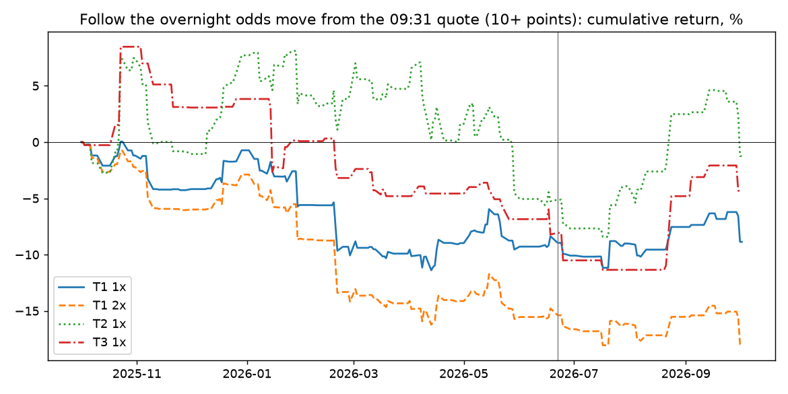
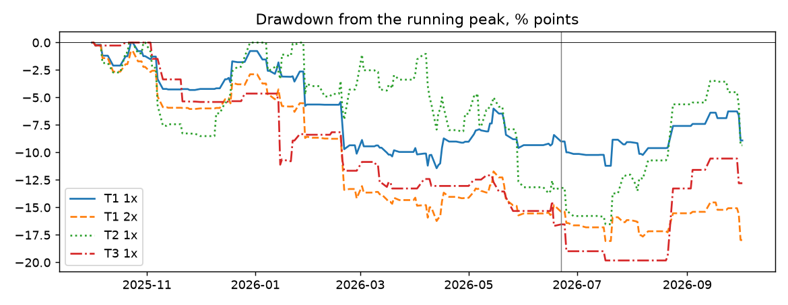

# S17: is the first minute of the session still pricing the night?

Method, pre-registered before any bar or quote was pulled: [`research/s17_first_minute/METHOD.md`](../../s17_first_minute/METHOD.md)
(commit `6076c4d`; runner `9d19f18`; amendment 1 before the pull, amendment 2 a code fix after the first run).
Companion of S16 (options on the same mornings). Data: Massive one-minute bars and NBBO stock quotes for every
ticker-day after an overnight odds move of 10+ points (300 ticker-days, 109 dates, 30 tickers; 54 out-of-sample from
2026-06-22) and of 5+ points (808 ticker-days). Files: [`tests.csv`](tests.csv), [`metrics.csv`](metrics.csv),
[`trades.csv`](trades.csv), [`events.csv`](events.csv), [`criterion.csv`](criterion.csv),
[`exploratory.csv`](exploratory.csv), [`largest_recent.csv`](largest_recent.csv), [`capacity.md`](capacity.md),
[`RUN_LOG.md`](RUN_LOG.md).

## Answer

**The night is priced at the opening print, down to less than the spread.** After an overnight odds move of 10+
points the linked asset opens **+99.3 bp** the way the odds moved (excess over its beta to SPY; date-bootstrap 95%
interval [+68.2, +130.9]): that is the gap S4 and S5 found, and the positive control works. What follows is small and
not significant:

| Window (10+ points, 300 ticker-days) | Signed excess move, bp | 95% interval |
|---|---|---|
| previous close to the open (the gap) | **+99.3** | [+68.2, +130.9] |
| open to 09:31 (the first minute) | +5.2 | [−2.7, +13.2] |
| 09:31 to 09:35 | +8.5 | [−1.6, +19.1] |
| 09:35 to 10:00 | −4.1 | [−16.5, +7.9] |
| 10:00 to the close | +4.5 | [−19.4, +27.1] |
| 09:31 to the close | +9.1 | [−19.2, +35.9] |

Theo's thesis, that the night cannot be perfectly priced in the first second, is right in a narrow sense: the first
minute leans the same way (+5.2 bp). But a round trip in these ETFs and stocks costs **8.4 bp** at the quoted spread,
more than what is left. The mispricing exists, and it sits inside the spread.

**Verdict on the pre-registered criterion: no trade passes.** The primary, follow the odds from the 09:31 quote to
10:00 (T1), earns +4.15 bp before costs and **−4.28 bp after** [−20.87, +11.04] on 299 trades; −6.91 in-sample,
+7.93 out-of-sample [−35.50, +55.19]; −12.72 at doubled costs.

**When the asset opens against the odds it does not catch up (F2).** On 73 such mornings, the move from 09:31 to the
close is −3.7 bp [−57.6, +57.3], against +13.2 on confirmed mornings.

## Headline numbers (10+ points, real NBBO, $10,000 a trade)

| Trade | Segment | Costs | Trades | Dates | Net, bp per trade | 95% interval | Before costs | Costs, bp | Sharpe |
|---|---|---|---|---|---|---|---|---|---|
| T1 follow, 09:31 to 10:00 (primary) | IS | 1× | 246 | 87 | −6.91 | [−23.98, +8.75] | +0.56 | 7.48 | −1.33 |
| T1 | OOS | 1× | 53 | 22 | +7.93 | [−35.50, +55.19] | +20.82 | 12.89 | −0.20 |
| T1 | ALL | 1× | 299 | 109 | −4.28 | [−20.87, +11.04] | +4.15 | 8.44 | −1.01 |
| T1 | ALL | 2× | 299 | 109 | −12.72 | [−29.38, +2.92] | +4.15 | 16.87 | −2.01 |
| T1f fade, 09:31 to 10:00 | ALL | 1× | 299 | 109 | −12.59 | [−28.33, +4.11] | −4.15 | 8.44 | −1.07 |
| T2 follow, 09:31 to 15:55 | ALL | 1× | 299 | 109 | +7.39 | [−22.40, +36.30] | +14.69 | 7.30 | −0.07 |
| T2 | OOS | 1× | 53 | 22 | +35.98 | [−38.31, +118.97] | +47.04 | 11.06 | +0.94 |
| T3 catch-up (unconfirmed only), to 15:55 | ALL | 1× | 73 | 44 | −32.94 | [−86.57, +17.24] | −25.63 | 7.31 | −0.33 |

Sharpe on daily returns over every session of the window (a day without a trade returns zero), × √252. Maximum
drawdown, worst month and turnover for every row are in `metrics.csv`.

## The one significant trade number, and why it is not an edge

At the looser threshold (5+ points), following the odds from 09:31 to 15:55 (T2) earned **+75.37 bp per trade
out-of-sample** [+26.22, +129.40] on 119 trades, +62.26 at doubled costs, Sharpe 3.88. The same rule **lost −10.33 bp
in-sample** [−29.98, +8.89] on 674 trades. The Sharpe above 3 triggered the bug hunt the method requires. There is no
bug: every quote mid is within 1% of its minute bar but one, there is no split, and there is no wrong previous close.
But:

- **77% of it is one question.** COIN, GLXY and HOOD on "Clarity Act signed into law in 2026?" (32 trades) carry 77%
  of the out-of-sample profit. The other 87 trades average +23.7 bp.
- **Three dates carry half of it.**
- **It is a variant (one of eight), it is out-of-sample only, and in-sample it went the other way.** By the rules,
  that is a regime, the crypto-legislation news of July to September 2026, not an edge. It is not traded and not
  presented as one.

## Looked at by cut (exploratory, 10+ points)

| Cut | Ticker-days | Gap, bp | 09:31 to close, bp | 95% interval | T1 net, bp | 95% interval |
|---|---|---|---|---|---|---|
| Oil (USO, XLE, XOP, energy stocks) | 128 | +155.9 | +4.4 | [−27.2, +33.8] | −3.8 | [−21.5, +13.5] |
| Rates (SHY, IEF, TLT) | 26 | +10.3 | −9.1 | [−20.3, +3.9] | −6.5 | [−9.9, −3.2] |
| Everything else | 146 | +65.4 | +16.4 | [−28.6, +63.8] | −4.3 | [−33.2, +25.7] |
| After a weekend or holiday | 118 | +98.8 | +37.2 | [−6.6, +80.4] | +13.4 | [−9.5, +36.5] |
| Ordinary night | 182 | +99.6 | −9.1 | [−42.5, +26.2] | −15.8 | [−36.1, +3.2] |

- Rates barely gap (+10 bp, not significant): bond ETFs move little on these questions, and T1 there loses
  significantly to its costs.
- After a weekend the asset keeps going a little more (+37.2 bp, interval includes zero) than after an ordinary night.
  This is the same direction S8 saw for the odds after weekends. Not tested, not traded.
- The 12 largest moves since 2026-07-01 are in `largest_recent.csv`. The Iran ceasefire mornings in USO opened
  +485 to +651 bp the way the odds moved. The first minute went on by +31.6 and +39.3 bp on two of them and back
  −11.7 on the third, and by the close they split.

## What didn't work

- The first-minute thesis as a trade: the first minute carries +5.2 bp [−2.7, +13.2], under the 8.4 bp round trip.
- Fading the open (T1f): −12.59 bp.
- Catch-up after an unconfirmed open (F2, T3): −3.7 bp of drift, −32.94 bp per trade.
- 5+ points instead of 10+: the gap halves (+52.9 bp) and nothing after the open is significant over the year.

## Costs (source: the quoted NBBO itself)

Entry at the 09:31 quote, exit at the exit quote, each at the far side. Median spread at 09:31: 3.5 bp (oil 2.5,
rates 1.1, other 15.0). Round trip T1: 8.44 bp at 1×, 16.87 at 2× (half-spreads doubled). No commission.

## Capacity

Median size displayed at the touch at 09:31: $40,818 (oil $39,363, rates $1.25 million, other $33,038). See
[`capacity.md`](capacity.md).

## Limits

- One-minute bars: the "first second" is measured as the first minute; the open is the first bar's open (the opening
  auction print or the first trade).
- Links and directions are S4/S5's model judgements, as in every earlier study.
- 8 trials (4 trades × 2 thresholds) in three segments at two cost levels, plus the F1 and F2 windows: with this many
  looks, an isolated significant cell is to be expected by chance and needs replication before it means anything.
