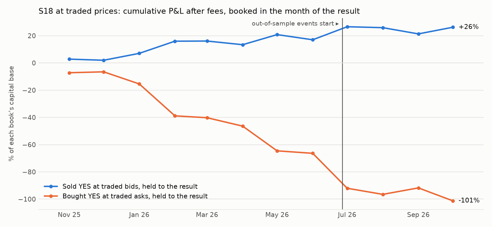
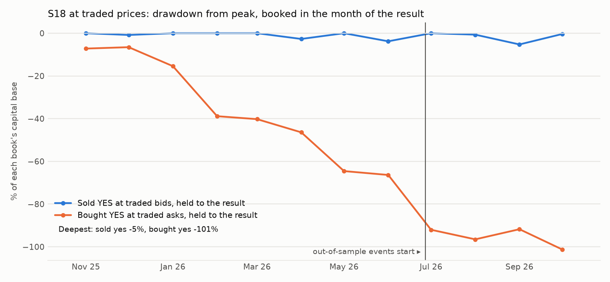

# S18: are Polymarket's price markets fairly priced against how they resolve?

Method, pre-registered before any entry price was matched to a result: [`research/s18_price_market_calibration/METHOD.md`](../../s18_price_market_calibration/METHOD.md) (commit `93d38c1`; amendment 1, the bug hunt and the test at traded prices, commit `37c9a0c`, before any print was pulled). Data: 1,092 price markets with a result, in 130 events, first weekends from 2025-11-01 to 2026-09-26. Files: [`prints_tests.csv`](prints_tests.csv), [`prints_markets.csv`](prints_markets.csv), [`calibration.csv`](calibration.csv), [`metrics.csv`](metrics.csv), [`trades.csv`](trades.csv), [`capacity.md`](capacity.md), [`RUN_LOG.md`](RUN_LOG.md).

## Answer

**What holds up, at prices that actually traded: people who bought YES in these markets overpaid.** Over 606 markets in 97 events, takers who bought YES on a market's first weekend paid 37.2% on average and 28.7% of those markets resolved YES. Held to the result they lost 8.87 points per contract after the fee, event-bootstrap 95% interval [-11.94, -5.93]. Where it is largest: contracts bought between 50% and 75% lost 17.25 points [-24.50, -10.28].

**The other side of those tickets earned a premium over the year, and nothing in the most recent events.** Takers who sold YES into a bid received 30.8% on average (657 markets, 101 events). Held to the result they earned +3.63 points per contract after the fee [+0.72, +6.57], and +3.29 with the fee doubled. In-sample +4.69 [+2.10, +7.35]; out-of-sample (the most recent 20% of events, from 2026-06-27) -0.99 [-10.96, +9.28] on 123 markets in 20 events.

**By the rule fixed before the prints were pulled this is not a pass:** it needed the sellers' P&L above zero in-sample and out-of-sample, and out-of-sample it is not. It is the closest thing to an edge in the project, and it is not an arbitrage: selling "will it hit" tickets is selling insurance against large moves. As a book of up to 100 contracts per market (never more than the printed size) it made +$2,171 on a capital base of $8,282 over the year, with a monthly Sharpe of 1.53, a maximum drawdown of 5.3% and a worst event of -$242.

**The modelled run is not evidence (the bug hunt).** Priced at Polymarket's history mid, YES looks overpriced by 10 to 20 points in every bucket and "sell every market" (V4) earns +11.58 points per trade with a Sharpe near 3. The entry prices explain it: 232 of the 1,092 are within half a point of 50% (152 are exactly 0.500), on markets a median of 2.8 days old. That is the midpoint of a book that has not formed. Nobody could sell there.

**Verdict on the pre-registered primary (V0, sell YES at 5 to 25% at the history mid): not a pass.** +1.73 points per trade [-2.64, +5.59] on 263 trades; in-sample +4.05 [+0.53, +7.09], out-of-sample -8.12 [-21.22, +6.09].

## At traded prices (amendment 1)

One observation per market: the size-weighted mean price of the prints of one taker side during the market's first weekend (48 hours from the entry instant), then held to the result. P&L after the market's own taker fee. Intervals resample events.

| Test | Markets | Markets with such prints | Events | Mean traded price, % | Resolved YES, % | P&L per contract, points | 95% interval | Median printed size |
|---|---|---|---|---|---|---|---|---|
| sellers: sold YES into a bid, held to the result | all markets | 657 | 101 | 30.8 | 26.8 | +3.63 | [+0.72, +6.57] | 355 |
| sellers: sold YES into a bid, held to the result | in-sample events | 534 | 81 | 31.2 | 26.2 | +4.69 | [+2.10, +7.35] | 254 |
| sellers: sold YES into a bid, held to the result | out-of-sample events | 123 | 20 | 28.8 | 29.3 | -0.99 | [-10.96, +9.28] | 838 |
| sellers: sold YES into a bid, held to the result | S9's markets | 270 | 23 | 30.1 | 25.6 | +4.12 | [+0.55, +8.21] | 3,748 |
| sellers: sold YES into a bid, held to the result | S15's markets | 387 | 93 | 31.2 | 27.6 | +3.29 | [-0.74, +7.18] | 114 |
| sellers: sold YES into a bid, held to the result | "hit high" markets | 356 | 86 | 29.1 | 24.4 | +4.33 | [-1.97, +10.45] | 443 |
| sellers: sold YES into a bid, held to the result | "hit low" markets | 281 | 84 | 34.3 | 30.6 | +3.30 | [-2.88, +9.70] | 254 |
| sellers: sold YES into a bid, held to the result, fee doubled | all markets | 657 | 101 | 30.8 | 26.8 | +3.29 | [+0.36, +6.28] | 355 |
| sellers: sold YES into a bid, held to the result | traded price 2 to 10% | 188 | 71 | 5.4 | 6.4 | -1.05 | [-5.88, +2.90] | 408 |
| sellers: sold YES into a bid, held to the result | traded price 10 to 25% | 118 | 59 | 16.4 | 14.4 | +1.67 | [-4.66, +7.30] | 333 |
| sellers: sold YES into a bid, held to the result | traded price 25 to 50% | 145 | 70 | 36.9 | 31.7 | +4.56 | [-2.25, +12.57] | 255 |
| sellers: sold YES into a bid, held to the result | traded price 50 to 75% | 88 | 51 | 61.6 | 47.7 | +13.30 | [+5.16, +21.33] | 347 |
| sellers: sold YES into a bid, held to the result | traded price 75 to 90% | 39 | 26 | 79.9 | 66.7 | +12.79 | [-1.48, +30.12] | 485 |
| sellers: sold YES into a bid, held to the result | traded price 90 to 98% | 32 | 22 | 93.8 | 93.8 | -0.08 | [-6.53, +9.46] | 339 |
| buyers: bought YES at the ask, held to the result | all markets | 606 | 97 | 37.2 | 28.7 | -8.87 | [-11.94, -5.93] | 388 |
| buyers: bought YES at the ask, held to the result | in-sample events | 483 | 75 | 38.2 | 28.2 | -10.41 | [-13.17, -7.71] | 280 |
| buyers: bought YES at the ask, held to the result | out-of-sample events | 123 | 22 | 33.1 | 30.9 | -2.80 | [-13.05, +6.31] | 996 |
| buyers: bought YES at the ask, held to the result | S9's markets | 254 | 23 | 33.2 | 26.0 | -7.65 | [-11.57, -4.08] | 5,028 |
| buyers: bought YES at the ask, held to the result | S15's markets | 352 | 89 | 40.1 | 30.7 | -9.74 | [-13.50, -5.65] | 118 |
| buyers: bought YES at the ask, held to the result | "hit high" markets | 323 | 81 | 35.9 | 28.2 | -8.13 | [-14.90, -1.00] | 393 |
| buyers: bought YES at the ask, held to the result | "hit low" markets | 264 | 80 | 39.6 | 30.3 | -9.70 | [-16.04, -3.12] | 374 |
| buyers: bought YES at the ask, held to the result, fee doubled | all markets | 606 | 97 | 37.2 | 28.7 | -9.25 | [-12.33, -6.36] | 388 |
| buyers: bought YES at the ask, held to the result | traded price 2 to 10% | 131 | 51 | 6.0 | 4.6 | -1.51 | [-5.11, +2.94] | 530 |
| buyers: bought YES at the ask, held to the result | traded price 10 to 25% | 132 | 61 | 16.6 | 11.4 | -5.64 | [-10.86, +0.30] | 518 |
| buyers: bought YES at the ask, held to the result | traded price 25 to 50% | 129 | 59 | 36.7 | 28.7 | -8.67 | [-15.82, -2.55] | 420 |
| buyers: bought YES at the ask, held to the result | traded price 50 to 75% | 105 | 56 | 60.4 | 43.8 | -17.25 | [-24.50, -10.28] | 213 |
| buyers: bought YES at the ask, held to the result | traded price 75 to 90% | 50 | 34 | 82.2 | 64.0 | -18.58 | [-35.34, -2.97] | 164 |
| buyers: bought YES at the ask, held to the result | traded price 90 to 98% | 24 | 19 | 94.9 | 83.3 | -11.67 | [-28.44, +4.42] | 124 |

Of the 1,092 markets, 1 are left out because: no print served at all (or the request failed); 285 are left out because: never traded during its first weekend (every print was served); 6 are left out because: first-weekend prints beyond the 20,000 the API keeps. Of the 800 checked, 657 have a taker sale of YES in the window and 606 a taker purchase.

### The reading fixed before the prints were pulled

| Needed | Result | Evidence |
|---|---|---|
| Sellers' mean P&L above zero, interval excluding zero (whole sample) | met | +3.63 points [+0.72, +6.57] |
| Above zero in-sample | met | +4.69 [+2.10, +7.35] |
| Above zero out-of-sample | **not met** | -0.99 [-10.96, +9.28] on 123 markets, 20 events |
| Above zero with the fee doubled | met | +3.29 [+0.36, +6.28] |

### The two sides as books

| Book | Segment | Markets | Net P&L | Capital base | Sharpe (monthly) | Max DD | Worst month | Turnover / yr | Winners | Worst event | Median days locked |
|---|---|---|---|---|---|---|---|---|---|---|---|
| Sold YES at traded bids | IS | 534 | +$2,378 | $8,282 | 2.04 | 3.8% | -3.8% | 4.5× | 74% | -$100 | 28 |
| Sold YES at traded bids | OOS | 123 | -$207 | $4,100 | -0.54 | 14.9% | -9.3% | 5.6× | 71% | -$242 | 31 |
| Sold YES at traded bids | ALL | 657 | +$2,171 | $8,282 | 1.53 | 5.3% | -4.6% | 4.3× | 73% | -$242 | 28 |
| Bought YES at traded asks | IS | 483 | -$3,528 | $3,564 | -3.36 | 99.0% | -32.6% | 5.2× | 28% | -$298 | 28 |
| Bought YES at traded asks | OOS | 123 | -$81 | $1,620 | -0.25 | 20.9% | -20.9% | 6.1× | 31% | -$240 | 31 |
| Bought YES at traded asks | ALL | 606 | -$3,609 | $3,564 | -3.08 | 101.3% | -25.7% | 4.8× | 29% | -$298 | 28 |

Up to 100 contracts per market, never more than the printed size. P&L is booked in the month of the result. The capital base is the largest capital locked at one time. In the charts each point is a calendar month; a market that entered in-sample and resolved late is booked after the out-of-sample line.





## The pre-registered run, at history mids (not evidence, see the bug hunt)

### Pre-registered success criterion (V0)

| Criterion | Result | Evidence |
|---|---|---|
| At least 30 OOS trades in at least 10 OOS events | pass | 50 trades in 13 events |
| OOS mean net P&L per trade above zero, event-bootstrap interval excluding zero (1× costs) | **fail** | -8.12 points [-21.22, +6.09] |
| OOS above zero at 2× costs | **fail** | -9.70 points |
| In-sample above zero at 1× costs | pass | +4.05 points [+0.53, +7.09] |
| C1 over the whole sample: markets priced 2 to 25% resolve YES less often than priced | pass | -3.57 points [-6.63, -0.29] |

**Verdict: not a pass.**

### Every variant tried

| Segment | Variant | Costs | Trades | Events | Net, points per trade | 95% interval | Before costs | Costs, points | Resolved YES | Winners | Return on capital locked | Sharpe (monthly) | Deflated Sharpe prob. | Max DD | Worst month | Turnover / yr |
|---|---|---|---|---|---|---|---|---|---|---|---|---|---|---|---|---|
| IS | V0 (primary) | 1× | 213 | 67 | +4.05 | [+0.53, +7.09] | +6.05 | 2.00 | 7% | 93% | 4.8% | 2.87 | 0.725 | 0.3% | -0.3% | 5.3× |
| OOS | V0 (primary) | 1× | 50 | 13 | -8.12 | [-21.22, +6.09] | -6.45 | 1.67 | 20% | 80% | -8.8% | -2.54 | 0.000 | 9.2% | -5.4% | 2.7× |
| ALL | V0 (primary) | 1× | 263 | 80 | +1.73 | [-2.64, +5.59] | +3.67 | 1.94 | 9% | 91% | 2.2% | 0.91 | 0.195 | 6.8% | -5.4% | 4.9× |
| IS | V0 (primary) | 2× | 213 | 67 | +2.09 | [-1.46, +5.22] | +6.05 | 3.96 | 7% | 93% | 2.6% | 1.46 | 0.215 | 2.6% | -2.6% | 5.2× |
| OOS | V0 (primary) | 2× | 50 | 13 | -9.70 | [-22.87, +4.27] | -6.45 | 3.25 | 20% | 80% | -10.5% | -2.72 | 0.000 | 10.5% | -6.1% | 2.7× |
| ALL | V0 (primary) | 2× | 263 | 80 | -0.16 | [-4.59, +3.77] | +3.67 | 3.83 | 9% | 91% | 0.1% | -0.08 | 0.041 | 8.5% | -6.1% | 4.8× |
| IS | V1 | 1× | 45 | 31 | -12.51 | [-26.34, -0.56] | -10.46 | 2.05 | 73% | 73% | -15.0% | -1.65 | 0.000 | 60.4% | -37.5% | 5.5× |
| OOS | V1 | 1× | 10 | 5 | -56.33 | [-85.10, -32.90] | -54.98 | 1.35 | 30% | 30% | -66.2% | -4.62 | 0.000 | 60.4% | -36.5% | 3.7× |
| ALL | V1 | 1× | 55 | 36 | -20.48 | [-33.50, -7.83] | -18.56 | 1.92 | 65% | 65% | -24.3% | -2.33 | 0.000 | 120.8% | -37.5% | 5.1× |
| IS | V1 | 2× | 45 | 31 | -14.53 | [-28.55, -2.46] | -10.46 | 4.07 | 73% | 73% | -16.9% | -1.91 | 0.000 | 68.1% | -37.1% | 5.5× |
| OOS | V1 | 2× | 10 | 5 | -57.63 | [-87.04, -33.94] | -54.98 | 2.65 | 30% | 30% | -66.9% | -4.66 | 0.000 | 60.0% | -36.2% | 3.6× |
| ALL | V1 | 2× | 55 | 36 | -22.37 | [-35.35, -9.63] | -18.56 | 3.81 | 65% | 65% | -26.0% | -2.56 | 0.000 | 128.2% | -37.1% | 5.0× |
| IS | V2 | 1× | 84 | 18 | +7.21 | [+3.76, +10.24] | +8.64 | 1.43 | 4% | 96% | 8.3% | 2.77 | 0.640 | 2.1% | -2.1% | 4.0× |
| OOS | V2 | 1× | 23 | 5 | -17.86 | [-46.83, +8.62] | -16.73 | 1.13 | 30% | 70% | -20.0% | -3.32 | 0.014 | 18.1% | -8.7% | 2.4× |
| ALL | V2 | 1× | 107 | 23 | +1.82 | [-6.35, +8.53] | +3.19 | 1.36 | 9% | 91% | 2.2% | 0.50 | 0.111 | 16.0% | -8.7% | 3.8× |
| IS | V2 | 2× | 84 | 18 | +5.81 | [+2.28, +8.81] | +8.64 | 2.83 | 4% | 96% | 6.7% | 2.44 | 0.548 | 2.5% | -2.5% | 4.0× |
| OOS | V2 | 2× | 23 | 5 | -18.95 | [-48.21, +7.48] | -16.73 | 2.22 | 30% | 70% | -21.1% | -3.42 | 0.012 | 18.8% | -9.0% | 2.4× |
| ALL | V2 | 2× | 107 | 23 | +0.48 | [-7.67, +7.21] | +3.19 | 2.70 | 9% | 91% | 0.7% | 0.14 | 0.065 | 17.8% | -9.0% | 3.8× |
| IS | V3 | 1× | 46 | 8 | +8.04 | [+4.86, +12.84] | +8.88 | 0.84 | 4% | 96% | 9.4% | 3.90 | 0.842 | 0.0% | 0.0% | 4.6× |
| OOS | V3 | 1× | 22 | 4 | -10.35 | n/a | -9.07 | 1.27 | 23% | 77% | -11.7% | -1.39 | 0.002 | 15.1% | -14.5% | 3.3× |
| ALL | V3 | 1× | 68 | 12 | +2.09 | [-6.34, +9.34] | +3.07 | 0.98 | 10% | 90% | 2.6% | 0.56 | 0.176 | 11.5% | -10.9% | 4.5× |
| IS | V3 | 2× | 46 | 8 | +7.23 | [+3.95, +12.11] | +8.88 | 1.65 | 4% | 96% | 8.4% | 3.75 | 0.842 | 0.0% | 0.0% | 4.6× |
| OOS | V3 | 2× | 22 | 4 | -11.57 | n/a | -9.07 | 2.50 | 23% | 77% | -13.0% | -1.49 | 0.001 | 16.4% | -15.4% | 3.3× |
| ALL | V3 | 2× | 68 | 12 | +1.15 | [-7.36, +8.43] | +3.07 | 1.93 | 10% | 90% | 1.5% | 0.30 | 0.134 | 13.0% | -12.1% | 4.5× |
| IS | V4 | 1× | 813 | 103 | +11.02 | [+7.78, +14.19] | +13.33 | 2.31 | 28% | 72% | 22.8% | 2.97 | 0.732 | 2.6% | -2.3% | 5.0× |
| OOS | V4 | 1× | 192 | 26 | +13.98 | [+5.13, +23.67] | +16.31 | 2.33 | 26% | 74% | 44.7% | 3.11 | 0.486 | 0.0% | 0.9% | 2.6× |
| ALL | V4 | 1× | 1005 | 129 | +11.58 | [+8.75, +14.73] | +13.90 | 2.32 | 27% | 73% | 26.9% | 2.32 | 0.785 | 2.6% | -2.3% | 4.6× |
| IS | V4 | 2× | 813 | 103 | +8.72 | [+5.45, +11.90] | +13.33 | 4.61 | 28% | 72% | 17.5% | 2.44 | 0.564 | 4.6% | -2.4% | 5.0× |
| OOS | V4 | 2× | 192 | 26 | +11.67 | [+2.96, +21.15] | +16.31 | 4.64 | 26% | 74% | 38.2% | 2.82 | 0.430 | 0.0% | -0.0% | 2.6× |
| ALL | V4 | 2× | 1005 | 129 | +9.28 | [+6.46, +12.40] | +13.90 | 4.62 | 27% | 73% | 21.4% | 1.98 | 0.652 | 4.6% | -2.4% | 4.7× |

V1: buy YES at 75 to 95%. V2: V0 on S9's markets. V3: V0 on crude oil. V4: sell YES on every market between 5% and 95%. The deflated Sharpe probability uses 5 trials. Sharpe is on monthly P&L.

### Calibration at history mids

| Markets | Entry price (history mid) | Markets | Events | Mean price, % | Resolved YES, % | Difference, points | 95% interval |
|---|---|---|---|---|---|---|---|
| all markets | 2 to 10% | 174 | 63 | 5.4 | 2.9 | -2.50 | [-4.98, +0.75] |
| all markets | 10 to 25% | 162 | 67 | 16.1 | 11.7 | -4.33 | [-9.04, +1.49] |
| all markets | 25 to 50% | 313 | 109 | 40.6 | 23.6 | -16.93 | [-21.67, -12.07] |
| all markets | 50 to 75% | 377 | 109 | 55.1 | 37.1 | -17.92 | [-22.82, -12.63] |
| all markets | 75 to 90% | 43 | 32 | 81.6 | 60.5 | -21.14 | [-35.42, -7.38] |
| all markets | 90 to 98% | 23 | 20 | 94.4 | 91.3 | -3.06 | [-16.50, +5.85] |
| all markets | C1: 2 to 25% | 339 | 85 | 10.7 | 7.1 | -3.57 | [-6.63, -0.29] |
| all markets | C2: 75 to 98% | 66 | 42 | 86.0 | 71.2 | -14.84 | [-26.74, -4.34] |
| all markets | every price | 1092 | 130 | 39.1 | 26.1 | -12.98 | [-15.85, -9.99] |
| "hit high" markets | 2 to 10% | 109 | 53 | 5.4 | 3.7 | -1.77 | [-5.42, +3.22] |
| "hit high" markets | 10 to 25% | 92 | 51 | 16.1 | 14.1 | -2.01 | [-9.02, +6.44] |
| "hit high" markets | 25 to 50% | 143 | 81 | 41.4 | 23.1 | -18.37 | [-27.27, -9.21] |
| "hit high" markets | 50 to 75% | 179 | 84 | 55.8 | 33.0 | -22.86 | [-31.39, -14.21] |
| "hit high" markets | 75 to 90% | 25 | 23 | 81.6 | 56.0 | -25.56 | [-44.91, -5.68] |
| "hit high" markets | 90 to 98% | 8 | 8 | 94.4 | 87.5 | -6.91 | [-32.31, +6.73] |
| "hit high" markets | C1: 2 to 25% | 203 | 70 | 10.5 | 8.4 | -2.10 | [-6.44, +3.07] |
| "hit high" markets | C2: 75 to 98% | 33 | 26 | 84.7 | 63.6 | -21.04 | [-38.15, -3.27] |
| "hit high" markets | every price | 556 | 116 | 37.4 | 23.4 | -14.01 | [-19.17, -8.63] |
| "hit low" markets | 2 to 10% | 62 | 44 | 5.3 | 1.6 | -3.66 | [-5.63, +0.08] |
| "hit low" markets | 10 to 25% | 66 | 45 | 16.1 | 9.1 | -7.03 | [-13.49, +1.01] |
| "hit low" markets | 25 to 50% | 135 | 79 | 40.4 | 28.1 | -12.21 | [-19.82, -3.95] |
| "hit low" markets | 50 to 75% | 189 | 79 | 54.5 | 41.3 | -13.28 | [-21.61, -4.39] |
| "hit low" markets | 75 to 90% | 18 | 16 | 81.7 | 66.7 | -14.99 | [-35.70, +5.69] |
| "hit low" markets | 90 to 98% | 15 | 13 | 94.3 | 93.3 | -1.01 | [-15.43, +6.20] |
| "hit low" markets | C1: 2 to 25% | 129 | 65 | 11.0 | 5.4 | -5.55 | [-9.22, -1.37] |
| "hit low" markets | C2: 75 to 98% | 33 | 24 | 87.4 | 78.8 | -8.63 | [-22.25, +2.77] |
| "hit low" markets | every price | 485 | 113 | 41.3 | 30.7 | -10.59 | [-15.65, -5.45] |
| S9's markets | 2 to 10% | 79 | 20 | 5.0 | 3.8 | -1.18 | [-5.17, +5.42] |
| S9's markets | 10 to 25% | 63 | 21 | 16.1 | 11.1 | -4.99 | [-11.29, +2.99] |
| S9's markets | 25 to 50% | 69 | 22 | 38.0 | 27.5 | -10.43 | [-20.76, -1.43] |
| S9's markets | 50 to 75% | 86 | 19 | 57.1 | 34.9 | -22.20 | [-31.50, -14.72] |
| S9's markets | 75 to 90% | 14 | 9 | 82.3 | 57.1 | -25.12 | [-51.04, -1.30] |
| S9's markets | 90 to 98% | 9 | 8 | 94.1 | 77.8 | -16.32 | [-44.96, +6.02] |
| S9's markets | C1: 2 to 25% | 144 | 23 | 10.1 | 6.9 | -3.18 | [-8.42, +2.91] |
| S9's markets | C2: 75 to 98% | 23 | 12 | 86.9 | 65.2 | -21.68 | [-45.99, -0.20] |
| S9's markets | every price | 320 | 24 | 34.2 | 23.1 | -11.04 | [-15.93, -6.27] |
| S15's markets | 2 to 10% | 95 | 49 | 5.7 | 2.1 | -3.60 | [-5.94, -0.25] |
| S15's markets | 10 to 25% | 99 | 55 | 16.0 | 12.1 | -3.91 | [-10.32, +3.37] |
| S15's markets | 25 to 50% | 244 | 96 | 41.3 | 22.5 | -18.77 | [-23.64, -13.47] |
| S15's markets | 50 to 75% | 291 | 99 | 54.5 | 37.8 | -16.66 | [-22.81, -10.56] |
| S15's markets | 75 to 90% | 29 | 23 | 81.3 | 62.1 | -19.21 | [-36.02, -2.52] |
| S15's markets | 90 to 98% | 14 | 13 | 94.5 | 100.0 | +5.46 | [+4.42, +6.50] |
| S15's markets | C1: 2 to 25% | 195 | 76 | 11.0 | 7.2 | -3.87 | [-7.30, -0.03] |
| S15's markets | C2: 75 to 98% | 43 | 31 | 85.6 | 74.4 | -11.18 | [-23.45, +0.15] |
| S15's markets | every price | 772 | 122 | 41.1 | 27.3 | -13.78 | [-17.25, -10.12] |
| class: crude | 2 to 10% | 43 | 11 | 4.8 | 2.3 | -2.51 | [-5.50, +2.40] |
| class: crude | 10 to 25% | 45 | 11 | 16.5 | 13.3 | -3.14 | [-11.66, +6.53] |
| class: crude | 25 to 50% | 62 | 15 | 39.9 | 29.0 | -10.91 | [-23.29, -0.16] |
| class: crude | 50 to 75% | 64 | 18 | 57.2 | 46.9 | -10.34 | [-19.40, +0.40] |
| class: crude | 75 to 90% | 12 | 7 | 82.7 | 75.0 | -7.69 | [-27.38, +12.21] |
| class: crude | 90 to 98% | 5 | 4 | 92.6 | 80.0 | -12.60 | n/a |
| class: crude | C1: 2 to 25% | 89 | 12 | 10.9 | 7.9 | -3.08 | [-8.66, +3.20] |
| class: crude | C2: 75 to 98% | 17 | 7 | 85.6 | 76.5 | -9.13 | [-33.40, +10.50] |
| class: crude | every price | 231 | 20 | 37.0 | 29.4 | -7.54 | [-13.43, -2.59] |
| class: gold | 2 to 10% | 20 | 5 | 5.0 | 10.0 | +5.05 | [-5.59, +20.04] |
| class: gold | 10 to 25% | 15 | 7 | 18.0 | 13.3 | -4.62 | [-18.77, +22.60] |
| class: gold | 25 to 50% | 33 | 11 | 37.5 | 18.2 | -19.28 | [-33.52, -6.27] |
| class: gold | 50 to 75% | 56 | 9 | 55.6 | 30.4 | -25.22 | [-39.76, -9.49] |
| class: gold | 75 to 90% | 4 | 3 | 82.5 | 0.0 | -82.50 | n/a |
| class: gold | 90 to 98% | 2 | 2 | 95.4 | 50.0 | -45.45 | n/a |
| class: gold | C1: 2 to 25% | 36 | 7 | 10.9 | 11.1 | +0.18 | [-13.44, +15.96] |
| class: gold | C2: 75 to 98% | 6 | 4 | 86.8 | 16.7 | -70.15 | n/a |
| class: gold | every price | 130 | 12 | 40.3 | 21.5 | -18.75 | [-28.59, -8.57] |
| class: natgas | 2 to 10% | 1 | 1 | 7.9 | 0.0 | -7.85 | n/a |
| class: natgas | 10 to 25% | 4 | 2 | 17.6 | 0.0 | -17.57 | n/a |
| class: natgas | 25 to 50% | 13 | 4 | 46.3 | 23.1 | -23.23 | n/a |
| class: natgas | 50 to 75% | 27 | 7 | 52.1 | 18.5 | -33.59 | [-49.31, -9.68] |
| class: natgas | 75 to 90% | 0 | 0 | n/a | n/a | n/a | n/a |
| class: natgas | 90 to 98% | 0 | 0 | n/a | n/a | n/a | n/a |
| class: natgas | C1: 2 to 25% | 5 | 2 | 15.6 | 0.0 | -15.63 | n/a |
| class: natgas | C2: 75 to 98% | 0 | 0 | n/a | n/a | n/a | n/a |
| class: natgas | every price | 45 | 7 | 46.4 | 17.8 | -28.60 | [-42.09, -12.96] |
| class: silver | 2 to 10% | 16 | 4 | 5.4 | 0.0 | -5.42 | n/a |
| class: silver | 10 to 25% | 16 | 6 | 15.6 | 12.5 | -3.13 | [-16.97, +22.26] |
| class: silver | 25 to 50% | 43 | 10 | 37.7 | 16.3 | -21.44 | [-34.19, -8.02] |
| class: silver | 50 to 75% | 40 | 7 | 54.7 | 42.5 | -12.21 | [-32.71, +6.64] |
| class: silver | 75 to 90% | 4 | 3 | 79.6 | 50.0 | -29.63 | n/a |
| class: silver | 90 to 98% | 1 | 1 | 97.0 | 100.0 | +2.95 | n/a |
| class: silver | C1: 2 to 25% | 33 | 6 | 11.0 | 6.1 | -4.90 | [-13.60, +8.16] |
| class: silver | C2: 75 to 98% | 5 | 4 | 83.1 | 60.0 | -23.11 | n/a |
| class: silver | every price | 120 | 10 | 38.0 | 24.2 | -13.86 | [-24.10, -4.88] |
| class: sp500 | 2 to 10% | 7 | 3 | 6.5 | 0.0 | -6.51 | n/a |
| class: sp500 | 10 to 25% | 13 | 5 | 16.1 | 0.0 | -16.06 | [-18.44, -14.05] |
| class: sp500 | 25 to 50% | 31 | 9 | 38.2 | 9.7 | -28.50 | [-40.29, -16.94] |
| class: sp500 | 50 to 75% | 38 | 10 | 52.9 | 34.2 | -18.72 | [-28.79, -8.88] |
| class: sp500 | 75 to 90% | 3 | 3 | 79.0 | 66.7 | -12.33 | n/a |
| class: sp500 | 90 to 98% | 1 | 1 | 95.2 | 100.0 | +4.80 | n/a |
| class: sp500 | C1: 2 to 25% | 20 | 6 | 12.7 | 0.0 | -12.72 | [-16.37, -9.23] |
| class: sp500 | C2: 75 to 98% | 4 | 4 | 83.0 | 75.0 | -8.05 | n/a |
| class: sp500 | every price | 93 | 12 | 40.7 | 20.4 | -20.23 | [-28.34, -12.62] |
| class: stock | 2 to 10% | 87 | 39 | 5.6 | 2.3 | -3.30 | [-5.83, +0.51] |
| class: stock | 10 to 25% | 69 | 36 | 15.4 | 13.0 | -2.35 | [-9.50, +6.18] |
| class: stock | 25 to 50% | 131 | 60 | 42.6 | 28.2 | -14.34 | [-21.66, -6.39] |
| class: stock | 50 to 75% | 152 | 58 | 55.1 | 38.2 | -16.95 | [-23.96, -9.63] |
| class: stock | 75 to 90% | 20 | 16 | 81.6 | 65.0 | -16.55 | [-34.63, +0.37] |
| class: stock | 90 to 98% | 14 | 12 | 94.6 | 100.0 | +5.41 | [+4.32, +6.57] |
| class: stock | C1: 2 to 25% | 156 | 52 | 9.9 | 7.1 | -2.88 | [-6.58, +1.31] |
| class: stock | C2: 75 to 98% | 34 | 23 | 86.9 | 79.4 | -7.51 | [-18.17, +2.76] |
| class: stock | every price | 473 | 69 | 39.0 | 28.1 | -10.91 | [-14.62, -6.94] |

## Costs

- **At traded prices:** the price is the print, so no spread is assumed. The fee is the market's own taker fee, 0.04 × P × (1 − P) where the market charges one; nothing is paid at the result.
- **At history mids:** the half-spread of the asset class (S9 and S15) and the fee, once.

## Capacity

See [`capacity.md`](capacity.md).

## What didn't work

- **The primary at history mids** (sell YES at 5 to 25%): +1.73 points per trade, -8.12 out-of-sample.
- **Selling at traded bids out-of-sample:** -0.99 [-10.96, +9.28]. The premium of the first eleven months is not there in the most recent events, or the 20 events are too few to see it; the interval allows both.
- **Cheap tickets are not where the premium is.** Sold between 2% and 10%: -1.05 points; the gap sits between 50% and 75% (+13.30 [+5.16, +21.33]).

## Caveats

- **One year with one oil shock in it.** Selling these markets is selling insurance. Events in the same months share the same weather, and resampling events does not cure that.
- **The loss on one contract can be many times the gain.**
- **A taker's sale needs a bid.** The prints show that bids were hit at these prices; they do not show how much more could have been sold.
- **The buyers' loss is not our gain** unless our resting offer is the one they lift. P3 (S12) found that resting orders in these markets were adversely selected out-of-sample.
- Markets that did not trade on their first weekend are not in the test.
- The test at traded prices was added after the first run, in a dated amendment committed before any print was pulled.

## Reproduce

```
cd research
python -m s18_price_market_calibration.run
python -m s18_price_market_calibration.prints --pull
python -m s18_price_market_calibration.prints
python -m s18_price_market_calibration.report
python -m pytest s18_price_market_calibration/tests -q
```
