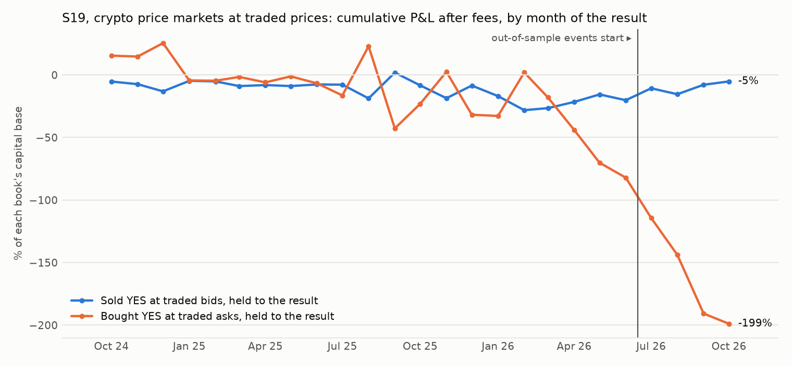
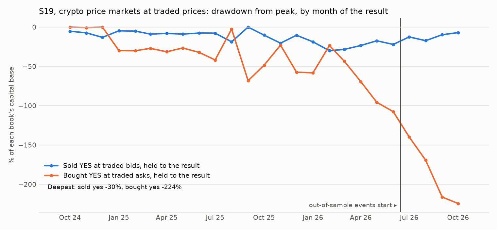

# S19: does the price-market premium replicate on crypto?

Method, pre-registered before any print of these markets was pulled: [`research/s19_crypto_price_markets/METHOD.md`](../../s19_crypto_price_markets/METHOD.md) (commit `f5fe8e5`). Data: 1,265 crypto price markets drawn at random, four per event, from 336 weekly or longer events listed from 2024-10-01 to 2026-10-01; public prints of at least $50 in each market's first 48 hours. Files: [`tests.csv`](tests.csv), [`markets.csv`](markets.csv), [`book.csv`](book.csv), [`capacity.md`](capacity.md), [`RUN_LOG.md`](RUN_LOG.md).

## Answer

**By the rule fixed before the prints were pulled: the premium does not replicate.**

**Sellers.** Takers who sold YES into a bid in a market's first 48 hours received 22.0% on average; 22.1% of those markets resolved YES. Held to the result: -0.25 points per contract after the fee, event-bootstrap 95% interval [-2.22, +1.60], on 1132 markets in 322 events; -0.44 with the fee doubled. In-sample -0.84 [-2.95, +1.19]; out-of-sample (68 events from 2026-06-15) +2.84 [-3.08, +7.80]. Listed up to the end of 2025: -0.37 [-3.18, +2.37]; listed in 2026: -0.13 [-2.91, +2.57].

**Buyers.** Takers who bought YES paid 30.9% on average; 28.3% resolved YES. Held to the result: -2.83 points per contract [-5.18, -0.45] on 880 markets; in-sample -1.54 [-4.22, +1.06], out-of-sample -10.32 [-15.29, -4.72].

**As a book** (up to 100 contracts per market, never more than the printed size, P&L booked in the month of the result): selling made -$212 on a capital base of $4,098 over 25 months, monthly Sharpe -0.09, maximum drawdown 30.0%, worst month -11.2%, worst event -$257.

**Set against S18** (oil, metals, the S&P 500 and stocks, one year): sellers +3.63 points [+0.72, +6.57] and -0.99 out-of-sample; buyers -8.87 [-11.94, -5.93].

## The reading fixed before the prints were pulled

| Needed | Result | Evidence |
|---|---|---|
| Sellers' mean P&L above zero, interval excluding zero (whole sample) | **not met** | -0.25 points [-2.22, +1.60] |
| Above zero in-sample | **not met** | -0.84 [-2.95, +1.19] |
| Above zero out-of-sample | met | +2.84 [-3.08, +7.80] on 184 markets, 60 events |
| Above zero with the fee doubled | **not met** | -0.44 [-2.41, +1.41] |

**The premium does not replicate.**

## Every cut that was fixed in advance

One observation per market: the size-weighted mean price of the prints of one taker side in the market's first 48 hours, held to the result, after the market's own taker fee. Intervals resample events.

| Test | Markets | Markets with such prints | Events | Mean traded price, % | Resolved YES, % | P&L per contract, points | 95% interval | Median printed size |
|---|---|---|---|---|---|---|---|---|
| sellers: sold YES into a bid, held to the result | all markets | 1132 | 322 | 22.0 | 22.1 | -0.25 | [-2.22, +1.60] | 5,290 |
| sellers: sold YES into a bid, held to the result | in-sample events | 948 | 262 | 23.0 | 23.7 | -0.84 | [-2.95, +1.19] | 5,863 |
| sellers: sold YES into a bid, held to the result | out-of-sample events | 184 | 60 | 17.1 | 13.6 | +2.84 | [-3.08, +7.80] | 3,309 |
| sellers: sold YES into a bid, held to the result | listed up to 2025-12-31 | 562 | 152 | 29.5 | 29.9 | -0.37 | [-3.18, +2.37] | 6,817 |
| sellers: sold YES into a bid, held to the result | listed in 2026 | 570 | 171 | 14.7 | 14.4 | -0.13 | [-2.91, +2.57] | 4,153 |
| sellers: sold YES into a bid, held to the result | asset: bitcoin | 346 | 90 | 26.1 | 25.4 | +0.41 | [-3.46, +4.02] | 15,270 |
| sellers: sold YES into a bid, held to the result | asset: ethereum | 326 | 89 | 23.7 | 26.4 | -2.88 | [-7.60, +1.58] | 5,488 |
| sellers: sold YES into a bid, held to the result | asset: solana | 264 | 80 | 19.4 | 18.6 | +0.71 | [-2.63, +4.01] | 3,193 |
| sellers: sold YES into a bid, held to the result | asset: xrp | 196 | 63 | 15.5 | 13.8 | +1.70 | [-1.91, +5.39] | 1,265 |
| sellers: sold YES into a bid, held to the result | horizon: monthly or longer | 364 | 98 | 26.2 | 26.4 | -0.31 | [-3.68, +2.83] | 8,931 |
| sellers: sold YES into a bid, held to the result | horizon: weekly | 624 | 182 | 19.9 | 19.1 | +0.65 | [-2.12, +3.41] | 4,332 |
| sellers: sold YES into a bid, held to the result | horizon: other range | 144 | 42 | 20.6 | 24.3 | -3.95 | [-10.02, +1.72] | 4,101 |
| sellers: sold YES into a bid, held to the result, fee doubled | all markets | 1132 | 322 | 22.0 | 22.1 | -0.44 | [-2.41, +1.41] | 5,290 |
| sellers: sold YES into a bid, held to the result | traded price 2 to 10% | 296 | 211 | 5.0 | 6.1 | -1.15 | [-3.99, +1.67] | 4,501 |
| sellers: sold YES into a bid, held to the result | traded price 10 to 25% | 201 | 160 | 17.0 | 15.9 | +0.84 | [-4.37, +5.97] | 8,432 |
| sellers: sold YES into a bid, held to the result | traded price 25 to 50% | 190 | 158 | 37.0 | 33.7 | +2.93 | [-3.27, +8.96] | 8,619 |
| sellers: sold YES into a bid, held to the result | traded price 50 to 75% | 121 | 99 | 60.5 | 58.7 | +1.46 | [-6.77, +9.77] | 9,200 |
| sellers: sold YES into a bid, held to the result | traded price 75 to 90% | 46 | 45 | 82.7 | 87.0 | -4.38 | [-13.01, +5.29] | 6,798 |
| sellers: sold YES into a bid, held to the result | traded price 90 to 98% | 9 | 8 | 93.9 | 100.0 | -6.33 | [-7.31, -5.32] | 21,812 |
| buyers: bought YES at the ask, held to the result | all markets | 880 | 301 | 30.9 | 28.3 | -2.83 | [-5.18, -0.45] | 8,055 |
| buyers: bought YES at the ask, held to the result | in-sample events | 751 | 248 | 31.5 | 30.1 | -1.54 | [-4.22, +1.06] | 8,369 |
| buyers: bought YES at the ask, held to the result | out-of-sample events | 129 | 53 | 27.2 | 17.8 | -10.32 | [-15.29, -4.72] | 6,382 |
| buyers: bought YES at the ask, held to the result | listed up to 2025-12-31 | 482 | 147 | 37.2 | 35.9 | -1.31 | [-4.60, +1.86] | 8,092 |
| buyers: bought YES at the ask, held to the result | listed in 2026 | 398 | 155 | 23.2 | 19.1 | -4.66 | [-8.08, -1.23] | 7,848 |
| buyers: bought YES at the ask, held to the result | asset: bitcoin | 320 | 90 | 30.5 | 28.1 | -2.66 | [-6.58, +1.41] | 14,411 |
| buyers: bought YES at the ask, held to the result | asset: ethereum | 264 | 87 | 31.5 | 31.1 | -0.68 | [-5.15, +3.74] | 7,788 |
| buyers: bought YES at the ask, held to the result | asset: solana | 181 | 74 | 30.9 | 27.6 | -3.45 | [-8.40, +1.83] | 4,604 |
| buyers: bought YES at the ask, held to the result | asset: xrp | 115 | 50 | 30.6 | 23.5 | -7.23 | [-12.69, -2.00] | 4,159 |
| buyers: bought YES at the ask, held to the result | horizon: monthly or longer | 336 | 97 | 31.1 | 29.2 | -2.04 | [-5.37, +1.25] | 10,509 |
| buyers: bought YES at the ask, held to the result | horizon: weekly | 443 | 164 | 30.6 | 26.2 | -4.76 | [-7.91, -1.34] | 6,877 |
| buyers: bought YES at the ask, held to the result | horizon: other range | 101 | 40 | 31.3 | 34.7 | +3.03 | [-4.14, +10.76] | 6,471 |
| buyers: bought YES at the ask, held to the result, fee doubled | all markets | 880 | 301 | 30.9 | 28.3 | -3.08 | [-5.48, -0.69] | 8,055 |
| buyers: bought YES at the ask, held to the result | traded price 2 to 10% | 229 | 168 | 5.4 | 5.2 | -0.29 | [-3.12, +2.81] | 6,750 |
| buyers: bought YES at the ask, held to the result | traded price 10 to 25% | 189 | 152 | 16.7 | 13.8 | -3.21 | [-8.10, +2.30] | 8,559 |
| buyers: bought YES at the ask, held to the result | traded price 25 to 50% | 184 | 155 | 37.0 | 31.0 | -6.52 | [-12.83, +0.41] | 8,485 |
| buyers: bought YES at the ask, held to the result | traded price 50 to 75% | 127 | 95 | 61.6 | 58.3 | -3.56 | [-11.16, +4.12] | 8,737 |
| buyers: bought YES at the ask, held to the result | traded price 75 to 90% | 49 | 46 | 83.3 | 77.6 | -5.96 | [-17.79, +5.53] | 7,421 |
| buyers: bought YES at the ask, held to the result | traded price 90 to 98% | 31 | 31 | 93.7 | 96.8 | +3.01 | [-3.79, +6.86] | 9,648 |

## The two sides as books

| Book | Segment | Markets | Events | Net P&L | Capital base | Sharpe (monthly) | Max DD | Worst month | Turnover / yr | Winners | Worst event | Median days locked |
|---|---|---|---|---|---|---|---|---|---|---|---|---|
| Sold YES at traded bids | IS | 948 | 262 | -$773 | $4,098 | -0.36 | 30.0% | -11.2% | 8.9× | 76% | -$249 | 7 |
| Sold YES at traded bids | OOS | 184 | 60 | +$561 | $3,065 | 2.21 | 4.7% | -4.7% | 11.9× | 86% | -$257 | 7 |
| Sold YES at traded bids | ALL | 1132 | 322 | -$212 | $4,098 | -0.09 | 30.0% | -11.2% | 10.3× | 78% | -$257 | 7 |
| Bought YES at traded asks | IS | 751 | 248 | -$1,153 | $1,249 | -0.57 | 118.9% | -65.7% | 9.5× | 30% | -$136 | 7 |
| Bought YES at traded asks | OOS | 129 | 53 | -$1,332 | $609 | -4.17 | 218.7% | -98.2% | 13.9× | 18% | -$119 | 7 |
| Bought YES at traded asks | ALL | 880 | 301 | -$2,485 | $1,249 | -1.10 | 224.4% | -65.7% | 10.4× | 28% | -$136 | 7 |

The capital base is the largest capital locked at one time. In the charts each point is a calendar month; a market listed in-sample that resolves late is booked after the out-of-sample line.





## Costs

- The price is the print, so no spread is assumed. The fee is the market's own taker fee where it charges one (474 of the 1,265 markets checked); nothing is paid at the result.
- In bp of the capital locked, the fee averages 44 bp for the sellers' book.

## Capacity

See [`capacity.md`](capacity.md).

## Markets left out

Of the 1,265 markets drawn, 0 because the request failed; 0 because its first 48 hours are beyond what the API serves. Of the 1,265 checked, 101 have no print of $50 or more in their first 48 hours, 1132 have a taker sale of YES and 880 a taker purchase.

## Caveats

- Crypto never shuts: this tests the premium, not the closed-market idea.
- Prints under $50 are not seen.
- Selling these markets is selling insurance against large moves; the loss on one contract can be many times the gain.
- A taker's sale needs a bid. The prints show what traded, not what else could have.
- Four markets per event, drawn at random before any print was seen.

## Reproduce

```
cd research
python -m s19_crypto_price_markets.universe      # catalogue only; already committed
python -m s19_crypto_price_markets.run --pull
python -m s19_crypto_price_markets.run
python -m s19_crypto_price_markets.report
python -m pytest s19_crypto_price_markets/tests -q
```
