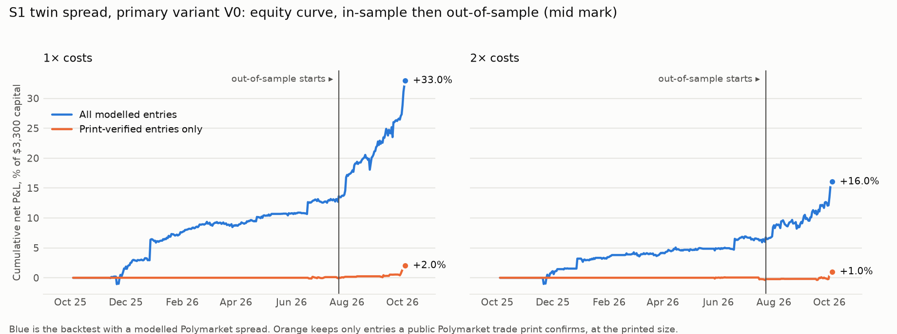
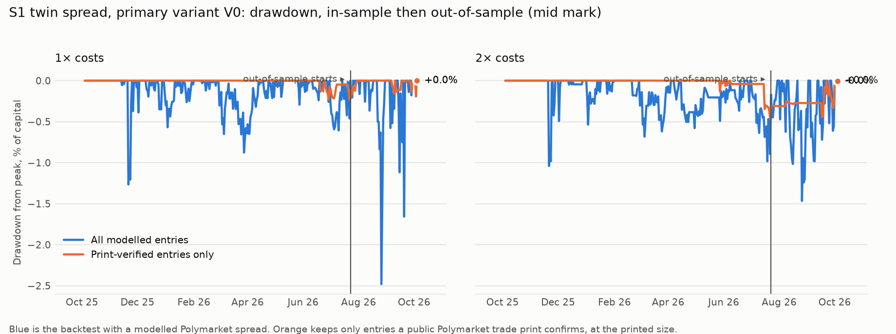

# S1: Polymarket–Kalshi twin spread

Method, pre-registered before any S1 data was pulled: [`research/s1_twin_spread/METHOD.md`](../../s1_twin_spread/METHOD.md) (commit `8260548`; amendments 1 and 2 in `460ffca`, before any run; amendment 3 in `68b49ff`, before the forward window). History 2025-10-03 to 2026-10-03, 31 of 33 verified pairs, 1-minute bars. Out-of-sample is the most recent 20%: 2026-07-22 to 2026-10-03 (73 days). Files: [`metrics.csv`](metrics.csv), [`trades.csv`](trades.csv), [`capacity.md`](capacity.md), [`RUN_LOG.md`](RUN_LOG.md).

## Answer

**Real cross-venue gaps exist, they are confirmed by trade prints, and they were profitable after every cost. They are also rare and small.** Out of sample, 15 entries on 5 pairs have a public Polymarket trade print at the price the trade needs. Held to resolution they lock in +$47.50 on 1,234 contract pairs ($1,177 of capital), a mean net edge of 3.8¢ per $1 pair after Kalshi fees, Polymarket fees, both spreads and carry. At 2× costs 9 verified entries still lock in +$32.28. Marked at mid, with exits at modelled prices, their mean net P&L per trade is +$4.38 (pair-bootstrap 95% interval 2.04 to 7.66) at 1× and +$4.51 (0.18 to 11.08) at 2×. The result is concentrated: the two largest entries carry +$26.16 of the +$47.50.

**The strategy as pre-registered does not pass.** Criterion 4 fails: only 15 of 99 out-of-sample entries (15.2%) are print-verified, against the 50% required. The unverified 84 entries carry +$561.12 of the +$637.28 modelled P&L. That P&L, and the Sharpe ratio of 7.16, come from the modelled Polymarket spread, not from prices anyone could trade (see "Sharpe above 3" below).

## Headline numbers (primary variant V0, registered quote rule)

| Segment | Costs | Entries | Pairs | Net P&L (mid) | Return on $3,300 | Sharpe | Max drawdown | Worst month | Turnover / yr | Print-verified | Verified P&L (mid) | Verified edge locked at entry |
|---|---|---|---|---|---|---|---|---|---|---|---|---|
| In-sample | 1× | 61 | 9 | +$450.44 | 13.6% | 2.99 | 1.27% | -0.23% | 4.2× | 2 of 61 | +$1.45 | +$3.86 |
| In-sample | 2× | 26 | 8 | +$222.39 | 6.7% | 2.03 | 1.04% | -0.17% | 1.7× | 4 of 26 | -$7.45 | +$5.55 |
| Out-of-sample | 1× | 99 | 20 | +$637.28 | 19.3% | 7.16 | 2.48% | 3.54% | 27.1× | 15 of 99 | +$65.67 | +$47.50 |
| Out-of-sample | 2× | 38 | 19 | +$307.06 | 9.3% | 4.86 | 1.47% | 0.33% | 9.1× | 9 of 38 | +$40.62 | +$32.28 |

Capital base $3,300 (33 pairs × $100), fully funded. Returns are net of financing at 4.17% on locked capital. The Sharpe ratio is on daily marks at venue mids, 365 days a year. "Verified edge locked at entry" needs no modelled exit: it is the edge of the verified entries if simply held to resolution.





## Pre-registered success criterion

| Criterion | Result | Evidence |
|---|---|---|
| 1. At least 30 OOS entries across at least 5 pairs | pass | 99 entries, 20 pairs |
| 2. OOS net P&L positive under the mid and locked marks, pair-bootstrap interval excludes zero | pass | mid +$637.28, locked +$665.66, per trade +$6.44 [4.92, 8.83] |
| 3. Still positive at 2× costs | pass | mid +$307.06, locked +$318.53 |
| 4. At least half of OOS entries print-verified, and the verified subset positive | **fail** | 15 of 99 verified (15.2%); verified subset +$65.67 |

**Verdict: not a pass.**

## The print-verified out-of-sample entries (primary variant, 1× costs)

| Kalshi ticker | Trade | Entry (UTC) | Polymarket price paid (YES terms) | Kalshi bid / ask | Net edge per pair | Prints | Printed shares | Contracts counted | Edge locked |
|---|---|---|---|---|---|---|---|---|---|
| KXIPO-26-ANTHROPIC | A | 2026-07-22T23:52 | 0.665 | 0.72 / 0.74 | 1.4¢ | 1 | 200 | 100 | +$1.39 |
| KXMACHADOVENEZUELA-26JUN29-JAN01 | A | 2026-07-29T12:50 | 0.425 | 0.49 / 0.56 | 2.1¢ | 2 | 40 | 40 | +$0.82 |
| KXIPO-26-ANTHROPIC | A | 2026-08-11T08:06 | 0.790 | 0.84 / 0.87 | 1.8¢ | 7 | 2,742 | 100 | +$1.81 |
| KXIPO-26-ANTHROPIC | A | 2026-09-06T17:16 | 0.895 | 0.94 / 0.95 | 2.4¢ | 7 | 379 | 100 | +$2.44 |
| KXGEMINI-GEM4-26NOV01 | A | 2026-09-16T20:17 | 0.660 | 0.70 / 0.75 | 1.1¢ | 2 | 349 | 100 | +$1.11 |
| KXIPO-26-ANTHROPIC | A | 2026-09-18T21:36 | 0.775 | 0.82 / 0.86 | 1.6¢ | 1 | 10 | 10 | +$0.16 |
| KXIPO-26-ANTHROPIC | B | 2026-09-26T14:52 | 0.770 | 0.43 / 0.70 | 3.8¢ | 3 | 271 | 100 | +$3.76 |
| KXMACHADOVENEZUELA-26JUN29-JAN01 | B | 2026-09-28T18:02 | 0.510 | 0.26 / 0.33 | 14.5¢ | 14 | 450 | 100 | +$14.53 |
| KXGEMINI-NEXTPRO-26NOV01 | B | 2026-09-30T18:49 | 0.905 | 0.84 / 0.87 | 2.0¢ | 1 | 31 | 31 | +$0.61 |
| KXGEMINI-NEXTPRO-26NOV01 | A | 2026-09-30T21:03 | 0.550 | 0.62 / 0.67 | 4.0¢ | 5 | 61 | 61 | +$2.45 |
| KXGEMINI-GEM4-26OCT16 | B | 2026-09-30T21:04 | 0.800 | 0.58 / 0.66 | 11.6¢ | 3 | 108 | 100 | +$11.63 |
| KXGEMINI-NEXTPRO-26NOV01 | A | 2026-10-01T00:00 | 0.465 | 0.51 / 0.56 | 1.4¢ | 4 | 93 | 93 | +$1.31 |
| KXMACHADOVENEZUELA-26JUN29-JAN01 | A | 2026-10-01T14:16 | 0.425 | 0.49 / 0.57 | 2.8¢ | 40 | 548 | 100 | +$2.76 |
| KXGEMINI-GEM4-26OCT16 | B | 2026-10-02T17:09 | 0.520 | 0.43 / 0.48 | 1.1¢ | 2 | 143 | 100 | +$1.10 |
| KXGEMINI-GEM4-26OCT16 | B | 2026-10-03T12:42 | 0.535 | 0.45 / 0.49 | 1.6¢ | 10 | 202 | 100 | +$1.61 |

Trade A buys Polymarket YES and Kalshi NO; trade B buys Kalshi YES and Polymarket NO. A print confirms the Polymarket price within ±10 minutes; it does not prove both legs could be filled in the same second, and Kalshi's size at the quote is unknown.

## Costs, in bp of the capital committed (mean at entry, out-of-sample)

| Cost | 1× | 2× | Source |
|---|---|---|---|
| Fees, both venues | 218 bp | 439 bp | Kalshi: `ceil(0.07 × C × P × (1 − P))` to the cent, fee schedule and the API's `fee_type` / `fee_multiplier` (1 for all 33 series). Polymarket: the market's `feeSchedule`, rate 0.04 or 0.05 × P × (1 − P). |
| Half-spreads, both venues | 422 bp | 767 bp | Kalshi: real bid / ask from 1-minute candles. Polymarket: modelled, median of this weekend's live books per pair, floor 0.5¢. |
| Carry to the deadline | 114 bp | 250 bp | 3-month Treasury yield 4.17% (2026-10-01), Alpha Vantage `TREASURY_YIELD` (FRED DGS3MO), on capital locked until the later venue deadline. |

Not charged: USDC on- and off-ramp and gas, Kalshi deposit fees, taxes. Kalshi's interest on collateral is ignored.

## Capacity

History has no sizes, so it supports no capacity claim. The verified entries rest on prints with a median of 200 shares. At that scale S1 is a few hundred dollars per opportunity. Real depth comes from the forward recording: [`capacity.md`](capacity.md).

## Forward paper test (this weekend's recorded order books)

Pending. The window is Sat 2026-10-03 20:00 ET to Sun 2026-10-04 07:00 ET. The rules are frozen in METHOD.md.

## Every variant tried

| Quote rule | Segment | Variant | Costs | Entries | Pairs | P&L mid | P&L liquidation | P&L locked | Sharpe | Deflated Sharpe prob. | Max DD | Print-verified | Verified P&L | Verified edge at entry |
|---|---|---|---|---|---|---|---|---|---|---|---|---|---|---|
| registered | IS | V0 (primary) | 1× | 61 | 9 | +$450.44 | +$426.58 | +$467.87 | 2.99 | 0.984 | 1.27% | 2 of 61 | +$1.45 | +$3.86 |
| registered | OOS | V0 (primary) | 1× | 99 | 20 | +$637.28 | +$577.42 | +$665.66 | 7.16 | 0.941 | 2.48% | 15 of 99 | +$65.67 | +$47.50 |
| registered | IS | V0 (primary) | 2× | 26 | 8 | +$222.39 | +$195.98 | +$229.18 | 2.03 | 0.928 | 1.04% | 4 of 26 | -$7.45 | +$5.55 |
| registered | OOS | V0 (primary) | 2× | 38 | 19 | +$307.06 | +$216.11 | +$318.53 | 4.86 | 0.939 | 1.47% | 9 of 38 | +$40.62 | +$32.28 |
| registered | IS | V1 | 1× | 51 | 9 | +$467.11 | +$443.26 | +$484.55 | 3.23 | 0.997 | 0.84% | 2 of 51 | -$0.66 | +$3.47 |
| registered | OOS | V1 | 1× | 84 | 20 | +$654.11 | +$598.38 | +$677.89 | 7.24 | 0.948 | 2.19% | 14 of 84 | +$51.84 | +$48.94 |
| registered | IS | V1 | 2× | 21 | 8 | +$219.11 | +$192.70 | +$226.08 | 2.03 | 0.931 | 1.04% | 2 of 21 | -$0.06 | +$2.97 |
| registered | OOS | V1 | 2× | 33 | 18 | +$321.02 | +$243.88 | +$330.31 | 5.05 | 0.951 | 1.47% | 7 of 33 | +$38.98 | +$33.29 |
| registered | IS | V2 | 1× | 45 | 9 | +$453.86 | +$430.01 | +$471.43 | 3.31 | 0.997 | 0.84% | 2 of 45 | +$7.88 | +$6.54 |
| registered | OOS | V2 | 1× | 70 | 20 | +$677.75 | +$634.50 | +$692.41 | 8.24 | 0.985 | 2.10% | 10 of 70 | +$49.95 | +$41.49 |
| registered | IS | V2 | 2× | 20 | 8 | +$220.82 | +$194.41 | +$227.88 | 2.06 | 0.935 | 1.04% | 0 of 20 | +$0.00 | +$0.00 |
| registered | OOS | V2 | 2× | 27 | 17 | +$321.98 | +$274.94 | +$321.39 | 5.02 | 0.951 | 1.43% | 5 of 27 | +$39.21 | +$27.94 |
| registered | IS | V3 | 1× | 9 | 9 | +$114.52 | +$79.96 | +$110.69 | 0.98 | 0.367 | 1.45% | 0 of 9 | +$0.00 | +$0.00 |
| registered | OOS | V3 | 1× | 20 | 20 | +$274.32 | +$195.81 | +$260.31 | 2.55 | 0.291 | 2.81% | 1 of 20 | +$8.38 | +$1.39 |
| registered | IS | V3 | 2× | 8 | 8 | +$120.54 | +$67.16 | +$107.82 | 1.05 | 0.649 | 1.61% | 1 of 8 | -$8.62 | +$1.36 |
| registered | OOS | V3 | 2× | 19 | 19 | +$224.85 | +$83.48 | +$200.26 | 2.68 | 0.680 | 2.19% | 2 of 19 | +$2.97 | +$2.08 |
| kalshi_carry_6h | IS | V0 (primary) | 1× | 65 | 9 | +$485.31 | +$466.95 | +$504.78 | 2.86 | 0.985 | 1.27% | 3 of 65 | +$4.28 | +$6.64 |
| kalshi_carry_6h | OOS | V0 (primary) | 1× | 117 | 21 | +$798.95 | +$739.30 | +$820.65 | 8.34 | 0.981 | 2.54% | 16 of 117 | +$58.34 | +$48.14 |
| kalshi_carry_6h | IS | V0 (primary) | 2× | 28 | 8 | +$242.20 | +$215.67 | +$252.49 | 2.06 | 0.943 | 1.04% | 4 of 28 | +$2.93 | +$6.09 |
| kalshi_carry_6h | OOS | V0 (primary) | 2× | 43 | 19 | +$391.26 | +$300.17 | +$398.89 | 5.74 | 0.978 | 1.68% | 10 of 43 | +$64.22 | +$32.55 |
| kalshi_carry_6h | IS | V1 | 1× | 54 | 9 | +$507.45 | +$496.80 | +$522.88 | 3.12 | 0.997 | 0.81% | 3 of 54 | +$2.16 | +$6.25 |
| kalshi_carry_6h | OOS | V1 | 1× | 99 | 20 | +$829.43 | +$780.04 | +$852.48 | 8.61 | 0.989 | 2.43% | 15 of 99 | +$63.24 | +$52.28 |
| kalshi_carry_6h | IS | V1 | 2× | 23 | 8 | +$238.37 | +$211.84 | +$248.81 | 2.04 | 0.942 | 1.04% | 3 of 23 | +$1.70 | +$4.87 |
| kalshi_carry_6h | OOS | V1 | 2× | 38 | 19 | +$404.40 | +$321.72 | +$410.22 | 5.88 | 0.985 | 1.79% | 8 of 38 | +$61.81 | +$34.83 |
| kalshi_carry_6h | IS | V2 | 1× | 48 | 9 | +$497.30 | +$486.66 | +$512.84 | 3.21 | 0.998 | 0.81% | 1 of 48 | +$1.43 | +$0.84 |
| kalshi_carry_6h | OOS | V2 | 1× | 83 | 20 | +$862.00 | +$825.18 | +$879.12 | 9.50 | 0.999 | 2.34% | 11 of 83 | +$53.70 | +$43.86 |
| kalshi_carry_6h | IS | V2 | 2× | 22 | 8 | +$241.88 | +$215.35 | +$252.44 | 2.09 | 0.950 | 1.04% | 1 of 22 | +$1.76 | +$1.90 |
| kalshi_carry_6h | OOS | V2 | 2× | 32 | 19 | +$382.92 | +$326.58 | +$383.98 | 5.55 | 0.978 | 1.76% | 5 of 32 | +$39.22 | +$27.94 |
| kalshi_carry_6h | IS | V3 | 1× | 9 | 9 | +$119.57 | +$84.84 | +$105.16 | 1.04 | 0.388 | 1.45% | 0 of 9 | +$0.00 | +$0.00 |
| kalshi_carry_6h | OOS | V3 | 1× | 21 | 21 | +$270.08 | +$190.44 | +$255.90 | 2.56 | 0.293 | 2.73% | 2 of 21 | +$11.03 | +$2.60 |
| kalshi_carry_6h | IS | V3 | 2× | 8 | 8 | +$117.54 | +$64.08 | +$107.82 | 1.05 | 0.651 | 1.55% | 0 of 8 | +$0.00 | +$0.00 |
| kalshi_carry_6h | OOS | V3 | 2× | 19 | 19 | +$244.94 | +$103.41 | +$221.54 | 2.91 | 0.716 | 2.26% | 3 of 19 | +$3.12 | +$2.35 |

`kalshi_carry_6h` is the sensitivity of amendment 1 (a Kalshi quote stays valid up to 6 hours, because Kalshi only writes a candle when the top of the book changes). The deflated Sharpe probability uses 8 trials.

## Sharpe above 3: the bug hunt

The modelled backtest shows Sharpe ratios up to 9.5. The pre-registered checks, in order:

| Check | Outcome |
|---|---|
| Fills at the second observation | Enforced in code and pinned by tests (`test_a_gap_of_one_minute_is_never_traded`, `test_entry_fills_at_the_second_observation`). |
| Quote ages at entry | Kalshi median 60 s, max 660 s; Polymarket median 48 s. Within the 15-minute rule. |
| **Polymarket points that are the middle of an empty or wide book** | **This is the cause.** 84 of 99 out-of-sample entries have no trade print at the price the model assumes. 18 entries are inside the first 48 hours of a Polymarket market's life, and 17 have a Polymarket "price" between 0.45 and 0.55 while Kalshi quotes far away: an unquoted midpoint, not a price. The median gap at entry is 9¢. |
| Fees on every leg | Yes: 218 bp of capital per entry on average. |
| Empty Kalshi sides | Never used (amendment 2, `test_build_pair_drops_empty_kalshi_sides`). |
| Both clocks in UTC | Yes. Kalshi candles matched the recorder's live book in 1,542 of 1,584 snapshots. |
| Pair direction | All 33 pairs are `direction: same`. |

So the high Sharpe is not a coding bug. It is the artifact the earlier options scan found: a tight spread assumed around a history point that was never a tradable price. The trade-print check exists to catch it, and it did.

## What didn't work

- **The modelled backtest is not evidence of an edge.** 84.8% of its out-of-sample entries have no supporting trade print.
- **In-sample, almost nothing verifies:** 2 of 61 entries, verified P&L +$1.45. Part of that is reach: Polymarket's data API serves only the latest 20,000 prints per market, so early entries on the two busiest markets cannot be checked (36.1% of in-sample entries are out of reach and are counted as unverified).
- **Hold-only (V3) is weaker than the primary** on the mid mark: most of the modelled P&L comes from exits at modelled Polymarket prices.
- **2 of 33 pairs are unusable in history:** `KXPRESNOMD-28-TW` (Polymarket book one-sided or empty in more than half of the calibration snapshots); `KXPRESNOMR-28-COWE` (the two venues never have a fresh quote in the same minute).
- **The 2028 nomination pairs produced 0 entries in any variant.** They lock capital for two years, so carry alone costs about 9¢ per $1.

## Caveats

- **Resolution risk.** The twins were verified from their text. No pair has resolved, so a mismatch cannot be measured here.
- **Legging risk.** Both legs are assumed to fill together. A print within ±10 minutes is not a simultaneous fill.
- **Exits use modelled Polymarket prices.** "Verified edge locked at entry" avoids that; the mid-mark P&L does not.
- **Small sample.** 15 verified out-of-sample entries on 5 pairs in 73 days; two of them carry +$26.16 of the +$47.50 locked.
- **Coverage.** Under the registered 15-minute rule the two venues are both fresh in 43.6% of minutes for the median pair (94.4% under the 6-hour sensitivity).

## Reproduce

```
cd research
python -m s1_twin_spread.data                       # pull (not committed; about 7 minutes)
python -m s1_twin_spread.run --rate 0.0417 --rate-date 2026-10-01
python -m s1_twin_spread.forward --rate 0.0417       # after the forward window closes
python -m s1_twin_spread.report
python -m pytest s1_twin_spread/tests -q
```
