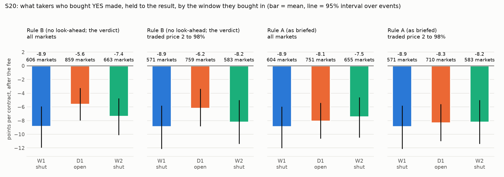
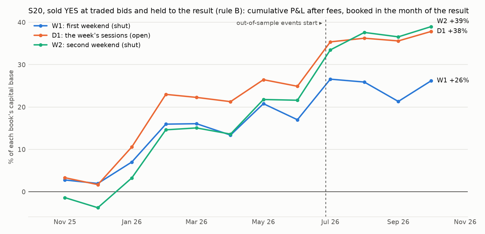
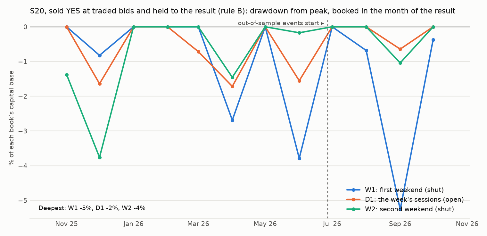

# S20: are Polymarket's price markets most overpriced when the reference market is shut?

Method, pre-registered before any print outside S18's first weekend was pulled: [`research/s20_closed_vs_open/METHOD.md`](../../s20_closed_vs_open/METHOD.md). Markets: S18's 1,092 price markets with a result, in 130 events. Three windows per market: **W1**, its first weekend (Friday 20:00 to Sunday 20:00 New York, the stock market shut; S18's prints, read only); **D1**, the regular sessions (09:30 to 16:00) of the trading days that follow; **W2**, the weekend after. Prices are public trade prints; P&L is after the market's own taker fee, held to the result; intervals resample events. Files: [`metrics.csv`](metrics.csv), [`trades.csv`](trades.csv), [`books.csv`](books.csv), [`counts.csv`](counts.csv), [`equity.csv`](equity.csv), [`capacity.md`](capacity.md), [`RUN_LOG.md`](RUN_LOG.md).

## Answer

Every number in this section is under rule B (a market counts in a window if it was still open when the window started) unless rule A is named. Why there are two rules is in the last paragraph and in the section after the verdict.

**Buyers of YES overpay in every window, with the reference market shut or open.** Held to the result and after the fee, takers who bought YES lost 8.87 points [-11.94, -5.93] per contract on the market's first weekend (606 markets, 97 events), 5.64 points [-7.96, -3.22] during the regular sessions of the following week (859 markets, 121 events) and 7.38 points [-10.10, -4.73] on the second weekend (663 markets, 110 events). No interval reaches zero. The overpricing S18 found is not a first-weekend effect: it is there during regular trading hours, with the stock, futures and options markets open.

**They lose more when the reference market is shut (T1 holds), but not in the most recent events.** First weekend minus open week: -3.22 [-5.51, -1.01] points. Second weekend minus open week: -1.73 [-3.62, -0.08], which by the line fixed in advance reads "shut matters, not just new", but only just. In the in-sample events T1 is -4.10 [-6.81, -1.57]; in the most recent 20% of events it is +0.09 [-5.75, +5.86] (123 against 168 markets).

**The extra weekend loss is a wider gap between buyers and sellers, not a dearer ticket that a seller collects (T3).** On the same markets, buyers paid +2.90 [+1.48, +4.33] points more on the first weekend than in the open week (538 markets, 90 events). Takers who sold into bids received the same price in both: +0.50 [-1.04, +1.81] (595 markets). The price at which a ticket can be sold does not rise when the reference market shuts. What rises is the price at which it is bought.

**So for the side that can be traded, the clock does not matter (T4).** Takers who sold YES into a bid and held to the result earned +3.63 [+0.72, +6.57] points per contract on the first weekend, +4.84 [+2.48, +7.14] in the open week and +5.35 [+2.97, +7.89] on the second weekend. First weekend minus open week: -1.22 [-3.56, +1.21]: selling while the reference market is shut paid no more than selling while it is open. As books of up to 100 contracts per market:

- **W1, first weekend (shut):** +$2,171 on a capital base of $8,282 (monthly Sharpe 1.53, maximum drawdown 5.3%, worst month -4.6%; +$1,987 with the fee doubled; in-sample +$2,378, out-of-sample -$207). This is S18's book.
- **D1, the open week:** +$4,113 on a capital base of $10,866 (monthly Sharpe 2.19, maximum drawdown 1.7%, worst month -1.6%; +$3,829 with the fee doubled; in-sample +$3,697, out-of-sample +$416).
- **W2, second weekend (shut):** +$3,211 on a capital base of $8,233 (monthly Sharpe 2.18, maximum drawdown 3.8%, worst month -2.4%; +$3,018 with the fee doubled; in-sample +$2,499, out-of-sample +$711).

The three books are one bet, short the same tickets, entered at three times; their monthly P&L moves together. Out-of-sample, per contract, none of the three is distinguishable from zero: -0.99 [-10.96, +9.28], +2.81 [-4.57, +10.63] and +4.97 [-2.42, +12.53].

**Where the sellers' premium is: stocks and the S&P 500, in all three windows.** +6.40 [+2.39, +9.92], +8.13 [+5.32, +10.86] and +7.51 [+4.29, +10.59] points per contract. In commodities it is +1.25 [-2.88, +5.09], +1.45 [-2.10, +5.08] and +3.18 [-0.57, +7.16]: every interval includes zero.

**Verdict by the rule fixed in advance: a lead.** T1 holds and the first-weekend sellers' book is not above zero out-of-sample (known from S18). Read with T3 and T4: the clock changes what a buyer pays; it does not change what a seller at the bid earns. The thesis that these tickets are *most* overpriced when the reference market is shut is right for the buyer's side by about three points and is not a reason to time the sale.

**The exclusion rule decides T1, and the briefed one gives a different answer.** Under rule A, as briefed, T1 is -0.82 [-3.35, +1.65]: no clock effect that can be told from zero. Rule A drops from the open week the 113 markets that resolved during it, 94% of them YES. Those are the buyers' winners, so under rule A open-week buyers lose 8.07 points instead of 5.64. The bias and its direction were written into `METHOD.md` from result times alone, before any print was pulled, together with the rule the verdict would be read from (rule B). This is a departure from the brief.

## The tests against the lines fixed in advance (rule B, all markets)

| Fixed in advance | Result | Evidence |
|---|---|---|
| T1: buyers lose more in W1 (shut) than in D1 (open): W1 minus D1 below zero, interval excluding zero | **holds** | -3.22 [-5.51, -1.01] points |
| T2: buyers lose more in W2 (shut again) than in D1: W2 minus D1 below zero, interval excluding zero | **holds** | -1.73 [-3.62, -0.08] points; reading: **shut matters** |
| T3: the same ticket is dearer in W1 than in D1 (buyers' traded price, same markets), interval excluding zero | **holds** | +2.90 [+1.48, +4.33] points on 538 markets |
| T3: the same ticket is dearer in W2 than in D1 | does not hold | -1.93 [-3.03, -0.85] points on 579 markets |
| T4: the W1 sellers' book is above zero in-sample | **holds** | +$2,378 on 534 markets |
| T4: the W1 sellers' book is above zero out-of-sample | does not hold | -$207 on 123 markets |

**Verdict by the rule of METHOD.md section 5: a lead.**

T1 under the other readings fixed in advance: rule A, all markets: -0.82 [-3.35, +1.65]; rule B, tickets traded 2 to 98%: -2.68 [-5.22, -0.31]; rule A, tickets traded 2 to 98%: -0.56 [-3.42, +2.11].

## Which markets count in a window: the briefed rule and the one the verdict is read from

The brief said: leave a market out of a window if it resolved before or during it (**rule A**). A "will it hit" market resolves early only when it is hit, so rule A removes the open week's winning tickets using knowledge of the future. That was visible from result times alone, before any print was pulled, and `METHOD.md` section 3 fixed a second rule then: **rule B**, a market counts if its result came after the window's start. Both are reported everywhere; the verdict is read from rule B. W1 under rule B is S18's own test and returns its committed numbers exactly (buyers -8.87 on 606 markets; sellers +3.63 on 657; sellers' book +$2,171).

| Rule | Window | S18's markets | Counted | Events | Resolved YES, % | With a print | With a taker purchase | Events (purchases) | With a taker sale | Events (sales) | Prints | Left out: beyond the 20,000 prints the API keeps | Left out: resolved before or during the window | Left out: no print served at all (or the request failed) | Left out: window not over at the pull | Left out: resolved before the window |
|---|---|---|---|---|---|---|---|---|---|---|---|---|---|---|---|---|
| A | W1 | 1092 | 1083 | 130 | 26.0 | 738 | 604 | 97 | 655 | 101 | 39026 | 6 | 2 | 1 | 0 | 0 |
| A | D1 | 1092 | 960 | 128 | 17.1 | 838 | 751 | 120 | 793 | 120 | 48477 | 5 | 127 | 0 | 0 | 0 |
| A | W2 | 1092 | 913 | 114 | 17.2 | 783 | 655 | 105 | 726 | 107 | 41864 | 3 | 173 | 0 | 3 | 0 |
| B | W1 | 1092 | 1085 | 130 | 26.2 | 740 | 606 | 97 | 657 | 101 | 39374 | 6 | 0 | 1 | 0 | 0 |
| B | D1 | 1092 | 1073 | 130 | 25.2 | 949 | 859 | 121 | 888 | 122 | 55073 | 5 | 0 | 0 | 0 | 14 |
| B | W2 | 1092 | 936 | 121 | 17.1 | 792 | 663 | 110 | 732 | 110 | 41948 | 3 | 0 | 0 | 3 | 150 |

## T1 and T2: what buyers of YES made, by the window they bought in



| Rule | Scope | Window | Markets | Events | Mean traded price, % | Resolved YES, % | P&L per contract, points | 95% interval | Fee doubled | Median printed size |
|---|---|---|---|---|---|---|---|---|---|---|
| B | all markets | W1 | 606 | 97 | 37.2 | 28.7 | -8.87 | [-11.94, -5.93] | -9.25 | 388 |
| B | all markets | D1 | 859 | 121 | 33.9 | 28.6 | -5.64 | [-7.96, -3.22] | -5.99 | 1,079 |
| B | all markets | W2 | 663 | 110 | 25.4 | 18.4 | -7.38 | [-10.10, -4.73] | -7.72 | 447 |
| B | traded price 2 to 98% | W1 | 571 | 96 | 35.8 | 27.3 | -8.90 | [-12.12, -5.81] | -9.30 | 377 |
| B | traded price 2 to 98% | D1 | 759 | 117 | 30.7 | 24.9 | -6.22 | [-8.84, -3.34] | -6.61 | 953 |
| B | traded price 2 to 98% | W2 | 583 | 104 | 28.6 | 20.8 | -8.24 | [-11.39, -5.01] | -8.62 | 408 |
| A | all markets | W1 | 604 | 97 | 37.0 | 28.5 | -8.90 | [-12.00, -5.95] | -9.28 | 382 |
| A | all markets | D1 | 751 | 120 | 26.9 | 19.2 | -8.07 | [-10.63, -5.40] | -8.44 | 838 |
| A | all markets | W2 | 655 | 105 | 25.6 | 18.5 | -7.46 | [-10.49, -4.61] | -7.81 | 447 |
| A | traded price 2 to 98% | W1 | 571 | 96 | 35.8 | 27.3 | -8.90 | [-12.12, -5.81] | -9.30 | 377 |
| A | traded price 2 to 98% | D1 | 710 | 117 | 28.1 | 20.1 | -8.34 | [-10.99, -5.60] | -8.72 | 849 |
| A | traded price 2 to 98% | W2 | 583 | 104 | 28.6 | 20.8 | -8.24 | [-11.39, -5.01] | -8.62 | 408 |

| Rule | Scope | Difference in mean P&L | Points | 95% interval | Markets (first / second window) |
|---|---|---|---|---|---|
| B | all markets | T1: W1 minus D1 | -3.22 | [-5.51, -1.01] | 606 / 859 |
| B | all markets | T2: W2 minus D1 | -1.73 | [-3.62, -0.08] | 663 / 859 |
| B | all markets | T2: W1 minus W2 | -1.49 | [-4.25, +1.26] | 606 / 663 |
| B | traded price 2 to 98% | T1: W1 minus D1 | -2.68 | [-5.22, -0.31] | 571 / 759 |
| B | traded price 2 to 98% | T2: W2 minus D1 | -2.01 | [-3.95, -0.07] | 583 / 759 |
| B | traded price 2 to 98% | T2: W1 minus W2 | -0.66 | [-3.41, +2.23] | 571 / 583 |
| A | all markets | T1: W1 minus D1 | -0.82 | [-3.35, +1.65] | 604 / 751 |
| A | all markets | T2: W2 minus D1 | +0.61 | [-1.18, +2.17] | 655 / 751 |
| A | all markets | T2: W1 minus W2 | -1.44 | [-4.19, +1.27] | 604 / 655 |
| A | traded price 2 to 98% | T1: W1 minus D1 | -0.56 | [-3.42, +2.11] | 571 / 710 |
| A | traded price 2 to 98% | T2: W2 minus D1 | +0.10 | [-1.73, +1.91] | 583 / 710 |
| A | traded price 2 to 98% | T2: W1 minus W2 | -0.66 | [-3.41, +2.23] | 571 / 583 |

## T3: the price of the same ticket, weekend against open week

Only markets with prints of that side in both windows. A fairly priced probability does not drift on average. "Buyers paid" is the pre-registered test; "sellers received" tells a dearer ticket from a wider spread.

| Rule | Scope | Windows | Price | Markets with prints in both | Events | Mean price, first window, % | Mean price, second window, % | Difference, points | 95% interval |
|---|---|---|---|---|---|---|---|---|---|
| B | all markets | W1 minus D1 | buyers paid | 538 | 90 | 37.4 | 34.5 | +2.90 | [+1.48, +4.33] |
| B | all markets | W1 minus D1 | sellers received | 595 | 94 | 30.0 | 29.5 | +0.50 | [-1.04, +1.81] |
| B | all markets | W2 minus D1 | buyers paid | 579 | 104 | 26.5 | 28.5 | -1.93 | [-3.03, -0.85] |
| B | all markets | W2 minus D1 | sellers received | 653 | 106 | 23.9 | 26.4 | -2.55 | [-3.42, -1.64] |
| B | traded price 2 to 98% | W1 minus D1 | buyers paid | 512 | 89 | 36.2 | 33.1 | +3.08 | [+1.63, +4.50] |
| B | traded price 2 to 98% | W1 minus D1 | sellers received | 546 | 91 | 32.0 | 31.6 | +0.50 | [-1.18, +1.91] |
| B | traded price 2 to 98% | W2 minus D1 | buyers paid | 544 | 101 | 28.2 | 30.2 | -2.04 | [-3.18, -0.86] |
| B | traded price 2 to 98% | W2 minus D1 | sellers received | 578 | 105 | 26.9 | 29.7 | -2.82 | [-3.81, -1.79] |
| A | all markets | W1 minus D1 | buyers paid | 462 | 84 | 32.3 | 27.0 | +5.29 | [+3.77, +6.77] |
| A | all markets | W1 minus D1 | sellers received | 526 | 92 | 26.0 | 23.5 | +2.47 | [+1.19, +3.65] |
| A | all markets | W2 minus D1 | buyers paid | 572 | 100 | 26.7 | 28.5 | -1.84 | [-2.86, -0.78] |
| A | all markets | W2 minus D1 | sellers received | 647 | 103 | 23.8 | 26.4 | -2.63 | [-3.51, -1.73] |
| A | traded price 2 to 98% | W1 minus D1 | buyers paid | 453 | 84 | 32.9 | 27.5 | +5.38 | [+3.86, +6.89] |
| A | traded price 2 to 98% | W1 minus D1 | sellers received | 481 | 89 | 28.3 | 25.6 | +2.64 | [+1.29, +4.00] |
| A | traded price 2 to 98% | W2 minus D1 | buyers paid | 537 | 97 | 28.4 | 30.3 | -1.94 | [-3.05, -0.82] |
| A | traded price 2 to 98% | W2 minus D1 | sellers received | 574 | 102 | 26.7 | 29.6 | -2.91 | [-3.90, -1.93] |

## T4: the trade, sell YES at traded bids and hold to the result, as a book per window

Up to 100 contracts per market, never more than the printed size; P&L booked in the month of the result; capital locked from the window's start to the result; the capital base is the largest capital locked at one time (S18's book function). The charts show rule B at the fee. A D1 or W2 book under rule A could not have been traded: it drops the markets that were about to be hit.





| Rule | Scope | Window | Fee | Segment | Markets | Net P&L | Capital base | Sharpe (monthly) | Max DD | Worst month | Turnover / yr | Winners | Worst event | Median days locked |
|---|---|---|---|---|---|---|---|---|---|---|---|---|---|---|
| B | all markets | W1 | 1× | IS | 534 | +$2,378 | $8,282 | 2.04 | 3.8% | -3.8% | 4.5× | 74% | -$100 | 28 |
| B | all markets | W1 | 1× | OOS | 123 | -$207 | $4,100 | -0.54 | 14.9% | -9.3% | 5.6× | 71% | -$242 | 31 |
| B | all markets | W1 | 1× | ALL | 657 | +$2,171 | $8,282 | 1.53 | 5.3% | -4.6% | 4.3× | 73% | -$242 | 28 |
| B | all markets | W1 | 2× | IS | 534 | +$2,251 | $8,282 | 1.95 | 4.1% | -4.1% | 4.5× | 74% | -$113 | 28 |
| B | all markets | W1 | 2× | OOS | 123 | -$264 | $4,100 | -0.68 | 16.2% | -9.5% | 5.6× | 71% | -$248 | 31 |
| B | all markets | W1 | 2× | ALL | 657 | +$1,987 | $8,282 | 1.41 | 5.8% | -4.7% | 4.3× | 73% | -$248 | 28 |
| B | all markets | D1 | 1× | IS | 712 | +$3,697 | $10,550 | 2.43 | 1.8% | -1.7% | 5.5× | 74% | -$178 | 26 |
| B | all markets | D1 | 1× | OOS | 176 | +$416 | $4,952 | 2.74 | 1.4% | -1.4% | 7.0× | 77% | -$208 | 28 |
| B | all markets | D1 | 1× | ALL | 888 | +$4,113 | $10,866 | 2.19 | 1.7% | -1.6% | 5.1× | 75% | -$208 | 26 |
| B | all markets | D1 | 2× | IS | 712 | +$3,501 | $10,550 | 2.29 | 2.1% | -2.1% | 5.5× | 74% | -$185 | 26 |
| B | all markets | D1 | 2× | OOS | 176 | +$328 | $4,952 | 2.07 | 1.9% | -1.9% | 7.0× | 77% | -$213 | 28 |
| B | all markets | D1 | 2× | ALL | 888 | +$3,829 | $10,866 | 2.04 | 2.0% | -2.0% | 5.1× | 75% | -$213 | 26 |
| B | all markets | W2 | 1× | IS | 582 | +$2,499 | $8,233 | 2.18 | 3.8% | -2.4% | 5.8× | 83% | -$165 | 21 |
| B | all markets | W2 | 1× | OOS | 150 | +$711 | $4,256 | 3.33 | 2.0% | -2.0% | 7.0× | 81% | -$209 | 24 |
| B | all markets | W2 | 1× | ALL | 732 | +$3,211 | $8,233 | 2.18 | 3.8% | -2.4% | 5.5× | 83% | -$209 | 21 |
| B | all markets | W2 | 2× | IS | 582 | +$2,378 | $8,233 | 2.10 | 3.8% | -2.4% | 5.8× | 83% | -$170 | 21 |
| B | all markets | W2 | 2× | OOS | 150 | +$640 | $4,256 | 3.07 | 2.3% | -2.3% | 7.0× | 81% | -$212 | 24 |
| B | all markets | W2 | 2× | ALL | 732 | +$3,018 | $8,233 | 2.09 | 3.8% | -2.4% | 5.5× | 83% | -$212 | 21 |
| A | all markets | W1 | 1× | IS | 532 | +$2,380 | $8,282 | 2.04 | 3.8% | -3.8% | 4.5× | 74% | -$100 | 28 |
| A | all markets | W1 | 1× | OOS | 123 | -$207 | $4,100 | -0.54 | 14.9% | -9.3% | 5.6× | 71% | -$242 | 31 |
| A | all markets | W1 | 1× | ALL | 655 | +$2,173 | $8,282 | 1.53 | 5.3% | -4.6% | 4.3× | 73% | -$242 | 28 |
| A | all markets | W1 | 2× | IS | 532 | +$2,253 | $8,282 | 1.95 | 4.1% | -4.1% | 4.5× | 74% | -$113 | 28 |
| A | all markets | W1 | 2× | OOS | 123 | -$264 | $4,100 | -0.68 | 16.2% | -9.5% | 5.6× | 71% | -$248 | 31 |
| A | all markets | W1 | 2× | ALL | 655 | +$1,989 | $8,282 | 1.41 | 5.8% | -4.7% | 4.3× | 73% | -$248 | 28 |
| A | all markets | D1 | 1× | IS | 632 | +$4,729 | $10,529 | 2.88 | 1.7% | -1.7% | 5.3× | 83% | -$127 | 26 |
| A | all markets | D1 | 1× | OOS | 161 | +$977 | $4,843 | 7.82 | 0.0% | 2.1% | 6.7× | 83% | -$156 | 28 |
| A | all markets | D1 | 1× | ALL | 793 | +$5,706 | $10,667 | 2.81 | 1.7% | -1.7% | 5.0× | 83% | -$156 | 26 |
| A | all markets | D1 | 2× | IS | 632 | +$4,554 | $10,529 | 2.81 | 1.7% | -1.7% | 5.3× | 83% | -$131 | 26 |
| A | all markets | D1 | 2× | OOS | 161 | +$898 | $4,843 | 7.34 | 0.0% | 1.7% | 6.7× | 83% | -$160 | 28 |
| A | all markets | D1 | 2× | ALL | 793 | +$5,452 | $10,667 | 2.73 | 1.7% | -1.7% | 5.0× | 83% | -$160 | 26 |
| A | all markets | W2 | 1× | IS | 578 | +$2,499 | $8,233 | 2.18 | 3.8% | -2.4% | 5.7× | 83% | -$165 | 21 |
| A | all markets | W2 | 1× | OOS | 148 | +$711 | $4,256 | 3.34 | 2.0% | -2.0% | 7.0× | 82% | -$209 | 25 |
| A | all markets | W2 | 1× | ALL | 726 | +$3,210 | $8,233 | 2.18 | 3.8% | -2.4% | 5.5× | 83% | -$209 | 21 |
| A | all markets | W2 | 2× | IS | 578 | +$2,377 | $8,233 | 2.10 | 3.8% | -2.4% | 5.7× | 83% | -$170 | 21 |
| A | all markets | W2 | 2× | OOS | 148 | +$641 | $4,256 | 3.07 | 2.3% | -2.3% | 7.0× | 82% | -$212 | 25 |
| A | all markets | W2 | 2× | ALL | 726 | +$3,018 | $8,233 | 2.09 | 3.8% | -2.4% | 5.5× | 83% | -$212 | 21 |

Sellers' mean P&L per contract by window:

| Rule | Scope | Window | Markets | Events | Mean traded price, % | Resolved YES, % | P&L per contract, points | 95% interval | Fee doubled | Median printed size |
|---|---|---|---|---|---|---|---|---|---|---|
| B | all markets | W1 | 657 | 101 | 30.8 | 26.8 | +3.63 | [+0.72, +6.57] | +3.29 | 355 |
| B | all markets | D1 | 888 | 122 | 30.6 | 25.5 | +4.84 | [+2.48, +7.14] | +4.50 | 881 |
| B | all markets | W2 | 732 | 110 | 23.0 | 17.3 | +5.35 | [+2.97, +7.89] | +5.05 | 417 |
| B | traded price 2 to 98% | W1 | 610 | 98 | 32.5 | 28.4 | +3.82 | [+0.55, +6.93] | +3.46 | 339 |
| B | traded price 2 to 98% | D1 | 763 | 120 | 31.4 | 25.4 | +5.54 | [+2.73, +8.30] | +5.15 | 883 |
| B | traded price 2 to 98% | W2 | 604 | 105 | 27.4 | 20.7 | +6.30 | [+3.25, +9.40] | +5.94 | 408 |
| A | all markets | W1 | 655 | 101 | 30.5 | 26.6 | +3.64 | [+0.72, +6.60] | +3.30 | 354 |
| A | all markets | D1 | 793 | 120 | 25.2 | 17.4 | +7.47 | [+4.99, +9.90] | +7.13 | 767 |
| A | all markets | W2 | 726 | 107 | 22.9 | 17.2 | +5.40 | [+2.94, +7.82] | +5.09 | 408 |
| A | traded price 2 to 98% | W1 | 610 | 98 | 32.5 | 28.4 | +3.82 | [+0.55, +6.93] | +3.46 | 339 |
| A | traded price 2 to 98% | D1 | 705 | 119 | 28.2 | 19.6 | +8.27 | [+5.60, +10.93] | +7.89 | 788 |
| A | traded price 2 to 98% | W2 | 604 | 105 | 27.4 | 20.7 | +6.30 | [+3.25, +9.40] | +5.94 | 408 |

| Rule | Scope | Difference in mean P&L | Points | 95% interval | Markets (first / second window) |
|---|---|---|---|---|---|
| B | all markets | T1: W1 minus D1 | -1.22 | [-3.56, +1.21] | 657 / 888 |
| B | all markets | T2: W2 minus D1 | +0.51 | [-0.87, +1.97] | 732 / 888 |
| B | all markets | T2: W1 minus W2 | -1.73 | [-4.38, +0.89] | 657 / 732 |
| A | all markets | T1: W1 minus D1 | -3.83 | [-6.56, -1.30] | 655 / 793 |
| A | all markets | T2: W2 minus D1 | -2.07 | [-3.25, -0.84] | 726 / 793 |
| A | all markets | T2: W1 minus W2 | -1.76 | [-4.54, +0.90] | 655 / 726 |

## By asset class

Buyers:

| Rule | Scope | Window | Markets | Events | Mean traded price, % | Resolved YES, % | P&L per contract, points | 95% interval | Fee doubled | Median printed size |
|---|---|---|---|---|---|---|---|---|---|---|
| B | stocks and S&P 500 | W1 | 266 | 60 | 40.1 | 28.6 | -11.75 | [-15.11, -8.03] | -12.01 | 103 |
| B | stocks and S&P 500 | D1 | 435 | 76 | 38.8 | 31.7 | -7.32 | [-10.40, -4.15] | -7.56 | 729 |
| B | stocks and S&P 500 | W2 | 310 | 69 | 26.2 | 17.1 | -9.39 | [-12.88, -5.74] | -9.64 | 191 |
| B | commodities | W1 | 340 | 37 | 35.0 | 28.8 | -6.61 | [-11.06, -2.28] | -7.09 | 2,073 |
| B | commodities | D1 | 424 | 45 | 28.9 | 25.5 | -3.92 | [-7.65, -0.13] | -4.39 | 1,998 |
| B | commodities | W2 | 353 | 41 | 24.7 | 19.5 | -5.60 | [-9.61, -1.64] | -6.03 | 1,453 |
| A | stocks and S&P 500 | W1 | 266 | 60 | 40.1 | 28.6 | -11.75 | [-15.11, -8.03] | -12.01 | 103 |
| A | stocks and S&P 500 | D1 | 367 | 75 | 28.4 | 19.1 | -9.56 | [-13.16, -5.79] | -9.81 | 500 |
| A | stocks and S&P 500 | W2 | 310 | 69 | 26.2 | 17.1 | -9.39 | [-12.88, -5.74] | -9.64 | 191 |
| A | commodities | W1 | 338 | 37 | 34.6 | 28.4 | -6.65 | [-11.11, -2.29] | -7.13 | 2,062 |
| A | commodities | D1 | 384 | 45 | 25.5 | 19.3 | -6.66 | [-10.34, -3.07] | -7.12 | 1,663 |
| A | commodities | W2 | 345 | 36 | 25.0 | 19.7 | -5.73 | [-10.15, -1.58] | -6.16 | 1,475 |

| Rule | Scope | Difference in mean P&L | Points | 95% interval | Markets (first / second window) |
|---|---|---|---|---|---|
| B | stocks and S&P 500 | T1: W1 minus D1 | -4.43 | [-8.05, -0.96] | 266 / 435 |
| B | stocks and S&P 500 | T2: W2 minus D1 | -2.07 | [-4.66, +0.76] | 310 / 435 |
| B | stocks and S&P 500 | T2: W1 minus W2 | -2.36 | [-6.35, +1.47] | 266 / 310 |
| B | commodities | T1: W1 minus D1 | -2.69 | [-5.94, +0.53] | 340 / 424 |
| B | commodities | T2: W2 minus D1 | -1.68 | [-4.15, +0.25] | 353 / 424 |
| B | commodities | T2: W1 minus W2 | -1.00 | [-4.90, +3.14] | 340 / 353 |
| A | stocks and S&P 500 | T1: W1 minus D1 | -2.20 | [-6.19, +1.71] | 266 / 367 |
| A | stocks and S&P 500 | T2: W2 minus D1 | +0.16 | [-2.69, +3.10] | 310 / 367 |
| A | stocks and S&P 500 | T2: W1 minus W2 | -2.36 | [-6.35, +1.47] | 266 / 310 |
| A | commodities | T1: W1 minus D1 | +0.01 | [-3.65, +3.76] | 338 / 384 |
| A | commodities | T2: W2 minus D1 | +0.93 | [-0.94, +2.66] | 345 / 384 |
| A | commodities | T2: W1 minus W2 | -0.93 | [-4.93, +3.25] | 338 / 345 |

| Rule | Scope | Windows | Price | Markets with prints in both | Events | Mean price, first window, % | Mean price, second window, % | Difference, points | 95% interval |
|---|---|---|---|---|---|---|---|---|---|
| B | stocks and S&P 500 | W1 minus D1 | buyers paid | 224 | 54 | 43.5 | 41.9 | +1.63 | [-0.84, +4.13] |
| B | stocks and S&P 500 | W1 minus D1 | sellers received | 265 | 59 | 32.4 | 33.3 | -0.89 | [-3.45, +1.49] |
| B | stocks and S&P 500 | W2 minus D1 | buyers paid | 254 | 66 | 29.4 | 30.7 | -1.26 | [-2.94, +0.50] |
| B | stocks and S&P 500 | W2 minus D1 | sellers received | 317 | 69 | 25.6 | 28.3 | -2.68 | [-4.06, -1.18] |
| B | commodities | W1 minus D1 | buyers paid | 314 | 36 | 33.1 | 29.3 | +3.81 | [+2.32, +5.37] |
| B | commodities | W1 minus D1 | sellers received | 330 | 35 | 28.1 | 26.5 | +1.61 | [+0.22, +2.83] |
| B | commodities | W2 minus D1 | buyers paid | 325 | 38 | 24.3 | 26.8 | -2.45 | [-3.82, -1.21] |
| B | commodities | W2 minus D1 | sellers received | 336 | 37 | 22.2 | 24.7 | -2.43 | [-3.57, -1.33] |
| A | stocks and S&P 500 | W1 minus D1 | buyers paid | 182 | 51 | 34.8 | 29.5 | +5.29 | [+2.70, +7.95] |
| A | stocks and S&P 500 | W1 minus D1 | sellers received | 229 | 57 | 26.1 | 24.6 | +1.48 | [-0.71, +3.47] |
| A | stocks and S&P 500 | W2 minus D1 | buyers paid | 254 | 66 | 29.4 | 30.7 | -1.26 | [-2.94, +0.50] |
| A | stocks and S&P 500 | W2 minus D1 | sellers received | 317 | 69 | 25.6 | 28.3 | -2.68 | [-4.06, -1.18] |
| A | commodities | W1 minus D1 | buyers paid | 280 | 33 | 30.6 | 25.3 | +5.29 | [+3.58, +7.12] |
| A | commodities | W1 minus D1 | sellers received | 297 | 35 | 26.0 | 22.7 | +3.23 | [+1.86, +4.55] |
| A | commodities | W2 minus D1 | buyers paid | 318 | 34 | 24.5 | 26.8 | -2.30 | [-3.51, -1.10] |
| A | commodities | W2 minus D1 | sellers received | 330 | 34 | 22.0 | 24.6 | -2.59 | [-3.65, -1.56] |

Sellers:

| Rule | Scope | Window | Markets | Events | Mean traded price, % | Resolved YES, % | P&L per contract, points | 95% interval | Fee doubled | Median printed size |
|---|---|---|---|---|---|---|---|---|---|---|
| B | stocks and S&P 500 | W1 | 303 | 65 | 31.7 | 25.1 | +6.40 | [+2.39, +9.92] | +6.20 | 96 |
| B | stocks and S&P 500 | D1 | 451 | 75 | 34.1 | 25.7 | +8.13 | [+5.32, +10.86] | +7.89 | 543 |
| B | stocks and S&P 500 | W2 | 367 | 72 | 24.1 | 16.3 | +7.51 | [+4.29, +10.59] | +7.30 | 171 |
| B | commodities | W1 | 354 | 36 | 30.0 | 28.2 | +1.25 | [-2.88, +5.09] | +0.79 | 1,402 |
| B | commodities | D1 | 437 | 47 | 27.1 | 25.2 | +1.45 | [-2.10, +5.08] | +1.01 | 1,714 |
| B | commodities | W2 | 365 | 38 | 21.9 | 18.4 | +3.18 | [-0.57, +7.16] | +2.79 | 1,559 |
| A | stocks and S&P 500 | W1 | 303 | 65 | 31.7 | 25.1 | +6.40 | [+2.39, +9.92] | +6.20 | 96 |
| A | stocks and S&P 500 | D1 | 396 | 73 | 26.6 | 15.7 | +10.68 | [+7.63, +13.60] | +10.44 | 489 |
| A | stocks and S&P 500 | W2 | 367 | 72 | 24.1 | 16.3 | +7.51 | [+4.29, +10.59] | +7.30 | 171 |
| A | commodities | W1 | 352 | 36 | 29.6 | 27.8 | +1.26 | [-2.89, +5.14] | +0.80 | 1,387 |
| A | commodities | D1 | 397 | 47 | 23.8 | 19.1 | +4.26 | [+0.97, +7.78] | +3.82 | 1,630 |
| A | commodities | W2 | 359 | 35 | 21.7 | 18.1 | +3.24 | [-0.46, +7.19] | +2.84 | 1,466 |

| Rule | Scope | Window | Fee | Segment | Markets | Net P&L | Capital base | Sharpe (monthly) | Max DD | Worst month | Turnover / yr | Winners | Worst event | Median days locked |
|---|---|---|---|---|---|---|---|---|---|---|---|---|---|---|
| B | stocks and S&P 500 | W1 | 1× | IS | 288 | +$1,588 | $4,304 | 3.38 | 1.2% | -1.2% | 4.4× | 74% | -$96 | 28 |
| B | stocks and S&P 500 | W1 | 1× | OOS | 15 | +$202 | $814 | 2.33 | 0.0% | 0.2% | 4.5× | 100% | +$2 | 31 |
| B | stocks and S&P 500 | W1 | 1× | ALL | 303 | +$1,790 | $4,304 | 3.03 | 1.2% | -1.2% | 3.4× | 75% | -$96 | 28 |
| B | stocks and S&P 500 | D1 | 1× | IS | 409 | +$3,134 | $6,644 | 2.86 | 2.7% | -2.7% | 5.4× | 73% | -$178 | 26 |
| B | stocks and S&P 500 | D1 | 1× | OOS | 42 | +$558 | $1,387 | 6.37 | 0.0% | 7.1% | 7.3× | 83% | -$72 | 30 |
| B | stocks and S&P 500 | D1 | 1× | ALL | 451 | +$3,693 | $6,644 | 2.83 | 2.7% | -2.7% | 4.3× | 74% | -$178 | 26 |
| B | stocks and S&P 500 | W2 | 1× | IS | 326 | +$1,968 | $4,257 | 2.47 | 7.3% | -4.6% | 6.4× | 84% | -$104 | 21 |
| B | stocks and S&P 500 | W2 | 1× | OOS | 41 | +$407 | $1,456 | 3.45 | 0.0% | 1.2% | 6.5× | 83% | -$176 | 28 |
| B | stocks and S&P 500 | W2 | 1× | ALL | 367 | +$2,375 | $4,257 | 2.50 | 7.3% | -4.6% | 5.2× | 84% | -$176 | 21 |
| B | commodities | W1 | 1× | IS | 246 | +$790 | $6,444 | 0.82 | 7.9% | -5.4% | 3.6× | 74% | -$100 | 25 |
| B | commodities | W1 | 1× | OOS | 108 | -$409 | $3,286 | -1.01 | 24.8% | -12.1% | 6.2× | 67% | -$242 | 26 |
| B | commodities | W1 | 1× | ALL | 354 | +$381 | $6,444 | 0.33 | 9.9% | -6.2% | 3.7× | 72% | -$242 | 26 |
| B | commodities | D1 | 1× | IS | 303 | +$562 | $7,443 | 0.57 | 7.5% | -4.2% | 4.0× | 75% | -$176 | 25 |
| B | commodities | D1 | 1× | OOS | 134 | -$142 | $3,915 | -0.55 | 11.1% | -5.9% | 6.9× | 75% | -$208 | 28 |
| B | commodities | D1 | 1× | ALL | 437 | +$420 | $7,976 | 0.34 | 7.0% | -3.9% | 4.0× | 75% | -$208 | 25 |
| B | commodities | W2 | 1× | IS | 256 | +$531 | $5,769 | 0.67 | 5.5% | -5.5% | 5.2× | 82% | -$165 | 21 |
| B | commodities | W2 | 1× | OOS | 109 | +$304 | $2,841 | 1.96 | 3.7% | -3.7% | 8.0× | 80% | -$209 | 24 |
| B | commodities | W2 | 1× | ALL | 365 | +$835 | $5,769 | 0.79 | 5.5% | -5.5% | 5.2× | 82% | -$209 | 21 |
| A | stocks and S&P 500 | W1 | 1× | IS | 288 | +$1,588 | $4,304 | 3.38 | 1.2% | -1.2% | 4.4× | 74% | -$96 | 28 |
| A | stocks and S&P 500 | W1 | 1× | OOS | 15 | +$202 | $814 | 2.33 | 0.0% | 0.2% | 4.5× | 100% | +$2 | 31 |
| A | stocks and S&P 500 | W1 | 1× | ALL | 303 | +$1,790 | $4,304 | 3.03 | 1.2% | -1.2% | 3.4× | 75% | -$96 | 28 |
| A | stocks and S&P 500 | D1 | 1× | IS | 355 | +$3,670 | $6,631 | 3.14 | 2.7% | -2.7% | 5.3× | 85% | -$127 | 26 |
| A | stocks and S&P 500 | D1 | 1× | OOS | 41 | +$558 | $1,387 | 6.36 | 0.0% | 7.1% | 7.0× | 83% | -$72 | 30 |
| A | stocks and S&P 500 | D1 | 1× | ALL | 396 | +$4,228 | $6,631 | 3.00 | 2.7% | -2.7% | 4.2× | 84% | -$127 | 26 |
| A | stocks and S&P 500 | W2 | 1× | IS | 326 | +$1,968 | $4,257 | 2.47 | 7.3% | -4.6% | 6.4× | 84% | -$104 | 21 |
| A | stocks and S&P 500 | W2 | 1× | OOS | 41 | +$407 | $1,456 | 3.45 | 0.0% | 1.2% | 6.5× | 83% | -$176 | 28 |
| A | stocks and S&P 500 | W2 | 1× | ALL | 367 | +$2,375 | $4,257 | 2.50 | 7.3% | -4.6% | 5.2× | 84% | -$176 | 21 |
| A | commodities | W1 | 1× | IS | 244 | +$792 | $6,444 | 0.82 | 7.9% | -5.4% | 3.6× | 75% | -$100 | 25 |
| A | commodities | W1 | 1× | OOS | 108 | -$409 | $3,286 | -1.01 | 24.8% | -12.1% | 6.2× | 67% | -$242 | 26 |
| A | commodities | W1 | 1× | ALL | 352 | +$383 | $6,444 | 0.33 | 9.9% | -6.2% | 3.7× | 72% | -$242 | 26 |
| A | commodities | D1 | 1× | IS | 277 | +$1,059 | $7,422 | 1.16 | 3.6% | -3.1% | 4.4× | 80% | -$122 | 26 |
| A | commodities | D1 | 1× | OOS | 120 | +$419 | $3,806 | 2.73 | 1.6% | -1.6% | 6.6× | 82% | -$156 | 28 |
| A | commodities | D1 | 1× | ALL | 397 | +$1,478 | $7,777 | 1.21 | 3.4% | -2.9% | 4.2× | 81% | -$156 | 26 |
| A | commodities | W2 | 1× | IS | 252 | +$530 | $5,769 | 0.67 | 5.5% | -5.5% | 5.1× | 82% | -$165 | 21 |
| A | commodities | W2 | 1× | OOS | 107 | +$305 | $2,841 | 1.96 | 3.6% | -3.6% | 8.0× | 81% | -$209 | 24 |
| A | commodities | W2 | 1× | ALL | 359 | +$835 | $5,769 | 0.79 | 5.5% | -5.5% | 5.1× | 82% | -$209 | 22 |

## In-sample and out-of-sample events (S18's split)

| Rule | Scope | Window | Markets | Events | Mean traded price, % | Resolved YES, % | P&L per contract, points | 95% interval | Fee doubled | Median printed size |
|---|---|---|---|---|---|---|---|---|---|---|
| B | in-sample events | W1 | 483 | 75 | 38.2 | 28.2 | -10.41 | [-13.17, -7.71] | -10.74 | 280 |
| B | in-sample events | D1 | 691 | 96 | 35.5 | 29.5 | -6.31 | [-8.87, -3.82] | -6.61 | 1,124 |
| B | in-sample events | W2 | 525 | 91 | 25.1 | 17.9 | -7.47 | [-10.46, -4.70] | -7.75 | 408 |
| B | out-of-sample events | W1 | 123 | 22 | 33.1 | 30.9 | -2.80 | [-13.05, +6.31] | -3.38 | 996 |
| B | out-of-sample events | D1 | 168 | 25 | 27.3 | 25.0 | -2.88 | [-10.19, +4.93] | -3.44 | 1,009 |
| B | out-of-sample events | W2 | 138 | 19 | 26.7 | 20.3 | -7.01 | [-15.22, +1.27] | -7.58 | 679 |

| Rule | Scope | Difference in mean P&L | Points | 95% interval | Markets (first / second window) |
|---|---|---|---|---|---|
| B | in-sample events | T1: W1 minus D1 | -4.10 | [-6.81, -1.57] | 483 / 691 |
| B | in-sample events | T2: W2 minus D1 | -1.16 | [-3.19, +0.65] | 525 / 691 |
| B | in-sample events | T2: W1 minus W2 | -2.94 | [-5.94, +0.15] | 483 / 525 |
| B | out-of-sample events | T1: W1 minus D1 | +0.09 | [-5.75, +5.86] | 123 / 168 |
| B | out-of-sample events | T2: W2 minus D1 | -4.13 | [-9.35, -0.30] | 138 / 168 |
| B | out-of-sample events | T2: W1 minus W2 | +4.22 | [-2.15, +11.75] | 123 / 138 |

| Rule | Scope | Window | Markets | Events | Mean traded price, % | Resolved YES, % | P&L per contract, points | 95% interval | Fee doubled | Median printed size |
|---|---|---|---|---|---|---|---|---|---|---|
| B | in-sample events | W1 | 534 | 81 | 31.2 | 26.2 | +4.69 | [+2.10, +7.35] | +4.39 | 254 |
| B | in-sample events | D1 | 712 | 96 | 31.6 | 26.0 | +5.35 | [+2.86, +7.73] | +5.06 | 824 |
| B | in-sample events | W2 | 582 | 90 | 22.5 | 16.8 | +5.45 | [+2.94, +7.84] | +5.20 | 348 |
| B | out-of-sample events | W1 | 123 | 20 | 28.8 | 29.3 | -0.99 | [-10.96, +9.28] | -1.51 | 838 |
| B | out-of-sample events | D1 | 176 | 26 | 26.7 | 23.3 | +2.81 | [-4.57, +10.63] | +2.26 | 1,032 |
| B | out-of-sample events | W2 | 150 | 20 | 24.8 | 19.3 | +4.97 | [-2.42, +12.53] | +4.46 | 775 |

## By S18's price buckets (rule B)

Buyers, by the price they paid in that window:

| Rule | Scope | Window | Markets | Events | Mean traded price, % | Resolved YES, % | P&L per contract, points | 95% interval | Fee doubled | Median printed size |
|---|---|---|---|---|---|---|---|---|---|---|
| B | traded price 2 to 10% | W1 | 131 | 51 | 6.0 | 4.6 | -1.51 | [-5.11, +2.94] | -1.62 | 530 |
| B | traded price 2 to 10% | D1 | 192 | 82 | 5.6 | 3.6 | -2.11 | [-4.36, +0.49] | -2.23 | 1,071 |
| B | traded price 2 to 10% | W2 | 163 | 65 | 5.4 | 1.8 | -3.66 | [-5.36, -1.75] | -3.77 | 386 |
| B | traded price 10 to 25% | W1 | 132 | 61 | 16.6 | 11.4 | -5.64 | [-10.86, +0.30] | -5.99 | 518 |
| B | traded price 10 to 25% | D1 | 205 | 93 | 16.2 | 9.8 | -6.72 | [-10.99, -1.66] | -7.04 | 616 |
| B | traded price 10 to 25% | W2 | 158 | 78 | 17.1 | 8.9 | -8.65 | [-13.32, -3.46] | -9.02 | 386 |
| B | traded price 25 to 50% | W1 | 129 | 59 | 36.7 | 28.7 | -8.67 | [-15.82, -2.55] | -9.28 | 420 |
| B | traded price 25 to 50% | D1 | 188 | 87 | 36.5 | 29.3 | -7.87 | [-13.96, -1.59] | -8.46 | 954 |
| B | traded price 25 to 50% | W2 | 148 | 80 | 35.7 | 26.4 | -9.92 | [-16.23, -3.23] | -10.49 | 296 |
| B | traded price 50 to 75% | W1 | 105 | 56 | 60.4 | 43.8 | -17.25 | [-24.50, -10.28] | -17.92 | 213 |
| B | traded price 50 to 75% | D1 | 118 | 74 | 61.7 | 53.4 | -9.03 | [-17.18, -1.10] | -9.72 | 1,604 |
| B | traded price 50 to 75% | W2 | 79 | 55 | 61.9 | 53.2 | -9.45 | [-19.19, +0.70] | -10.12 | 591 |
| B | traded price 75 to 90% | W1 | 50 | 34 | 82.2 | 64.0 | -18.58 | [-35.34, -2.97] | -18.96 | 164 |
| B | traded price 75 to 90% | D1 | 40 | 32 | 81.7 | 72.5 | -9.54 | [-23.54, +2.79] | -9.91 | 1,848 |
| B | traded price 75 to 90% | W2 | 31 | 25 | 82.0 | 61.3 | -21.09 | [-39.91, -2.37] | -21.47 | 477 |
| B | traded price 90 to 98% | W1 | 24 | 19 | 94.9 | 83.3 | -11.67 | [-28.44, +4.42] | -11.76 | 124 |
| B | traded price 90 to 98% | D1 | 16 | 14 | 94.5 | 93.8 | -0.84 | [-15.03, +6.20] | -0.96 | 5,472 |
| B | traded price 90 to 98% | W2 | 4 | 4 | 92.0 | 100.0 | +7.70 | n/a | +7.40 | 730 |

| Rule | Scope | Difference in mean P&L | Points | 95% interval | Markets (first / second window) |
|---|---|---|---|---|---|
| B | traded price 2 to 10% | T1: W1 minus D1 | +0.60 | [-3.13, +4.97] | 131 / 192 |
| B | traded price 2 to 10% | T2: W2 minus D1 | -1.55 | [-4.42, +0.92] | 163 / 192 |
| B | traded price 2 to 10% | T2: W1 minus W2 | +2.15 | [-1.37, +6.72] | 131 / 163 |
| B | traded price 10 to 25% | T1: W1 minus D1 | +1.09 | [-6.01, +8.17] | 132 / 205 |
| B | traded price 10 to 25% | T2: W2 minus D1 | -1.93 | [-7.03, +2.80] | 158 / 205 |
| B | traded price 10 to 25% | T2: W1 minus W2 | +3.01 | [-3.96, +10.34] | 132 / 158 |
| B | traded price 25 to 50% | T1: W1 minus D1 | -0.80 | [-9.58, +7.06] | 129 / 188 |
| B | traded price 25 to 50% | T2: W2 minus D1 | -2.05 | [-8.59, +4.46] | 148 / 188 |
| B | traded price 25 to 50% | T2: W1 minus W2 | +1.25 | [-7.97, +8.80] | 129 / 148 |
| B | traded price 50 to 75% | T1: W1 minus D1 | -8.22 | [-17.72, +1.73] | 105 / 118 |
| B | traded price 50 to 75% | T2: W2 minus D1 | -0.42 | [-9.42, +9.44] | 79 / 118 |
| B | traded price 50 to 75% | T2: W1 minus W2 | -7.81 | [-20.28, +4.56] | 105 / 79 |
| B | traded price 75 to 90% | T1: W1 minus D1 | -9.05 | [-27.55, +9.63] | 50 / 40 |
| B | traded price 75 to 90% | T2: W2 minus D1 | -11.55 | [-32.82, +7.20] | 31 / 40 |
| B | traded price 75 to 90% | T2: W1 minus W2 | +2.51 | [-19.12, +27.41] | 50 / 31 |
| B | traded price 90 to 98% | T1: W1 minus D1 | -10.84 | [-30.25, +11.21] | 24 / 16 |
| B | traded price 90 to 98% | T2: W2 minus D1 | +8.53 | [+0.94, +23.62] | 4 / 16 |
| B | traded price 90 to 98% | T2: W1 minus W2 | -19.37 | [-36.06, -3.26] | 24 / 4 |

The price path, by the mean of the two windows' prices:

| Rule | Scope | Windows | Price | Markets with prints in both | Events | Mean price, first window, % | Mean price, second window, % | Difference, points | 95% interval |
|---|---|---|---|---|---|---|---|---|---|
| B | traded price 2 to 10% | W1 minus D1 | buyers paid | 108 | 40 | 6.5 | 4.5 | +1.98 | [+1.32, +2.63] |
| B | traded price 2 to 10% | W1 minus D1 | sellers received | 144 | 58 | 6.0 | 4.8 | +1.15 | [+0.33, +1.94] |
| B | traded price 2 to 10% | W2 minus D1 | buyers paid | 136 | 53 | 4.5 | 6.3 | -1.80 | [-2.50, -1.20] |
| B | traded price 2 to 10% | W2 minus D1 | sellers received | 158 | 64 | 4.2 | 6.3 | -2.17 | [-2.75, -1.61] |
| B | traded price 10 to 25% | W1 minus D1 | buyers paid | 131 | 58 | 18.0 | 15.6 | +2.39 | [+0.29, +4.19] |
| B | traded price 10 to 25% | W1 minus D1 | sellers received | 135 | 60 | 17.2 | 15.6 | +1.60 | [-1.02, +4.08] |
| B | traded price 10 to 25% | W2 minus D1 | buyers paid | 143 | 69 | 15.6 | 17.6 | -1.97 | [-3.33, -0.65] |
| B | traded price 10 to 25% | W2 minus D1 | sellers received | 145 | 76 | 14.7 | 19.1 | -4.48 | [-6.17, -2.91] |
| B | traded price 25 to 50% | W1 minus D1 | buyers paid | 131 | 61 | 41.9 | 34.1 | +7.82 | [+3.89, +11.56] |
| B | traded price 25 to 50% | W1 minus D1 | sellers received | 130 | 63 | 39.5 | 35.3 | +4.21 | [+1.47, +7.05] |
| B | traded price 25 to 50% | W2 minus D1 | buyers paid | 156 | 74 | 33.1 | 38.3 | -5.24 | [-7.99, -2.43] |
| B | traded price 25 to 50% | W2 minus D1 | sellers received | 166 | 81 | 33.4 | 38.3 | -4.88 | [-7.14, -2.70] |
| B | traded price 50 to 75% | W1 minus D1 | buyers paid | 91 | 51 | 63.4 | 59.4 | +3.95 | [-1.30, +9.98] |
| B | traded price 50 to 75% | W1 minus D1 | sellers received | 93 | 54 | 59.7 | 62.1 | -2.34 | [-7.86, +2.89] |
| B | traded price 50 to 75% | W2 minus D1 | buyers paid | 83 | 57 | 62.8 | 60.4 | +2.38 | [-1.60, +6.88] |
| B | traded price 50 to 75% | W2 minus D1 | sellers received | 89 | 56 | 61.7 | 60.9 | +0.83 | [-2.97, +4.98] |
| B | traded price 75 to 90% | W1 minus D1 | buyers paid | 33 | 27 | 78.4 | 84.8 | -6.42 | [-12.47, -0.12] |
| B | traded price 75 to 90% | W1 minus D1 | sellers received | 25 | 21 | 75.1 | 89.0 | -13.90 | [-20.15, -8.23] |
| B | traded price 75 to 90% | W2 minus D1 | buyers paid | 25 | 22 | 80.9 | 79.2 | +1.72 | [-5.15, +8.46] |
| B | traded price 75 to 90% | W2 minus D1 | sellers received | 19 | 19 | 84.1 | 79.4 | +4.76 | [-0.09, +10.06] |
| B | traded price 90 to 98% | W1 minus D1 | buyers paid | 18 | 14 | 91.0 | 97.9 | -6.81 | [-9.66, -3.85] |
| B | traded price 90 to 98% | W1 minus D1 | sellers received | 19 | 14 | 92.2 | 97.0 | -4.80 | [-7.04, -2.59] |
| B | traded price 90 to 98% | W2 minus D1 | buyers paid | 1 | 1 | 87.3 | 93.1 | -5.79 | n/a |
| B | traded price 90 to 98% | W2 minus D1 | sellers received | 1 | 1 | 99.9 | 90.3 | +9.61 | n/a |

Sellers, by the price they received in that window:

| Rule | Scope | Window | Markets | Events | Mean traded price, % | Resolved YES, % | P&L per contract, points | 95% interval | Fee doubled | Median printed size |
|---|---|---|---|---|---|---|---|---|---|---|
| B | traded price 2 to 10% | W1 | 188 | 71 | 5.4 | 6.4 | -1.05 | [-5.88, +2.90] | -1.15 | 408 |
| B | traded price 2 to 10% | D1 | 204 | 79 | 5.7 | 4.4 | +1.20 | [-1.92, +3.75] | +1.07 | 683 |
| B | traded price 2 to 10% | W2 | 181 | 71 | 5.3 | 1.7 | +3.54 | [+1.44, +5.12] | +3.42 | 397 |
| B | traded price 10 to 25% | W1 | 118 | 59 | 16.4 | 14.4 | +1.67 | [-4.66, +7.30] | +1.37 | 333 |
| B | traded price 10 to 25% | D1 | 179 | 92 | 16.7 | 10.6 | +5.74 | [+1.45, +9.92] | +5.40 | 543 |
| B | traded price 10 to 25% | W2 | 162 | 80 | 16.5 | 9.9 | +6.27 | [+1.19, +10.84] | +5.94 | 344 |
| B | traded price 25 to 50% | W1 | 145 | 70 | 36.9 | 31.7 | +4.56 | [-2.25, +12.57] | +3.95 | 255 |
| B | traded price 25 to 50% | D1 | 202 | 83 | 36.8 | 25.7 | +10.46 | [+5.10, +15.98] | +9.87 | 932 |
| B | traded price 25 to 50% | W2 | 146 | 77 | 35.8 | 28.8 | +6.48 | [-0.49, +13.27] | +5.94 | 336 |
| B | traded price 50 to 75% | W1 | 88 | 51 | 61.6 | 47.7 | +13.30 | [+5.16, +21.33] | +12.69 | 347 |
| B | traded price 50 to 75% | D1 | 118 | 72 | 60.9 | 54.2 | +6.04 | [-2.20, +14.81] | +5.38 | 1,434 |
| B | traded price 50 to 75% | W2 | 88 | 61 | 61.6 | 50.0 | +11.00 | [+1.92, +20.90] | +10.36 | 492 |
| B | traded price 75 to 90% | W1 | 39 | 26 | 79.9 | 66.7 | +12.79 | [-1.48, +30.12] | +12.31 | 485 |
| B | traded price 75 to 90% | D1 | 40 | 31 | 82.1 | 77.5 | +4.23 | [-7.33, +17.06] | +3.82 | 1,119 |
| B | traded price 75 to 90% | W2 | 23 | 21 | 81.7 | 73.9 | +7.39 | [-10.13, +29.83] | +7.02 | 748 |
| B | traded price 90 to 98% | W1 | 32 | 22 | 93.8 | 93.8 | -0.08 | [-6.53, +9.46] | -0.16 | 339 |
| B | traded price 90 to 98% | D1 | 20 | 17 | 93.1 | 95.0 | -1.97 | [-7.78, +9.63] | -2.07 | 1,210 |
| B | traded price 90 to 98% | W2 | 4 | 4 | 91.9 | 75.0 | +16.67 | n/a | +16.45 | 2,111 |

| Rule | Scope | Window | Fee | Segment | Markets | Net P&L | Capital base | Sharpe (monthly) | Max DD | Worst month | Turnover / yr | Winners | Worst event | Median days locked |
|---|---|---|---|---|---|---|---|---|---|---|---|---|---|---|
| B | traded price 2 to 10% | W1 | 1× | IS | 155 | +$356 | $3,921 | 2.23 | 1.5% | -1.5% | 3.8× | 98% | -$96 | 28 |
| B | traded price 2 to 10% | W1 | 1× | OOS | 33 | -$673 | $1,544 | -2.90 | 44.7% | -29.0% | 5.6× | 73% | -$222 | 26 |
| B | traded price 2 to 10% | W1 | 1× | ALL | 188 | -$317 | $3,921 | -0.58 | 17.7% | -11.4% | 3.6× | 94% | -$222 | 28 |
| B | traded price 2 to 10% | D1 | 1× | IS | 165 | +$451 | $3,363 | 2.29 | 2.1% | -1.6% | 5.2× | 97% | -$69 | 26 |
| B | traded price 2 to 10% | D1 | 1× | OOS | 39 | -$38 | $1,369 | -0.38 | 10.1% | -10.1% | 7.0× | 90% | -$87 | 30 |
| B | traded price 2 to 10% | D1 | 1× | ALL | 204 | +$412 | $4,020 | 1.37 | 5.2% | -3.9% | 4.1× | 96% | -$87 | 26 |
| B | traded price 2 to 10% | W2 | 1× | IS | 148 | +$487 | $3,242 | 3.87 | 0.1% | -0.1% | 4.5× | 99% | -$47 | 21 |
| B | traded price 2 to 10% | W2 | 1× | OOS | 33 | -$52 | $1,065 | -0.51 | 13.4% | -13.4% | 7.7× | 94% | -$92 | 24 |
| B | traded price 2 to 10% | W2 | 1× | ALL | 181 | +$435 | $3,242 | 2.25 | 2.4% | -2.3% | 4.2× | 98% | -$92 | 21 |
| B | traded price 10 to 25% | W1 | 1× | IS | 97 | +$459 | $1,663 | 1.92 | 5.4% | -5.4% | 4.9× | 88% | -$99 | 28 |
| B | traded price 10 to 25% | W1 | 1× | OOS | 21 | -$205 | $1,060 | -3.08 | 22.1% | -10.0% | 4.4× | 76% | -$81 | 31 |
| B | traded price 10 to 25% | W1 | 1× | ALL | 118 | +$254 | $1,663 | 0.81 | 10.8% | -6.4% | 4.6× | 86% | -$99 | 28 |
| B | traded price 10 to 25% | D1 | 1× | IS | 141 | +$954 | $3,078 | 3.22 | 1.6% | -1.6% | 4.7× | 91% | -$155 | 26 |
| B | traded price 10 to 25% | D1 | 1× | OOS | 38 | -$36 | $1,592 | -0.27 | 8.9% | -8.9% | 5.2× | 84% | -$142 | 28 |
| B | traded price 10 to 25% | D1 | 1× | ALL | 179 | +$918 | $3,078 | 2.41 | 2.0% | -2.0% | 4.4× | 89% | -$155 | 26 |
| B | traded price 10 to 25% | W2 | 1× | IS | 125 | +$769 | $2,185 | 3.06 | 1.8% | -1.8% | 4.8× | 92% | -$138 | 24 |
| B | traded price 10 to 25% | W2 | 1× | OOS | 37 | +$40 | $1,333 | 0.32 | 9.4% | -9.4% | 5.8× | 84% | -$123 | 26 |
| B | traded price 10 to 25% | W2 | 1× | ALL | 162 | +$809 | $2,185 | 2.64 | 1.8% | -1.8% | 4.8× | 90% | -$138 | 25 |
| B | traded price 25 to 50% | W1 | 1× | IS | 121 | +$742 | $2,381 | 1.47 | 11.8% | -11.8% | 3.2× | 69% | -$162 | 28 |
| B | traded price 25 to 50% | W1 | 1× | OOS | 24 | -$150 | $716 | -1.70 | 25.4% | -17.1% | 5.3× | 62% | -$144 | 24 |
| B | traded price 25 to 50% | W1 | 1× | ALL | 145 | +$592 | $2,381 | 1.03 | 11.8% | -11.8% | 2.9× | 68% | -$162 | 28 |
| B | traded price 25 to 50% | D1 | 1× | IS | 159 | +$1,631 | $2,959 | 2.26 | 8.7% | -8.7% | 4.4× | 74% | -$124 | 26 |
| B | traded price 25 to 50% | D1 | 1× | OOS | 43 | +$326 | $988 | 1.27 | 18.7% | -18.7% | 7.6× | 74% | -$137 | 28 |
| B | traded price 25 to 50% | D1 | 1× | ALL | 202 | +$1,956 | $2,959 | 1.82 | 8.7% | -8.7% | 4.1× | 74% | -$137 | 26 |
| B | traded price 25 to 50% | W2 | 1× | IS | 115 | +$713 | $1,962 | 1.33 | 15.1% | -9.5% | 4.0× | 70% | -$148 | 21 |
| B | traded price 25 to 50% | W2 | 1× | OOS | 31 | +$404 | $711 | 2.28 | 10.7% | -10.7% | 7.9× | 77% | -$72 | 26 |
| B | traded price 25 to 50% | W2 | 1× | ALL | 146 | +$1,117 | $1,962 | 1.41 | 15.1% | -9.5% | 4.0× | 71% | -$148 | 22 |
| B | traded price 50 to 75% | W1 | 1× | IS | 72 | +$769 | $742 | 1.89 | 19.0% | -19.0% | 3.7× | 50% | -$55 | 23 |
| B | traded price 50 to 75% | W1 | 1× | OOS | 16 | +$365 | $231 | 2.51 | 23.6% | -23.6% | 7.2× | 62% | -$51 | 26 |
| B | traded price 50 to 75% | W1 | 1× | ALL | 88 | +$1,134 | $742 | 2.17 | 19.0% | -19.0% | 3.5× | 52% | -$55 | 25 |
| B | traded price 50 to 75% | D1 | 1× | IS | 95 | +$778 | $1,331 | 1.51 | 13.4% | -13.4% | 3.5× | 47% | -$147 | 25 |
| B | traded price 50 to 75% | D1 | 1× | OOS | 23 | -$74 | $312 | -0.83 | 46.7% | -38.8% | 8.0× | 39% | -$125 | 17 |
| B | traded price 50 to 75% | D1 | 1× | ALL | 118 | +$704 | $1,331 | 1.12 | 13.4% | -13.4% | 3.3× | 46% | -$147 | 24 |
| B | traded price 50 to 75% | W2 | 1× | IS | 69 | +$490 | $553 | 1.30 | 34.7% | -34.7% | 5.2× | 51% | -$74 | 21 |
| B | traded price 50 to 75% | W2 | 1× | OOS | 19 | +$88 | $287 | 0.70 | 43.0% | -32.8% | 7.3× | 47% | -$85 | 23 |
| B | traded price 50 to 75% | W2 | 1× | ALL | 88 | +$577 | $553 | 1.06 | 34.7% | -34.7% | 5.2× | 50% | -$85 | 21 |
| B | traded price 75 to 90% | W1 | 1× | IS | 28 | +$9 | $117 | 0.05 | 142.9% | -48.0% | 4.8× | 21% | -$56 | 5 |
| B | traded price 75 to 90% | W1 | 1× | OOS | 11 | +$461 | $127 | 5.56 | 0.0% | 45.0% | 7.3× | 64% | +$16 | 24 |
| B | traded price 75 to 90% | W1 | 1× | ALL | 39 | +$470 | $127 | 1.39 | 132.0% | -44.3% | 5.1× | 33% | -$56 | 8 |
| B | traded price 75 to 90% | D1 | 1× | IS | 33 | -$129 | $115 | -0.62 | 279.0% | -88.0% | 5.9× | 15% | -$48 | 8 |
| B | traded price 75 to 90% | D1 | 1× | OOS | 7 | +$242 | $83 | 9.07 | 0.0% | 64.4% | 7.4× | 57% | -$25 | 16 |
| B | traded price 75 to 90% | D1 | 1× | ALL | 40 | +$113 | $115 | 0.37 | 279.0% | -88.0% | 6.2× | 22% | -$48 | 8 |
| B | traded price 75 to 90% | W2 | 1× | IS | 19 | -$112 | $79 | -0.61 | 294.6% | -103.2% | 6.3× | 16% | -$63 | 5 |
| B | traded price 75 to 90% | W2 | 1× | OOS | 4 | +$224 | $39 | 18.56 | 0.0% | 156.0% | 7.6× | 75% | -$19 | 18 |
| B | traded price 75 to 90% | W2 | 1× | ALL | 23 | +$113 | $79 | 0.45 | 294.6% | -103.2% | 5.6× | 26% | -$63 | 5 |
| B | traded price 90 to 98% | W1 | 1× | IS | 29 | +$15 | $35 | 0.17 | 213.2% | -71.8% | 4.7× | 7% | -$20 | 3 |
| B | traded price 90 to 98% | W1 | 1× | OOS | 3 | -$22 | $10 | n/a | 230.7% | -203.9% | 13.4× | 0% | -$20 | 3 |
| B | traded price 90 to 98% | W1 | 1× | ALL | 32 | -$7 | $35 | -0.07 | 213.2% | -71.8% | 4.5× | 6% | -$20 | 3 |
| B | traded price 90 to 98% | D1 | 1× | IS | 18 | -$36 | $27 | -0.53 | 223.6% | -145.1% | 6.9× | 6% | -$15 | 2 |
| B | traded price 90 to 98% | D1 | 1× | OOS | 2 | -$20 | $10 | n/a | 201.5% | -201.5% | 23.3× | 0% | -$20 | 3 |
| B | traded price 90 to 98% | D1 | 1× | ALL | 20 | -$55 | $27 | -0.66 | 295.7% | -145.1% | 5.2× | 5% | -$20 | 2 |
| B | traded price 90 to 98% | W2 | 1× | IS | 3 | +$77 | $8 | 1.23 | 193.2% | -98.3% | 6.9× | 33% | -$8 | 17 |
| B | traded price 90 to 98% | W2 | 1× | OOS | 1 | -$10 | $10 | n/a | 103.6% | -103.6% | 12.0× | 0% | -$10 | 3 |
| B | traded price 90 to 98% | W2 | 1× | ALL | 4 | +$67 | $10 | 0.90 | 263.3% | -103.6% | 5.8× | 25% | -$10 | 11 |

Rule A by bucket is in [`metrics.csv`](metrics.csv) and [`books.csv`](books.csv).

## Costs

- The price is the print, so no spread is assumed. The fee is the market's own taker fee, 0.04 × P × (1 − P) where the market charges one (617 of the 1,092 markets), charged once; nothing is paid at the result. In points that is at most 1.0 at a price of 50% and 0.36 at 10%; on the capital a seller locks (1 − P) it is 4 × P percent, that is 0 to 400 bp. The "fee doubled" columns are the 2× case.

## Capacity

See [`capacity.md`](capacity.md).

## What didn't work

- **T3 on the second weekend:** on the same markets the price buyers paid on the second weekend, minus the open week's, is -1.93 [-3.03, -0.85] points, and the price sellers received -2.55 [-3.42, -1.64]: lower on the weekend, the opposite sign to the thesis. It is not evidence against it either. A market has prints on its second weekend only if it was not hit during the week, and tickets that go a week unhit have decayed. `METHOD.md` flagged this bias for rule A; it applies to this one comparison under rule B as well, and I did not see that before the run.
- **T1 out-of-sample:** +0.09 [-5.75, +5.86]. The clock effect of the in-sample events is not in the most recent ones, or 22 to 25 events are too few to see it.
- **The first-weekend sellers' book out-of-sample:** -$207 (S18's result). This is what keeps the verdict at "a lead".
- **T1 in commodities:** -2.69 [-5.94, +0.53], interval includes zero. In stocks and the S&P 500 it is -4.43 [-8.05, -0.96]. But in stocks the same-ticket price difference (T3) is +1.63 [-0.84, +4.13], interval includes zero.
- **T1 by price bucket:** no single bucket has an interval that excludes zero. The largest gap is at 50 to 75%: -8.22 [-17.72, +1.73].

## Looked at after the run (not pre-registered)

These were computed after the results above were seen. They are in [`after_the_run.csv`](after_the_run.csv) (`python -m s20_closed_vs_open.after`).

- **The gap between what buyers paid and what sellers received, same market and window** (rule B; markets with both sides printed). First weekend 3.47 points [+2.30, +4.74] on 523 markets; open week 1.02 points [+0.36, +1.65] on 798; second weekend 1.34 points [+0.90, +1.79] on 603. On markets with both sides printed in both windows: first weekend minus open week +1.87 [+0.54, +3.19]; second weekend minus open week +0.51 [-0.28, +1.41]; first minus second weekend +1.90 [+0.70, +3.30]. The wide gap belongs to the first weekend. The second weekend, equally shut, looks like the open week. On this measure the first weekend is expensive because the market is new, not because the reference market is shut.
- **Where the open week's smaller loss comes from.** Of the 859 open-week markets with purchases, 108 resolved during that week (94% YES). Their buyers paid 82.9% on average and made 11.26 points [+7.05, +16.35] per contract: these are purchases of tickets that were being hit while the asset traded. Buyers in the other 751 markets lost 8.07 points [-10.63, -5.40]. That split is the whole difference between rule A and rule B. It does not show that open-week tickets are priced more fairly: it shows that open-week buyers include people who buy a ticket while it is being hit, which cannot happen to a stock ticket on a weekend. This study does not separate the two (a better price, or better-timed buyers). The like-for-like reading is T3: the same ticket cost buyers +2.90 [+1.48, +4.33] points more on the first weekend.
- **The bug hunt (a Sharpe above 3 starts one).** 12 rule-B books have a Sharpe above 3 at the fee. 7 of them cover three or four months (out-of-sample segments and buckets of a few markets): a Sharpe on four monthly numbers is not a measurement. That includes the second weekend's out-of-sample book (3.33, four months, and its per-contract mean is +4.97 [-2.42, +12.53]). The other 5 are cuts of nine to twelve months: W1 stocks and S&P 500 IS 3.38 (288 markets, +$1,588, +$1,346 without its best event); W1 stocks and S&P 500 ALL 3.03 (303 markets, +$1,790, +$1,548 without its best event); D1 traded price 10 to 25% IS 3.22 (141 markets, +$954, +$884 without its best event); W2 traded price 2 to 10% IS 3.87 (148 markets, +$487, +$454 without its best event); W2 traded price 10 to 25% IS 3.06 (125 markets, +$769, +$691 without its best event). Checked: every print lies inside its window and none is stamped after its market's result (tested on the cache); W1 under rule B returns S18's committed numbers to the last digit; the fee is on and doubling it barely moves them; no single event carries a book; rule B uses nothing a trader would not know at the window's start. No bug found. They are sub-cuts of one year in which stock tickets mostly expired unhit; the pre-registered books (all markets, whole year) have Sharpes of 1.5 to 2.2. Under rule A the open-week book has a Sharpe of 7.82 out-of-sample: that is the look-ahead of rule A, not a result.

## Caveats

- **One year, one oil shock in it** (S18's caveat). Resampling events does not cure shared weather. The three books are the same bet.
- **Age and clock are tied together.** W1 is always the youngest window; W2 is one week older, not a random assignment. The gap measure above says "new"; T2 on buyers' P&L says "shut", only just. They are not the same test and the second weekend holds different tickets: buyers there paid 25.4% on average against 33.9% in the open week, because the tickets that were hit are gone.
- **Who trades when.** During sessions some takers buy because the asset is moving toward the strike. Their gains are part of why open-week buyers lose less. The test measures the price paid, not who paid it.
- **Size-weighting follows volume.** Purchases cluster when a price is rising and sales when it is falling, so traded-price paths are not clean martingale tests.
- **Commodity futures open on Sunday at 18:00**, so the last two hours of W1 and W2 are not shut for commodities.
- D1 is 32.5 hours of sessions (26 in a holiday week); W1 and W2 are 48 hours each. Weekday nights are in no window.
- **A taker's sale needs a bid.** The prints show what was sold, not how much more could have been.
- The buyers' loss is not a seller's gain unless the seller's resting order is the one lifted (S12 found resting orders adversely selected).

## Reproduce

```
cd research
python -m s20_closed_vs_open.pull      # one request a second; cached, resumable
python -m s20_closed_vs_open.run
python -m s20_closed_vs_open.report
python -m pytest s20_closed_vs_open/tests -q
```
