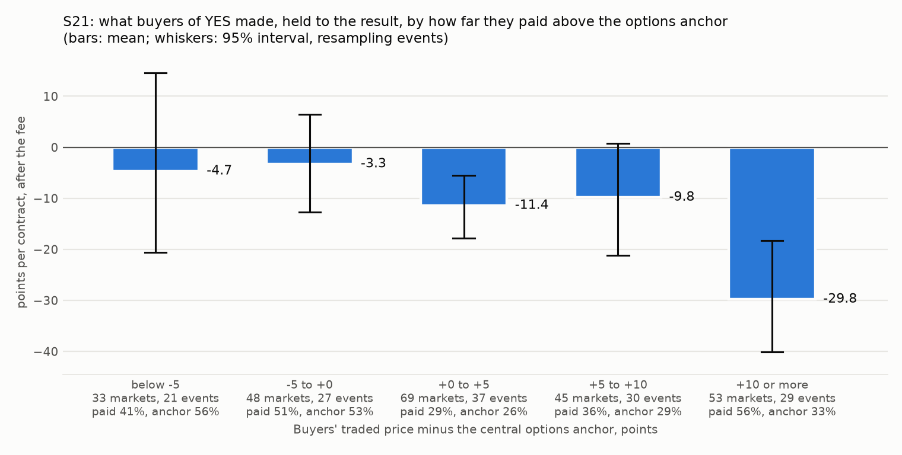
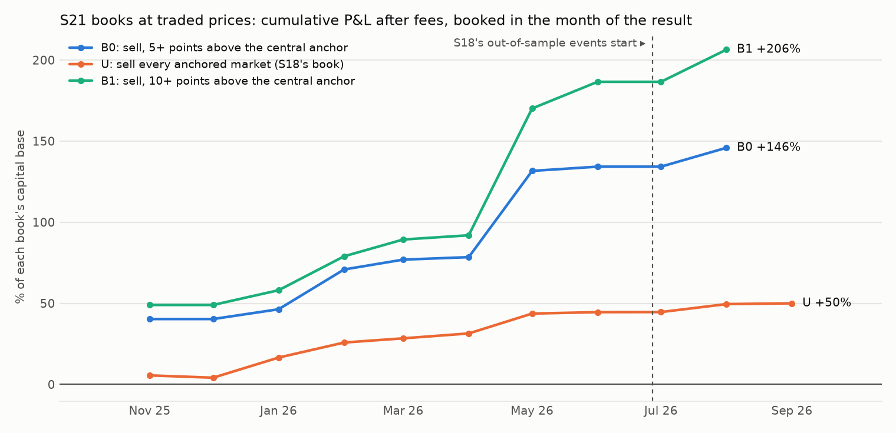
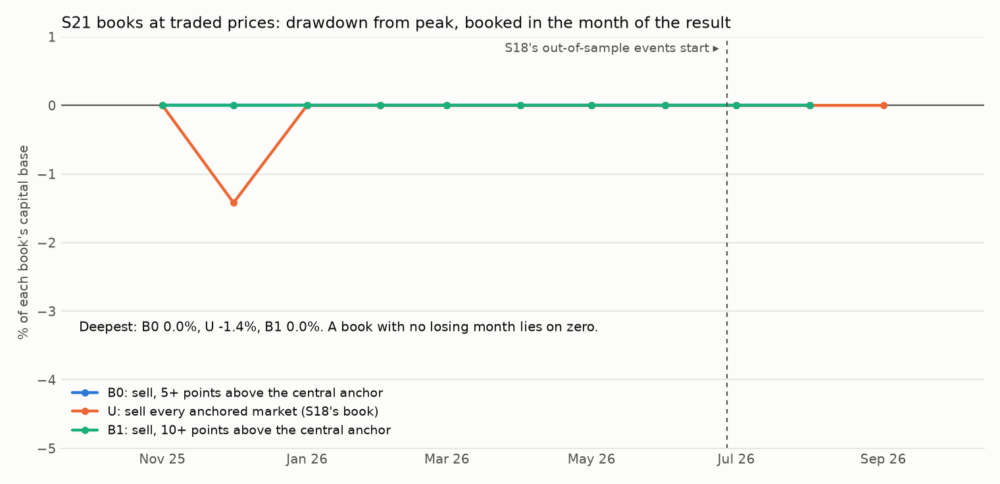

# S21: does the options chain tell which "will it hit" tickets are overpriced?

Method, pre-registered before any option quote was pulled: [`research/s21_options_anchor/METHOD.md`](../../s21_options_anchor/METHOD.md) (commit `df3cb4a`). Data: the 424 stock and S&P 500 price markets of S18's traded-price file, their first weekends from 2025-10-31 to 2026-09-25; real NBBO option quotes from Massive at 15:55 New York on the Friday before. Files: [`anchors.csv`](anchors.csv), [`t1_buckets.csv`](t1_buckets.csv), [`t1_slope.csv`](t1_slope.csv), [`t2_regression.csv`](t2_regression.csv), [`metrics.csv`](metrics.csv), [`improvement.csv`](improvement.csv), [`trades.csv`](trades.csv), [`checks.csv`](checks.csv), [`capacity.md`](capacity.md), [`RUN_LOG.md`](RUN_LOG.md).

## Answer

**In this sample the options anchor does sort the overpriced tickets from the fair ones, and by the rule fixed in advance it is still not a pass: almost none of the evidence is out-of-sample.** 387 of the 424 stock and S&P 500 markets got an anchor from two real option quotes taken at 15:55 on the Friday before the market's first weekend.

**The further above the anchor a buyer paid, the more the buyer lost.** Over 248 markets in 59 events, buyers of YES paid 41.7% on average against a central anchor of 37.4%; 29.4% resolved YES; they lost 12.56 points per contract [-16.31, -8.51]. Where they paid 10 points or more above the central anchor (53 markets, 29 events) they lost 29.76 points [-40.10, -18.29]. Where they paid below it (81 markets) the loss is not distinguishable from zero: -4.66 [-20.63, +14.57] at 5 or more points below, -3.26 [-12.70, +6.51] between 5 below and the anchor. Each extra point paid above the anchor cost 0.60 points of P&L (event-bootstrap interval of the slope [-1.085, -0.122], t = -2.44). The steps are not even: the buckets in between do not line up one by one; the two ends do.

**Selling only the tickets priced above the anchor beat selling all of them, in-sample.** B0 sells YES at the traded bid when it is 5 or more points above the central anchor and holds to the result: +22.27 points [+10.35, +33.14] on 60 markets in 33 events (+21.93 with the fee doubled); in-sample +21.09 points [+9.13, +31.58] on 58 markets in 31 events. S18's unfiltered book on the same anchored markets: +7.24 points [+2.93, +11.56] on 277 markets in 62 events. The anchored markets B0 leaves: +3.08 points [-1.54, +7.91] on 217 markets in 60 events. Taken minus left: **+19.19 points [+5.82, +31.45]**; in-sample +18.85 [+3.94, +32.11]. The tickets B0 sold were priced 40.9% on average, the anchor said 28.9%, and 18.3% resolved YES. As a book of up to 100 contracts per market B0 made +$1,098 on a capital base of $752 (monthly Sharpe 2.70, maximum drawdown 0.0%, worst month 0.0%, 10 months); the unfiltered book made +$1,839 on $3,678 (Sharpe 3.24, maximum drawdown 1.4%, worst month -1.4%). The filter takes 22% of the markets and keeps 60% of the unfiltered book's dollars.

**Not a pass. Lines not met: (2); (4).** Out-of-sample B0 holds 2 markets in 2 events (+56.44 points; both won; no interval can be drawn from two events) against the 30 the rule needs: too few. This was known before the pull: only 15 of the stock and S&P markets in S18's out-of-sample events have a taker sale at all. Lines (1) and (3) are met: in-sample +21.09 [+9.13, +31.58]; with the fee doubled +20.77 in-sample and +55.46 out-of-sample.

**What did not hold.** (a) The anchor does not carry the weight alone (T2). With the result regressed on both, the central anchor's coefficient is +0.492 [-0.116, +1.100] and the traded price's +0.417 [-0.209, +1.043]: the two move together and neither is distinguishable from zero next to the other. With the lower-bound anchor instead, both are: anchor +0.797 [+0.198, +1.396], price +0.449 [+0.055, +0.843]. Brier scores: traded price 0.1344, central anchor 0.1309, lower-bound anchor 0.1389; the central anchor is better by +0.0035 [-0.0111, +0.0175], an interval that includes zero. So each price knows something the other does not; the options do not simply replace the crowd. (b) B2, buying tickets priced 5 or more points below the lower-bound anchor, found 2 markets (-10.01 points): the crowd almost never prices a ticket below the options' floor. (c) Out-of-sample nothing can be said: 2 markets.

**The bug hunt.** A Sharpe above 3 appears in: B1 in-sample 3.00 (27 markets), B2 out-of-sample -3.78 (2 markets), B2 whole sample -3.78 (2 markets), U in-sample 3.69 (263 markets), U whole sample 3.24 (277 markets), U-all in-sample 3.38 (288 markets), U-all whole sample 3.03 (303 markets). The largest is S18's own unfiltered book on these markets, which does not use the anchor. The cause found is the sample, not the code: ten or eleven monthly numbers with one losing month (1 losing months of 11; capital base $3,678); B0 has no losing month at all in 10, on a capital base of $752. A Sharpe from so few months is known only to about plus or minus 2.5, and this is a book that sells insurance in months when the insured move did not come. Every anchor was recomputed by hand from the cached quotes (0 mismatches); every book mean and the book dollars were recomputed from S18's file; every leg quote is at most 305 seconds older than the anchor instant; the instant is 4.1 hours or more before the first traded price. Checks added after the result (not pre-registered, in [`checks.csv`](checks.csv)): with the anchors shuffled across markets the taken-minus-left difference is +4.00 [-3.49, +11.45] and none of 5,000 shuffles reach the observed +19.19, so it is the anchor and not only the price level; inside each of S18's five price buckets the taken markets earned more than the left ones. One check weakens it: on the 128 markets whose anchor needed no option leg moved to a further strike, B0 earned +21.27 [+1.13, +36.57] and the markets it leaves +12.99 [+7.86, +17.80]: a smaller gap.


## How many markets

- In S18's file: 424 stock and S&P markets. Parsed (ticker, level, direction, window end): 424; dropped in parsing: 0.
- Anchored with two real leg quotes: **387** in 74 events (358 in-sample, 29 out-of-sample). With a first-weekend taker purchase: 248; with a taker sale: 277.
- Not anchored: 24: no quote at or before the instant on the bracketing strikes; 9: no usable pair of leg quotes (stale, or no offer); 4: no listed strikes bracket the level.
- Of the anchors, 15 used a leg with a zero bid, 214 moved a leg outward, 7 had a mid outside 0 to 1 before clamping. Expiry tried first / second / third: 337 / 41 / 9; the expiry is a median of 0 days after the window's last session (at most 17). The band from bid and ask is a median of 6.0 points wide on the finish-beyond probability (twice that on the central anchor).

| Ticker | Markets | Anchored |
|---|---|---|
| NVDA | 79 | 79 |
| TSLA | 59 | 59 |
| SPY | 41 | 34 |
| GOOGL | 39 | 38 |
| AMZN | 30 | 29 |
| SPX | 30 | 26 |
| META | 28 | 28 |
| NFLX | 26 | 8 |
| AAPL | 24 | 24 |
| MSFT | 22 | 21 |
| PLTR | 20 | 17 |
| OPEN | 16 | 15 |
| HOOD | 7 | 7 |
| RKLB | 3 | 2 |

## T1: dose and response (buyers' P&L by gap against the central anchor)

| Gap (buyers' price minus central anchor), points | Markets | Events | Mean gap | Mean price paid, % | Mean central anchor, % | Resolved YES, % | Buyers' P&L, points | 95% interval |
|---|---|---|---|---|---|---|---|---|
| below -5 | 33 | 21 | -15.7 | 40.7 | 56.4 | 36.4 | -4.66 | [-20.63, +14.57] |
| -5 to +0 | 48 | 27 | -2.0 | 51.0 | 53.0 | 47.9 | -3.26 | [-12.70, +6.51] |
| +0 to +5 | 69 | 37 | +2.4 | 28.6 | 26.1 | 17.4 | -11.40 | [-17.81, -5.50] |
| +5 to +10 | 45 | 30 | +7.1 | 36.2 | 29.0 | 26.7 | -9.80 | [-21.15, +0.82] |
| +10 or more | 53 | 29 | +22.8 | 55.8 | 33.0 | 26.4 | -29.76 | [-40.10, -18.29] |
| every gap | 248 | 59 | +4.4 | 41.7 | 37.4 | 29.4 | -12.56 | [-16.31, -8.51] |

Slope of buyers' P&L on the gap: **-0.605 points of P&L per point of gap** (clustered error 0.248, t = -2.44; event-bootstrap interval [-1.085, -0.122]; 248 markets, 59 events). The thesis predicts a negative slope.



Secondary, against the lower-bound anchor (slope -0.470, t = -3.06, interval [-0.777, -0.174]):

| Gap (buyers' price minus lower-bound anchor), points | Markets | Events | Mean price paid, % | Mean lower-bound anchor, % | Resolved YES, % | Buyers' P&L, points | 95% interval |
|---|---|---|---|---|---|---|---|
| below -5 | 2 | 2 | 9.7 | 21.0 | 0.0 | -10.01 | n/a |
| -5 to +0 | 1 | 1 | 27.9 | 32.6 | 0.0 | -27.85 | n/a |
| +0 to +5 | 46 | 24 | 10.2 | 7.4 | 8.7 | -1.58 | [-8.00, +7.78] |
| +5 to +10 | 36 | 26 | 19.7 | 12.3 | 16.7 | -3.23 | [-12.20, +6.41] |
| +10 or more | 163 | 52 | 56.0 | 25.2 | 38.7 | -17.66 | [-22.04, -13.05] |
| every gap | 248 | 59 | 41.7 | 20.0 | 29.4 | -12.56 | [-16.31, -8.51] |

## T2: which price knows more

342 anchored markets with a first-weekend print, 69 events. Mean traded price 35.7%, mean central anchor 33.8%, mean lower-bound anchor 18.0%, resolved YES 26.6%.

| Regression | Term | Coefficient | Clustered error | t | 95% interval |
|---|---|---|---|---|---|
| result on central anchor and traded price | intercept | -0.049 | 0.025 | -2.00 | [-0.098, -0.001] |
| result on central anchor and traded price | central anchor | +0.492 | 0.310 | +1.59 | [-0.116, +1.100] |
| result on central anchor and traded price | traded price | +0.417 | 0.319 | +1.31 | [-0.209, +1.043] |
| result on lower-bound anchor and traded price | intercept | -0.038 | 0.027 | -1.42 | [-0.090, +0.014] |
| result on lower-bound anchor and traded price | lower-bound anchor | +0.797 | 0.305 | +2.61 | [+0.198, +1.396] |
| result on lower-bound anchor and traded price | traded price | +0.449 | 0.201 | +2.23 | [+0.055, +0.843] |
| result on traded price alone | intercept | -0.054 | 0.024 | -2.27 | [-0.100, -0.007] |
| result on traded price alone | traded price | +0.894 | 0.055 | +16.30 | [+0.787, +1.002] |
| result on central anchor alone | intercept | -0.028 | 0.020 | -1.44 | [-0.066, +0.010] |
| result on central anchor alone | central anchor | +0.871 | 0.058 | +14.98 | [+0.757, +0.985] |
| result on lower-bound anchor alone | intercept | +0.004 | 0.019 | +0.22 | [-0.033, +0.042] |
| result on lower-bound anchor alone | lower-bound anchor | +1.458 | 0.084 | +17.33 | [+1.293, +1.623] |

| Forecast | Brier score (lower is better) |
|---|---|
| traded price | 0.1344 |
| central anchor (twice the finish-beyond probability) | 0.1309 |
| lower-bound anchor (the finish-beyond probability) | 0.1389 |

Brier difference, traded price minus central anchor (positive = the anchor is better): **+0.0035** [-0.0111, +0.0175]. Traded price minus lower-bound anchor: -0.0045 [-0.0229, +0.0141].

## T3: the PolyBridge rule as books

| Book | Segment | Fee | Markets | Events | P&L per contract, points | 95% interval | Mean traded price, % | Mean anchor, % | Resolved YES, % | Book P&L | Capital base | Sharpe (monthly) | Max DD | Worst month | Months |
|---|---|---|---|---|---|---|---|---|---|---|---|---|---|---|---|
| B0: sell, 5+ points above the central anchor | all | 1× | 60 | 33 | +22.27 | [+10.35, +33.14] | 40.9 | 28.9 | 18.3 | +$1,098 | $752 | 2.70 | 0.0% | 0.0% | 10 |
| B0: sell, 5+ points above the central anchor | in-sample | 1× | 58 | 31 | +21.09 | [+9.13, +31.58] | 40.4 | 28.5 | 19.0 | +$1,010 | $752 | 2.86 | 0.0% | 0.0% | 8 |
| B0: sell, 5+ points above the central anchor | out-of-sample | 1× | 2 | 2 | +56.44 | n/a | 57.4 | 41.7 | 0.0 | +$88 | $67 | n/a | 0.0% | 130.1% | 1 |
| B0: sell, 5+ points above the central anchor | all | 2× | 60 | 33 | +21.93 | [+9.99, +32.79] | 40.9 | 28.9 | 18.3 | +$1,083 | $752 | 2.70 | 0.0% | 0.0% | 10 |
| B0: sell, 5+ points above the central anchor | in-sample | 2× | 58 | 31 | +20.77 | [+8.77, +31.28] | 40.4 | 28.5 | 19.0 | +$997 | $752 | 2.87 | 0.0% | 0.0% | 8 |
| B0: sell, 5+ points above the central anchor | out-of-sample | 2× | 2 | 2 | +55.46 | n/a | 57.4 | 41.7 | 0.0 | +$86 | $67 | n/a | 0.0% | 127.9% | 1 |
| B1: sell, 10+ points above the central anchor | all | 1× | 29 | 19 | +35.10 | [+20.86, +46.31] | 49.3 | 32.3 | 13.8 | +$912 | $442 | 2.88 | 0.0% | 0.0% | 10 |
| B1: sell, 10+ points above the central anchor | in-sample | 1× | 27 | 17 | +33.52 | [+17.14, +45.52] | 48.7 | 31.6 | 14.8 | +$824 | $442 | 3.00 | 0.0% | 0.0% | 8 |
| B1: sell, 10+ points above the central anchor | out-of-sample | 1× | 2 | 2 | +56.44 | n/a | 57.4 | 41.7 | 0.0 | +$88 | $67 | n/a | 0.0% | 130.1% | 1 |
| B1: sell, 10+ points above the central anchor | all | 2× | 29 | 19 | +34.72 | [+20.64, +45.82] | 49.3 | 32.3 | 13.8 | +$903 | $442 | 2.89 | 0.0% | 0.0% | 10 |
| B1: sell, 10+ points above the central anchor | in-sample | 2× | 27 | 17 | +33.19 | [+16.97, +44.96] | 48.7 | 31.6 | 14.8 | +$816 | $442 | 3.01 | 0.0% | 0.0% | 8 |
| B1: sell, 10+ points above the central anchor | out-of-sample | 2× | 2 | 2 | +55.46 | n/a | 57.4 | 41.7 | 0.0 | +$86 | $67 | n/a | 0.0% | 127.9% | 1 |
| B2: buy, 5+ points below the lower-bound anchor | all | 1× | 2 | 2 | -10.01 | n/a | 9.7 | 21.0 | 0.0 | -$5 | $3 | -3.78 | 172.4% | -103.5% | 3 |
| B2: buy, 5+ points below the lower-bound anchor | in-sample | 1× | 0 | 0 | n/a | n/a | n/a | n/a | n/a | +$0 | $0 | n/a | n/a | n/a | 0 |
| B2: buy, 5+ points below the lower-bound anchor | out-of-sample | 1× | 2 | 2 | -10.01 | n/a | 9.7 | 21.0 | 0.0 | -$5 | $3 | -3.78 | 172.4% | -103.5% | 3 |
| B2: buy, 5+ points below the lower-bound anchor | all | 2× | 2 | 2 | -10.36 | n/a | 9.7 | 21.0 | 0.0 | -$5 | $3 | -3.78 | 178.4% | -107.0% | 3 |
| B2: buy, 5+ points below the lower-bound anchor | in-sample | 2× | 0 | 0 | n/a | n/a | n/a | n/a | n/a | +$0 | $0 | n/a | n/a | n/a | 0 |
| B2: buy, 5+ points below the lower-bound anchor | out-of-sample | 2× | 2 | 2 | -10.36 | n/a | 9.7 | 21.0 | 0.0 | -$5 | $3 | -3.78 | 178.4% | -107.0% | 3 |
| R1: B0 without zero-bid anchors | all | 1× | 56 | 31 | +23.40 | [+10.73, +34.42] | 43.4 | 31.0 | 19.6 | +$1,080 | $752 | 2.68 | 0.0% | 0.0% | 10 |
| R1: B0 without zero-bid anchors | in-sample | 1× | 54 | 29 | +22.18 | [+8.76, +33.40] | 42.9 | 30.6 | 20.4 | +$993 | $752 | 2.83 | 0.0% | 0.0% | 8 |
| R1: B0 without zero-bid anchors | out-of-sample | 1× | 2 | 2 | +56.44 | n/a | 57.4 | 41.7 | 0.0 | +$88 | $67 | n/a | 0.0% | 130.1% | 1 |
| R1: B0 without zero-bid anchors | all | 2× | 56 | 31 | +23.05 | [+10.38, +34.05] | 43.4 | 31.0 | 19.6 | +$1,066 | $752 | 2.68 | 0.0% | 0.0% | 10 |
| R1: B0 without zero-bid anchors | in-sample | 2× | 54 | 29 | +21.85 | [+8.39, +33.05] | 42.9 | 30.6 | 20.4 | +$980 | $752 | 2.83 | 0.0% | 0.0% | 8 |
| R1: B0 without zero-bid anchors | out-of-sample | 2× | 2 | 2 | +55.46 | n/a | 57.4 | 41.7 | 0.0 | +$86 | $67 | n/a | 0.0% | 127.9% | 1 |
| U: sell every anchored market (S18's book) | all | 1× | 277 | 62 | +7.24 | [+2.93, +11.56] | 33.4 | 33.2 | 26.0 | +$1,839 | $3,678 | 3.24 | 1.4% | -1.4% | 11 |
| U: sell every anchored market (S18's book) | in-sample | 1× | 263 | 57 | +6.40 | [+1.89, +10.71] | 34.0 | 33.7 | 27.4 | +$1,639 | $3,678 | 3.69 | 1.4% | -1.4% | 8 |
| U: sell every anchored market (S18's book) | out-of-sample | 1× | 14 | 5 | +23.00 | [+17.68, +29.13] | 23.6 | 23.7 | 0.0 | +$200 | $716 | 2.34 | 0.0% | 0.3% | 3 |
| U: sell every anchored market (S18's book) | all | 2× | 277 | 62 | +7.03 | [+2.69, +11.35] | 33.4 | 33.2 | 26.0 | +$1,800 | $3,678 | 3.24 | 1.4% | -1.4% | 11 |
| U: sell every anchored market (S18's book) | in-sample | 2× | 263 | 57 | +6.21 | [+1.65, +10.53] | 34.0 | 33.7 | 27.4 | +$1,605 | $3,678 | 3.69 | 1.4% | -1.4% | 8 |
| U: sell every anchored market (S18's book) | out-of-sample | 2× | 14 | 5 | +22.40 | [+17.20, +28.40] | 23.6 | 23.7 | 0.0 | +$195 | $716 | 2.34 | 0.0% | 0.3% | 3 |
| the anchored markets B0 leaves | all | 1× | 217 | 60 | +3.08 | [-1.54, +7.91] | 31.4 | 34.3 | 28.1 | +$741 | $2,926 | 1.74 | 5.2% | -3.4% | 11 |
| the anchored markets B0 leaves | in-sample | 1× | 205 | 55 | +2.24 | [-2.67, +7.30] | 32.1 | 35.1 | 29.8 | +$629 | $2,926 | 1.74 | 5.2% | -3.4% | 8 |
| the anchored markets B0 leaves | out-of-sample | 1× | 12 | 5 | +17.42 | [+10.72, +27.28] | 18.0 | 20.7 | 0.0 | +$113 | $649 | 2.67 | 0.0% | 0.3% | 3 |
| the anchored markets B0 leaves | all | 2× | 217 | 60 | +2.91 | [-1.75, +7.72] | 31.4 | 34.3 | 28.1 | +$717 | $2,926 | 1.68 | 5.2% | -3.4% | 11 |
| the anchored markets B0 leaves | in-sample | 2× | 205 | 55 | +2.09 | [-2.82, +7.15] | 32.1 | 35.1 | 29.8 | +$608 | $2,926 | 1.68 | 5.2% | -3.4% | 8 |
| the anchored markets B0 leaves | out-of-sample | 2× | 12 | 5 | +16.89 | [+10.35, +26.52] | 18.0 | 20.7 | 0.0 | +$109 | $649 | 2.67 | 0.0% | 0.3% | 3 |
| U-all: sell every stock and S&P market (S18's book) | all | 1× | 303 | 65 | +6.40 | [+2.69, +10.17] | 31.7 | n/a | 25.1 | +$1,790 | $4,304 | 3.03 | 1.2% | -1.2% | 11 |
| U-all: sell every stock and S&P market (S18's book) | in-sample | 1× | 288 | 60 | +5.61 | [+1.47, +9.45] | 32.2 | n/a | 26.4 | +$1,588 | $4,304 | 3.38 | 1.2% | -1.2% | 8 |
| U-all: sell every stock and S&P market (S18's book) | out-of-sample | 1× | 15 | 5 | +21.58 | [+15.69, +29.13] | 22.1 | n/a | 0.0 | +$202 | $814 | 2.33 | 0.0% | 0.2% | 3 |
| U-all: sell every stock and S&P market (S18's book) | all | 2× | 303 | 65 | +6.20 | [+2.47, +9.97] | 31.7 | n/a | 25.1 | +$1,750 | $4,304 | 3.02 | 1.2% | -1.2% | 11 |
| U-all: sell every stock and S&P market (S18's book) | in-sample | 2× | 288 | 60 | +5.43 | [+1.23, +9.31] | 32.2 | n/a | 26.4 | +$1,553 | $4,304 | 3.38 | 1.2% | -1.2% | 8 |
| U-all: sell every stock and S&P market (S18's book) | out-of-sample | 2× | 15 | 5 | +21.01 | [+15.28, +28.40] | 22.1 | n/a | 0.0 | +$197 | $814 | 2.33 | 0.0% | 0.2% | 3 |

Books by S18's own function: up to 100 contracts per market, never more than the printed size; P&L booked in the month of the result; the capital base is the largest capital locked at one time; Sharpe on monthly P&L. P&L per contract weighs each market once. Many of these markets charge no fee, so the 2× rows differ little.

### Does the anchor improve S18's unfiltered book?

| Segment | Markets B0 takes | Their P&L, points | Anchored markets B0 leaves | Their P&L, points | Difference | 95% interval |
|---|---|---|---|---|---|---|
| all | 60 | +22.27 | 217 | +3.08 | +19.19 | [+5.82, +31.45] |
| in-sample | 58 | +21.09 | 205 | +2.24 | +18.85 | [+3.94, +32.11] |
| out-of-sample | 2 | +56.44 | 12 | +17.42 | +39.01 | [+32.69, +45.19] |

The out-of-sample row rests on 2 taken markets; its interval is a resampling artefact of so few and says nothing.

### The pass rule (fixed before the pull)

| Needed | Result | Evidence |
|---|---|---|
| (1) in-sample mean P&L above zero, interval excluding zero | met | +21.09 points [+9.13, +31.58] on 58 markets in 31 events |
| (2) out-of-sample mean P&L above zero, interval excluding zero | **not met** | +56.44 points n/a on 2 markets in 2 events (under 5 events: no interval can be drawn) |
| (3) above zero with the fee doubled, in-sample and out-of-sample | met | in-sample +20.77, out-of-sample +55.46 |
| (4) at least 30 out-of-sample markets in the book | **not met** | 2 markets: too few |

**Verdict: not a pass.** Lines not met: (2); (4).





Each point is a calendar month, as a percentage of that book's own capital base (the largest capital locked at one time). B2 took two markets and is not drawn. In the table, rows with one or three months (the out-of-sample rows, B2) are there for completeness: a "worst month" above zero means no month lost, and a Sharpe on three months means nothing.

## Bug hunt and checks added after the result (not pre-registered; METHOD.md amendment 2)

Books showed a Sharpe above 3, so the result was hunted for a bug before it was written up. None of these checks is one of the three tests, none changed a rule, and all of them were run once and are all listed.

| Check | What | Value | Interval or range | n | Note |
|---|---|---|---|---|---|
| no look-ahead | seconds from the anchor instant to the start of the traded-price window, minimum | +14700.000 |  | 387 |  |
| no look-ahead | oldest leg quote, seconds before the anchor instant | +305.072 |  | 387 |  |
| no look-ahead | youngest leg quote, seconds before the anchor instant | +0.001 |  | 387 |  |
| placebo: anchors shuffled across markets | taken minus left, observed | +19.188 |  | 277 |  |
| placebo: anchors shuffled across markets | taken minus left, placebo mean and 95% range | +3.997 | [-3.49, +11.45] | 5,000 | mean markets taken 122 |
| placebo: anchors shuffled across markets | share of placebo draws at or above the observed difference | +0.000 |  | 5,000 |  |
| regression with the price level held fixed | sellers' P&L on traded price (points) and gap: intercept | +3.991 | [-0.69, +8.67] | 277 | t = +1.67 |
| regression with the price level held fixed | sellers' P&L on traded price (points) and gap: traded price | +0.091 | [-0.02, +0.20] | 277 | t = +1.66 |
| regression with the price level held fixed | sellers' P&L on traded price (points) and gap: gap | +0.747 | [-0.10, +1.59] | 277 | t = +1.74 |
| regression with the price level held fixed | buyers' P&L on traded price (points) and gap: intercept | -6.806 | [-13.09, -0.52] | 248 | t = -2.12 |
| regression with the price level held fixed | buyers' P&L on traded price (points) and gap: traded price | -0.078 | [-0.20, +0.04] | 248 | t = -1.26 |
| regression with the price level held fixed | buyers' P&L on traded price (points) and gap: gap | -0.569 | [-1.05, -0.08] | 248 | t = -2.30 |
| within S18's traded-price buckets | sold at 0 to 10%: taken by B0 | +7.158 |  | 8 | resolved YES 0%, mean anchor 1% |
| within S18's traded-price buckets | sold at 0 to 10%: left by B0 | +4.452 |  | 80 | resolved YES 0%, mean anchor 4% |
| within S18's traded-price buckets | sold at 10 to 25%: taken by B0 | +17.599 |  | 11 | resolved YES 0%, mean anchor 8% |
| within S18's traded-price buckets | sold at 10 to 25%: left by B0 | -2.139 |  | 39 | resolved YES 18%, mean anchor 18% |
| within S18's traded-price buckets | sold at 25 to 50%: taken by B0 | +16.618 |  | 20 | resolved YES 20%, mean anchor 25% |
| within S18's traded-price buckets | sold at 25 to 50%: left by B0 | +8.664 |  | 45 | resolved YES 29%, mean anchor 43% |
| within S18's traded-price buckets | sold at 50 to 75%: taken by B0 | +45.137 |  | 13 | resolved YES 15%, mean anchor 45% |
| within S18's traded-price buckets | sold at 50 to 75%: left by B0 | +1.994 |  | 26 | resolved YES 62%, mean anchor 70% |
| within S18's traded-price buckets | sold at 75 to 100%: taken by B0 | +20.779 |  | 8 | resolved YES 62%, mean anchor 70% |
| within S18's traded-price buckets | sold at 75 to 100%: left by B0 | -1.695 |  | 27 | resolved YES 93%, mean anchor 96% |
| subsets of the primary | B0 on anchors with no leg moved outward | +21.271 | [+1.13, +36.57] | 30 | 17 events |
| subsets of the primary | the markets it leaves, same anchors | +12.987 | [+7.86, +17.80] | 98 | 49 events |
| subsets of the primary | sell only when the traded bid is 5+ points above the TOP of the anchor's band | +28.522 | [+14.08, +40.52] | 25 | 16 events |
| subsets of the primary | B0, printed size of 100 contracts or more | +30.227 | [+11.16, +44.06] | 29 | 21 events |
| subsets of the primary | B0, printed size under 100 contracts | +14.827 | [+2.73, +26.83] | 31 | 25 events |
| subsets of the primary | B0, stock markets | +19.170 | [+8.80, +29.37] | 45 | 27 events |
| subsets of the primary | B0, S&P 500 markets | +31.570 | [-10.59, +51.12] | 15 | 6 events |
| subsets of the primary | B0 weighted by contracts in the book (up to 100 per market) | +29.083 |  | 3,774 |  |
| subsets of the primary | B0 worst single market, points | -64.926 |  | 60 |  |
| subsets of the primary | B0 share of markets that made money | +0.817 |  | 60 |  |
| resampling Fridays instead of events | B0 mean P&L per contract | +22.270 | [+11.11, +32.04] | 13 | Fridays |
| resampling Fridays instead of events | taken minus left | +19.188 | [+4.74, +29.24] | 17 | Fridays |
| resampling Fridays instead of events | T1 slope of buyers' P&L on the gap | -0.605 | [-1.03, -0.08] | 17 | Fridays |
| Sharpe on monthly P&L | B0: annualised Sharpe and a rough 95% range (plus or minus two standard errors) | +2.705 | [+0.20, +5.21] | 10 | 0 losing months of 10; capital base $752 |
| Sharpe on monthly P&L | B1: annualised Sharpe and a rough 95% range (plus or minus two standard errors) | +2.879 | [+0.34, +5.42] | 10 | 0 losing months of 10; capital base $442 |
| Sharpe on monthly P&L | B2: annualised Sharpe and a rough 95% range (plus or minus two standard errors) | -3.779 | [-8.83, +1.27] | 3 | 2 losing months of 3; capital base $3 |
| Sharpe on monthly P&L | R1: annualised Sharpe and a rough 95% range (plus or minus two standard errors) | +2.676 | [+0.18, +5.17] | 10 | 0 losing months of 10; capital base $752 |
| Sharpe on monthly P&L | U: annualised Sharpe and a rough 95% range (plus or minus two standard errors) | +3.236 | [+0.73, +5.74] | 11 | 1 losing months of 11; capital base $3,678 |
| Sharpe on monthly P&L | U-all: annualised Sharpe and a rough 95% range (plus or minus two standard errors) | +3.026 | [+0.57, +5.48] | 11 | 1 losing months of 11; capital base $4,304 |
| Sharpe on monthly P&L | U-left: annualised Sharpe and a rough 95% range (plus or minus two standard errors) | +1.740 | [-0.48, +3.96] | 11 | 2 losing months of 11; capital base $2,926 |

## Costs

- The Polymarket price is the print (S18's size-weighted traded price of one taker side over the first weekend), so no spread is assumed. The fee is the market's own taker fee, 0.04 × P × (1 − P) where the market charges one; nothing is paid at the result. At 2× the fee is doubled.
- The option side is a yardstick. Nothing is traded there, so no option cost enters.

## Capacity

See [`capacity.md`](capacity.md).

## Caveats

- **We were not blind to the results**, only to the anchor: S18's file already held every market's result and traded prices.
- **The anchor itself ran above the results this year.** On the anchored markets with a taker sale the central anchor averaged 33.2% and the sellers' traded price 33.4%, while 26.0% resolved YES. So part of what a seller earned is the premium any seller of listed options earns when moves come in smaller than the options implied, plus the reflection rule's upward lean. Only the part above the anchor is special to Polymarket, and that is what T1 and B0 measure.
- **The central anchor is an approximation.** Twice the finish-beyond probability is the reflection rule for a touch; it ignores drift, and the expiry is at or after the question's end, which makes the anchor a little high. Stock and SPY options are American and are read as if European.
- **The anchor is taken at 15:55 on Friday; the tickets traded from Friday 20:00 to Sunday 20:00.** News in between moves the ticket and not the anchor.
- **The traded price is an average over a weekend of prints**, not one fill; a seller could not have chosen only the best of them.
- **One year, 18 Fridays.** Markets on the same Friday share the same market weather; resampling events does not cure that.
- **A zero bid was accepted on a leg** (15 anchors), a stated difference from the existing code; R1 reruns the primary without them.
- **The loss on one contract can be several times the gain.** B0's worst market lost 64.9 points; 82% of its markets made money. It is selling insurance against large moves.
- **Small prints count as much as large ones** in the per-contract means (each market once). Weighted by the contracts the book holds B0 earned +29.08 points per contract.
- **A Sharpe above 3 appears in: B1 in-sample 3.00 (27 markets), B2 out-of-sample -3.78 (2 markets), B2 whole sample -3.78 (2 markets), U in-sample 3.69 (263 markets), U whole sample 3.24 (277 markets), U-all in-sample 3.38 (288 markets), U-all whole sample 3.03 (303 markets).** It comes from ten or eleven monthly numbers with one losing month; see the bug hunt above and RUN_LOG.md. Do not read it as the Sharpe of a strategy.

## Reproduce

```
cd research
python -m s21_options_anchor.pull      # Massive, 2 requests a second, resumable
python -m s21_options_anchor.run
python -m s21_options_anchor.checks     # the bug hunt, added after the result
python -m s21_options_anchor.report
python -m pytest s21_options_anchor/tests -q
```
