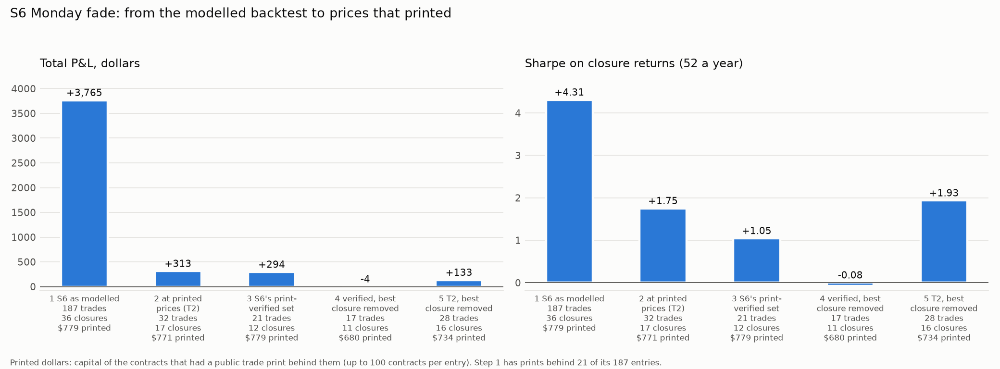
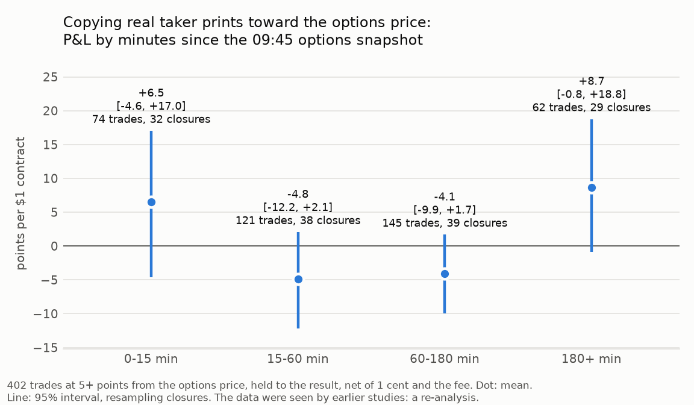
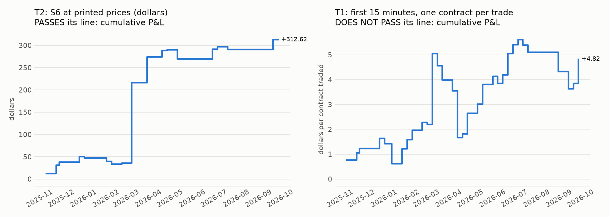
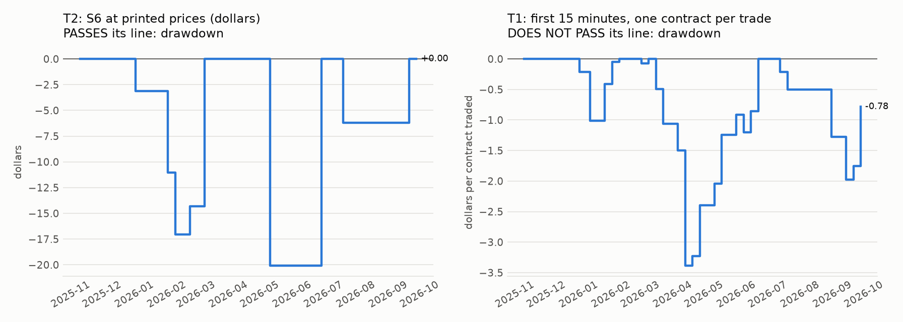

# S23: how much of the Monday fade exists at prices that really traded

**This is a pre-registered re-analysis, not a confirmation.** Both data sets were already seen by earlier studies: S6's 187 entries and its cached trade prints, and the partner's 402 reopening-day taker trades. The rules were fixed and committed before any P&L of this study was computed: [`METHOD.md`](../../s23_monday_fade_real/METHOD.md) (commit `7b9e3e4`); code and tests committed before the run (`9482b64`). No network call was made. A pass below is a **lead that needs replication on new data, not an edge**.

## Answer

**One book passes its pre-registered line, narrowly: S6 replayed at prices that printed (T2). Its Sharpe is 1.75, not 4.27.**

- **What survives.** 32 of S6's 187 entries could be traded at a price that really printed in the 30 minutes from 09:45 and was still 2 points beyond the options band after the fee. They sit on 17 closures (a closure is one weekend or holiday break: one independent bet). They made **+$9.77 per trade** (95% interval +$1.37 to +$20.29, resampling closures), +$312.62 in total, 75% winners, **Sharpe 1.75** on closure returns at 52 closures a year.
- **Without the best closure** (2026-03-09, four buys that all won: one bet): +$4.74 per trade (+$0.25 to +$10.77), 28 trades on 16 closures, +$132.80 in total, Sharpe 1.93. Still above zero, so the line is met.
- **What does not survive.** The modelled figure: +$20.14 per trade and a Sharpe of 4.31 at 52 closures a year (S6 published 4.27 at 51 a year, 4.18 in-sample, 7.70 out-of-sample). 122 of the 187 entries had no print at all on the side needed in those 30 minutes, and 33 had a print whose price was no longer 2 points beyond the band. The modelled book made +$3,765.41; at printed prices and sizes it is +$312.62.
- **The decay curve (T1, the primary test) fails.** Copying real taker prints in the first 15 minutes after 09:45 made +6.52 points per contract (-4.62 to +17.01; 74 trades, 32 closures): the interval includes zero, so H1 fails. The first 15 minutes beat the later trades by +8.47 points (-3.99 to +21.03): the interval includes zero, so H2 fails. The curve is not a decay: the last window (after 180 minutes) is as high as the first.

**Why the pass is only a lead.**

1. **No out-of-sample read.** 1 of the 32 trades is in the most recent 20% of closures (2026-08-03 onward).
2. **It leans on hindsight inside the 30 minutes.** T2 takes the best print of the window. Taking the *first* print that still clears the line (T2b) makes +$5.98 per trade (-$3.18 to +$15.73), Sharpe 1.25: above zero, not distinguishable from zero.
3. **The intervals only just clear zero**, on 17 closures. The plain t-statistic of the closure returns is 1.63 (looked at after the run).
4. **One closure carries 58% of the profit**; two carry 76%.
5. **It is tiny.** +$312.62 over eleven months, on $771 of capital behind real prints. The largest capital on one closure was $156.
6. **The options price is up to 30 minutes old** when the print happens. Part of the gap is the stock moving after 09:45, not Polymarket being wrong.

## T4: the number for the paper

| Book | Per trade | 95% interval | Trades | Independent closures | Total | Sharpe on closure returns | Capacity (printed capital) |
|---|---|---|---|---|---|---|---|
| **T2: S6 at printed prices (passes its line)** | **+$9.77** | +$1.37 to +$20.29 | 32 | 17 | +$312.62 | **1.75** | $771 ($1,823 before the 100-contract cap) |
| T2 without its best closure | +$4.74 | +$0.25 to +$10.77 | 28 | 16 | +$132.80 | 1.93 | $734 |
| T2b: first print, no hindsight (variant) | +$5.98 | -$3.18 to +$15.73 | 32 | 17 | +$191.46 | 1.25 | $680 |
| T1: first 15 minutes (fails its line) | +6.52 points per contract | -4.62 to +17.01 | 74 | 32 | n/a | n/a | $2,871 of prints copied |

The figure that can be defended: **a Sharpe of 1.75 at prices that printed, against 4.31 as modelled**, on 32 trades and 17 independent closures, with a capacity under $1,000 of capital a year. Without hindsight inside the window it is 1.25. It is a lead for a forward test, not a result.

## T3: the staircase



| Step | Trades | Closures traded | Per trade | 95% interval | Total P&L | Sharpe (52 a year) | Printed dollars behind it |
|---|---|---|---|---|---|---|---|
| 1. S6 as modelled | 187 | 36 | +$20.14 | +$14.89 to +$26.22 | +$3,765.41 | 4.31 | $779 |
| 2. S6 at printed prices (T2) | 32 | 17 | +$9.77 | +$1.37 to +$20.29 | +$312.62 | 1.75 | $771 |
| 3. S6's own print-verified set | 21 | 12 | +$14.02 | -$3.85 to +$38.71 | +$294.43 | 1.05 | $779 |
| 4. Verified set, best closure removed (2026-03-09) | 17 | 11 | -$0.22 | -$5.03 to +$7.25 | -$3.81 | -0.08 | $680 |
| 5. T2, best closure removed (2026-03-09) | 28 | 16 | +$4.74 | +$0.25 to +$10.77 | +$132.80 | 1.93 | $734 |

- Step 1 trades 100 contracts on every entry, but only 21 of its 187 entries have a print behind them: $779 of printed capital against $10,575 the model deployed.
- Step 3 is S6's own check: the modelled price, the printed size. Step 4 removes 2026-03-09 and the profit is gone (-$3.81).
- Steps 2 and 5 are this study's replay. It finds more trades than S6's check (32 against 21) because it takes the price that printed, not the modelled one, and looks 30 minutes forward instead of 10 minutes either side. 17 of its trades are entries S6 verified; 15 are new (+$141.08 of the total).
- Sharpe: P&L of each of the 45 reopening days (zero when idle) over the largest capital locked on one closure; mean over standard deviation, times the root of 52.

## T1: the decay curve at real prices (primary test)



The partner's 402 trades at 5 points or more from the options' 09:45 probability. Net of one cent and the market's fee, held to the result. Points per $1 contract.

| Minutes since 09:45 | Trades | Closures | Mean | 95% interval | Winners |
|---|---|---|---|---|---|
| 0-15 | 74 | 32 | +6.52 | -4.62 to +17.01 | 49% |
| 15-60 | 121 | 38 | -4.85 | -12.22 to +2.06 | 36% |
| 60-180 | 145 | 39 | -4.10 | -9.93 to +1.67 | 36% |
| 180+ | 62 | 29 | +8.70 | -0.84 to +18.75 | 42% |
| 15+ (all later trades) | 328 | 44 | -1.96 | -6.64 to +2.57 | 37% |

| Hypothesis | Result | Evidence |
|---|---|---|
| H1: first 15 minutes above zero, interval excluding zero | **fails** | +6.52 (-4.62 to +17.01) |
| H2: first 15 minutes above the later trades, interval excluding zero | **fails** | +8.47 (-3.99 to +21.03) |
| First 15 minutes minus 15-60 | reported | +11.36 (-2.07 to +25.00) |
| First 15 minutes minus 60-180 | reported | +10.62 (-2.22 to +23.32) |
| First 15 minutes minus 180+ | reported | -2.18 (-18.71 to +13.32) |
| Earlier 80% of closures above zero | yes | +7.50 (-3.94 to +18.19), 68 trades |
| Most recent 20% above zero, at least 30 trades | **no** | -4.65 on 6 trades, 4 closures (known before the run: 6 trades) |

**T1 verdict: fail.** Both hypotheses fail and the recent part has 6 trades. The sign is the hoped-for one in the first 15 minutes, but the last window is just as high, so the data do not show a trade that is there early and fades.

Variants (all reported, none of them the test). First-15-minute mean, points per contract:

| Variant | Trades | Closures | First window | 95% interval | Minus later trades | 95% interval |
|---|---|---|---|---|---|---|
| 2x costs | 74 | 32 | +5.25 | -5.87 to +15.75 | +8.48 | -3.96 to +21.06 |
| tau 0.03 | 111 | 37 | +5.04 | -3.80 to +13.63 | +6.32 | -3.98 to +16.87 |
| tau 0.10 | 36 | 19 | +4.51 | -17.14 to +24.96 | +4.05 | -18.22 to +25.68 |
| first 30 minutes | 139 | 38 | +1.13 | -6.90 to +9.22 | +2.34 | -7.77 to +12.41 |
| daily markets only | 60 | 24 | +7.29 | -5.69 to +19.05 | +10.52 | -3.81 to +24.29 |
| whole clock minutes (through 10:00:59) | 82 | 33 | +5.48 | -5.18 to +15.96 | +7.39 | -4.43 to +18.97 |

No variant has an interval that excludes zero. The brief counted the windows as 82 / 118 / 140 / 62; that is whole clock minutes. On exact seconds, fixed as the primary before any P&L was read, they are 74 / 121 / 145 / 62.

## T2: S6 replayed at prices that printed

Of 187 entries: 75 had any print in the 30 minutes from 09:45; 65 had a print on the side needed (a taker bought YES for our buys, sold YES for our sales); 33 of those were no longer 2 points beyond the options band one cent worse and after the fee; **32 trade**.

| Book | Costs | Trades | Closures | Per trade | 95% interval | Total | Winners | Points per contract | Sharpe | Printed capital |
|---|---|---|---|---|---|---|---|---|---|---|
| T2, all | 1x | 32 | 17 | +$9.77 | +$1.37 to +$20.29 | +$312.62 | 75% | +24.3 (+8.8 to +41.4) | 1.75 | $771 |
| T2, earlier 80% of closures | 1x | 31 | 16 | +$9.37 | +$0.68 to +$20.20 | +$290.33 | 74% | +24.4 (+8.4 to +42.3) | 1.83 | $694 |
| T2, most recent 20% | 1x | 1 | 1 | +$22.29 | n/a to n/a | +$22.29 | 100% | +22.3 (n/a to n/a) | n/a (one trade) | $77 |
| T2, best closure removed (2026-03-09) | 1x | 28 | 16 | +$4.74 | +$0.25 to +$10.77 | +$132.80 | 71% | +15.5 (+6.3 to +24.5) | 1.93 | $734 |
| T2 at 2x costs | 2x | 27 | 17 | +$10.24 | +$0.21 to +$21.85 | +$276.35 | 74% | +25.8 (+6.9 to +45.5) | 1.57 | $721 |
| T2 at 2x costs, best closure removed | 2x | 23 | 16 | +$4.35 | -$1.19 to +$11.56 | +$100.03 | 70% | +15.6 (+3.6 to +28.4) | 1.47 | $682 |
| T2b first print (no hindsight) | 1x | 32 | 17 | +$5.98 | -$3.18 to +$15.73 | +$191.46 | 75% | +21.1 (+5.6 to +37.0) | 1.25 | $680 |
| T2b, best closure removed | 1x | 28 | 16 | +$2.50 | -$5.08 to +$11.00 | +$70.04 | 71% | +13.4 (+2.6 to +23.6) | 0.68 | $655 |
| T2b at 2x costs | 2x | 27 | 17 | +$2.73 | -$5.68 to +$11.66 | +$73.82 | 74% | +22.4 (+3.2 to +41.2) | 0.68 | $615 |

A trade is at most the printed size and at most 100 contracts. "Points per contract" weights every trade equally whatever its size.

| Split | Trades | Closures | Per trade | 95% interval | Total |
|---|---|---|---|---|---|
| side: buy YES | 17 | 11 | +$15.45 | +$0.38 to +$29.65 | +$262.63 |
| side: sell YES | 15 | 9 | +$3.33 | -$9.00 to +$16.05 | +$49.99 |
| kind: daily | 23 | 12 | +$11.54 | -$0.24 to +$25.62 | +$265.50 |
| kind: monthly | 2 | 1 | +$9.42 | n/a to n/a | +$18.83 |
| kind: weekly | 7 | 4 | +$4.04 | n/a to n/a | +$28.29 |

By closure (T2):

| Reopening day | Trades | P&L | Capital locked |
|---|---|---|---|
| 2025-11-10 | 2 | +$12.36 | $5 |
| 2025-11-24 | 2 | +$18.83 | $86 |
| 2025-11-28 | 1 | +$6.74 | $93 |
| 2025-12-26 | 3 | +$12.32 | $74 |
| 2026-01-02 | 1 | -$3.13 | $3 |
| 2026-02-02 | 3 | -$7.92 | $156 |
| 2026-02-09 | 2 | -$5.99 | $104 |
| 2026-02-23 | 1 | +$2.74 | $6 |
| 2026-03-09 | 4 | +$179.82 | $37 |
| 2026-03-30 | 1 | +$58.03 | $41 |
| 2026-04-20 | 2 | +$14.28 | $16 |
| 2026-04-27 | 1 | +$1.44 | $10 |
| 2026-05-11 | 2 | -$20.08 | $30 |
| 2026-06-29 | 2 | +$21.98 | $18 |
| 2026-07-06 | 3 | +$5.13 | $10 |
| 2026-07-20 | 1 | -$6.22 | $6 |
| 2026-09-21 | 1 | +$22.29 | $77 |

12 closures up, 5 down.

| Pass line (T2) | Result | Evidence |
|---|---|---|
| Mean P&L per trade above zero | pass | +$9.77 |
| Interval excluding zero | pass | +$1.37 to +$20.29 |
| Above zero with the best closure removed | pass | +$4.74 (+$0.25 to +$10.77) |
| Fixed in advance: if T2b's mean is not above zero, the pass rests on hindsight | T2b is above zero | +$5.98 (-$3.18 to +$15.73): above zero, **interval includes zero** |

**T2 verdict: pass, narrowly. A lead needing replication, not an edge.**

## Equity curve and drawdown





T2 book: maximum drawdown 12.9% of the capital base ($156), worst month -12.9%, turnover 5.7x a year. The T1 panel is shown for completeness; that book fails its line.

## Costs

- **T2:** one cent worse than the print, plus Polymarket's fee 0.04 x P x (1 - P), charged on every trade (source: S6's schedule; some of these markets had the fee off, so this errs against the trade). On the 32 trades: 1.67 points per contract on average, 534 bp of the capital locked. At 2x costs (two cents, twice the fee): +$10.24 per trade (+$0.21 to +$21.85) on 27 trades.
- **T1:** the partner's costs: one cent and the market's own fee where it charges one (43% of the trades). At 2x: see the variant table.
- No spread is modelled anywhere in this study: every price is a print.

## Capacity

See [`capacity.md`](capacity.md). T2: $771 of capital behind real prints over the year, 1,577 contracts, median trade 36 contracts. This is a retail-size book.

## Every variant tried

T1: the primary; 2x costs; tau 0.03; tau 0.10; first 30 minutes; daily markets only; whole clock minutes. T2: the primary; T2b (first print); each at 2x costs. All are in [`metrics.csv`](metrics.csv) with their in-sample and out-of-sample rows. Nothing else was run before the section "Looked at after the run".

## Sharpe above 3: what was checked

Only step 1, S6 as modelled, is above 3 (4.31). S6's own write-up found the cause: prices that were not prices. No book of this study is above 3. The T2 book passed, so it was checked anyway:

| Check | Outcome |
|---|---|
| T2 replayed again from the raw print files by code that shares no function with the runner (`after.py`) | 32 trades, +$312.62: the same |
| Three trades read print by print (AMZN 2026-03-09, MSFT 2026-03-30, META 2026-02-09) | Price, side, time and size match the raw records |
| Duplicated print records | None: counting each record once gives 32 trades, +$312.62 |
| Print files cut off by the puller | No: the largest holds 919 prints against a page of 10,000; 180 files read, 0 missing |
| The result never enters a signal | Yes: the result enters only the P&L. The side and the options band are S6's, fixed at 09:45 |
| Times | New York time with daylight saving; tests pin a winter and a summer date |
| T1 input | The 1x recomputation reproduces the partner's `pnl_t1` to nine decimals; window counts match the brief under its clock-minute reading |
| Sharpe on closures, not trades | Yes: 45 reopening days, idle ones as zero |

## Looked at after the run (not pre-registered; changes no verdict)

- **An interval for the T2 Sharpe.** Resampling the 45 closures: 1.75 (0.60 to 3.09). Without the best closure: 1.93 (0.08 to 3.44). T2b: 1.25 (-0.86 to 3.05). The plain t-statistic of the T2 closure returns is 1.63, under the usual 1.96: the bootstrap and the t-test disagree about whether zero is excluded, because one large winning closure skews the returns. Treat the Sharpe as "about 1 to 2, not well measured".
- **How late the prints were.** 19 trades used a print within 15 minutes of 09:45 (+$187.48); 13 used one 15 to 30 minutes after (+$125.14). Median 11.7 minutes.
- **Size.** 12 trades hit the 100-contract cap; 14 are under 20 contracts. The largest single trade made +$85.52.
- **What the best closure looks like.** 2026-03-09, 4 buys (AMZN 0.36 at 09:45, bought at 0.21 17 minutes later; GOOGL 0.09 at 09:45, bought at 0.10 17 minutes later; TSLA 0.27 at 09:45, bought at 0.14 13 minutes later; NVDA 0.09 at 09:45, bought at 0.09 10 minutes later). Two of the four prices had fallen about 15 points since 09:45 while the options band stayed the 09:45 one. All 4 markets then resolved YES. That is a rebound in the stocks that day as much as a Polymarket error, and it is one bet.

## What didn't work

- **The decay curve (T1).** H1 and H2 both fail; the first 15 minutes are +6.52 points (-4.62 to +17.01) and the recent closures are -4.65 on 6 trades.
- **S6's own verified set without its best closure:** -$3.81 on 17 trades, Sharpe -0.08.
- **Selling YES at printed prices:** see the split table; the buys carry the T2 profit.
- **The no-hindsight replay at 2x costs:** +$2.73 per trade (-$5.68 to +$11.66).
- **Any out-of-sample check of T2:** 1 trade in the recent 20%.

## Forward test: rule fixed before the run, not run here

For the next reopening, **Monday 2026-10-05**: on Polymarket "close above $K" markets on stocks and SPY with a usable options band at 09:45 New York (no wider than 20 points, probability between 3% and 97%), copy the first taker print with 09:45:00 <= time < 10:00:00 whose YES-equivalent price is at least 5 points from the options' 09:45 probability, on the side toward the options. One trade per market, one contract, one cent worse than the print, the market's own fee, held to the result. One morning is one closure: it adds one observation and decides nothing by itself.

## Caveats

- Both data sets were seen before. Nothing here is out-of-sample.
- T2 assumes we could have taken the offer that a real taker lifted (or the bid a real taker hit), one cent worse, for at most the printed size.
- The print's `side` is read as the taker's side, as S6 and the partner's study read it. This could not be re-checked without the network.
- T1 uses the partner's committed trade file; its raw prints are not on this machine.
- Unhedged. A closure's trades win or lose together.
- Monthly markets lock capital for weeks; no financing charge.

## Reproduce

```
cd research
.venv/bin/python -m s23_monday_fade_real.run
.venv/bin/python -m s23_monday_fade_real.after
.venv/bin/python -m s23_monday_fade_real.report
.venv/bin/python -m pytest s23_monday_fade_real/tests -q
```
