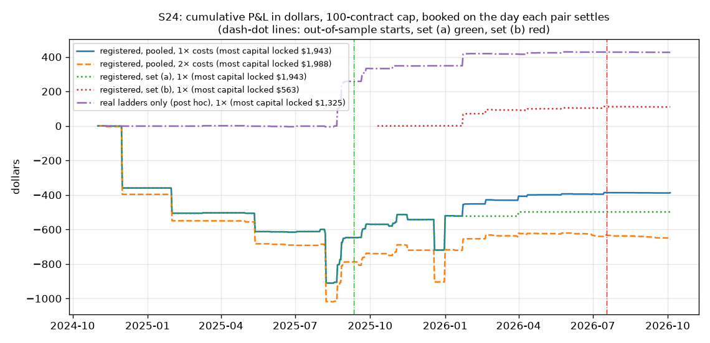
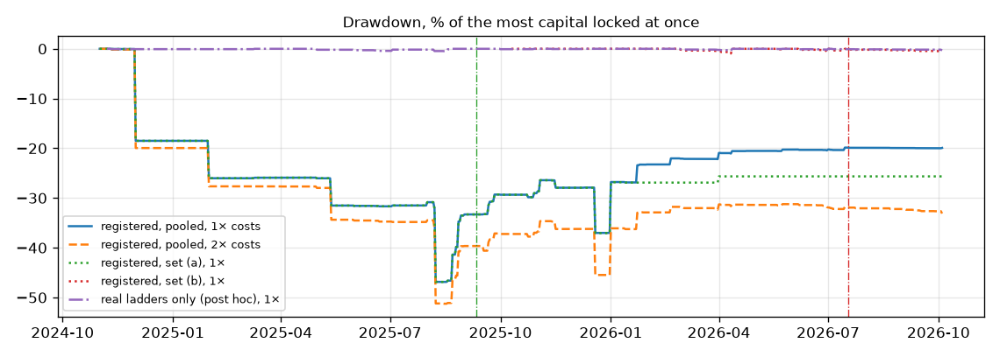

# S24: the ladder trade on fresh ladders

Method, pre-registered before any print of these markets was pulled: [`research/s24_ladder_fresh/METHOD.md`](../../s24_ladder_fresh/METHOD.md) (commit `c5e0b22`). The out-of-sample cut dates were committed before any P&L was computed (`e10f593`, [`oos_cut.json`](oos_cut.json)). Files: [`metrics.csv`](metrics.csv), [`trades.csv`](trades.csv), [`coverage.csv`](coverage.csv), [`capacity.md`](capacity.md), [`RUN_LOG.md`](RUN_LOG.md). This file is written by `report.py` from those files.

Two amendments. Amendment 1 (`61c05e0`, before any result or P&L, after a detection smoke test on part of the pull): the registered test stays; the partner study's corrected ladder rule is a secondary analysis. Amendment 2 (post hoc, after the results): a direction check. Order of events by commit time (New York): pre-registration `c5e0b22` 01:59:01; detection smoke test on part of the pull 02:04; the partner's finding known here 02:30; amendment 1 `61c05e0` 02:34:58; cut dates and pair verdicts `e10f593` 02:42:36; first P&L 02:42:40.

## Answer

**No. Under S11's own rules the ladder trade does not hold on fresh ladders.** It made −2.56 points per trade (95% interval over dates [−6.51, +1.27]) on 375 trades on 226 dates, and −4.78 [−8.76, −0.92] at doubled costs. In-sample −4.46 [−9.05, −0.18] on 305 trades. Out-of-sample +5.70 [−1.50, +13.31] on 70 trades on 46 dates. P&L at 100 contracts a leg: −$387. S11's +3.89 does not replicate under S11's rules.

**The reason is the ladder list, not the prints.** 86 of the 375 trades (23%) resolved with the ladder's order violated: the rung we sold resolved YES and the rung we bought resolved NO. A real ladder cannot do that. All 86 are on 11 pairs that S11's rules built wrong, in two ways:

- **The year of a rung** (8 date pairs, 61 trades). "Will Russia capture Pokrovsk by December 31?" was read as the year before, so it was placed ahead of "... by March 31?" and sold against it. The partner's study found this fault shortly before these results.
- **The direction of a level** (3 strike pairs, 25 trades). "Will Bitcoin reach $65,000 in November?" was a level below the price: its description says YES needs a low of $65,000 or lower. S11 reads "reach" as up. This fault is new.

On those pairs the trade sold the more likely rung. The "gap" it saw was the correct price order, and the pair can lose $1.

**On pairs that are real ladders the trade was positive in-sample, out-of-sample and at doubled costs. It is short of the 30 out-of-sample trades, it is not the registered test, and its profit is a few $1 payouts.** With the partner's year check and nesting rule (adopted at 02:35, before any result here was read) and without the markets the partner had used: +7.12 points per trade [+3.07, +11.11] on 193 trades on 107 dates; in-sample +5.87 [+1.71, +9.88]; out-of-sample +14.47 [+0.56, +30.72] on 28 trades on 19 dates; +4.80 [+0.70, +8.84] at 2×. 3 of its trades still resolved with the order violated (the direction fault).
With the direction check added after seeing those losers (post hoc): +8.14 [+3.74, +12.17] on 160 trades on 89 dates; in-sample +6.74 [+2.10, +10.80]; out-of-sample +15.03 [+0.60, +31.62] on 27 trades on 19 dates; +5.78 [+1.36, +9.97] at 2×; 0 trades with the order violated.

**What that profit is made of.** In the cleaned sample the edge locked in at entry is +0.64 points per trade at 1× and −1.72 at 2×. 12 of the 160 trades were paid $1 because the result fell between the two rungs; they carry the mean. The median trade made −0.84 points and 61% of trades lost a little. Money: $425 at 100 contracts a leg ($300 at 2×), $3,570 at the full printed size, on $1,325 of capital at the most.

**Set (b) on its own** (S11's year, rungs under S11's volume floor, registered rule): no trade resolved with the order violated. +4.36 [+1.48, +8.13] on 95 trades on 67 dates; in-sample +5.31 [+1.39, +9.95]; out-of-sample +1.00 [−0.58, +3.22] on 21 trades on 14 dates; +1.55 [−1.34, +5.38] at 2×. $111 at the cap. Positive, small, and not a pass by itself.

The registered numbers, line by line:

- **What was tested (registered).** 662 fresh ladders (1,680 pairs of neighbouring rungs) that S11 never used: 214 listed before S11's year (set a) and 448 inside S11's year but below its volume floor (set b). A trade needs two public prints within 10 minutes: a taker selling YES on the rich rung above a taker buying YES on the cheap rung, by more than both fees. No mid price is used.
- **Trades.** 375 trades on 226 dates, in 161 pairs and 96 events.
- **Profit per trade, 1× costs.** −2.56 points [−6.51, +1.27]. In-sample −4.46 [−9.05, −0.18] on 305 trades. Out-of-sample +5.70 [−1.50, +13.31] on 70 trades and 46 dates.
- **At 2× costs** (fees doubled, two cents worse on each price, the same trades): −4.78 points [−8.76, −0.92].
- **Money.** −$387 in all at 100 contracts a leg at most (−$658 at 2×). $1,843 at the full printed size, an upper bound. The most capital locked at once was $1,943; a pair stays locked 15 days at the median (36 on average).
- **Sharpe −0.47**, maximum drawdown 46.9%, worst month −18.46% (daily P&L over 703 calendar days, as a share of the most capital locked at once).
- **Where the P&L comes from.** The entry edge averages +16.90 points per trade, but on the wrongly built pairs that "edge" is the correct price order, not a mispricing. The results take −19.47 points per trade: 13 trades were paid $1 (the cheap rung YES, the rich rung NO) and 86 lost $1 (the reverse).
- **Ladder order at the result.** 86 of 375 trades resolved with the ladder's order violated. It should be zero. Each case is read and explained below.

**Verdict on the pre-registered rule: NOT A PASS.** Lines that fail: 1. In-sample, 1×: above zero, interval excludes zero; 2. Out-of-sample, 1×: above zero, interval excludes zero; 3. The same trades at 2×: above zero.

| Line of the pass rule (pooled primary trades) | Holds? | Number |
|---|---|---|
| 1. In-sample, 1×: above zero, interval excludes zero | **no** | −4.46 [−9.05, −0.18], 305 trades on 181 dates |
| 2. Out-of-sample, 1×: above zero, interval excludes zero | **no** | +5.70 [−1.50, +13.31], 70 trades on 46 dates |
| 3. The same trades at 2×: above zero | **no** | −4.78 [−8.76, −0.92], 375 trades on 226 dates |
| 4. At least 30 out-of-sample trades on 10+ dates | yes | 70 trades on 46 dates |

## Headline numbers

A point is one cent per contract. Every trade is weighted equally, as in S11. Costs: each market's own taker fee (catalogue `feeSchedule`), and every fill one cent worse than the print (2×: fees doubled, two cents worse; the same trades). "bp" is basis points of the capital the trade ties up. Dollar P&L uses the smaller of the two printed sizes, capped at 100 contracts ("cap") or not ("full size"). Sharpe: daily P&L over every calendar day, booked on the day each pair settles, against the most capital locked at once.

| Row | Trades | Dates | Net, points per trade | 95% interval | Net, bp of capital | Winners | P&L, cap | P&L, full size | Sharpe | Max drawdown | Worst month |
|---|---|---|---|---|---|---|---|---|---|---|---|
| Pooled, in-sample, 1× | 305 | 181 | −4.46 | [−9.05, −0.18] | −1389 | 40% | −$405 | $1,904 | −0.54 | 46.9% | −18.46% |
| Pooled, out-of-sample, 1× | 70 | 46 | +5.70 | [−1.50, +13.31] | +170 | 50% | $17.33 | −$61.40 | +0.10 | 31.5% | −26.17% |
| Pooled, all, 1× | 375 | 226 | −2.56 | [−6.51, +1.27] | −1098 | 42% | −$387 | $1,843 | −0.47 | 46.9% | −18.46% |
| Pooled, all, 2× (same trades) | 375 | 226 | −4.78 | [−8.76, −0.92] | −1324 | 33% | −$658 | $1,126 | −0.76 | 51.2% | −19.80% |
| Set (a), in-sample, 1× | 231 | 128 | −7.59 | [−13.74, −1.96] | −2052 | 41% | −$514 | $1,811 | −0.69 | 46.9% | −18.46% |
| Set (a), out-of-sample, 1× | 49 | 32 | +7.71 | [−3.71, +17.94] | +189 | 59% | $15.69 | −$63.04 | +0.09 | 31.5% | −26.17% |
| Set (a), all, 1× | 280 | 160 | −4.91 | [−10.53, +0.31] | −1660 | 44% | −$498 | $1,748 | −0.61 | 46.9% | −18.46% |
| Set (a), all, 2× | 280 | 160 | −6.92 | [−12.54, −1.69] | −1861 | 38% | −$700 | $1,131 | −0.82 | 51.2% | −19.80% |
| Set (b), in-sample, 1× | 74 | 53 | +5.31 | [+1.39, +9.95] | +681 | 38% | $110 | $92.89 | +1.51 | 0.9% | −0.60% |
| Set (b), out-of-sample, 1× | 21 | 14 | +1.00 | [−0.58, +3.22] | +125 | 29% | $1.64 | $1.64 | +1.05 | 1.1% | −0.82% |
| Set (b), all, 1× | 95 | 67 | +4.36 | [+1.48, +8.13] | +558 | 36% | $111 | $94.53 | +1.54 | 0.9% | −0.60% |
| Set (b), all, 2× | 95 | 67 | +1.55 | [−1.34, +5.38] | +260 | 18% | $41.77 | −$5.23 | +0.58 | 8.1% | −2.01% |
| Date ladders, all, 1× | 211 | 162 | −4.89 | [−9.02, −0.98] | −1552 | 46% | −$445 | −$746 | −0.77 | 60.4% | −25.48% |
| Date ladders, all, 2× | 211 | 162 | −7.07 | [−11.16, −3.17] | −1783 | 38% | −$592 | −$984 | −0.99 | 66.7% | −27.08% |
| Strike ladders, all, 1× | 164 | 85 | +0.43 | [−6.73, +6.74] | −513 | 36% | $57.53 | $2,589 | +0.10 | 26.8% | −26.49% |
| Strike ladders, all, 2× | 164 | 85 | −1.82 | [−9.00, +4.55] | −733 | 25% | −$66.15 | $2,110 | −0.11 | 29.7% | −28.48% |

Out-of-sample starts on 2025-09-11 in set (a) (160 trade dates) and on 2026-07-18 in set (b) (67 trade dates): the most recent 20% of each set's trade dates.

## What was built, pulled and left out

| Set | Ladders built | Pairs built | Ladders pulled | of which date / strike | Rungs pulled | Pairs pulled | Events pulled | Ladders left out | Pairs left out | Print requests | Smallest event pulled |
|---|---|---|---|---|---|---|---|---|---|---|---|
| (a) | 214 | 704 | 214 | 35 / 179 | 918 | 704 | 183 | 0 | 0 | 967 | $289,795 |
| (b) | 1,309 | 3,922 | 448 | 49 / 399 | 1,424 | 976 | 401 | 861 | 2,946 | 1,425 | $643,926 |

Ladders were pulled in the order fixed before the pull (largest event volume first, the two sets in turns). Set (a) was pulled whole; set (b) stopped at the first ladder that might not fit in the 2,400 print requests (2,392 used). Requests in all: 2,927 of 3,000. The recorder's `fetch failed` count did not move (51 before, 51 after), so the pull never had to pause.

**Pairs that could not be fully checked.** The API serves only a market's latest 20,000 prints.

| Set | Pairs pulled | Every print checked | Latest 20,000 prints only (earlier life unseen) | No prints served | Pairs with at least one trade |
|---|---|---|---|---|---|
| (a) | 704 | 683 | 21 | 0 | 94 |
| (b) | 976 | 976 | 0 | 0 | 67 |

## Secondary: the corrected ladder rule (added after the partner's finding; not the registered test)

At 02:30 the partner's study (`research/ladder_replay`, origin/main `4d9ac93`) became known here. It found that S11's year rule puts some date rungs in the wrong order, and that some pairs are not truly nested. Its year check and its nesting rule were adopted as written, in METHOD.md amendment 1 (`61c05e0`, committed 02:34:58). **When that was committed, this study had read no result and computed no P&L. It had run one detection pass on part of the pull (127 pairs, counts of matches only) at 02:04.** So these rows are not the registered test. They are fixed before the results, by a rule that came from someone else's data.

| Row (10-minute trades) | Trades | Dates | Net, points per trade, 1× | 95% interval | In-sample | Out-of-sample | At 2× | P&L, cap | P&L, full size | Losing trades | Order violated at the result | The four pass lines |
|---|---|---|---|---|---|---|---|---|---|---|---|---|
| Registered rule, every pulled pair (the registered test) | 375 | 226 | −2.56 | [−6.51, +1.27] | −4.46 [−9.05, −0.18], 305 on 181 dates | +5.70 [−1.50, +13.31], 70 on 46 dates | −4.78 | −$387 | $1,843 | 213 | 86 | fails 1, 2, 3 |
| Year check | 237 | 128 | +1.65 | [−3.38, +6.35] | −0.27 [−5.59, +4.56], 203 on 105 dates | +13.10 [+0.90, +26.94], 34 on 23 dates | −0.69 | $88.22 | $2,613 | 145 | 25 | fails 1, 3 |
| Corrected rule (year check + nesting) | 196 | 109 | +7.68 | [+3.65, +11.76] | +6.43 [+2.10, +10.36], 167 on 90 dates | +14.90 [+0.56, +30.37], 29 on 19 dates | +5.36 | $441 | $3,688 | 111 | 3 | fails 4 |
| **Corrected rule, unseen sample** | 193 | 107 | +7.12 | [+3.07, +11.11] | +5.87 [+1.71, +9.88], 165 on 88 dates | +14.47 [+0.56, +30.72], 28 on 19 dates | +4.80 | $429 | $3,677 | 111 | 3 | fails 4 |
| Registered rule, unseen sample | 291 | 169 | −2.37 | [−6.88, +1.74] | −4.30 [−9.24, −0.01], 258 on 146 dates | +12.68 [+0.90, +26.94], 33 on 23 dates | −4.63 | −$172 | $2,147 | 177 | 57 | fails 1, 3 |
| Corrected rule, unseen sample, set (a) | 113 | 51 | +9.72 | [+3.64, +15.64] | +6.85 [+0.17, +11.81], 102 on 43 dates | +36.31 [+9.02, +63.61], 11 on 8 dates | +7.72 | $352 | $3,617 | 58 | 3 | fails 4 |
| Corrected rule, unseen sample, set (b) | 80 | 56 | +3.44 | [+0.24, +7.90] | +4.27 [+0.21, +9.42], 63 on 45 dates | +0.34 [−0.82, +1.62], 17 on 11 dates | +0.69 | $76.54 | $59.83 | 53 | 0 | fails 2, 4 |
| Corrected rule, unseen sample, date ladders | 61 | 41 | +2.78 | [+0.05, +7.10] | +3.35 [−0.05, +9.02], 47 on 32 dates | +0.86 [−0.42, +2.21], 14 on 9 dates | +0.35 | $16.21 | $9.88 | 39 | 0 | fails 1, 2, 4 |
| Corrected rule, unseen sample, strike ladders | 132 | 71 | +9.12 | [+3.46, +14.22] | +6.87 [+0.85, +11.27], 118 on 60 dates | +28.09 [+6.46, +52.48], 14 on 11 dates | +6.86 | $413 | $3,667 | 72 | 3 | fails 4 |
| Corrected rule, unseen sample, prints within 2 minutes | 131 | 83 | +6.31 | [+1.34, +11.46] | +6.14 [+0.84, +11.56], 116 on 72 dates | +7.65 [+0.14, +25.38], 15 on 11 dates | +3.91 | $212 | $253 | 71 | 2 | fails 4 |
| **Post hoc:** corrected rule + direction check, unseen sample | 160 | 89 | +8.14 | [+3.74, +12.17] | +6.74 [+2.10, +10.80], 133 on 70 dates | +15.03 [+0.60, +31.62], 27 on 19 dates | +5.78 | $425 | $3,570 | 97 | 0 | fails 4 |
| Post hoc, set (a) | 81 | 33 | +12.67 | [+5.12, +19.39] | +8.96 [+0.11, +13.94], 70 on 25 dates | +36.31 [+9.02, +63.61], 11 on 8 dates | +10.67 | $348 | $3,510 | 45 | 0 | fails 4 |
| Post hoc, set (b) | 79 | 56 | +3.49 | [+0.25, +7.96] | +4.27 [+0.21, +9.42], 63 on 45 dates | +0.39 [−0.83, +1.66], 16 on 11 dates | +0.77 | $76.66 | $59.95 | 52 | 0 | fails 2, 4 |
| Post hoc, date ladders | 61 | 41 | +2.78 | [+0.05, +7.10] | +3.35 [−0.05, +9.02], 47 on 32 dates | +0.86 [−0.42, +2.21], 14 on 9 dates | +0.35 | $16.21 | $9.88 | 39 | 0 | fails 1, 2, 4 |
| Post hoc, strike ladders | 99 | 52 | +11.44 | [+5.14, +17.37] | +8.59 [+1.77, +13.46], 86 on 42 dates | +30.28 [−0.43, +56.66], 13 on 10 dates | +9.13 | $409 | $3,561 | 58 | 0 | fails 2, 4 |
| Post hoc, prints within 2 minutes | 105 | 65 | +6.76 | [+1.07, +12.31] | +6.53 [+0.50, +13.06], 91 on 54 dates | +8.23 [+0.17, +26.88], 14 on 11 dates | +4.29 | $189 | $212 | 60 | 0 | fails 4 |

"Losing trades" counts every trade below zero; most lose a cent or two to the haircut on a 1-cent or 2-cent gap. "Order violated" is the count that matters for the ladder list: those trades lose $1. The post hoc rows use the direction check of amendment 2, which was chosen after seeing this study's own losing trades.

**What the corrected rule says about the pairs that traded** (10-minute trades):

| Verdict | Pairs | Trades | Net, points per trade, 1× | Losing trades | Order violated at the result | P&L, cap |
|---|---|---|---|---|---|---|
| nested | 125 | 196 | +7.68 | 111 | 3 | $441 |
| rung order wrong once each deadline's year is re-derived | 18 | 138 | −9.79 | 68 | 61 | −$475 |
| descriptions differ | 13 | 35 | −32.46 | 32 | 22 | −$355 |
| window starts at creation and the cheap rung was created later | 5 | 6 | +3.30 | 2 | 0 | $3.07 |

- **Markets the partner's study had used**: 17 of the 161 pairs that traded, carrying 84 of the 375 trades (−3.23 points per trade). They are removed from the unseen rows. In the pulled list: 38 of 76 date pairs of set (a); none in set (b).
- **Year check over every pulled date pair** (from the question and the start date): 21 of 76 fail in set (a), 3 of 100 in set (b). Among pairs that traded: 18.
- The descriptions and sources were read for the 161 pairs that traded only (273 markets), so the nesting rule's count over the whole list is not known.
- **Print mapping.** The partner found the API's `outcomeIndex` wrong on many prints. This study maps by the `outcome` text. On one market read again (9,450 prints) the text agreed with the token on 9,450 prints and disagreed on 0; `outcomeIndex` disagreed with the token on 0.

## Variant: the two prints within 2 minutes

252 trades on 169 dates. Net −3.55 points per trade at 1× [−8.17, +1.13]; in-sample −4.79 [−10.20, +0.25] on 213; out-of-sample +3.22 [−4.43, +11.05] on 39 trades and 30 dates; −5.82 at 2×. P&L −$229 at the cap, −$736 at full size. Sharpe −0.48. Against the same four lines: line 1 fails; line 2 fails; line 3 fails; line 4 holds.

## The other pre-registered rows

| Row | Trades | Dates | Net, points per trade, 1× | 95% interval | At 2× | P&L, cap |
|---|---|---|---|---|---|---|
| Locked at entry only (entry edge above zero after the haircut) | 237 | 172 | −6.34 | [−11.16, −1.20] | −8.47 | −$503 |
| Locked at entry, out-of-sample | 43 | 33 | +2.97 | [−6.74, +12.64] | +0.83 | −$33.64 |
| Resolved pairs only (both rungs have a result) | 368 | 220 | −2.66 | [−6.62, +1.09] | −4.84 | −$388 |
| Resolved pairs only, out-of-sample | 69 | 45 | +5.53 | [−2.27, +12.92] | +3.29 | $14.06 |
| Calendar split, in-sample (a: before 2025-05-26; b: before 2026-07-22) | 212 | 141 | −10.58 | [−14.20, −6.92] | −12.86 | −$764 |
| Calendar split, out-of-sample | 163 | 86 | +7.87 | [+2.52, +12.78] | +5.74 | $377 |

S11's Sharpe convention (P&L booked on the entry date, capital base = the most capital opened in one day) gives −0.88 on the pooled trades (S11's own figure was 4.64). 7 of the 375 trades have a rung still open tonight and are booked at their entry edge alone.

## Money and capital

- At 100 contracts a leg at most: **−$387** at 1× costs, −$658 at 2×, over 703 calendar days. That is −$1.03 a trade.
- At the full printed size: $1,843 at 1×, $1,126 at 2×. An upper bound (see [`capacity.md`](capacity.md)).
- Locked in at entry (before any result): $2,060 at the cap, $4,529 at full size.
- Capital: about $1 a contract until the later rung closes. Most locked at once $1,943; on an average day $457. Days locked: median 15, mean 35.8, longest 241. Net P&L per year on the capital actually locked: −44.0%.
- Costs: the fees and the one-cent haircuts took the entry gap from +19.12 points (print against print) to +16.90 points at 1× and +14.69 at 2×. Net of costs the trade earned −1098 bp of the capital tied up at 1× and −1324 bp at 2×.

## The bug hunt (looked at after the run)

The registered Sharpe is −0.47, so no hunt was owed for a Sharpe above 3. The checks of METHOD.md section 9 were run anyway, because trades that break a ladder's order mean the ladder list is wrong. What was checked:

- **Each trade's two prints were found again in the stored prints** (right market, a taker sale of YES on the rich rung, a taker purchase of YES on the cheap rung, the stated prices and sizes, within 10 minutes, gap above the fees): 375 of 375 pass.
- **No trade uses a print at or after a rung's close**: 0 such trades (checked against the close times read with the results).
- **The sides are the takers'.** Over 28,567 pairs of consecutive prints of one market on opposite sides, at most 60 seconds apart, the taker purchase of YES printed +1.06 points above the taker sale on average (median +0.20); above in 72% of cases, below in 17%. A purchase at the ask prints above a sale at the bid, so the side field is the taker's side.
- **Results**: both NO 136, both YES 133, rich NO and cheap YES (pays $1) 13, rich YES and cheap NO (order violated) 86, a rung still open 7.

**Trades whose ladder order was violated at the result, pair by pair (each is a ladder-building error):**

- Sold "Will Ethereum reach $3,500 in November?", bought "Will Ethereum reach $2,250 in November?": 19 trades, 2024-11-07 to 2024-11-25, mean gap 47.0 points, mean P&L −55.0 points. Direction fault: the rung we sold is an up level (a "High" price or higher) and the rung we bought is a down level (a "Low" price or lower); the two have no order. The partner's nesting rule removes the pair (descriptions differ).
- Sold "Will Russia capture Pokrovsk by December 31?", bought "Will Russia capture Pokrovsk by March 31?": 13 trades, 2025-01-31 to 2025-03-28, mean gap 57.8 points, mean P&L −44.2 points. Year fault: S11's year rule placed the rung we sold before the rung we bought; by their descriptions it is the later one. The partner's year check removes the pair.
- Sold "Will Trump lower tariffs on China by May 31?", bought "Will Trump lower tariffs on China by April 30?": 13 trades, 2025-04-16 to 2025-05-01, mean gap 50.2 points, mean P&L −51.8 points. Year fault: S11's year rule placed the rung we sold before the rung we bought; by their descriptions it is the later one. The partner's year check removes the pair.
- Sold "Will Russia capture Siversk by December 31?", bought "Will Russia capture Siversk by September 30?": 12 trades, 2025-09-02 to 2025-09-30, mean gap 47.0 points, mean P&L −55.0 points. Year fault: S11's year rule placed the rung we sold before the rung we bought; by their descriptions it is the later one. The partner's year check removes the pair.
- Sold "Will the Palisades fire be fully contained by January 31?", bought "Will the Palisades fire be fully contained by January 19?": 12 trades, 2025-01-08 to 2025-01-19, mean gap 54.5 points, mean P&L −47.5 points. Year fault: S11's year rule placed the rung we sold before the rung we bought; by their descriptions it is the later one. The partner's year check removes the pair.
- Sold "Will GPT-5 be released by December 31?", bought "Will GPT-5 be released by March 31?": 7 trades, 2025-01-28 to 2025-03-25, mean gap 75.1 points, mean P&L −26.9 points. Year fault: S11's year rule placed the rung we sold before the rung we bought; by their descriptions it is the later one. The partner's year check removes the pair.
- Sold "Will Bitcoin reach $67,500 in November?", bought "Will Bitcoin reach $65,000 in November?": 3 trades, 2024-11-01 to 2024-11-03, mean gap 17.7 points, mean P&L −84.3 points. Direction fault: both rungs are down levels (a "Low" price or lower), so the lower level is the less likely one; S11 read "reach" as up and reversed the pair. The partner's nesting rule does not catch it; the post hoc direction check does.
- Sold "Will Solana reach $210 in November?", bought "Will Solana reach $150 in November?": 3 trades, 2024-11-08 to 2024-11-10, mean gap 64.7 points, mean P&L −37.3 points. Direction fault: the rung we sold is an up level (a "High" price or higher) and the rung we bought is a down level (a "Low" price or lower); the two have no order. The partner's nesting rule removes the pair (descriptions differ).
- Sold "Fed rate cut by December meeting?", bought "Fed rate cut by July meeting?": 2 trades, 2025-07-16 to 2025-07-18, mean gap 80.3 points, mean P&L −21.7 points. Year fault: S11's year rule placed the rung we sold before the rung we bought; by their descriptions it is the later one. The partner's year check removes the pair.
- Sold "Will Russia capture Myrnohrad by December 31?", bought "Will Russia capture Myrnohrad by September 30?": 1 trade, 2025-09-19 to 2025-09-19, mean gap 44.3 points, mean P&L −57.7 points. Year fault: S11's year rule placed the rung we sold before the rung we bought; by their descriptions it is the later one. The partner's year check removes the pair.
- Sold "Will Russia capture Pokrovsk train station by December 31?", bought "Will Russia capture Pokrovsk train station by September 30?": 1 trade, 2025-09-18 to 2025-09-18, mean gap 53.0 points, mean P&L −49.0 points. Year fault: S11's year rule placed the rung we sold before the rung we bought; by their descriptions it is the later one. The partner's year check removes the pair.

## Looked at after the run (not part of the test)

**Registered trades by the size of the gap between the two prints.** A real out-of-order ladder is a gap of a few points. The gaps over 20 points are the wrongly built pairs: the "gap" is the fair price difference between two rungs in the wrong order.

| Gap, sale print minus purchase print | Trades | Dates | Net, points per trade, 1× | 95% interval | At 2× | Entry edge, points | P&L, cap |
|---|---|---|---|---|---|---|---|
| 1 point or less | 75 | 53 | +3.94 | [−0.06, +8.77] | +1.89 | −1.39 | $79.08 |
| over 1 to 2 | 49 | 37 | +5.45 | [−0.71, +12.88] | +3.12 | −0.68 | $43.88 |
| over 2 to 5 | 48 | 41 | +5.02 | [+0.61, +10.46] | +2.28 | +0.85 | $129 |
| over 5 to 20 | 65 | 53 | +6.54 | [−2.91, +16.36] | +4.24 | +8.08 | $110 |
| over 20 | 133 | 115 | −16.39 | [−23.41, −9.64] | −18.42 | +44.51 | −$746 |

Registered trades, bootstrap over events instead of dates (one event can trade on many dates): ALL −2.56 [−10.99, +6.21] on 96 events; IS −4.46 [−13.65, +4.95] on 74 events; OOS +5.70 [−9.91, +19.18] on 28 events.

**The cleaned sample (160 trades: corrected rule, direction check, unseen markets; post hoc) by how far apart the two prints were.** The closer the two prints, the closer the trade is to a proven simultaneous fill.

| Seconds between the two prints | Trades | Dates | Net, points per trade, 1× | 95% interval | At 2× | Entry edge, points | P&L, cap |
|---|---|---|---|---|---|---|---|
| same second | 40 | 34 | +3.81 | [−0.35, +10.31] | +0.82 | +1.31 | $66.58 |
| 1 to 10 s | 13 | 12 | −0.16 | [−1.10, +0.78] | −2.71 | −0.16 | −$4.10 |
| 11 to 60 s | 19 | 13 | +5.15 | [−0.65, +18.39] | +3.14 | −0.11 | $10.63 |
| 61 to 120 s | 11 | 10 | +11.40 | [+0.33, +33.68] | +9.26 | +2.31 | $23.84 |
| 121 to 600 s | 77 | 48 | +12.06 | [+4.44, +17.91] | +9.95 | +0.37 | $328 |

**The cleaned sample: was the earlier print's price still there at the entry?** "Same second": both prints in one second. "Confirmed after": the earlier rung printed again on the same side, at our fill price or better, between the entry and 10 minutes later. "Moved away": not confirmed, and the earlier rung had already printed at a worse price than our fill before the entry. "Not confirmed": neither.

| Group | Trades | Dates | Net, points per trade, 1× | 95% interval | At 2× | Entry edge, points | P&L, cap | P&L, full size |
|---|---|---|---|---|---|---|---|---|
| same second | 40 | 34 | +3.81 | [−0.35, +10.31] | +0.82 | +1.31 | $66.58 | $62.11 |
| confirmed after | 27 | 15 | +11.45 | [−1.14, +22.17] | +9.37 | +0.33 | $145 | $122 |
| not confirmed | 35 | 30 | +5.96 | [−0.25, +14.75] | +3.74 | +0.25 | $26.40 | $56.64 |
| moved away | 58 | 34 | +10.89 | [+2.93, +19.88] | +8.77 | +0.55 | $187 | $3,330 |

- **The profit sits where the fill is least proven.** 77 of the 160 trades have prints more than 2 minutes apart, and they earn +12.06 points per trade. 58 trades are "moved away": the earlier rung had already traded at a worse price than our fill before the second print came, so that fill was probably not there. They earn +10.89 points per trade and $3,330 of the full-size dollars.
- **Same-second trades**, the only ones where both prices are proven at one instant: 40 trades on 34 dates, +3.81 points per trade [−0.35, +10.31] at 1×, +0.82 at 2×. The interval includes zero.
- **Without the $1 payouts** (12 trades) the cleaned sample averages +0.56 points per trade at 1× and −1.83 at 2×.
- **Size.** The median trade is 20 contracts; 10 trades are under Polymarket's 5-contract minimum. The 5 largest trades carry 98% of the full-size dollars; the largest alone is $3,263.
- **Bootstrap over events instead of dates:** ALL +8.14 [+4.01, +12.37] on 70 events; IS +6.74 [+2.61, +11.17] on 56 events; OOS +15.03 [+3.70, +33.70] on 14 events.
- **When.** 2024-11: 2, 2025-02: 1, 2025-03: 1, 2025-04: 4, 2025-05: 2, 2025-06: 3, 2025-07: 6, 2025-08: 51, 2025-09: 9, 2025-10: 2, 2025-12: 3, 2026-01: 7, 2026-02: 5, 2026-03: 11, 2026-04: 13, 2026-05: 4, 2026-06: 18, 2026-07: 8, 2026-09: 10 (trades a month).

**Where the registered trades were** (events with the most trades):

| Event | Trades | Sum of points | P&L, cap |
|---|---|---|---|
| Will Trump lower tariffs on China by...? | 36 | −286.7 | −$107 |
| What price will Bitcoin hit in November? | 26 | −40.5 | −$24.67 |
| Fed rate cut by...? | 22 | +35.9 | $1.01 |
| What price will Ethereum hit in November? | 19 | −1045.5 | −$328 |
| Will Russia capture Pokrovsk by...? | 14 | −575.2 | −$287 |
| Will Russia capture Siversk by...? | 12 | −659.8 | −$177 |
| What price will Solana hit in November? | 12 | −1.2 | −$6.94 |
| When will the Palisades wildfire be fully contained? | 12 | −569.8 | −$146 |
| GPT-5 released by…? | 10 | −193.8 | −$24.14 |
| Will Trump lower tariffs on Canada by...? | 10 | +434.0 | $152 |

## What this does and does not show

- **It shows that S11's ladder rules cannot be trusted on new markets.** They need a year check and a direction check before any pair is called a ladder. S11's own figure was never tested against this: the partner's replay found the year fault on S11's pairs too.
- **It does not show that the trade fails on real ladders.** On pairs that pass the corrected rule, the pooled rows are positive in-sample, out-of-sample and at doubled costs, with intervals above zero. By set it is weaker: set (b) alone is +0.34 [−0.82, +1.62] out-of-sample on 17 trades, and date ladders alone +0.86 [−0.42, +2.21] on 14. Those rows are secondary (a rule taken from the partner's data, fixed before our results) or post hoc (the direction check), the out-of-sample count is 27 to 29 against the 30 required, and the profit is a handful of $1 payouts.
- **It does not show that both legs could be filled together.** The two prints are up to 10 minutes apart. In the cleaned sample the profit sits in the trades with the widest time gaps and in trades where the first price had already moved away. The same-second trades have an interval that includes zero.
- **It does not show size.** A print proves one taker's trade, not a second order of our size. The median trade is 20 contracts.
- **Freshness.** The claim that nobody had seen these markets failed for 58 of them: the partner's study analysed them while this pull ran. The unseen rows remove them.

## What didn't work

- **The registered test**: not a pass (lines 1, 2, 3 fail). −2.56 points per trade, −$387 at the cap.
- **The 2-minute variant** under the registered rule: −3.55 points per trade on 252 trades.
- **Locked-at-entry trades only**: −6.34 points per trade. A positive entry edge did not protect against a wrongly built pair; it selected them.
- **Set (a)** (older, larger rungs): −4.91 points per trade, with 86 order violations.
- **Set (b) out-of-sample**: 21 trades, short of 30, interval includes zero.
- **Coverage**: 861 of set (b)'s 1,309 ladders were not pulled (request budget).

## Every variant tried

Registered before the pull: primary (10 minutes, 100-contract cap, 1×); 2× costs on the same trades; prints within 2 minutes; uncapped size; locked at entry only; resolved pairs only; the calendar split; S11's Sharpe convention; set (a) and set (b); date and strike ladders. Amendment 1 (after the partner's finding, before any result): year check; corrected rule; corrected rule on the unseen sample; registered rule on the unseen sample. Amendment 2 (post hoc): the direction check. After the run: cuts by seconds apart, by gap, by whether the earlier price was still there, a bootstrap over events. Every row is in [`metrics.csv`](metrics.csv) and [`audit.json`](audit.json).

