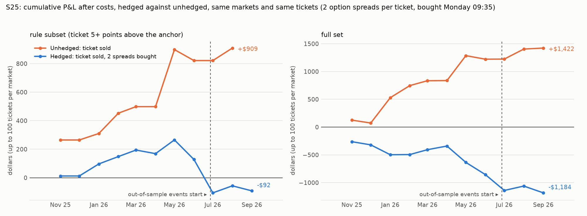
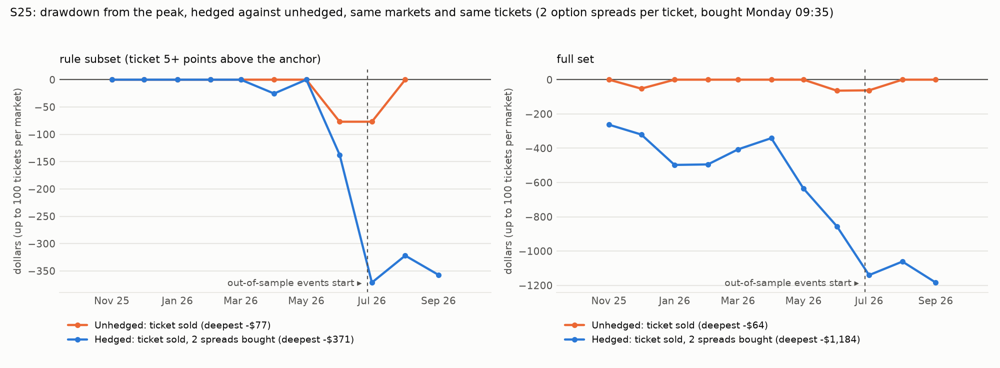
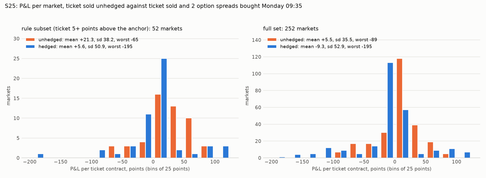

# S25: sell the ticket on Polymarket, buy the matching option spread. What is left, and how much risk goes?

Method, pre-registered before any Monday option quote or any underlying close was pulled: [`research/s25_ticket_option_hedge/METHOD.md`](../../s25_ticket_option_hedge/METHOD.md) (commit `9519ff4`). Markets: S21's anchored stock and S&P 500 "will it hit" tickets with a first-weekend taker sale, first weekends from 2025-10-31 to 2026-09-25. Ticket leg: S18's traded bids and held-to-result P&L. Hedge leg: real NBBO option quotes from Massive at 09:35 New York on the first session after the weekend, the long leg at its ask and the short leg at its bid, held to expiry and settled on the underlying's unadjusted close. Files: [`trades.csv`](trades.csv), [`metrics.csv`](metrics.csv), [`hypotheses.csv`](hypotheses.csv), [`cells.csv`](cells.csv), [`equity.csv`](equity.csv), [`after_run.csv`](after_run.csv), [`run_meta.json`](run_meta.json), [`capacity.md`](capacity.md), [`RUN_LOG.md`](RUN_LOG.md).

Words used here. A *ticket* is one YES contract of a Polymarket "will the stock hit this level this month" market; it pays $1 if the level is touched. A *spread* is two options on the two listed strikes around that level, one bought and one sold; sized here so that one spread pays $1 when the stock finishes beyond the far strike at expiry. A *point* is one cent per ticket. *Hedged* means the ticket sold plus the spreads bought.

## Answer

**Buying the option spread at real Monday quotes made the trade worse, not safer: it cost more than it paid back and it raised the risk instead of cutting it. H1 is not met and H2 is not met: not a lead. One thing holds: the options anchor still sorts the tickets after the hedge (H3 met).**

**On all 252 hedged markets** the ticket sold at its traded bid made +5.50 points [+1.45, +9.59] per ticket unhedged. With two option spreads per ticket bought at Monday 09:35 quotes the same tickets made **-9.35 points [-18.36, -1.68]**. The two spreads cost 45.17 points per ticket and paid back 30.33. The standard deviation of P&L per market went from 35.46 to 52.88 points: a ratio of **1.49 [1.33, 1.67]**, above 1. The worst market went from -89.00 to -195.16 points, the worst month of the book from -$64 to -$294.

**H3, the anchor still sorts: met.** Hedged P&L on the rule subset +5.62 points minus hedged P&L on the 200 markets the rule leaves -13.24: **+18.86 points [+1.91, +33.73]**. The tickets the rule leaves lose once hedged: -13.24 points [-22.33, -5.31].

**H1, the premium survives the hedge: not met.** On the rule subset (52 markets in 29 events) the hedged trade made **+5.62 points [-11.94, +20.85]** per ticket, an interval that includes zero. The same tickets unhedged made +21.29 points [+7.54, +33.86]. The hedge cost 46.44 points per ticket and paid back 30.77: it took 15.67 points per ticket. In-sample +5.60 points [-11.62, +20.46] on 50 markets. Out-of-sample +6.03 on 2 markets, which is no evidence either way. At 2× costs -5.30 points [-28.14, +12.68].

**H2, the hedge cuts risk: not met.** (a) Standard deviation of P&L per market on the rule subset: hedged 50.90 points against unhedged 38.18, a ratio of **1.33 [0.88, 1.93]**; it had to be below 1 with the interval below 1: **not met**. (b) Worst month of the book: hedged -$234 (-20.5% of its capital base) against unhedged -$77 (-11.1%): **not met**; difference -$157, interval [-$702, -$33]. Worst single market: hedged -195.16 points against unhedged -64.93. Maximum drawdown: hedged 32.6% against 11.1%. Monthly Sharpe: hedged -0.29 against 2.19. Skew per market: hedged -0.84 against -0.60.

**Why the hedge fails as specified.** Three things, all visible in the outcome table below.
1. *It does not cover the case that hurts.* The spread pays when the stock **finishes** beyond the level; the ticket loses when the stock **touches** it. 34 of the 252 markets (13%) touched and came back: the ticket lost 50.08 points, the hedge lost another 55.51, -105.59 in all.
2. *Two spreads per ticket is too many.* When the ticket never touched (181 markets, 72%) the two spreads cost 28.14 points and the ticket had earned 22.11: -5.95. When it touched and finished beyond (37 markets) the hedge paid twice the loss: +62.48. The hedge swaps one bet for a larger opposite one.
3. *The options are not cheap, and crossing their quotes at 09:35 is dear.* The two spreads cost 45.17 points and paid back 30.33: the hedge leg lost 14.85 points per ticket, against a ticket premium of 5.50. On the markets with fresh quotes about 7.0 points of the hedge leg's loss is the cost of crossing the quotes and about 6.3 is options priced above what happened (looked at after the run, L2).

**The variants, disclosed, none of them the test.** One spread per ticket (variant A) on the rule subset: +13.45 points [+1.43, +22.80], standard deviation 29.45 against 38.18 unhedged (ratio 0.77 [0.41, 1.06]), worst month -$117 against -$77; on the full set -1.93 points [-7.35, +2.79]. Friday 15:55 quotes (variant B, the gap on paper, not executable): rule subset +11.91 points [-1.65, +25.47], full set -9.29 points [-17.58, -2.32]. Primary at 2× costs: rule subset -5.30 points [-28.14, +12.68], full set -17.56 points [-28.21, -8.57].

**Out-of-sample there is almost nothing:** 14 of the 252 hedged markets, 2 of the 52 in the rule subset. S21 already found this. Nothing here is confirmed out-of-sample.

**Markets.** 252 of the 277 could be hedged, 52 of the 60 in the rule subset. Dropped: 20 (the underlying's closes or splits are not served); 4 (a split between the first weekend and the expiry); 1 (no usable quote at Monday 09:35 (from before the open, or no offer)). The 20 index (SPX) tickets are out because Massive does not serve the index close on this key.

## How many markets

- In the plan: 277 markets in 62 events; 60 in the rule subset.
- **Hedged: 252** in 57 events (238 in-sample, 14 out-of-sample); **52 in the rule subset** (50 in-sample, 2 out-of-sample).
- **Dropped: 25** (20: the underlying's closes or splits are not served; 4: a split between the first weekend and the expiry; 1: no usable quote at Monday 09:35 (from before the open, or no offer)). The first reason is the 20 S&P 500 index (SPX) tickets: Massive answered HTTP 403, not entitled, for the index's daily closes on this key.
- Dropped from the rule subset: 8 (6: the underlying's closes or splits are not served; 2: a split between the first weekend and the expiry).
- Dropped by ticker: SPX 20, OPEN 4, HOOD 1. Hedged by ticker: NVDA 59, TSLA 41, SPY 28, GOOGL 24, AMZN 21, AAPL 20, META 20, MSFT 11, PLTR 10, NFLX 6, HOOD 6, OPEN 5, RKLB 1.
- Monday quotes used are 0.0 to 299.8 seconds older than 09:35:00 (median 0.7). 15 hedges sold a short leg with a zero bid (sold for nothing); 0 pairs were crossed; 3 cost more than the spread can pay.

## Unhedged against hedged, same markets

### Rule subset

| Trade | Markets | Events | Mean P&L per ticket, points | 95% interval | SD per market | Worst market | Skew | Book P&L | Capital base | Sharpe (monthly) | Max drawdown | Worst month | Months |
|---|---|---|---|---|---|---|---|---|---|---|---|---|---|
| unhedged | 52 | 29 | +21.29 | [+7.54, +33.86] | 38.18 | -64.93 | -0.60 | +$909 | $694 | 2.19 | 11.1% | -$77 (-11.1%) | 10 |
| hedged, primary (2 spreads, Monday 09:35) | 52 | 29 | +5.62 | [-11.94, +20.85] | 50.90 | -195.16 | -0.84 | -$92 | $1,139 | -0.29 | 32.6% | -$234 (-20.5%) | 11 |

### Full set

| Trade | Markets | Events | Mean P&L per ticket, points | 95% interval | SD per market | Worst market | Skew | Book P&L | Capital base | Sharpe (monthly) | Max drawdown | Worst month | Months |
|---|---|---|---|---|---|---|---|---|---|---|---|---|---|
| unhedged | 252 | 57 | +5.50 | [+1.45, +9.59] | 35.46 | -89.00 | -0.46 | +$1,422 | $3,460 | 2.44 | 1.9% | -$64 (-1.9%) | 11 |
| hedged, primary (2 spreads, Monday 09:35) | 252 | 57 | -9.35 | [-18.36, -1.68] | 52.88 | -195.16 | -0.63 | -$1,184 | $6,437 | -2.48 | 18.4% | -$294 (-4.6%) | 11 |

### The markets the rule leaves

| Trade | Markets | Events | Mean P&L per ticket, points | 95% interval | SD per market | Worst market | Skew | Book P&L | Capital base | Sharpe (monthly) | Max drawdown | Worst month | Months |
|---|---|---|---|---|---|---|---|---|---|---|---|---|---|
| unhedged | 200 | 56 | +1.39 | [-3.01, +5.73] | 33.62 | -89.00 | -0.59 | +$513 | $2,766 | 1.18 | 6.9% | -$139 (-5.0%) | 11 |
| hedged, primary (2 spreads, Monday 09:35) | 200 | 56 | -13.24 | [-22.33, -5.31] | 52.81 | -169.83 | -0.60 | -$1,092 | $5,323 | -2.31 | 20.5% | -$391 (-7.3%) | 11 |

P&L per ticket weighs each market once. The book holds up to 100 tickets per market, never more than the printed size, and for the hedged book the matching number of spreads; the capital base is the largest capital locked at one time (ticket collateral plus option premium); Sharpe, drawdown and worst month are on monthly P&L over that base. Intervals resample events.

## The four outcomes

### Rule subset

| Outcome | Markets | Share | Ticket P&L, points | Hedge cost | Hedge paid | Hedge P&L | Hedged P&L |
|---|---|---|---|---|---|---|---|
| never touched | 42 | 80.8% | +35.99 | 40.39 | 0.00 | -40.39 | -4.40 |
| touched and finished beyond | 8 | 15.4% | -37.15 | 79.26 | 200.00 | +120.74 | +83.59 |
| touched and came back | 2 | 3.8% | -53.57 | 42.30 | 0.00 | -42.30 | -95.87 |
| finished beyond without a recorded touch | 0 | 0.0% | n/a | n/a | n/a | n/a | n/a |
| every market | 52 | 100.0% | +21.29 | 46.44 | 30.77 | -15.67 | +5.62 |

### Full set

| Outcome | Markets | Share | Ticket P&L, points | Hedge cost | Hedge paid | Hedge P&L | Hedged P&L |
|---|---|---|---|---|---|---|---|
| never touched | 181 | 71.8% | +22.11 | 28.14 | 0.08 | -28.06 | -5.95 |
| touched and finished beyond | 37 | 14.7% | -24.68 | 109.41 | 196.57 | +87.16 | +62.48 |
| touched and came back | 34 | 13.5% | -50.08 | 65.94 | 10.43 | -55.51 | -105.59 |
| finished beyond without a recorded touch | 0 | 0.0% | n/a | n/a | n/a | n/a | n/a |
| every market | 252 | 100.0% | +5.50 | 45.17 | 30.33 | -14.85 | -9.35 |

"Touched" is the ticket's result. "Finished beyond" is the close on the option's expiry date at or beyond the question's level. "Hedge cost" and "hedge paid" are for the two spreads of the primary, in points per ticket. The hedge is built for the second row and does not cover the third: on the full set the touched-and-came-back markets lost -105.59 points hedged against -50.08 unhedged (34 markets).
**Finished beyond without a recorded touch: none**, as it should be.

## What the hedge costs, and the capital each leg ties up

|  | Rule subset | Full set |
|---|---|---|
| Hedge cost paid, mean, points per ticket (2 spreads, Monday 09:35, ask and bid, with commission) | 46.44 | 45.17 |
| Hedge cost paid, median | 40.72 | 30.80 |
| The same two spreads at Monday's mid quotes, median | 32.75 | 23.40 |
| Cost of crossing the quotes plus commission, median, points per ticket | 5.30 | 4.30 |
| The same two spreads at Friday 15:55 mid quotes, median | 28.10 | 23.40 |
| Hedge cost at Friday 15:55 quotes (variant B), mean | 40.15 | 45.11 |
| What the hedge paid at expiry, points per ticket | 30.77 | 30.33 |
| Hedge P&L, points per ticket | -15.67 | -14.85 |
| Ticket price received, points | 40.87 | 33.89 |
| Ticket leg capital per ticket (collateral, 100 minus the price), points | 59.13 | 66.11 |
| Hedge leg capital per ticket (premium paid), points | 46.44 | 45.17 |
| Book: capital base unhedged | $694 | $3,460 |
| Book: capital base hedged | $1,139 | $6,437 |
| Book: ticket collateral deployed / option premium deployed | $1,862 / $1,485 | $10,531 / $7,600 |

Commission: $0.65 per option contract per leg (an assumed retail figure, the project's existing cost model). No financing cost is charged on either leg.

## Variants and 2× costs (all reported, none replaces the primary)

| Set | Trade | Markets | Mean P&L per ticket, points | 95% interval | SD per market | Worst market | Skew | Hedge cost | Hedge paid | Book P&L | Sharpe (monthly) | Max drawdown | Worst month |
|---|---|---|---|---|---|---|---|---|---|---|---|---|---|
| rule subset (ticket 5+ points above the anchor) | unhedged | 52 | +21.29 | [+7.54, +33.86] | 38.18 | -64.93 | -0.60 | n/a | n/a | +$909 | 2.19 | 11.1% | -$77 |
| rule subset (ticket 5+ points above the anchor) | hedged, primary (2 spreads, Monday 09:35) | 52 | +5.62 | [-11.94, +20.85] | 50.90 | -195.16 | -0.84 | 46.44 | 30.77 | -$92 | -0.29 | 32.6% | -$234 |
| rule subset (ticket 5+ points above the anchor) | hedged, variant A (1 spread, Monday 09:35) | 52 | +13.45 | [+1.43, +22.80] | 29.45 | -95.07 | -2.04 | 23.22 | 15.38 | +$409 | 1.22 | 24.8% | -$117 |
| rule subset (ticket 5+ points above the anchor) | hedged, variant B (2 spreads, Friday 15:55 quotes; on paper) | 52 | +11.91 | [-1.65, +25.47] | 44.65 | -100.23 | 0.31 | 40.15 | 30.77 | +$147 | 0.52 | 20.5% | -$141 |
| rule subset (ticket 5+ points above the anchor) | unhedged, fee doubled | 52 | +20.94 | [+7.17, +33.43] | 38.23 | -65.85 | -0.62 | n/a | n/a | +$896 | 2.19 | 11.3% | -$79 |
| rule subset (ticket 5+ points above the anchor) | primary at 2× costs | 52 | -5.30 | [-28.14, +12.68] | 61.47 | -295.53 | -1.92 | 57.01 | 30.77 | -$473 | -1.26 | 45.7% | -$356 |
| rule subset (ticket 5+ points above the anchor) | variant A at 2× costs | 52 | +7.82 | [-6.56, +18.96] | 35.46 | -145.35 | -2.37 | 28.51 | 15.38 | +$211 | 0.66 | 31.0% | -$178 |
| rule subset (ticket 5+ points above the anchor) | variant B at 2× costs | 52 | +2.12 | [-12.94, +16.40] | 47.16 | -136.64 | -0.09 | 49.59 | 30.77 | -$161 | -0.67 | 23.7% | -$155 |
| full set | unhedged | 252 | +5.50 | [+1.45, +9.59] | 35.46 | -89.00 | -0.46 | n/a | n/a | +$1,422 | 2.44 | 1.9% | -$64 |
| full set | hedged, primary (2 spreads, Monday 09:35) | 252 | -9.35 | [-18.36, -1.68] | 52.88 | -195.16 | -0.63 | 45.17 | 30.33 | -$1,184 | -2.48 | 18.4% | -$294 |
| full set | hedged, variant A (1 spread, Monday 09:35) | 252 | -1.93 | [-7.35, +2.79] | 34.60 | -104.82 | -1.55 | 22.59 | 15.16 | +$119 | 0.35 | 5.7% | -$142 |
| full set | hedged, variant B (2 spreads, Friday 15:55 quotes; on paper) | 252 | -9.29 | [-17.58, -2.32] | 50.53 | -163.83 | -0.48 | 45.11 | 30.33 | -$1,206 | -2.70 | 18.5% | -$376 |
| full set | unhedged, fee doubled | 252 | +5.28 | [+1.23, +9.35] | 35.45 | -89.00 | -0.47 | n/a | n/a | +$1,385 | 2.44 | 2.0% | -$68 |
| full set | primary at 2× costs | 252 | -17.56 | [-28.21, -8.57] | 58.21 | -295.53 | -1.02 | 53.16 | 30.33 | -$2,577 | -3.10 | 37.0% | -$699 |
| full set | variant A at 2× costs | 252 | -6.14 | [-12.18, -1.00] | 36.69 | -145.35 | -1.57 | 26.58 | 15.16 | -$596 | -1.66 | 12.2% | -$209 |
| full set | variant B at 2× costs | 252 | -18.36 | [-27.52, -10.39] | 54.05 | -202.52 | -0.73 | 53.96 | 30.33 | -$2,742 | -3.14 | 38.0% | -$841 |

Variant B uses Friday 15:55 option quotes. It is **not executable in that order**: the ticket is sold after Friday's close. It shows the gap as it stood on paper. At 2× costs each option leg is moved a further half-spread against us, the commission is doubled and the ticket's fee is doubled.

Variant B on every market with a verified close (its own set, 253 markets, 52 in the rule subset):

| Set | Trade | Markets | Mean P&L per ticket, points | 95% interval | SD per market | Worst market |
|---|---|---|---|---|---|---|
| rule subset (ticket 5+ points above the anchor) | unhedged | 52 | +21.29 | [+7.54, +33.86] | 38.18 | -64.93 |
| rule subset (ticket 5+ points above the anchor) | hedged, variant B (2 spreads, Friday 15:55 quotes; on paper) | 52 | +11.91 | [-1.65, +25.47] | 44.65 | -100.23 |
| rule subset (ticket 5+ points above the anchor) | variant B at 2× costs | 52 | +2.12 | [-12.94, +16.40] | 47.16 | -136.64 |
| full set | unhedged | 253 | +5.48 | [+1.45, +9.55] | 35.39 | -89.00 |
| full set | hedged, variant B (2 spreads, Friday 15:55 quotes; on paper) | 253 | -9.26 | [-17.51, -2.32] | 50.43 | -163.83 |
| full set | variant B at 2× costs | 253 | -18.30 | [-27.43, -10.38] | 53.95 | -202.52 |

## The hypotheses by variant and segment

| Trade | Segment | Rule-subset markets | H1: hedged mean on the rule subset | H2a: SD ratio, rule subset | H2b: worst month hedged vs unhedged | H3: rule subset minus left |
|---|---|---|---|---|---|---|
| hedged, primary (2 spreads, Monday 09:35) | whole sample | 52 | +5.62 [-11.94, +20.85] | 1.33 [0.88, 1.93] | -$234 vs -$77 | +18.86 [+1.91, +33.73] |
| hedged, primary (2 spreads, Monday 09:35) | in-sample | 50 | +5.60 [-11.62, +20.46] | 1.36 [0.88, 1.91] | -$234 vs -$77 | +19.29 [+2.16, +34.88] |
| hedged, primary (2 spreads, Monday 09:35) | out-of-sample | 2 | +6.03 n/a (under 5 events) | 6.60 n/a (under 5 events) | -$35 vs +$88 | +12.19 [+0.15, +22.78] |
| hedged, variant A (1 spread, Monday 09:35) | whole sample | 52 | +13.45 [+1.43, +22.80] | 0.77 [0.41, 1.06] | -$117 vs -$77 | +19.38 [+7.44, +29.95] |
| hedged, variant A (1 spread, Monday 09:35) | in-sample | 50 | +12.74 [+0.17, +22.27] | 0.78 [0.43, 1.06] | -$117 vs -$77 | +19.40 [+6.31, +30.06] |
| hedged, variant A (1 spread, Monday 09:35) | out-of-sample | 2 | +31.23 n/a (under 5 events) | 2.80 n/a (under 5 events) | -$18 vs +$88 | +25.60 [+17.21, +32.92] |
| hedged, variant B (2 spreads, Friday 15:55 quotes; on paper) | whole sample | 52 | +11.91 [-1.65, +25.47] | 1.17 [0.89, 1.49] | -$141 vs -$77 | +26.70 [+12.52, +40.36] |
| hedged, variant B (2 spreads, Friday 15:55 quotes; on paper) | in-sample | 50 | +12.24 [-2.16, +26.21] | 1.19 [0.90, 1.53] | -$141 vs -$77 | +27.37 [+12.42, +42.32] |
| hedged, variant B (2 spreads, Friday 15:55 quotes; on paper) | out-of-sample | 2 | +3.53 n/a (under 5 events) | 2.52 n/a (under 5 events) | -$33 vs +$88 | +13.11 [+7.80, +18.58] |
| primary at 2× costs | whole sample | 52 | -5.30 [-28.14, +12.68] | 1.61 [0.97, 2.51] | -$356 vs -$79 | +15.45 [-5.76, +32.66] |
| primary at 2× costs | in-sample | 50 | -5.37 [-26.69, +12.06] | 1.63 [0.98, 2.50] | -$356 vs -$79 | +15.91 [-6.49, +33.26] |
| primary at 2× costs | out-of-sample | 2 | -3.61 n/a (under 5 events) | 8.34 n/a (under 5 events) | -$42 vs +$86 | +8.75 [-5.44, +20.38] |

Only the first row (primary, whole sample, 1× costs) is the test. The others are disclosure.

## In-sample and out-of-sample (S18's split of events)

| Set | Segment | Trade | Markets | Events | Mean P&L per ticket, points | 95% interval | SD per market | Worst market | Book P&L | Sharpe (monthly) |
|---|---|---|---|---|---|---|---|---|---|---|
| rule subset (ticket 5+ points above the anchor) | in-sample | unhedged | 50 | 27 | +19.88 | [+5.79, +32.62] | 38.27 | -64.93 | +$822 | 2.24 |
| rule subset (ticket 5+ points above the anchor) | in-sample | hedged (primary) | 50 | 27 | +5.60 | [-11.62, +20.46] | 51.88 | -195.16 | -$106 | -0.38 |
| rule subset (ticket 5+ points above the anchor) | out-of-sample | unhedged | 2 | 2 | +56.44 | n/a (under 5 events) | 2.25 | +54.85 | +$88 | n/a |
| rule subset (ticket 5+ points above the anchor) | out-of-sample | hedged (primary) | 2 | 2 | +6.03 | n/a (under 5 events) | 14.87 | -4.49 | +$14 | n/a |
| full set | in-sample | unhedged | 238 | 52 | +4.47 | [-0.18, +8.95] | 35.99 | -89.00 | +$1,222 | 2.55 |
| full set | in-sample | hedged (primary) | 238 | 52 | -9.64 | [-18.19, -1.30] | 54.36 | -195.16 | -$1,140 | -2.87 |
| full set | out-of-sample | unhedged | 14 | 5 | +23.00 | [+17.68, +29.13] | 17.68 | +4.38 | +$200 | 2.34 |
| full set | out-of-sample | hedged (primary) | 14 | 5 | -4.42 | [-7.11, -0.74] | 8.83 | -19.17 | -$43 | -0.49 |
| markets the rule leaves | in-sample | unhedged | 188 | 51 | +0.37 | [-4.50, +4.99] | 34.32 | -89.00 | +$401 | 1.08 |
| markets the rule leaves | in-sample | hedged (primary) | 188 | 51 | -13.69 | [-22.64, -4.93] | 54.42 | -169.83 | -$1,034 | -2.50 |
| markets the rule leaves | out-of-sample | unhedged | 12 | 5 | +17.42 | [+10.72, +27.28] | 11.47 | +4.38 | +$113 | 2.67 |
| markets the rule leaves | out-of-sample | hedged (primary) | 12 | 5 | -6.16 | [-8.12, -2.46] | 6.99 | -19.17 | -$57 | -1.09 |

**The out-of-sample part has almost no markets:** 14 hedged markets, 2 in the rule subset. Nothing here is confirmed out-of-sample. S21 found the same.

## What a pass would and would not mean

A pass on H1 and H2 is a **lead needing replication, not an edge**. The tickets' results were known before this study; only the Monday option quotes, the closes at expiry and the hedged P&L were new. The rule subset was chosen by S21 on the same markets, so its unhedged premium is in-sample by construction.

## Looked at after the run (not pre-registered, not tests)

These three looks were chosen after the result was read (METHOD.md, amendment 2). Each was run once. None replaces H1, H2 or H3.

**L1, fresh quotes only.** 17 hedged markets (6 in the rule subset) had a Monday leg quote more than 60 seconds old at 09:35: an opening quote that was never refreshed. The clearest case is the worst market of the study, META "Will Meta Platforms, Inc. (META) hit (LOW) $480 in June?": both legs showed 0.00 bid, 15.00 offered, about 299 seconds old; the registered rule buys at the offer, and the hedge of a far out-of-the-money spread cost 200.17 points (-195.16 hedged). Nobody would lift that offer. Without those markets:

| Set | Trade | Markets | Mean P&L per ticket, points | 95% interval | SD per market | SD ratio to unhedged | Worst market |
|---|---|---|---|---|---|---|---|
| rule subset (ticket 5+ points above the anchor) | unhedged | 46 | +22.86 | [+7.24, +36.44] | 40.34 | 1 | -64.93 |
| rule subset (ticket 5+ points above the anchor) | hedged, primary | 46 | +12.55 | [-2.59, +26.34] | 43.26 | 1.07 [0.79, 1.35] | -98.23 |
| rule subset (ticket 5+ points above the anchor) | hedged, variant A | 46 | +17.70 | [+5.37, +26.37] | 25.55 | 0.63 [0.33, 0.86] | -81.08 |
| full set | unhedged | 235 | +5.56 | [+1.03, +9.78] | 36.42 | 1 | -89.00 |
| full set | hedged, primary | 235 | -7.77 | [-16.20, -0.08] | 52.40 | 1.44 [1.30, 1.59] | -169.83 |
| full set | hedged, variant A | 235 | -1.10 | [-6.21, +3.97] | 34.66 | 0.95 [0.86, 1.04] | -104.82 |
| markets the rule leaves | unhedged | 189 | +1.35 | [-3.15, +6.32] | 34.22 | 1 | -89.00 |
| markets the rule leaves | hedged, primary | 189 | -12.71 | [-21.26, -4.89] | 53.33 | 1.56 [1.39, 1.77] | -169.83 |
| markets the rule leaves | hedged, variant A | 189 | -5.68 | [-10.84, -0.75] | 35.09 | 1.03 [0.93, 1.13] | -104.82 |

Rule subset minus left, hedged primary, fresh quotes: +25.26 [+11.01, +39.85]. The stale quotes made the primary look worse than a careful trader would have done, and they do not change any verdict: the two-spread hedge still does not cut the standard deviation, and on the rule subset its interval still includes zero.

**L2, the same two spreads at Monday's mid quotes plus commission (not executable), on the fresh quotes.** Rule subset +20.13 [+5.21, +34.66]; full set -0.79 [-8.52, +6.52]. Bought at mid, the hedge leg still loses 6.35 points per ticket on the full set (2.72 on the rule subset): in this sample the options were priced above what happened, as S21 noted of its anchor. Crossing the quotes costs a further mean of 6.98 points per ticket on the full set (median 3.40; rule subset mean 7.58). So about half of the hedge leg's loss is the options' own premium and about half is the cost of crossing at the open. Even at mid the two-spread hedge raises the standard deviation on the full set: ratio 1.40 [1.27, 1.54].

**L3, how many spreads per ticket would have cut the risk most, found after the fact.** Rule subset: 0.76 spreads per ticket, standard deviation ratio 0.74 [0.46, 0.95], mean +15.37 [+3.65, +25.00]. Full set: 0.54 spreads, ratio 0.90 [0.84, 0.96], mean +1.52 [-2.58, +5.34]. The ticket's P&L and one spread's P&L move against each other with a correlation of -0.67 (rule subset) and -0.44 (full set). These ratios were fitted on the same markets they are scored on, so they flatter the hedge; even so, the best ratio removes about 10% of the standard deviation on the full set and 26% on the rule subset. A spread that pays on the finish is a weak hedge for a ticket that pays on the touch.

## Checks

- Every primary hedged P&L was recomputed by a second route from the cached quotes, the cached close and S18's file: 252 markets, 0 mismatches.
- The copied book function reproduces S18's own function on the ticket leg: yes.
- Tickets whose result came before the hedge was bought: 0.
- **A Sharpe beyond 3 in absolute value appears in:** hedged, variant B (2 spreads, Friday 15:55 quotes; on paper), full set, IS: -3.05 (238 markets, 9 months); primary at 2× costs, full set, ALL: -3.10 (252 markets, 11 months); primary at 2× costs, full set, IS: -3.52 (238 markets, 9 months); variant B at 2× costs, full set, ALL: -3.14 (252 markets, 11 months); variant B at 2× costs, full set, IS: -3.48 (238 markets, 9 months); variant B at 2× costs, markets the rule leaves, IS: -3.07 (188 markets, 9 months). All of them are negative: hedged books that lose in most of their months. These are monthly numbers over at most a dozen months. The bug hunt: the recomputation above, the quote times (every quote used is from 09:30:00 to 09:35:00 of the hedge day), the close basis (no market finished beyond its level without a recorded touch, which ties Massive's closes to Polymarket's results), and the after-the-run look L1 at stale opening quotes.

