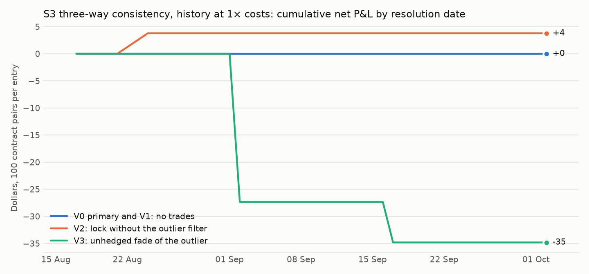
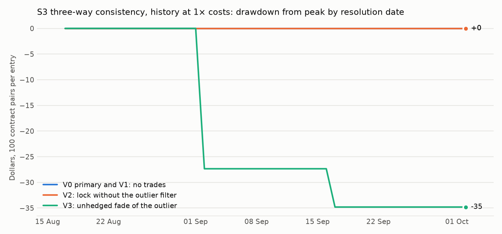

# S3: three-way consistency on "S&P 500 closes above K"

Method, pre-registered before any S3 data was pulled: [`research/s3_three_way/METHOD.md`](../../s3_three_way/METHOD.md) (commit `83ce137`; amendment 1 before any result). Files: [`metrics.csv`](metrics.csv), [`sets.csv`](sets.csv), [`trades.csv`](trades.csv), [`capacity.md`](capacity.md), [`RUN_LOG.md`](RUN_LOG.md).

## Answer

**No trade. Too few observations.** On 33 resolution dates (2026-08-17 to 2026-10-02) there are 60 matched sets: a Polymarket SPY strike, the Kalshi S&P 500 strike at the same level, and the options band, all at 12:00 ET. The primary rule (V0: one prediction venue outside the options band, the other inside, and a cross-venue lock worth at least 2¢ after costs) fired **0 times at 1× costs and 0 at 2×**. At noon on the resolution day the three prices agreed to within costs.

The pre-registered pass needed 20 print-verified entries on 10 dates. There are none. This is a null and is reported as one.

## How close the three prices are (all matched sets)

| Pair of prices | Mean absolute gap |
|---|---|
| Polymarket mid against Kalshi mid | 3.5 points |
| Kalshi mid against the options band mid | 3.6 points |
| Polymarket mid against the options band mid | 2.1 points |

Median Kalshi spread 3 points; the Polymarket spread in history is the arb scan's assumed ±5 points. Split resolutions (the two venues settling differently): 0 of 60 sets. Strike rounding: at most 2.5 index points.

## Every variant tried (history)

| Segment | Variant | Costs | Sets | Entries | Dates with an entry | Net P&L | Winners | Print-verified | Verified P&L | Sharpe |
|---|---|---|---|---|---|---|---|---|---|---|
| IS | V0 (primary) | 1× | 43 | 0 | 0 | +$0.00 | 0 | 0 | +$0.00 | n/a |
| OOS | V0 (primary) | 1× | 17 | 0 | 0 | +$0.00 | 0 | 0 | +$0.00 | n/a |
| ALL | V0 (primary) | 1× | 60 | 0 | 0 | +$0.00 | 0 | 0 | +$0.00 | n/a |
| IS | V0 (primary) | 2× | 43 | 0 | 0 | +$0.00 | 0 | 0 | +$0.00 | n/a |
| OOS | V0 (primary) | 2× | 17 | 0 | 0 | +$0.00 | 0 | 0 | +$0.00 | n/a |
| ALL | V0 (primary) | 2× | 60 | 0 | 0 | +$0.00 | 0 | 0 | +$0.00 | n/a |
| IS | V1 | 1× | 43 | 0 | 0 | +$0.00 | 0 | 0 | +$0.00 | n/a |
| OOS | V1 | 1× | 17 | 0 | 0 | +$0.00 | 0 | 0 | +$0.00 | n/a |
| ALL | V1 | 1× | 60 | 0 | 0 | +$0.00 | 0 | 0 | +$0.00 | n/a |
| IS | V1 | 2× | 43 | 0 | 0 | +$0.00 | 0 | 0 | +$0.00 | n/a |
| OOS | V1 | 2× | 17 | 0 | 0 | +$0.00 | 0 | 0 | +$0.00 | n/a |
| ALL | V1 | 2× | 60 | 0 | 0 | +$0.00 | 0 | 0 | +$0.00 | n/a |
| IS | V2 | 1× | 43 | 1 | 1 | +$3.78 | 1 | 0 | +$0.00 | 3.11 |
| OOS | V2 | 1× | 17 | 0 | 0 | +$0.00 | 0 | 0 | +$0.00 | n/a |
| ALL | V2 | 1× | 60 | 1 | 1 | +$3.78 | 1 | 0 | +$0.00 | 2.76 |
| IS | V2 | 2× | 43 | 0 | 0 | +$0.00 | 0 | 0 | +$0.00 | n/a |
| OOS | V2 | 2× | 17 | 0 | 0 | +$0.00 | 0 | 0 | +$0.00 | n/a |
| ALL | V2 | 2× | 60 | 0 | 0 | +$0.00 | 0 | 0 | +$0.00 | n/a |
| IS | V3 | 1× | 43 | 2 | 2 | -$34.81 | 0 | 2 | -$34.81 | -3.86 |
| OOS | V3 | 1× | 17 | 0 | 0 | +$0.00 | 0 | 0 | +$0.00 | n/a |
| ALL | V3 | 1× | 60 | 2 | 2 | -$34.81 | 0 | 2 | -$34.81 | -3.42 |
| IS | V3 | 2× | 43 | 1 | 1 | +$36.64 | 1 | 1 | +$36.64 | 3.11 |
| OOS | V3 | 2× | 17 | 0 | 0 | +$0.00 | 0 | 0 | +$0.00 | n/a |
| ALL | V3 | 2× | 60 | 1 | 1 | +$36.64 | 1 | 1 | +$36.64 | 2.76 |

P&L is per 100 contract pairs (about $100 of capital per entry); each leg is paid by its own venue's result. OOS is the most recent 20% of dates (2026-09-24 to 2026-10-02, 7 dates). With one to two entries a Sharpe ratio means nothing; it is printed only because the table has the column.





## Costs, in bp of capital

Kalshi `quadratic` fee, multiplier 1: `ceil(0.07 × C × P × (1 − P))`, up to 175 bp at P = 0.5. Polymarket 0.04 × P × (1 − P), up to 100 bp. Half-spreads: Kalshi's real quote (median 1.7 points a side), Polymarket assumed 5 points a side. Carry to a same-day resolution is under 1 bp. A round lock near P = 0.5 therefore needs a gap of about 9 points between the venues' mids before it clears 2¢; the mean gap is 3.5.

## Forward: this weekend's recorded books (Monday 2026-10-05 markets)

Six matched strikes, real books every 30 s. Primary (θ = 2¢): **0 fills at 1× costs**, 0 contract pairs, $0.00 of capital, +$0.00 locked if both venues resolve alike on Monday; 0 fills at 2×. The markets resolve after the deadline, so no realised P&L.

| SPY strike | S&P strike | Snapshots | Polymarket mid (median) | Polymarket spread | Kalshi mid (median) | Kalshi spread | Mid gap (PM − Kalshi) | Options band, Friday close (stale) |
|---|---|---|---|---|---|---|---|---|
| 750 | 7525 | 1287 | 0.997 | 0.005 | n/a | n/a | n/a | 0.37 to 1.00 |
| 755 | 7575 | 1287 | 0.938 | 0.102 | n/a | n/a | n/a | 0.42 to 1.00 |
| 760 | 7625 | 1287 | 0.930 | 0.080 | 0.945 | 0.090 | -0.010 | 0.83 to 1.00 |
| 765 | 7675 | 1287 | 0.885 | 0.070 | 0.790 | 0.320 | 0.085 | 0.82 to 0.89 |
| 770 | 7725 | 1287 | 0.540 | 0.070 | 0.585 | 0.180 | -0.040 | 0.55 to 0.57 |
| 775 | 7775 | 1287 | 0.150 | 0.070 | 0.270 | 0.280 | -0.115 | 0.15 to 0.16 |

## What didn't work

- **The primary rule never fired** (60 sets, 33 dates, 1× and 2× costs).
- **Loosening it did not help.** V1 (θ = 1¢) also has no entry. V2 (no outlier filter) has one entry, not print-verified. V3 (unhedged fade) has two entries at 1× costs, both losers, and one at 2×, a winner: noise.
- **Coverage is thin.** Of 96 Polymarket rows, 19 had no two-sided Kalshi quote at noon, 13 had no Kalshi strike within 2.5 points, and 4 fell on the SPY ex-dividend date.

## Caveats

- One snapshot a day in history, so no two-observation latency rule there.
- The contracts are near-twins (SPY against the index, a rounded strike, two closing prints).
- The historical Polymarket spread is assumed; nothing here rests on it because nothing traded.

## Reproduce

```
cd research
python -m s3_three_way.run --rate 0.0417
python -m s3_three_way.forward --rate 0.0417     # after the forward window closes
python -m s3_three_way.report
python -m pytest s3_three_way/tests -q
```
