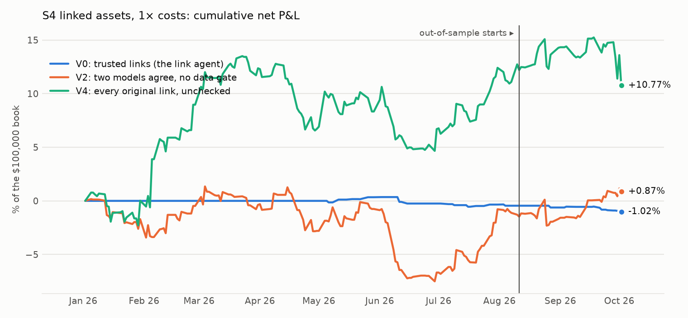
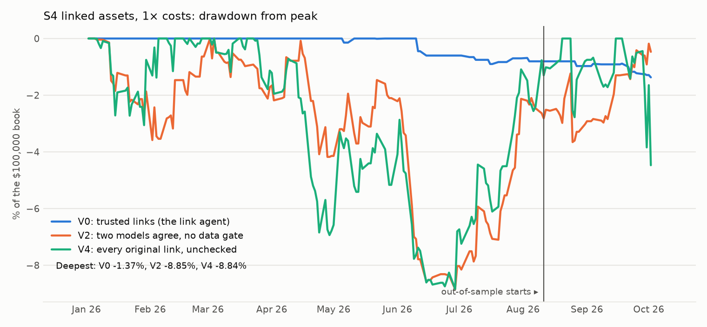

# S4: prediction-market odds against the equity they move

Method, pre-registered before any test-sample price was pulled: [`research/s4_linked_assets/METHOD.md`](../../s4_linked_assets/METHOD.md) (commit `603f2e8`). Files: [`metrics.csv`](metrics.csv), [`trades.csv`](trades.csv), [`links.csv`](links.csv), [`regressions.csv`](regressions.csv), [`capacity.md`](capacity.md), [`RUN_LOG.md`](RUN_LOG.md).

## Answer

**The link is real, and the open already prices it.** On event questions where two independent models agree on the equity and the direction, a 1-point overnight move in odds comes with a +4.7 bp excess gap in that equity at the open (t = 4.0, 3,504 link-days, 188 dates; in-sample +5.7, t = 3.7; out-of-sample +2.7, t = 2.5). It comes from the larger moves: the two have the same sign on only 51% of days. After the open nothing follows: +0.7 bp per point (t = 0.4). The reverse does not hold either: the odds do not follow the equity's session move (-0.05 pp per 100 bp, t = -0.9). The information reaches the equity while it is closed; by 09:30 there is no lag left to trade.

**Verdict on the pre-registered criterion: too few observations.** Out of sample (2026-08-11 to 2026-10-02, 38 sessions), trading the equity at the open in the direction of the overnight move in odds, on links the agent trusts, gave 12 trades on 5 tickers: -47.1 bp net per trade at 1× costs (95% interval -93.3 to -7.4), -41.0 bp before costs; -53.1 bp net at 2× costs. In-sample: 15 trades, -30.2 bp net.

**The link agent's result.** Of 380 links on 117 markets written by the first model, the blind critic agreed on the ticker and the direction for 194, named the same ticker with the **opposite** direction for 0, and did not name the ticker for 186. The data gate then confirmed 21 of the agreed links at some point in the window (6 of them on event questions). 18 links pass the data gate without the critic's agreement.

## The link agent

| Stage | What it does | Result |
|---|---|---|
| 1. Proposer | The links in `ai_map.json`, written from the question text | 380 links, 117 Polymarket markets, 58 tickers |
| 2. Blind critic | A second model, shown only the question and the ticker menu | agreed 194; opposite direction 0; ticker not named 186 |
| 3. Data gate | Walk-forward: equity and odds must have moved together in 30-minute bins, t ≥ 2, earlier days only | 21 agreed links confirmed at some point (6 event, 15 spot proxy) |

Markets by family (critic): event 59, spot_proxy 52, none 6. A spot proxy is a question about a traded price itself ("Bitcoin above X"); the primary test leaves those out.

Trusted event links, strongest first (sensitivity is measured, in bp of excess return per pp of odds):

| Question | Ticker | Direction | Sensitivity | t | Bins | First confirmed |
|---|---|---|---|---|---|---|
| Will the U.S. invade Iran before 2027? | JETS | down on yes | +5.3 | 3.3 | 489 | 2026-05-04 |
| Will the Fed increase interest rates by 25 bps after the October 2026  | IWM | down on yes | +1.7 | 3.0 | 143 | 2026-08-31 |
| Will the Fed increase interest rates by 25 bps after the December 2026 | TLT | down on yes | +1.5 | 2.7 | 85 | 2026-09-29 |
| Will the Fed decrease interest rates by 25 bps after the October 2026  | XHB | up on yes | +10.8 | 2.1 | 156 | 2026-08-26 |
| Will OpenAI have the best AI model at the end of October 2026? | GOOGL | down on yes | +2.0 | 1.7 | 223 | 2026-08-28 |
| Will OpenAI have the best AI model at the end of October 2026? | MSFT | up on yes | +0.2 | 0.4 | 223 | 2026-09-04 |

## Headline numbers (primary V0: trusted links, event questions, exit at the close)

| Segment | Variant | Costs | Trades | Tickers | Dates | Net P&L | Net per trade | 95% interval | Gross per trade | Winners | Sharpe | Deflated Sharpe prob. | Max DD | Worst month | Turnover / yr |
|---|---|---|---|---|---|---|---|---|---|---|---|---|---|---|---|
| IS | V0 (primary) | 1× | 15 | 1 | 15 | -$453 | -30.2 bp | [-113.8, 47.3] | -22.8 bp | 47% | -0.90 | 0.041 | 0.90% | -0.59% | 13.4× |
| OOS | V0 (primary) | 1× | 12 | 5 | 10 | -$565 | -47.1 bp | [-93.3, -7.4] | -41.0 bp | 17% | -5.02 | 0.000 | 0.56% | -0.32% | 32.2× |
| IS | V0 (primary) | 2× | 15 | 1 | 15 | -$563 | -37.5 bp | [-121.2, 39.7] | -22.8 bp | 47% | -1.11 | 0.040 | 0.94% | -0.61% | 13.4× |
| OOS | V0 (primary) | 2× | 12 | 5 | 10 | -$638 | -53.1 bp | [-99.4, -13.5] | -41.0 bp | 17% | -5.50 | 0.000 | 0.64% | -0.37% | 32.2× |

A $100,000 book; $10,000 per position against a beta-weighted SPY hedge; entry at the 09:30 open, exit at the close. The Sharpe ratio is on daily returns, 252 days.





## Pre-registered success criterion

| Criterion | Result | Evidence |
|---|---|---|
| At least 30 out-of-sample trades on at least 10 dates and 5 tickers | **fail** | 12 trades, 10 dates, 5 tickers |
| Out-of-sample mean net return per trade above zero, date-bootstrap interval excluding zero (1× costs) | **fail** | -47.1 bp [-93.3, -7.4] |
| Still above zero at 2× costs | **fail** | -53.1 bp |
| In-sample mean net return per trade above zero | **fail** | -30.2 bp on 15 trades |

**Verdict: too few observations.**

## Who moves first (described, not traded)

| Relation | trusted, event (V0 set) | agreed, event, no data gate | every proposer link | motivating example (Brazil) |
|---|---|---|---|---|
| gap on overnight odds move (bp per pp) | +6.45 (t +1.73, n 166, same sign 65%) | +4.69 (t +4.01, n 3504, same sign 51%) | +8.00 (t +6.19, n 16541, same sign 56%) | -0.78 (t -0.34, n 206, same sign 48%) |
| move after the open on overnight odds move (bp per pp) | -2.38 (t -0.69, n 166, same sign 45%) | +0.69 (t +0.40, n 3504, same sign 51%) | -4.34 (t -1.65, n 16541, same sign 48%) | -0.37 (t -0.10, n 206, same sign 38%) |
| next overnight odds move on the equity's session move (pp per 100 bp) | +0.16 (t +1.17, n 162, same sign 48%) | -0.05 (t -0.90, n 3504, same sign 50%) | +0.05 (t +0.89, n 16541, same sign 52%) | +0.20 (t +1.14, n 206, same sign 53%) |
| next 24h odds move on the equity's session move (pp per 100 bp) | +0.11 (t +0.83, n 162, same sign 53%) | -0.04 (t -0.64, n 3504, same sign 50%) | +0.01 (t +0.18, n 16541, same sign 51%) | +0.17 (t +0.83, n 206, same sign 54%) |

Slopes are through the origin with errors clustered by date. Rows 1 and 2 ask whether the equity follows the odds: at the open (row 1, not tradable, the move is already in the opening price) and after it (row 2, the trade). Rows 3 and 4 ask the reverse: whether the odds follow the equity's session move. The Brazil column is the motivating example and is not part of any test.

## How big is it (descriptive, same sample)

Agreed event links: 3,504 link-days, 55 links, 34 tickers, 188 dates. The equity's excess gap has a standard deviation of 127 bp.

- **Most nights the odds barely move.** 83% of link-days have an overnight move under 2 points; 11% between 2 and 5; 4% between 5 and 10; 2% of 10 or more.
- **On the big nights the gap is large.** After a move of 10 points or more the linked equity opens +91 bp in the direction of the odds (95% interval +40 to +145; 70 link-days on 30 dates; same sign 66%). Without the crypto-linked equities: +81 bp [+34, +156] on 25 link-days.
- **It explains little of an ordinary night.** Variance of the gap explained: 1.3% overall; -0.1% out-of-sample with the in-sample slope; 10% on nights with a move of 5 points or more.
- **It does not rest on one market.** One market (the Clarity Act, linked to three crypto equities) carries 46% of the weight. Without it: +3.79 bp per point (t = 3.1). Without the three heaviest markets: +5.09 (t = 2.9). Without any crypto-linked equity: in-sample +6.25 (t = 2.7), out-of-sample +1.87 (t = 2.2). One observation per ticker and day: +5.31 (t = 3.8).

| Closures | Overnight odds move | Link-days | Dates | Gap, signed by the odds move | Same sign | After the open, to the close |
|---|---|---|---|---|---|---|
| all closures | 2 to 5 points | 372 | 129 | +16 bp [-5, +38] | 54% | +7 bp [-25, +38] |
| all closures | 5 to 10 points | 144 | 57 | +31 bp [-6, +74] | 56% | +3 bp [-69, +70] |
| all closures | 10 or more points | 70 | 30 | +91 bp [+40, +145] | 66% | +39 bp [-50, +122] |
| weekends only | 2 to 5 points | 121 | 34 | -3 bp [-30, +30] | 46% | -15 bp [-64, +33] |
| weekends only | 5 to 10 points | 57 | 21 | +62 bp [+10, +124] | 68% | -47 bp [-167, +33] |
| weekends only | 10 or more points | 29 | 12 | +92 bp [+3, +168] | 72% | +82 bp [-82, +216] |

The last column is the part a trade at the open could earn. No interval there excludes zero.

Tickers by weight in the estimate:

| Ticker | Weight | bp per point | t | Link-days | Example question |
|---|---|---|---|---|---|
| COIN | 15% | +7.1 | +2.3 | 182 | Clarity Act (H.R.3633) signed into law in 2026? |
| GLXY | 15% | +7.4 | +2.4 | 182 | Clarity Act (H.R.3633) signed into law in 2026? |
| HOOD | 15% | +2.7 | +1.4 | 182 | Clarity Act (H.R.3633) signed into law in 2026? |
| GOOGL | 13% | +3.2 | +3.7 | 80 | Will Anthropic announce bankruptcy by December 31, 2027? |
| JETS | 12% | +13.5 | +6.6 | 305 | Will the U.S. invade Iran before 2027? |
| ITA | 8% | +0.0 | +0.1 | 190 | Russia military action against an EU country by December 31, 2026? |
| SPY | 3% | +0.0 | +1.0 | 191 | Will the Fed increase interest rates by 25 bps after the October 2026  |
| IWM | 3% | -0.9 | -0.8 | 219 | Will the Fed increase interest rates by 25 bps after the October 2026  |

## Exploratory follow-up: is the lag in the pre-market? (S4c)

Designed after the S4 run (amendment 2), so it is exploratory and outside the success criterion. Excess move of the equity in bp per 1 pp of signed odds move, errors clustered by date:

| Interval | Agreed event links, all closures | Agreed event links, weekends only | Trusted event links, all closures |
|---|---|---|---|
| previous close to 08:00, on the odds move to 07:59 | +3.98 (t +3.0, n 2,889) | +4.29 (t +2.5, n 598) | +9.65 (t +1.4, n 101) |
| 08:00 to the open, on the odds move to 07:59 | +0.51 (t +0.7, n 2,889) | +1.31 (t +1.3, n 598) | -2.56 (t -1.2, n 101) |
| whole gap, on the odds move to 09:29 | +4.69 (t +4.0, n 3,504) | +6.20 (t +3.8, n 711) | +6.45 (t +1.7, n 166) |

**By 08:00 the equity already carries the move** (+4.0 of the +4.7 bp per point, t = 3.0); from 08:00 to the open there is nothing significant (+0.5, t = 0.7). Weekend closures show a larger gap relation and the same picture. 39 of the 189 sessions follow a weekend or holiday; 82% of link-days have a pre-market bar between 08:00 and 08:30.

Trading it (enter at 08:00 in the direction of the odds, exit at the open, agreed event links):

| Segment | Costs | Trades | Tickers | Dates | Net per trade | 95% interval | Gross per trade | Winners |
|---|---|---|---|---|---|---|---|---|
| IS | 1× | 309 | 13 | 106 | -26.9 bp | [-42.9, -11.2] | -2.1 bp | 38% |
| OOS | 1× | 87 | 19 | 31 | -16.0 bp | [-37.4, 6.2] | +3.1 bp | 36% |
| IS | 2× | 309 | 13 | 106 | -51.8 bp | [-67.8, -36.3] | -2.1 bp | 26% |
| OOS | 2× | 87 | 19 | 31 | -35.0 bp | [-56.5, -12.6] | +3.1 bp | 32% |

No edge before costs, and a loss after them. Pre-market costs here are assumptions (5 or 15 bp to enter).

## Costs, in bp of the position

Round trip on the primary's trades: 6.0 bp at 1×, 12.1 bp at 2×. Per side: SPY hedge 1 bp, liquid ETFs and stocks above $50 billion 2 bp, other tickers 5 bp (half the quoted spread plus Interactive Brokers tiered commission and SEC and FINRA fees, widened for fills at the open; `research/strategy_backtest/METHOD.md` section 5).

## Capacity

See [`capacity.md`](capacity.md).

## Every variant tried

| Segment | Variant | Costs | Trades | Tickers | Dates | Net P&L | Net per trade | 95% interval | Gross per trade | Winners | Sharpe | Deflated Sharpe prob. | Max DD | Worst month | Turnover / yr |
|---|---|---|---|---|---|---|---|---|---|---|---|---|---|---|---|
| IS | V0 (primary) | 1× | 15 | 1 | 15 | -$453 | -30.2 bp | [-113.8, 47.3] | -22.8 bp | 47% | -0.90 | 0.041 | 0.90% | -0.59% | 13.4× |
| OOS | V0 (primary) | 1× | 12 | 5 | 10 | -$565 | -47.1 bp | [-93.3, -7.4] | -41.0 bp | 17% | -5.02 | 0.000 | 0.56% | -0.32% | 32.2× |
| IS | V0 (primary) | 2× | 15 | 1 | 15 | -$563 | -37.5 bp | [-121.2, 39.7] | -22.8 bp | 47% | -1.11 | 0.040 | 0.94% | -0.61% | 13.4× |
| OOS | V0 (primary) | 2× | 12 | 5 | 10 | -$638 | -53.1 bp | [-99.4, -13.5] | -41.0 bp | 17% | -5.50 | 0.000 | 0.64% | -0.37% | 32.2× |
| IS | V1 | 1× | 15 | 1 | 15 | -$367 | -24.5 bp | [-72.1, 22.3] | -17.1 bp | 33% | -1.25 | 0.026 | 0.45% | -0.21% | 13.4× |
| OOS | V1 | 1× | 12 | 5 | 10 | -$124 | -10.4 bp | [-35.5, 9.7] | -4.3 bp | 25% | -2.39 | 0.027 | 0.19% | -0.10% | 32.2× |
| IS | V1 | 2× | 15 | 1 | 15 | -$478 | -31.9 bp | [-79.5, 14.9] | -17.1 bp | 33% | -1.60 | 0.018 | 0.54% | -0.24% | 13.4× |
| OOS | V1 | 2× | 12 | 5 | 10 | -$197 | -16.4 bp | [-41.6, 3.6] | -4.3 bp | 25% | -3.73 | 0.004 | 0.22% | -0.15% | 32.2× |
| IS | V2 | 1× | 359 | 13 | 123 | -$1,292 | -3.6 bp | [-44.2, 34.3] | +9.7 bp | 48% | -0.22 | 0.141 | 8.85% | -5.93% | 426.0× |
| OOS | V2 | 1× | 113 | 24 | 33 | +$2,167 | +19.2 bp | [-46.7, 67.5] | +28.4 bp | 50% | 1.71 | 0.378 | 2.42% | -0.39% | 321.6× |
| IS | V2 | 2× | 359 | 13 | 123 | -$6,057 | -16.9 bp | [-57.5, 21.2] | +9.7 bp | 46% | -1.05 | 0.064 | 11.34% | -6.56% | 426.0× |
| OOS | V2 | 2× | 113 | 24 | 33 | +$1,120 | +9.9 bp | [-55.5, 58.2] | +28.4 bp | 49% | 0.89 | 0.271 | 2.47% | -0.74% | 321.6× |
| IS | V3 | 1× | 145 | 5 | 63 | +$1,326 | +9.1 bp | [-59.3, 85.6] | +21.8 bp | 45% | 0.32 | 0.250 | 5.50% | -3.35% | 186.6× |
| OOS | V3 | 1× | 64 | 9 | 24 | -$1,144 | -17.9 bp | [-123.2, 111.6] | -6.3 bp | 39% | -0.73 | 0.104 | 3.80% | -1.78% | 265.5× |
| IS | V3 | 2× | 145 | 5 | 63 | -$514 | -3.5 bp | [-72.1, 73.5] | +21.8 bp | 44% | -0.12 | 0.214 | 6.12% | -3.61% | 186.6× |
| OOS | V3 | 2× | 64 | 9 | 24 | -$1,882 | -29.4 bp | [-134.6, 99.7] | -6.3 bp | 39% | -1.19 | 0.080 | 4.27% | -2.20% | 265.5× |
| IS | V4 | 1× | 666 | 30 | 140 | +$12,731 | +19.1 bp | [-12.6, 50.0] | +31.7 bp | 50% | 1.54 | 0.617 | 8.84% | -5.65% | 744.6× |
| OOS | V4 | 1× | 223 | 41 | 34 | -$1,963 | -8.8 bp | [-61.1, 41.5] | +1.2 bp | 51% | -0.85 | 0.085 | 4.47% | -2.88% | 735.2× |
| IS | V4 | 2× | 666 | 30 | 140 | +$4,321 | +6.5 bp | [-25.2, 37.4] | +31.7 bp | 48% | 0.52 | 0.380 | 12.61% | -6.66% | 744.6× |
| OOS | V4 | 2× | 223 | 41 | 34 | -$4,195 | -18.8 bp | [-70.9, 31.5] | +1.2 bp | 49% | -1.81 | 0.037 | 5.87% | -3.98% | 735.2× |

V4 is the same backtest on the original links with no checking. The deflated Sharpe probability uses 5 trials.

## What didn't work

- **Unchecked links (V4):** 223 out-of-sample trades, -8.8 bp net per trade [-61.1, 41.5].
- **Two models agreeing, without the data gate (V2):** 113 trades, +19.2 bp net per trade [-46.7, 67.5].
- **The critic contradicted the first model's direction on 0 links** and did not name the ticker on 186: a map written from text alone is not a reliable input to a backtest.

## Caveats

- The links come from language models; agreement is not truth. The data gate needs history that young markets lack.
- Fills are at the first regular bar's open, standing in for the opening auction.
- Several markets share a ticker and tickers move together, so the interval resamples dates.
- The Brazil example was seen before the method was written and is excluded from every test figure.

## Reproduce

```
cd research
python -m s4_linked_assets.data      # pull (not committed)
python -m s4_linked_assets.run
python -m s4_linked_assets.report
python -m pytest s4_linked_assets/tests -q
```
