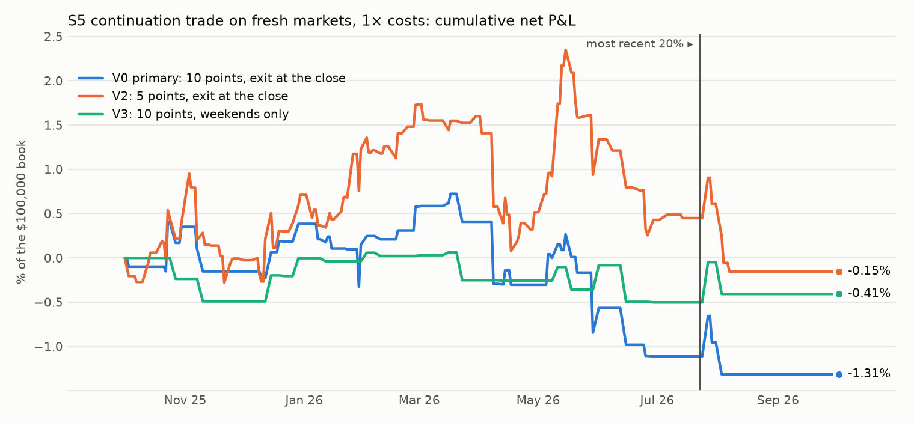
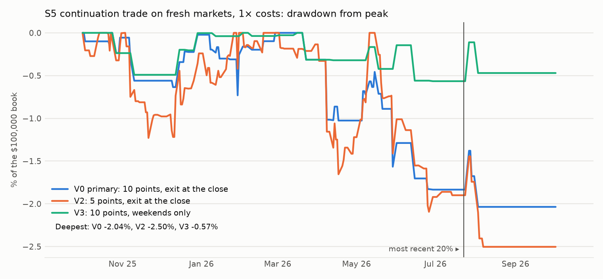

# S5: do the S4 findings hold on markets S4 never used?

Method, pre-registered before any S5 price was pulled: [`research/s5_big_moves/METHOD.md`](../../s5_big_moves/METHOD.md) (commit `3f0539e`). Files: [`metrics.csv`](metrics.csv), [`trades.csv`](trades.csv), [`links.csv`](links.csv), [`regressions.csv`](regressions.csv), [`buckets.csv`](buckets.csv), [`universe.csv`](universe.csv), [`capacity.md`](capacity.md), [`RUN_LOG.md`](RUN_LOG.md).

## Answer

**P1, the replication: replicates.** On 93 fresh markets linked to 27 tickers (14,439 link-days, 252 dates), a 1-point overnight move in odds comes with a +6.88 bp excess gap in the linked equity at the open (t = 6.01; S4 found +4.69, t = 4.01). After the open: -0.55 bp per point (t = -0.74). On sessions from 2026-07-01, which the labelling models cannot have seen (amendment 1): +5.91 bp per point (t = 6.54, 693 link-days).

**P2, the trade: not a pass.** Buying (or shorting) the linked equity at the open after an overnight move of 10 points or more, exit at the close: 94 trades on 15 tickers and 46 dates, -14.0 bp net per trade at 1× costs (95% interval -50.9 to 24.1), -7.4 bp before costs, -20.6 bp net at 2× costs. Sharpe -0.72, maximum drawdown 2.04% of a $100,000 book.

After a move of 10 points or more the gap is +137 bp in the direction of the odds [+90, +187] (478 link-days, 92 dates, same sign 74%); S4 had +91 bp [+40, +145].

## P1: the opening gap and the odds

| Sample | Opening gap, bp per point | After the open, bp per point |
|---|---|---|
| all link-days | +6.88 (t +6.0, n 14,439) | -0.55 (t -0.7, n 14,439) |
| one per ticker and day | +5.99 (t +6.5, n 3,948) | -0.03 (t -0.0, n 3,948) |
| weekends only | +5.79 (t +5.0, n 3,249) | +0.35 (t +0.4, n 3,249) |
| without crypto-linked equities | +6.95 (t +5.9, n 13,887) | -0.54 (t -0.7, n 13,887) |
| earlier 80% of sessions | +6.89 (t +5.7, n 14,103) | -0.55 (t -0.7, n 14,103) |
| most recent 20% of sessions | +6.57 (t +7.9, n 336) | -0.63 (t -0.4, n 336) |
| sessions from 2026-07-01 (after the labellers' knowledge) | +5.91 (t +6.5, n 693) | -0.07 (t -0.0, n 693) |
| sessions before 2026-07-01 | +6.95 (t +5.7, n 13,746) | -0.59 (t -0.7, n 13,746) |
| links that pass the data gate | +7.04 (t +6.1, n 1,717) | -0.12 (t -0.1, n 1,717) |

Through-origin slopes, errors clustered by date. The gap and the odds move are measured over the same closure: this is co-movement, not a forecast. The second column is the part a trade at the open could earn.

## How big, by size of the overnight move

| Closures | Overnight odds move | Link-days | Dates | Gap, signed by the odds move | Same sign | After the open, to the close |
|---|---|---|---|---|---|---|
| all closures | 2 to 5 points | 1972 | 204 | +15 bp [+6, +24] | 54% | -2 bp [-9, +5] |
| all closures | 5 to 10 points | 849 | 152 | +64 bp [+41, +85] | 63% | +3 bp [-11, +17] |
| all closures | 10 or more points | 478 | 92 | +137 bp [+90, +187] | 74% | -7 bp [-40, +24] |
| weekends only | 2 to 5 points | 537 | 44 | +8 bp [-13, +29] | 49% | +7 bp [-6, +21] |
| weekends only | 5 to 10 points | 275 | 41 | +72 bp [+37, +106] | 66% | +13 bp [-9, +34] |
| weekends only | 10 or more points | 219 | 34 | +125 bp [+68, +172] | 74% | +23 bp [-19, +62] |

Share of link-days by move: 2 to 5 points 13.7%, 5 to 10 points 5.9%, 10 or more points 3.3%. The gap's standard deviation is 125 bp.

## P2: the trade (primary V0)

| Segment | Variant | Costs | Trades | Tickers | Dates | Net P&L | Net per trade | 95% interval | Gross per trade | Winners | Sharpe | Deflated Sharpe prob. | Max DD | Worst month | Turnover / yr |
|---|---|---|---|---|---|---|---|---|---|---|---|---|---|---|---|
| all | V0 (primary) | 1× | 94 | 15 | 46 | -$1,313 | -14.0 bp | [-50.9, 24.1] | -7.4 bp | 37% | -0.72 | 0.162 | 2.04% | -0.71% | 41.4× |
| earlier | V0 (primary) | 1× | 85 | 15 | 43 | -$1,111 | -13.1 bp | [-53.3, 25.1] | -6.4 bp | 39% | -0.73 | 0.152 | 1.83% | -0.71% | 47.4× |
| recent | V0 (primary) | 1× | 9 | 3 | 3 | -$202 | -22.4 bp | [n/a, n/a] | -16.5 bp | 22% | -0.68 | 0.173 | 0.66% | -0.36% | 17.5× |
| from 2026-07-01 | V0 (primary) | 1× | 9 | 3 | 3 | -$202 | -22.4 bp | [n/a, n/a] | -16.5 bp | 22% | -0.60 | 0.173 | 0.66% | -0.36% | 13.6× |
| all | V0 (primary) | 2× | 94 | 15 | 46 | -$1,935 | -20.6 bp | [-57.4, 17.4] | -7.4 bp | 36% | -1.05 | 0.096 | 2.35% | -0.76% | 41.4× |
| earlier | V0 (primary) | 2× | 85 | 15 | 43 | -$1,679 | -19.8 bp | [-60.0, 18.8] | -6.4 bp | 38% | -1.10 | 0.110 | 2.10% | -0.76% | 47.4× |
| recent | V0 (primary) | 2× | 9 | 3 | 3 | -$255 | -28.4 bp | [n/a, n/a] | -16.5 bp | 22% | -0.86 | 0.149 | 0.69% | -0.38% | 17.5× |
| from 2026-07-01 | V0 (primary) | 2× | 9 | 3 | 3 | -$255 | -28.4 bp | [n/a, n/a] | -16.5 bp | 22% | -0.75 | 0.148 | 0.69% | -0.38% | 13.6× |





| Criterion | Result | Evidence |
|---|---|---|
| At least 30 trades on at least 15 dates and 8 tickers | pass | 94 trades, 46 dates, 15 tickers |
| Mean net return per trade above zero, date-bootstrap 95% interval excluding zero (1× costs) | **fail** | -14.0 bp [-50.9, 24.1] |
| Mean net return above zero at 2× costs | **fail** | -20.6 bp |
| Mean net return above zero in both time segments | **fail** | earlier -13.1 bp on 85; recent -22.4 bp on 9 |

**Verdict: not a pass.**

## Exploratory: who moves first inside the session? (S5b)

Designed after the S5 run (amendment 2). Regular session, 5-minute bins: 1,127,527 link-bins on 220 links and 253 dates; 3,978 bins with an odds jump of 3 points or more, 13,476 with an equity jump of 50 bp or more.

| Next | After an odds jump: equity, bp | Equity on odds, bp per point | After an equity jump: odds, points | Odds on equity, points per 100 bp |
|---|---|---|---|---|
| 5 min | +1.31 [+0.41, +2.18] | +0.156 (t +2.5) | +0.06 [+0.03, +0.10] | +0.066 (t +4.3) |
| 15 min | +1.84 [-0.32, +4.07] | +0.228 (t +1.7) | +0.11 [+0.07, +0.15] | +0.104 (t +5.0) |
| 30 min | +2.05 [-0.21, +4.56] | +0.339 (t +2.5) | +0.12 [+0.07, +0.16] | +0.127 (t +4.9) |
| 60 min | +0.18 [-4.41, +4.46] | +0.014 (t +0.1) | +0.10 [+0.05, +0.15] | +0.130 (t +4.1) |

- **Each leads the other a little, and neither by enough to trade.** After a 3-point jump in the odds the equity moves about 2 bp more over the next half hour. After a 50 bp jump in the equity the odds move about 0.1 point more.
- **The odds-first trade loses.** Entering the equity in the bin after an odds jump and holding 30 minutes: 1,469 trades, +1.8 bp before costs [-0.7, +4.4], -4.3 bp after [-6.9, -1.8]; -10.4 bp at 2× costs.
- **The equity-first direction is statistically clear (t about 5) and economically nothing:** 0.1 point of odds against a Polymarket round trip of about 2.0 points (measured on the live books of 18 open linked markets priced between 0.10 and 0.90: one spread plus two fees, quartiles 1.2 to 2.4; $786 at the touch).

## Exploratory: do the odds give back their overnight move? (amendment 3)

The 93 S5 markets, odds only. After an overnight move, the odds retrace part of it during the next session: slope -0.127 (t = -3.2, 6,229 market-days).

| Overnight move | Cases | Dates | Average move | Change by the close, signed by the move | By the next 09:29 |
|---|---|---|---|---|---|
| 5 points or more | 553 | 172 | 11.3 points | -1.55 points [-2.30, -0.88] | -1.11 |
| 10 points or more | 198 | 92 | 19.0 points | -2.86 points [-4.37, -1.40] | -1.87 [-4.23, +0.44] |
| 10 points or more, weekends only | 89 | 34 | 20.0 points | -1.37 points [-3.66, +0.77] | |

A give-back of about 2.9 points after a 19-point move is significant in this price series. A round trip costs about 2.0 points (measured on the live books of 18 open linked markets priced between 0.10 and 0.90: one spread plus two fees, quartiles 1.2 to 2.4; $786 at the touch). So after 10-point moves the point estimate is a little above the cost and its interval (1.4 to 4.4 points) straddles it; after 5-point moves it is below the cost. Three reasons not to call it an edge: it is not significant by the next morning or on weekends alone; a give-back is exactly what bid-ask bounce in a history of last trades and midpoints looks like (S1 showed how far such prices can be from executable ones); and the size on offer at the touch is a few hundred dollars. Only recorded order books can settle it.

## The links

2,400 events scanned, 892 markets eligible, the 240 with the largest volume kept. Two blind labellers per question: both called 124 of 240 questions an event; they agreed on 220 links (ticker and direction) across 93 markets, named a ticker the other did not 47 times, and named the same ticker with opposite directions 0 times. 220 links have odds inside the window. Tickers with the most links: USO 41, XLE 30, SHY 25, IEF 23, SPY 18, TLT 16, XOP 7, EPOL 7, VGK 7, GLD 5.

## Costs and capacity

Round trip on the primary's trades: 6.6 bp at 1×, 13.2 bp at 2× (per side: SPY 1 bp, liquid names 2 bp, others 5 bp; sources in S4's METHOD section 3). Capacity: [`capacity.md`](capacity.md).

## Every variant tried

| Segment | Variant | Costs | Trades | Tickers | Dates | Net P&L | Net per trade | 95% interval | Gross per trade | Winners | Sharpe | Deflated Sharpe prob. | Max DD | Worst month | Turnover / yr |
|---|---|---|---|---|---|---|---|---|---|---|---|---|---|---|---|
| all | V0 (primary) | 1× | 94 | 15 | 46 | -$1,313 | -14.0 bp | [-50.9, 24.1] | -7.4 bp | 37% | -0.72 | 0.162 | 2.04% | -0.71% | 41.4× |
| earlier | V0 (primary) | 1× | 85 | 15 | 43 | -$1,111 | -13.1 bp | [-53.3, 25.1] | -6.4 bp | 39% | -0.73 | 0.152 | 1.83% | -0.71% | 47.4× |
| recent | V0 (primary) | 1× | 9 | 3 | 3 | -$202 | -22.4 bp | [n/a, n/a] | -16.5 bp | 22% | -0.68 | 0.173 | 0.66% | -0.36% | 17.5× |
| from 2026-07-01 | V0 (primary) | 1× | 9 | 3 | 3 | -$202 | -22.4 bp | [n/a, n/a] | -16.5 bp | 22% | -0.60 | 0.173 | 0.66% | -0.36% | 13.6× |
| all | V0 (primary) | 2× | 94 | 15 | 46 | -$1,935 | -20.6 bp | [-57.4, 17.4] | -7.4 bp | 36% | -1.05 | 0.096 | 2.35% | -0.76% | 41.4× |
| earlier | V0 (primary) | 2× | 85 | 15 | 43 | -$1,679 | -19.8 bp | [-60.0, 18.8] | -6.4 bp | 38% | -1.10 | 0.110 | 2.10% | -0.76% | 47.4× |
| recent | V0 (primary) | 2× | 9 | 3 | 3 | -$255 | -28.4 bp | [n/a, n/a] | -16.5 bp | 22% | -0.86 | 0.149 | 0.69% | -0.38% | 17.5× |
| from 2026-07-01 | V0 (primary) | 2× | 9 | 3 | 3 | -$255 | -28.4 bp | [n/a, n/a] | -16.5 bp | 22% | -0.75 | 0.148 | 0.69% | -0.38% | 13.6× |
| all | V1 | 1× | 94 | 15 | 46 | -$363 | -3.9 bp | [-21.3, 14.6] | +2.7 bp | 34% | -0.41 | 0.258 | 0.63% | -0.31% | 41.4× |
| earlier | V1 | 1× | 85 | 15 | 43 | -$205 | -2.4 bp | [-22.5, 19.0] | +4.3 bp | 35% | -0.26 | 0.281 | 0.63% | -0.31% | 47.4× |
| recent | V1 | 1× | 9 | 3 | 3 | -$158 | -17.5 bp | [n/a, n/a] | -11.6 bp | 22% | -3.42 | 0.000 | 0.16% | -0.08% | 17.5× |
| from 2026-07-01 | V1 | 1× | 9 | 3 | 3 | -$158 | -17.5 bp | [n/a, n/a] | -11.6 bp | 22% | -2.99 | 0.000 | 0.16% | -0.08% | 13.6× |
| all | V1 | 2× | 94 | 15 | 46 | -$984 | -10.5 bp | [-27.7, 7.9] | +2.7 bp | 32% | -1.11 | 0.099 | 0.98% | -0.36% | 41.4× |
| earlier | V1 | 2× | 85 | 15 | 43 | -$773 | -9.1 bp | [-29.1, 12.3] | +4.3 bp | 33% | -0.99 | 0.145 | 0.90% | -0.36% | 47.4× |
| recent | V1 | 2× | 9 | 3 | 3 | -$211 | -23.5 bp | [n/a, n/a] | -11.6 bp | 22% | -3.62 | 0.000 | 0.21% | -0.11% | 17.5× |
| from 2026-07-01 | V1 | 2× | 9 | 3 | 3 | -$211 | -23.5 bp | [n/a, n/a] | -11.6 bp | 22% | -3.17 | 0.000 | 0.21% | -0.11% | 13.6× |
| all | V2 | 1× | 270 | 21 | 111 | -$154 | -0.6 bp | [-20.4, 18.7] | +6.1 bp | 41% | -0.06 | 0.380 | 2.50% | -1.09% | 116.0× |
| earlier | V2 | 1× | 255 | 21 | 106 | +$449 | +1.8 bp | [-18.2, 20.9] | +8.5 bp | 43% | 0.20 | 0.432 | 2.09% | -1.09% | 138.0× |
| recent | V2 | 1× | 15 | 3 | 5 | -$604 | -40.2 bp | [-108.3, 64.2] | -34.3 bp | 13% | -1.84 | 0.077 | 1.06% | -0.76% | 29.1× |
| from 2026-07-01 | V2 | 1× | 21 | 6 | 7 | -$583 | -27.8 bp | [-84.0, 39.7] | -22.0 bp | 19% | -1.56 | 0.080 | 1.06% | -0.76% | 30.0× |
| all | V2 | 2× | 270 | 21 | 111 | -$1,955 | -7.2 bp | [-27.0, 12.0] | +6.1 bp | 40% | -0.75 | 0.170 | 2.95% | -1.27% | 116.0× |
| earlier | V2 | 2× | 255 | 21 | 106 | -$1,262 | -5.0 bp | [-25.0, 14.1] | +8.5 bp | 42% | -0.56 | 0.242 | 2.40% | -1.27% | 138.0× |
| recent | V2 | 2× | 15 | 3 | 5 | -$692 | -46.2 bp | [-114.2, 58.3] | -34.3 bp | 13% | -2.07 | 0.058 | 1.13% | -0.81% | 29.1× |
| from 2026-07-01 | V2 | 2× | 21 | 6 | 7 | -$704 | -33.5 bp | [-89.9, 34.0] | -22.0 bp | 19% | -1.85 | 0.055 | 1.13% | -0.81% | 30.0× |
| all | V3 | 1× | 43 | 13 | 19 | -$407 | -9.5 bp | [-56.2, 36.1] | -2.9 bp | 37% | -0.40 | 0.259 | 0.57% | -0.36% | 18.8× |
| earlier | V3 | 1× | 37 | 13 | 17 | -$502 | -13.6 bp | [-59.2, 32.0] | -6.9 bp | 38% | -0.67 | 0.162 | 0.57% | -0.27% | 20.6× |
| recent | V3 | 1× | 6 | 3 | 2 | +$95 | +15.9 bp | [n/a, n/a] | +21.8 bp | 33% | 0.36 | 0.307 | 0.36% | -0.36% | 11.7× |
| from 2026-07-01 | V3 | 1× | 6 | 3 | 2 | +$95 | +15.9 bp | [n/a, n/a] | +21.8 bp | 33% | 0.32 | 0.308 | 0.36% | -0.36% | 9.0× |
| all | V3 | 2× | 43 | 13 | 19 | -$688 | -16.0 bp | [-62.8, 29.2] | -2.9 bp | 35% | -0.67 | 0.187 | 0.75% | -0.38% | 18.8× |
| earlier | V3 | 2× | 37 | 13 | 17 | -$748 | -20.2 bp | [-65.7, 25.4] | -6.9 bp | 35% | -0.98 | 0.122 | 0.75% | -0.32% | 20.6× |
| recent | V3 | 2× | 6 | 3 | 2 | +$60 | +9.9 bp | [n/a, n/a] | +21.8 bp | 33% | 0.23 | 0.283 | 0.38% | -0.38% | 11.7× |
| from 2026-07-01 | V3 | 2× | 6 | 3 | 2 | +$60 | +9.9 bp | [n/a, n/a] | +21.8 bp | 33% | 0.20 | 0.283 | 0.38% | -0.38% | 9.0× |

The deflated Sharpe probability uses 4 trials. The whole S5 sample is out-of-sample for the rule (it was fixed on S4's markets); "earlier" and "recent" split it by time.

## Caveats

- Links are judgements of two models; agreement is not truth.
- **Hindsight.** Most S5 markets have resolved, and one labeller said some of its links draw on how markets reacted at the time. Figures on sessions from 2026-07-01 are free of that; figures before it may be inflated.
- A resolved market's last big move is the news itself, when the equity's own news flow is heaviest.
- Fills at the first regular bar's open stand for the opening auction.
- S4 and S5 overlap in calendar time: different markets, same market regimes.

## Reproduce

```
cd research
python -m s5_big_moves.universe
python -m s5_big_moves.run links
python -m s5_big_moves.run pull
python -m s5_big_moves.run
python -m s5_big_moves.report
python -m pytest s5_big_moves/tests -q
```
