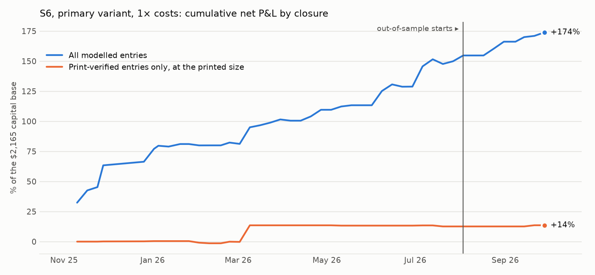
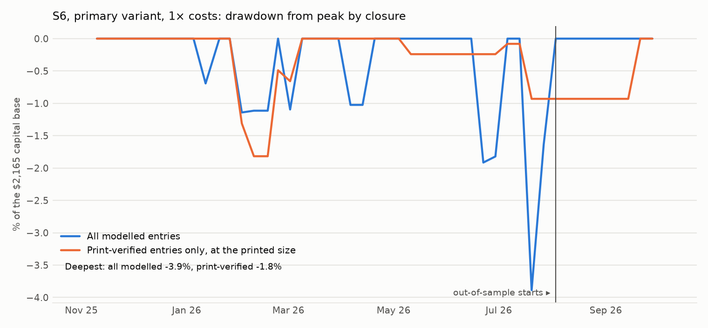

# S6: on Monday morning, bet with the options against the prediction market

Method, pre-registered before any P&L of this trade was computed: [`research/s6_monday_fade/METHOD.md`](../../s6_monday_fade/METHOD.md) (commit `7ef1a8d`). Data: R3's `research/results/open_options/events.csv` (1,535 events, 45 closures from 2025-11-10 to 2026-09-28). Files: [`metrics.csv`](metrics.csv), [`trades.csv`](trades.csv), [`capacity.md`](capacity.md), [`RUN_LOG.md`](RUN_LOG.md).

## Answer

**Verdict on the pre-registered criterion: too few observations.** Out-of-sample (9 closures from 2026-08-03) has 16 trades on 6 closures, against the 30 the criterion needs.

**What the confirmed trades show.** Over the whole year, 21 of the 187 entries have a public Polymarket trade print at the price the trade needs. 15 of the 21 won. At the printed size they average +$14.02 per trade of up to 100 contracts (closure-bootstrap 95% interval -3.99 to 36.94): positive, and not distinguishable from zero.

**The modelled backtest is not evidence.** All 187 entries: +$20.14 per trade [15.08, 26.28], 78% winners, Sharpe 4.27. The 166 entries with no print carry +$3,364.15 of the +$3,765.41. 54 of the 187 entries have a Polymarket "price" between 0.45 and 0.55, the midpoint of an empty or very wide book. It is the S1 artifact again.

## Headline numbers (primary V0: gap of 2 points beyond the options' band after costs, held to resolution)

| Segment | Variant | Costs | Trades | Closures | Net P&L | Per trade | 95% interval | Winners | Sharpe | Deflated Sharpe prob. | Max DD | Worst month | Turnover / yr | Print-verified | Per verified trade | 95% interval  |
|---|---|---|---|---|---|---|---|---|---|---|---|---|---|---|---|---|
| IS | V0 (primary) | 1× | 171 | 30 | +$3,245.64 | +$18.98 | [13.62, 25.36] | 77% | 4.18 | 1.000 | 3.9% | 1.2% | 6.4× | 20 of 171 | +$13.66 | [-4.69, 38.48] |
| OOS | V0 (primary) | 1× | 16 | 6 | +$519.77 | +$32.49 | [25.32, 43.01] | 88% | 7.70 | 0.996 | 0.0% | 7.7% | 2.3× | 1 of 16 | +$21.31 | [n/a, n/a] |
| ALL | V0 (primary) | 1× | 187 | 36 | +$3,765.41 | +$20.14 | [15.08, 26.28] | 78% | 4.27 | 1.000 | 3.9% | 1.2% | 5.5× | 21 of 187 | +$14.02 | [-3.99, 36.94] |
| IS | V0 (primary) | 2× | 105 | 19 | +$2,230.88 | +$21.25 | [13.48, 28.30] | 85% | 3.57 | 0.972 | 3.3% | -1.9% | 6.5× | 8 of 105 | +$11.81 | [-1.43, 21.24] |
| OOS | V0 (primary) | 2× | 5 | 2 | +$93.58 | +$18.72 | [n/a, n/a] | 80% | 2.07 | 0.819 | 0.8% | 0.0% | 1.2× | 0 of 5 | n/a | [n/a, n/a] |
| ALL | V0 (primary) | 2× | 110 | 21 | +$2,324.46 | +$21.13 | [12.95, 27.87] | 85% | 3.25 | 0.985 | 3.3% | -1.9% | 5.5× | 8 of 110 | +$11.81 | [-1.43, 21.24] |

100 contracts per trade. Capital base $2,165, the largest amount deployed on one closure. Sharpe on closure returns, 51 closures a year.





## Pre-registered success criterion

| Criterion | Result | Evidence |
|---|---|---|
| At least 30 OOS trades on at least 5 OOS closures | **fail** | 16 trades, 6 closures |
| OOS mean net P&L per trade above zero, closure-bootstrap interval excluding zero (1× costs) | pass | +$32.49 [25.32, 43.01] |
| OOS above zero at 2× costs | pass | +$18.72 on 5 trades |
| In-sample above zero | pass | +$18.98 on 171 trades |
| At least half of OOS entries print-verified, and those above zero | **fail** | 1 of 16 verified |

**Verdict: too few observations.**

## The print-verified entries (primary, 1× costs)

| Reopening day | Question | Trade | Polymarket at 09:45 | Options' band | Entry | Result | P&L, 100 contracts | Printed shares |
|---|---|---|---|---|---|---|---|---|
| 2025-11-28 | Will Tesla (TSLA) close above $440 end of November? | sell YES | 0.155 | 0.07 to 0.07 | 0.110 | NO | +$10.61 | 30 |
| 2025-12-26 | Will Google (GOOGL) finish week of December 22 above $315? | sell YES | 0.545 | 0.39 to 0.41 | 0.500 | NO | +$49.00 | 32 |
| 2025-12-26 | Will NVIDIA (NVDA) finish week of December 22 above $190? | sell YES | 0.910 | 0.79 to 0.81 | 0.865 | YES | -$13.97 | 100 |
| 2026-01-02 | Will Google (GOOGL) finish week of December 29 above $315? | buy YES | 0.605 | 0.80 to 1.00 | 0.650 | YES | +$34.09 | 13 |
| 2026-02-02 | Will Amazon (AMZN) close above $245 on February 2? | sell YES | 0.292 | 0.10 to 0.11 | 0.247 | NO | +$24.01 | 440 |
| 2026-02-02 | Will Google (GOOGL) close above $340 on February 2? | sell YES | 0.380 | 0.24 to 0.26 | 0.335 | YES | -$67.39 | 222 |
| 2026-02-02 | Will Google (GOOGL) close above $345 on February 2? | sell YES | 0.199 | 0.05 to 0.06 | 0.153 | NO | +$14.83 | 110 |
| 2026-02-02 | Will Google (GOOGL) close above $350 on February 2? | sell YES | 0.085 | 0.00 to 0.01 | 0.040 | NO | +$3.85 | 5 |
| 2026-02-09 | Will Meta (META) close above $670 on February 9? | sell YES | 0.480 | 0.28 to 0.37 | 0.435 | YES | -$57.48 | 267 |
| 2026-02-09 | Will Tesla (TSLA) close above $410 on February 9? | buy YES | 0.480 | 0.60 to 0.65 | 0.525 | YES | +$46.50 | 257 |
| 2026-02-23 | Will NVIDIA (NVDA) close above $195 on February 23? | sell YES | 0.341 | 0.19 to 0.20 | 0.296 | NO | +$28.77 | 1,632 |
| 2026-03-02 | Will Amazon (AMZN) close above $210 on March 2? | buy YES | 0.185 | 0.26 to 0.28 | 0.230 | NO | -$23.71 | 15 |
| 2026-03-09 | Will Amazon (AMZN) close above $210 on March 9? | buy YES | 0.360 | 0.45 to 0.48 | 0.405 | YES | +$58.54 | 162 |
| 2026-03-09 | Will Google (GOOGL) close above $300 on March 9? | buy YES | 0.090 | 0.17 to 0.19 | 0.135 | YES | +$86.03 | 220 |
| 2026-03-09 | Will Tesla (TSLA) close above $390 on March 9? | buy YES | 0.270 | 0.35 to 0.37 | 0.315 | YES | +$67.64 | 233 |
| 2026-03-09 | Will NVIDIA (NVDA) close above $180 on March 9? | buy YES | 0.090 | 0.18 to 0.18 | 0.135 | YES | +$86.03 | 459 |
| 2026-05-11 | S&P 500 (SPY) closes above $740 on May 11? | buy YES | 0.160 | 0.29 to 0.30 | 0.205 | NO | -$21.15 | 1,794 |
| 2026-05-11 | S&P 500 (SPY) closes above $735 on May 11? | buy YES | 0.790 | 0.87 to 0.90 | 0.835 | YES | +$15.95 | 383 |
| 2026-07-06 | Will Google (GOOGL) close above $360 on July 6? | buy YES | 0.255 | 0.41 to 0.68 | 0.300 | YES | +$69.16 | 5 |
| 2026-07-20 | S&P 500 (SPY) closes above $750 on July 20? | buy YES | 0.260 | 0.35 to 0.36 | 0.305 | NO | -$31.35 | 59 |
| 2026-09-21 | S&P 500 (SPY) closes above $765 on September 21? | buy YES | 0.735 | 0.83 to 0.84 | 0.780 | YES | +$21.31 | 300 |

A print confirms that the price traded within ten minutes of 09:45. Four of these entries are on one morning (2026-03-09), which is why the interval is wide.

## Costs

- **Polymarket half-spread: 4.5 points**, measured on this weekend's recorded books of 158 threshold markets (quartiles 4.0 to 6.5). Historical books are not published.
- **Polymarket fee:** 0.04 × P × (1 − P) per contract, the market's own schedule.
- **In bp of the capital locked:** 1,111 bp per trade at 1×, 1,852 bp at 2×. No option is traded, so there is no option cost.

## Capacity

See [`capacity.md`](capacity.md). Short version: about $2 at the best price on a weekend.

## Every variant tried

| Segment | Variant | Costs | Trades | Closures | Net P&L | Per trade | 95% interval | Winners | Sharpe | Deflated Sharpe prob. | Max DD | Worst month | Turnover / yr | Print-verified | Per verified trade | 95% interval  |
|---|---|---|---|---|---|---|---|---|---|---|---|---|---|---|---|---|
| IS | V0 (primary) | 1× | 171 | 30 | +$3,245.64 | +$18.98 | [13.62, 25.36] | 77% | 4.18 | 1.000 | 3.9% | 1.2% | 6.4× | 20 of 171 | +$13.66 | [-4.69, 38.48] |
| OOS | V0 (primary) | 1× | 16 | 6 | +$519.77 | +$32.49 | [25.32, 43.01] | 88% | 7.70 | 0.996 | 0.0% | 7.7% | 2.3× | 1 of 16 | +$21.31 | [n/a, n/a] |
| ALL | V0 (primary) | 1× | 187 | 36 | +$3,765.41 | +$20.14 | [15.08, 26.28] | 78% | 4.27 | 1.000 | 3.9% | 1.2% | 5.5× | 21 of 187 | +$14.02 | [-3.99, 36.94] |
| IS | V0 (primary) | 2× | 105 | 19 | +$2,230.88 | +$21.25 | [13.48, 28.30] | 85% | 3.57 | 0.972 | 3.3% | -1.9% | 6.5× | 8 of 105 | +$11.81 | [-1.43, 21.24] |
| OOS | V0 (primary) | 2× | 5 | 2 | +$93.58 | +$18.72 | [n/a, n/a] | 80% | 2.07 | 0.819 | 0.8% | 0.0% | 1.2× | 0 of 5 | n/a | [n/a, n/a] |
| ALL | V0 (primary) | 2× | 110 | 21 | +$2,324.46 | +$21.13 | [12.95, 27.87] | 85% | 3.25 | 0.985 | 3.3% | -1.9% | 5.5× | 8 of 110 | +$11.81 | [-1.43, 21.24] |
| IS | V1 | 1× | 124 | 23 | +$2,898.15 | +$23.37 | [16.11, 29.33] | 81% | 3.68 | 1.000 | 5.7% | 0.1% | 6.6× | 11 of 124 | -$2.03 | [-8.55, 8.13] |
| OOS | V1 | 1× | 10 | 4 | +$295.34 | +$29.53 | [n/a, n/a] | 80% | 4.89 | 0.990 | 0.0% | 2.4% | 1.9× | 0 of 10 | n/a | [n/a, n/a] |
| ALL | V1 | 1× | 134 | 27 | +$3,193.49 | +$23.83 | [16.94, 29.20] | 81% | 3.56 | 1.000 | 5.7% | 0.1% | 5.7× | 11 of 134 | -$2.03 | [-8.55, 8.13] |
| IS | V1 | 2× | 80 | 17 | +$2,000.52 | +$25.01 | [14.63, 33.57] | 88% | 3.32 | 0.924 | 10.0% | 0.0% | 7.6× | 3 of 80 | +$16.98 | [n/a, n/a] |
| OOS | V1 | 2× | 5 | 2 | +$93.58 | +$18.72 | [n/a, n/a] | 80% | 2.07 | 0.819 | 1.3% | 0.0% | 1.8× | 0 of 5 | n/a | [n/a, n/a] |
| ALL | V1 | 2× | 85 | 19 | +$2,094.10 | +$24.64 | [14.08, 33.13] | 87% | 3.04 | 0.955 | 10.0% | 0.0% | 6.4× | 3 of 85 | +$16.98 | [n/a, n/a] |
| IS | V2 | 1× | 171 | 30 | +$3,245.64 | +$18.98 | [13.62, 25.36] | 77% | 4.18 | 1.000 | 3.9% | 1.2% | 6.4× | 20 of 171 | +$13.66 | [-4.69, 38.48] |
| OOS | V2 | 1× | 16 | 6 | +$519.77 | +$32.49 | [25.32, 43.01] | 88% | 7.70 | 0.996 | 0.0% | 7.7% | 2.3× | 1 of 16 | +$21.31 | [n/a, n/a] |
| ALL | V2 | 1× | 187 | 36 | +$3,765.41 | +$20.14 | [15.08, 26.28] | 78% | 4.27 | 1.000 | 3.9% | 1.2% | 5.5× | 21 of 187 | +$14.02 | [-3.99, 36.94] |
| IS | V2 | 2× | 105 | 19 | +$2,230.88 | +$21.25 | [13.48, 28.30] | 85% | 3.57 | 0.972 | 3.3% | -1.9% | 6.5× | 8 of 105 | +$11.81 | [-1.43, 21.24] |
| OOS | V2 | 2× | 5 | 2 | +$93.58 | +$18.72 | [n/a, n/a] | 80% | 2.07 | 0.819 | 0.8% | 0.0% | 1.2× | 0 of 5 | n/a | [n/a, n/a] |
| ALL | V2 | 2× | 110 | 21 | +$2,324.46 | +$21.13 | [12.95, 27.87] | 85% | 3.25 | 0.985 | 3.3% | -1.9% | 5.5× | 8 of 110 | +$11.81 | [-1.43, 21.24] |
| IS | V3 | 1× | 171 | 30 | +$430.95 | +$2.52 | [-2.28, 10.51] | 48% | 1.06 | 0.399 | 15.1% | -7.1% | 6.4× | 20 of 171 | +$9.92 | [-7.77, 33.27] |
| OOS | V3 | 1× | 16 | 6 | +$264.98 | +$16.56 | [5.03, 32.21] | 75% | 5.68 | 0.992 | 0.2% | 4.6% | 2.3× | 1 of 16 | +$16.12 | [n/a, n/a] |
| ALL | V3 | 1× | 187 | 36 | +$695.93 | +$3.72 | [-0.82, 11.08] | 50% | 1.49 | 0.611 | 15.1% | -7.1% | 5.5× | 21 of 187 | +$10.22 | [-6.94, 31.86] |
| IS | V3 | 2× | 105 | 19 | -$598.72 | -$5.70 | [-10.77, 2.17] | 39% | -1.58 | 0.000 | 51.1% | -39.5% | 6.5× | 8 of 105 | -$2.82 | [-13.66, 6.15] |
| OOS | V3 | 2× | 5 | 2 | +$75.89 | +$15.18 | [n/a, n/a] | 100% | 3.52 | 0.972 | 0.0% | 0.0% | 1.2× | 0 of 5 | n/a | [n/a, n/a] |
| ALL | V3 | 2× | 110 | 21 | -$522.83 | -$4.75 | [-10.08, 2.78] | 42% | -1.21 | 0.000 | 51.1% | -39.5% | 5.5× | 8 of 110 | -$2.82 | [-13.66, 6.15] |

V2 (every pair with valid measurements) is identical to V0: R3's file keeps full measurements only for its events, so there were no extra rows to add. The deflated Sharpe probability uses 4 trials.

## Sharpe above 3: the bug hunt

| Check | Outcome |
|---|---|
| The signal uses only 09:45 prices | Yes: `pm_0945` and the options' band at 09:45. Tests pin the rule. |
| The result is never an input | Yes: `outcome` enters only the P&L. |
| Costs on every trade | Yes: half-spread and fee on entry, and again on the end-of-day exit variant. |
| **Polymarket prices that are not prices** | **This is the cause.** 166 of 187 entries have no print at the assumed price, and 54 sit near 0.50. R3 removed prices of exactly 0.500 at the close and the open; near-0.50 midpoints at 09:45 remain. |

## What didn't work

- **Too few out-of-sample trades** (16) for any verdict.
- **Only 11% of entries are print-verified**, and the verified ones are not significant.
- **Closing at the end of the reopening day (V3)** earns +$3.72 per trade at 1× costs and -$4.75 at 2×: the second spread eats it.

## Caveats

- Unhedged: a closure's trades win or lose together when the stock moves through its strikes.
- The half-spread is measured on one weekend, not on the mornings traded.
- One year, 45 closures.

## Reproduce

```
cd research
python -m s6_monday_fade.run
python -m s6_monday_fade.report
python -m pytest s6_monday_fade/tests -q
```
