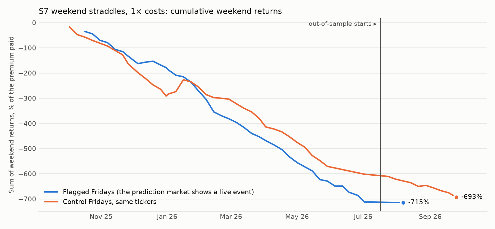
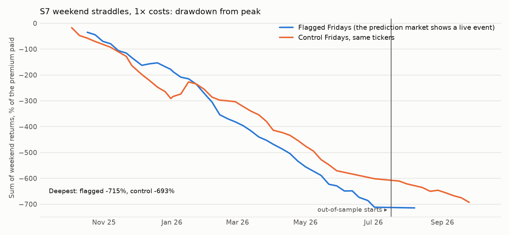

# S7: are options too cheap on Friday when the prediction market shows a live event?

Method, pre-registered before any option price was pulled: [`research/s7_weekend_straddle/METHOD.md`](../../s7_weekend_straddle/METHOD.md) (commit `8b4e914`). 55 weekend and holiday closures, Fridays 2025-10-03 to 2026-09-25; out-of-sample is the last 11 (from 2026-07-17). Files: [`metrics.csv`](metrics.csv), [`trades.csv`](trades.csv), [`capacity.md`](capacity.md), [`RUN_LOG.md`](RUN_LOG.md).

## Answer

**Verdict on the pre-registered criterion: too few observations.** Out-of-sample has 3 flagged trades on 1 weekend: the events that made the odds active had ended by then. Over the whole year the answer is a clear no: Friday straddles lose, and flagged Fridays do no better than ordinary ones.

- **Does the flag find the weekends that move?** On flagged Fridays the underlying moved 129 bp on average by Monday's open; on control Fridays, 105 bp.
- **Did the straddle pay?** Flagged, net of every spread and commission: -17.7% of the premium per trade (95% interval -20.8% to -14.7%; 161 trades on 40 weekends). Before costs, mid to mid: -1.0%. At 2× costs: -30.4%.
- **Against ordinary weekends:** control straddles returned -17.6% net (-2.0% mid to mid). Flagged minus control: -0.1% [-3.9%, +3.7%].

## Headline numbers (primary V0: activity of 4 points, odds between 10% and 90%)

| Variant | Costs | Segment | Flagged trades | Weekends | Net return, flagged | 95% interval | Winners | Mid-to-mid, flagged | Underlying move, flagged | Control trades | Net return, control | Mid-to-mid, control | Underlying move, control | Flagged minus control | Sharpe | Max DD | Worst month |
|---|---|---|---|---|---|---|---|---|---|---|---|---|---|---|---|---|---|
| V0 (primary) | 1× | IS | 158 | 39 | -18.0% | [-21.0%, -15.0%] | 13% | -1.2% | 129 bp | 117 | -17.7% | -2.0% | 106 bp | -0.3% [-4.0%, +3.6%] | -10.03 | 712% | -110% |
| V0 (primary) | 1× | OOS | 3 | 1 | -2.6% | [n/a, n/a] | 33% | +8.3% | 158 bp | 1 | -4.5% | -2.9% | 12 bp | +1.9% [n/a, n/a] | -2.26 | 3% | -3% |
| V0 (primary) | 1× | ALL | 161 | 40 | -17.7% | [-20.8%, -14.7%] | 14% | -1.0% | 129 bp | 118 | -17.6% | -2.0% | 105 bp | -0.1% [-3.9%, +3.7%] | -7.75 | 715% | -110% |
| V0 (primary) | 2× | IS | 158 | 39 | -30.7% | [-34.7%, -26.9%] | 9% | -1.2% | 129 bp | 117 | -29.2% | -2.0% | 106 bp | -1.6% [-5.6%, +2.5%] | -11.83 | 1212% | -176% |
| V0 (primary) | 2× | OOS | 3 | 1 | -12.4% | [n/a, n/a] | 0% | +8.3% | 158 bp | 1 | -6.1% | -2.9% | 12 bp | -6.3% [n/a, n/a] | -2.26 | 12% | -12% |
| V0 (primary) | 2× | ALL | 161 | 40 | -30.4% | [-34.3%, -26.6%] | 9% | -1.0% | 129 bp | 118 | -29.0% | -2.0% | 105 bp | -1.4% [-5.5%, +2.6%] | -8.81 | 1224% | -176% |

Each trade buys one at-the-money straddle at Friday 15:55 at the ask and sells it at Monday 09:45 at the bid, expiry at least a week out. Returns are a share of the premium paid. Sharpe is on weekend returns, 56 weekends a year.





## Pre-registered success criterion

| Criterion | Result | Evidence |
|---|---|---|
| At least 30 OOS flagged trades on at least 5 OOS weekends | **fail** | 3 trades, 1 weekends |
| OOS mean net return per flagged trade above zero, weekend-bootstrap interval excluding zero (1× costs) | **fail** | -2.6% [n/a, n/a] |
| OOS above zero at 2× costs | **fail** | -12.4% |
| In-sample above zero | **fail** | -18.0% on 158 trades |
| Whole sample: flagged minus control above zero, interval excluding zero | **fail** | -0.1% [-3.9%, +3.7%] |

**Verdict: too few observations.**

## By ticker (primary, flagged, 1× costs)

| Ticker | Trades | Net return | Mid-to-mid | Underlying move | Costs, share of premium | Median premium per straddle | Median contracts at the ask |
|---|---|---|---|---|---|---|---|
| XLE | 27 | -14.7% | -0.7% | 100 bp | 15.4% | $180 | 27 |
| USO | 27 | -20.5% | -7.0% | 267 bp | 15.0% | $848 | 24 |
| SPY | 21 | -7.1% | -4.8% | 55 bp | 2.4% | $1,221 | 53 |
| XOP | 14 | -29.9% | +1.1% | 111 bp | 34.2% | $596 | 25 |
| IEF | 9 | -20.4% | -5.3% | 15 bp | 16.3% | $62 | 148 |
| FXI | 8 | -42.7% | -5.3% | 75 bp | 45.2% | $96 | 26 |
| TSLA | 7 | +2.1% | +3.8% | 163 bp | 1.6% | $2,182 | 7 |
| KWEB | 7 | -28.1% | -9.7% | 95 bp | 20.9% | $121 | 21 |
| GLD | 6 | +21.5% | +27.6% | 205 bp | 5.6% | $878 | 154 |
| IBIT | 6 | -8.9% | -3.7% | 213 bp | 5.4% | $166 | 72 |
| ITA | 6 | -26.2% | +8.1% | 47 bp | 39.4% | $811 | 32 |
| MSTR | 6 | +1.1% | +7.3% | 313 bp | 6.1% | $1,266 | 10 |
| TLT | 6 | -13.1% | -5.9% | 37 bp | 7.6% | $116 | 54 |
| EWU | 4 | -37.5% | +15.8% | 69 bp | 58.2% | $141 | 76 |
| UUP | 2 | -60.9% | +5.0% | 0 bp | 92.7% | $29 | 60 |
| JETS | 2 | -42.8% | +5.2% | 85 bp | 57.0% | $106 | 8 |
| ORCL | 2 | -13.9% | -8.6% | 167 bp | 5.8% | $1,080 | 19 |
| SHY | 1 | -78.9% | -9.1% | 4 bp | 109.5% | $28 | 10 |

## Costs

Real NBBO quotes on every leg: bought at the ask on Friday, sold at the bid on Monday, plus $0.65 per contract per leg each way. On the primary's trades that is 19.0% of the premium at 1× and 37.1% at 2×. Source: Massive `/v3/quotes`; commission as in R3.

## Every variant tried

| Variant | Costs | Segment | Flagged trades | Weekends | Net return, flagged | 95% interval | Winners | Mid-to-mid, flagged | Underlying move, flagged | Control trades | Net return, control | Mid-to-mid, control | Underlying move, control | Flagged minus control | Sharpe | Max DD | Worst month |
|---|---|---|---|---|---|---|---|---|---|---|---|---|---|---|---|---|---|
| V0 (primary) | 1× | IS | 158 | 39 | -18.0% | [-21.0%, -15.0%] | 13% | -1.2% | 129 bp | 117 | -17.7% | -2.0% | 106 bp | -0.3% [-4.0%, +3.6%] | -10.03 | 712% | -110% |
| V0 (primary) | 1× | OOS | 3 | 1 | -2.6% | [n/a, n/a] | 33% | +8.3% | 158 bp | 1 | -4.5% | -2.9% | 12 bp | +1.9% [n/a, n/a] | -2.26 | 3% | -3% |
| V0 (primary) | 1× | ALL | 161 | 40 | -17.7% | [-20.8%, -14.7%] | 14% | -1.0% | 129 bp | 118 | -17.6% | -2.0% | 105 bp | -0.1% [-3.9%, +3.7%] | -7.75 | 715% | -110% |
| V0 (primary) | 2× | IS | 158 | 39 | -30.7% | [-34.7%, -26.9%] | 9% | -1.2% | 129 bp | 117 | -29.2% | -2.0% | 106 bp | -1.6% [-5.6%, +2.5%] | -11.83 | 1212% | -176% |
| V0 (primary) | 2× | OOS | 3 | 1 | -12.4% | [n/a, n/a] | 0% | +8.3% | 158 bp | 1 | -6.1% | -2.9% | 12 bp | -6.3% [n/a, n/a] | -2.26 | 12% | -12% |
| V0 (primary) | 2× | ALL | 161 | 40 | -30.4% | [-34.3%, -26.6%] | 9% | -1.0% | 129 bp | 118 | -29.0% | -2.0% | 105 bp | -1.4% [-5.5%, +2.6%] | -8.81 | 1224% | -176% |
| V1 | 1× | IS | 267 | 41 | -18.6% | [-20.9%, -16.0%] | 12% | -1.6% | 103 bp | 206 | -17.3% | -1.7% | 98 bp | -1.3% [-4.3%, +1.8%] | -13.77 | 758% | -100% |
| V1 | 1× | OOS | 6 | 2 | -12.3% | [n/a, n/a] | 17% | -1.7% | 94 bp | 2 | -9.0% | -7.6% | 7 bp | -3.3% [n/a, n/a] | -2.54 | 25% | -22% |
| V1 | 1× | ALL | 273 | 43 | -18.4% | [-20.8%, -15.8%] | 12% | -1.6% | 102 bp | 208 | -17.2% | -1.7% | 97 bp | -1.3% [-4.3%, +1.7%] | -9.96 | 783% | -100% |
| V1 | 2× | IS | 267 | 41 | -31.5% | [-34.2%, -28.3%] | 7% | -1.6% | 103 bp | 206 | -28.8% | -1.7% | 98 bp | -2.6% [-5.9%, +0.7%] | -17.44 | 1281% | -170% |
| V1 | 2× | OOS | 6 | 2 | -21.5% | [n/a, n/a] | 0% | -1.7% | 94 bp | 2 | -10.4% | -7.6% | 7 bp | -11.1% [n/a, n/a] | -3.05 | 43% | -31% |
| V1 | 2× | ALL | 273 | 43 | -31.2% | [-34.0%, -28.2%] | 7% | -1.6% | 102 bp | 208 | -28.6% | -1.7% | 97 bp | -2.6% [-5.9%, +0.7%] | -11.52 | 1324% | -170% |
| V2 | 1× | IS | 133 | 39 | -17.8% | [-21.1%, -14.8%] | 14% | -2.2% | 126 bp | 97 | -16.4% | -1.5% | 104 bp | -1.4% [-5.5%, +2.8%] | -9.55 | 697% | -117% |
| V2 | 1× | OOS | 0 | 0 | n/a | [n/a, n/a] | n/a | n/a | n/a | 0 | n/a | n/a | n/a | n/a [n/a, n/a] | n/a | 0% | 0% |
| V2 | 1× | ALL | 133 | 39 | -17.8% | [-21.1%, -14.8%] | 14% | -2.2% | 126 bp | 97 | -16.4% | -1.5% | 104 bp | -1.4% [-5.5%, +2.8%] | -7.42 | 697% | -117% |
| V2 | 2× | IS | 133 | 39 | -29.6% | [-34.1%, -25.6%] | 9% | -2.2% | 126 bp | 97 | -27.3% | -1.5% | 104 bp | -2.4% [-7.1%, +2.5%] | -10.95 | 1167% | -191% |
| V2 | 2× | OOS | 0 | 0 | n/a | [n/a, n/a] | n/a | n/a | n/a | 0 | n/a | n/a | n/a | n/a [n/a, n/a] | n/a | 0% | 0% |
| V2 | 2× | ALL | 133 | 39 | -29.6% | [-34.1%, -25.6%] | 9% | -2.2% | 126 bp | 97 | -27.3% | -1.5% | 104 bp | -2.4% [-7.1%, +2.5%] | -8.19 | 1167% | -191% |

The deflated Sharpe ratio is not shown: no variant has a positive Sharpe to deflate.

## Trades dropped

625 trades were planned (flagged under the loosest rule, and their controls). Kept: 505. Dropped: no valid quote: call_fri 50; no underlying price 32; no valid quote: put_fri 24; no valid quote: call_mon 7; no valid quote: put_mon 7.

## Caveats

- A weekend straddle pays three days of time decay and two spreads; it needs a move well above the usual to break even.
- Most active weekends are one theme (Iran and oil), so the result leans on USO, XLE and XOP.
- The links are model judgements made after most of these markets resolved (S5 amendment 1). The flag itself uses only odds.
- One year of weekends.

## Reproduce

```
cd research
python -m s7_weekend_straddle.run
python -m s7_weekend_straddle.report
python -m pytest s7_weekend_straddle/tests -q
```
