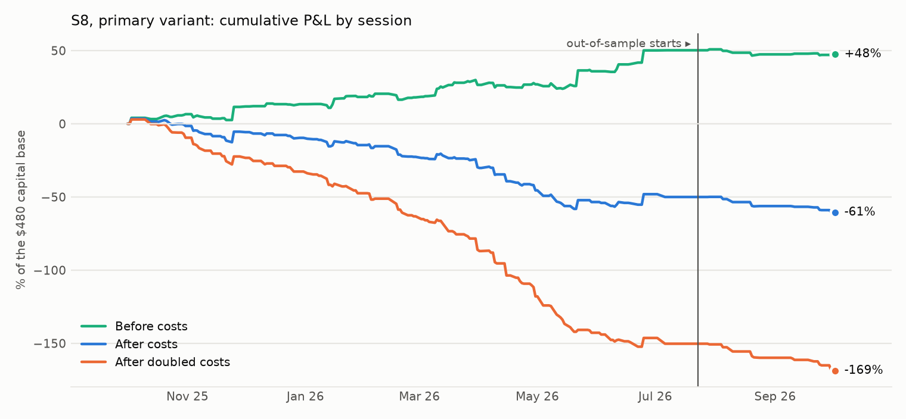
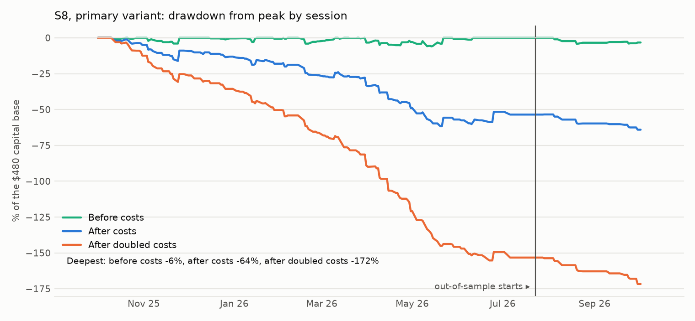

# S8: is the stock market's open a referee for the overnight move in the odds?

Method, pre-registered before the give-back was split by the asset's move: [`research/s8_open_referee/METHOD.md`](../../s8_open_referee/METHOD.md) (commit `1cb7cb3`). Data: the S4 and S5 caches, 128 markets, 254 links to 48 tickers, 253 sessions from 2025-10-01 to 2026-10-02. Files: [`metrics.csv`](metrics.csv), [`giveback.csv`](giveback.csv), [`trades.csv`](trades.csv), [`mornings.csv`](mornings.csv), [`capacity.md`](capacity.md), [`RUN_LOG.md`](RUN_LOG.md).

## Answer

**What holds up: the odds give back part of an overnight move, and a second set of markets shows it too.** After an overnight move of 10 points or more, the odds move back 2.63 points between 09:40 and the close (232 market-mornings on 109 dates, date-bootstrap 95% interval [-3.90, -1.47]). The S5 markets, where this was first seen, give -2.65 [-4.11, -1.31]; the S4 markets, never tested for it before, give -2.52 [-4.67, -0.75] on 34 mornings. After 5 points or more the give-back is 1.35 points [-1.95, -0.80] on 666 mornings.

**It cannot be taken at these costs.** Crossing the spread twice and paying the fee twice costs 2.62 points per trade here. Selling every move of 5 points or more at 09:40 (V3) earns +1.46 before costs and -1.12 after [-1.76, -0.48].

**The stock market's open is not a referee.** The idea was that the odds overshoot when the linked asset opens without confirming them. It does not work: on "not confirmed" mornings the odds give back 1.12 points, on "confirmed" mornings 1.45; difference +0.33 [-0.82, +1.49]. At 10 points: 2.78 against 2.59, difference -0.19 [-2.94, +2.55].

**Verdict on the pre-registered criterion: null.** The primary trade loses 1.47 points per trade after costs [-2.42, -0.54] on 198 trades, and 4.09 at doubled costs. Out-of-sample has 16 trades (-3.16 points each), fewer than the 30 the criterion needs; in-sample is negative on its own.

## Headline numbers (primary V0: overnight move of 5+ points, asset did not confirm, sold at 09:40, closed at the close)

| Segment | Variant | Costs | Trades | Dates | Net, points per trade | 95% interval | Before costs | Costs, points | Winners | Net P&L | Sharpe | Deflated Sharpe prob. | Max DD | Worst month | Turnover / yr | Print-verified |
|---|---|---|---|---|---|---|---|---|---|---|---|---|---|---|---|---|
| IS | V0 (primary) | 1× | 182 | 103 | -1.32 | [-2.31, -0.31] | +1.33 | 2.64 | 25% | -$240 | -2.79 | 0.000 | 61.7% | -15.8% | 20.5× | 26 of 49 checkable |
| OOS | V0 (primary) | 1× | 16 | 12 | -3.16 | [-5.28, -1.60] | -0.80 | 2.37 | 12% | -$51 | -5.65 | 0.000 | 10.6% | -6.3% | 7.1× | 7 of 16 checkable |
| ALL | V0 (primary) | 1× | 198 | 115 | -1.47 | [-2.42, -0.54] | +1.15 | 2.62 | 24% | -$291 | -2.96 | 0.000 | 64.1% | -15.8% | 17.8× | 33 of 65 checkable |
| from 2026-07-01 | V0 (primary) | 1× | 20 | 13 | -2.99 | [-4.81, -1.73] | -0.61 | 2.38 | 15% | -$60 | -5.35 | 0.000 | 12.5% | -6.3% | 7.2× | 8 of 19 checkable |
| IS | V0 (primary) | 2× | 182 | 103 | -3.96 | [-4.96, -2.95] | +1.33 | 5.29 | 17% | -$721 | -7.04 | 0.000 | 153.8% | -31.6% | 20.5× | 30 of 49 checkable |
| OOS | V0 (primary) | 2× | 16 | 12 | -5.53 | [-7.66, -3.94] | -0.80 | 4.73 | 0% | -$88 | -6.65 | 0.000 | 18.3% | -9.0% | 7.1× | 8 of 16 checkable |
| ALL | V0 (primary) | 2× | 198 | 115 | -4.09 | [-5.03, -3.16] | +1.15 | 5.24 | 16% | -$810 | -6.81 | 0.000 | 170.1% | -31.6% | 17.8× | 38 of 65 checkable |
| from 2026-07-01 | V0 (primary) | 2× | 20 | 13 | -5.37 | [-7.21, -4.11] | -0.61 | 4.75 | 0% | -$107 | -6.03 | 0.000 | 22.1% | -9.0% | 7.2× | 9 of 19 checkable |

100 contracts per trade; a point is one cent per contract. Capital base $480, the largest amount deployed in one session. Out-of-sample is the last 51 sessions, from 2026-07-23. Sharpe on session returns, 252 a year. "From 2026-07-01" is the hindsight check: sessions after the labelling models' knowledge ends.





## The test behind the trade (before costs)

The change in the odds after the open, in points, signed so that a negative number is a give-back of the overnight move. Intervals resample dates.

| Overnight move | Nights | Window | Asset did not confirm | Asset confirmed | Difference |
|---|---|---|---|---|---|
| 5+ points | all nights | 09:40 to the close | -1.12 [-2.06, -0.23], n 204 | -1.45 [-2.18, -0.77], n 462 | +0.33 [-0.82, +1.49] |
| 5+ points | all nights | 09:29 to 09:40 | +0.02 [-0.15, +0.19], n 204 | -0.14 [-0.28, -0.02], n 463 | +0.16 [-0.05, +0.38] |
| 5+ points | all nights | 09:40 to the next 09:40 | -0.11 [-1.65, +1.32], n 203 | -1.43 [-2.85, -0.03], n 458 | +1.32 [-0.75, +3.34] |
| 5+ points | weekends and holidays | 09:40 to the close | -0.37 [-1.31, +0.63], n 64 | -0.75 [-2.02, +0.35], n 192 | +0.38 [-1.01, +1.86] |
| 5+ points | weekends and holidays | 09:29 to 09:40 | +0.14 [-0.06, +0.36], n 64 | -0.02 [-0.14, +0.10], n 193 | +0.16 [-0.08, +0.41] |
| 5+ points | weekends and holidays | 09:40 to the next 09:40 | +1.87 [-0.47, +4.49], n 64 | -1.21 [-2.93, +0.26], n 192 | +3.08 [+0.32, +6.07] |
| 10+ points | all nights | 09:40 to the close | -2.78 [-5.44, -0.47], n 50 | -2.59 [-3.93, -1.24], n 182 | -0.19 [-2.94, +2.55] |
| 10+ points | all nights | 09:29 to 09:40 | +0.20 [-0.23, +0.69], n 50 | -0.29 [-0.57, -0.06], n 183 | +0.50 [+0.01, +1.04] |
| 10+ points | all nights | 09:40 to the next 09:40 | -0.36 [-3.89, +3.13], n 50 | -1.97 [-4.32, +0.20], n 179 | +1.60 [-2.47, +5.59] |
| 10+ points | weekends and holidays | 09:40 to the close | -0.05 [-2.36, +2.63], n 21 | -1.64 [-3.93, +0.59], n 81 | +1.59 [-1.81, +5.02] |
| 10+ points | weekends and holidays | 09:29 to 09:40 | +0.28 [-0.28, +0.77], n 21 | -0.03 [-0.31, +0.14], n 82 | +0.32 [-0.25, +0.91] |
| 10+ points | weekends and holidays | 09:40 to the next 09:40 | +3.11 [-1.85, +7.91], n 21 | -1.31 [-4.57, +1.68], n 81 | +4.41 [-1.43, +10.18] |

Of the 667 mornings after a move of 5 points or more, the linked assets had moved the way the odds did by 09:35 on 463 (69%), and on 78% after 10 points or more. That is S5's opening-gap relation seen as a count.

2 of the 12 differences have an interval excluding zero: 5+ points, weekends and holidays, 09:40 to the next 09:40: +3.08 [+0.32, +6.07]; 10+ points, all nights, 09:29 to 09:40: +0.50 [+0.01, +1.04]. Both signs are the opposite of the idea (the moves the asset did not confirm gave back less, or went further), the rows overlap, and nothing is built on them. Taken at face value, following an unconfirmed weekend move to the next morning earns +1.87 points before costs [-0.47, +4.49], less than the 2.62 points it costs.

## Pre-registered success criterion

| Criterion | Result | Evidence |
|---|---|---|
| At least 30 OOS trades on at least 10 OOS dates | **fail** | 16 trades on 12 dates |
| OOS mean net P&L per trade above zero, date-bootstrap interval excluding zero (1× costs) | **fail** | -3.16 points [-5.28, -1.60] |
| OOS above zero at 2× costs | **fail** | -5.53 points |
| In-sample above zero at 1× costs | **fail** | -1.32 points [-2.31, -0.31] on 182 trades |
| Whole sample: a larger give-back on "not confirmed" mornings, interval excluding zero | **fail** | difference +0.33 points [-0.82, +1.49] |

**Verdict: null.**

## Costs

- **Polymarket half-spread: 0.5 point** per fill, half of the median spread of 1.0 point on 18 open markets priced between 10% and 90% (snapshot of 2026-10-04T01:01 UTC). Historical books are not published.
- **Polymarket fee:** 0.04 × P × (1 − P) per contract, at entry and at exit. Near 50% that is one point each way, which is why the round trip here (2.62 points) is above the 2.0 points of the snapshot's markets.
- **In bp of the capital of a trade:** 772 bp at 1×, 1,511 bp at 2×.
- **Print check:** 65 of the 198 primary entries are recent enough for the data API to serve their prints; 33 have a print at the assumed price or better, averaging -2.56 points [-5.03, -0.12].

## Capacity

See [`capacity.md`](capacity.md).

## Every variant tried

| Segment | Variant | Costs | Trades | Dates | Net, points per trade | 95% interval | Before costs | Costs, points | Winners | Net P&L | Sharpe | Deflated Sharpe prob. | Max DD | Worst month | Turnover / yr | Print-verified |
|---|---|---|---|---|---|---|---|---|---|---|---|---|---|---|---|---|
| IS | V0 (primary) | 1× | 182 | 103 | -1.32 | [-2.31, -0.31] | +1.33 | 2.64 | 25% | -$240 | -2.79 | 0.000 | 61.7% | -15.8% | 20.5× | 26 of 49 checkable |
| OOS | V0 (primary) | 1× | 16 | 12 | -3.16 | [-5.28, -1.60] | -0.80 | 2.37 | 12% | -$51 | -5.65 | 0.000 | 10.6% | -6.3% | 7.1× | 7 of 16 checkable |
| ALL | V0 (primary) | 1× | 198 | 115 | -1.47 | [-2.42, -0.54] | +1.15 | 2.62 | 24% | -$291 | -2.96 | 0.000 | 64.1% | -15.8% | 17.8× | 33 of 65 checkable |
| from 2026-07-01 | V0 (primary) | 1× | 20 | 13 | -2.99 | [-4.81, -1.73] | -0.61 | 2.38 | 15% | -$60 | -5.35 | 0.000 | 12.5% | -6.3% | 7.2× | 8 of 19 checkable |
| IS | V0 (primary) | 2× | 182 | 103 | -3.96 | [-4.96, -2.95] | +1.33 | 5.29 | 17% | -$721 | -7.04 | 0.000 | 153.8% | -31.6% | 20.5× | 30 of 49 checkable |
| OOS | V0 (primary) | 2× | 16 | 12 | -5.53 | [-7.66, -3.94] | -0.80 | 4.73 | 0% | -$88 | -6.65 | 0.000 | 18.3% | -9.0% | 7.1× | 8 of 16 checkable |
| ALL | V0 (primary) | 2× | 198 | 115 | -4.09 | [-5.03, -3.16] | +1.15 | 5.24 | 16% | -$810 | -6.81 | 0.000 | 170.1% | -31.6% | 17.8× | 38 of 65 checkable |
| from 2026-07-01 | V0 (primary) | 2× | 20 | 13 | -5.37 | [-7.21, -4.11] | -0.61 | 4.75 | 0% | -$107 | -6.03 | 0.000 | 22.1% | -9.0% | 7.2× | 9 of 19 checkable |
| IS | V1 | 1× | 40 | 30 | +0.70 | [-2.05, +3.58] | +3.45 | 2.75 | 42% | +$28 | 0.51 | 0.119 | 34.1% | -11.5% | 15.7× | 8 of 13 checkable |
| OOS | V1 | 1× | 5 | 4 | -2.98 | n/a | -0.50 | 2.48 | 20% | -$15 | -3.24 | 0.000 | 10.7% | -10.3% | 4.7× | 2 of 5 checkable |
| ALL | V1 | 1× | 45 | 34 | +0.29 | [-2.38, +2.99] | +3.01 | 2.72 | 40% | +$13 | 0.21 | 0.074 | 34.1% | -11.5% | 13.5× | 10 of 18 checkable |
| from 2026-07-01 | V1 | 1× | 6 | 5 | -3.79 | [-6.70, -1.22] | -1.25 | 2.54 | 17% | -$23 | -3.48 | 0.000 | 16.4% | -10.3% | 5.5× | 3 of 6 checkable |
| IS | V1 | 2× | 40 | 30 | -2.05 | [-4.77, +0.83] | +3.45 | 5.50 | 40% | -$82 | -1.50 | 0.000 | 84.0% | -29.2% | 15.7× | 9 of 13 checkable |
| OOS | V1 | 2× | 5 | 4 | -5.46 | n/a | -0.50 | 4.96 | 0% | -$27 | -3.83 | 0.000 | 19.5% | -15.7% | 4.7× | 2 of 5 checkable |
| ALL | V1 | 2× | 45 | 34 | -2.43 | [-5.08, +0.20] | +3.01 | 5.44 | 36% | -$109 | -1.73 | 0.000 | 88.0% | -29.2% | 13.5× | 11 of 18 checkable |
| from 2026-07-01 | V1 | 2× | 6 | 5 | -6.32 | [-9.20, -3.68] | -1.25 | 5.07 | 0% | -$38 | -3.92 | 0.000 | 27.0% | -15.7% | 5.5× | 3 of 6 checkable |
| IS | V2 | 1× | 181 | 102 | -2.56 | [-4.20, -0.84] | +0.07 | 2.64 | 30% | -$464 | -3.02 | 0.000 | 117.7% | -26.7% | 20.5× | 25 of 48 checkable |
| OOS | V2 | 1× | 16 | 12 | -1.71 | [-4.38, +0.66] | +0.60 | 2.31 | 19% | -$27 | -3.01 | 0.004 | 5.8% | -3.5% | 7.1× | 7 of 16 checkable |
| ALL | V2 | 1× | 197 | 114 | -2.50 | [-4.03, -0.87] | +0.11 | 2.61 | 29% | -$492 | -2.83 | 0.000 | 117.7% | -26.7% | 17.8× | 32 of 64 checkable |
| from 2026-07-01 | V2 | 1× | 20 | 13 | -1.93 | [-4.09, +0.03] | +0.40 | 2.33 | 20% | -$39 | -3.29 | 0.001 | 8.1% | -3.5% | 7.2× | 8 of 19 checkable |
| IS | V2 | 2× | 181 | 102 | -5.20 | [-6.83, -3.44] | +0.07 | 5.27 | 19% | -$941 | -5.33 | 0.000 | 203.1% | -40.9% | 20.5× | 29 of 48 checkable |
| OOS | V2 | 2× | 16 | 12 | -4.02 | [-6.60, -1.70] | +0.60 | 4.62 | 12% | -$64 | -5.64 | 0.000 | 13.3% | -7.8% | 7.1× | 8 of 16 checkable |
| ALL | V2 | 2× | 197 | 114 | -5.10 | [-6.65, -3.48] | +0.11 | 5.22 | 18% | -$1,005 | -5.02 | 0.000 | 211.5% | -40.9% | 17.8× | 37 of 64 checkable |
| from 2026-07-01 | V2 | 2× | 20 | 13 | -4.27 | [-6.35, -2.34] | +0.40 | 4.67 | 10% | -$85 | -5.13 | 0.000 | 17.6% | -7.8% | 7.2× | 9 of 19 checkable |
| IS | V3 | 1× | 567 | 174 | -0.98 | [-1.66, -0.29] | +1.62 | 2.60 | 29% | -$557 | -3.12 | 0.000 | 116.7% | -16.7% | 50.5× | 26 of 158 checkable |
| OOS | V3 | 1× | 48 | 25 | -2.77 | [-3.97, -1.56] | -0.40 | 2.37 | 10% | -$133 | -8.11 | 0.000 | 23.6% | -11.3% | 15.2× | 7 of 33 checkable |
| ALL | V3 | 1× | 615 | 199 | -1.12 | [-1.76, -0.48] | +1.46 | 2.58 | 28% | -$690 | -3.40 | 0.000 | 120.3% | -16.7% | 43.4× | 33 of 191 checkable |
| from 2026-07-01 | V3 | 1× | 60 | 33 | -2.76 | [-3.79, -1.83] | -0.41 | 2.35 | 12% | -$166 | -8.26 | 0.000 | 29.1% | -11.3% | 14.3× | 8 of 39 checkable |
| IS | V3 | 2× | 567 | 174 | -3.58 | [-4.26, -2.88] | +1.62 | 5.20 | 17% | -$2,030 | -9.74 | 0.000 | 342.7% | -69.4% | 50.7× | 30 of 158 checkable |
| OOS | V3 | 2× | 48 | 25 | -5.14 | [-6.36, -3.90] | -0.40 | 4.74 | 6% | -$247 | -9.84 | 0.000 | 41.5% | -20.2% | 15.2× | 8 of 33 checkable |
| ALL | V3 | 2× | 615 | 199 | -3.70 | [-4.35, -3.07] | +1.46 | 5.16 | 16% | -$2,277 | -9.41 | 0.000 | 384.3% | -69.4% | 43.6× | 38 of 191 checkable |
| from 2026-07-01 | V3 | 2× | 60 | 33 | -5.11 | [-6.17, -4.17] | -0.41 | 4.69 | 5% | -$306 | -9.81 | 0.000 | 51.5% | -20.2% | 14.4× | 9 of 39 checkable |
| IS | V4 | 1× | 58 | 28 | -2.25 | [-3.36, -1.32] | +0.38 | 2.64 | 22% | -$131 | -3.67 | 0.000 | 51.0% | -15.8% | 13.0× | 11 of 22 checkable |
| OOS | V4 | 1× | 4 | 3 | -2.77 | n/a | -0.50 | 2.27 | 25% | -$11 | -2.42 | 0.000 | 4.3% | -3.5% | 3.0× | 2 of 4 checkable |
| ALL | V4 | 1× | 62 | 31 | -2.29 | [-3.28, -1.34] | +0.33 | 2.61 | 23% | -$142 | -3.44 | 0.000 | 55.3% | -15.8% | 10.9× | 13 of 26 checkable |
| from 2026-07-01 | V4 | 1× | 8 | 4 | -2.53 | n/a | -0.19 | 2.34 | 25% | -$20 | -2.91 | 0.000 | 7.9% | -3.6% | 5.5× | 3 of 7 checkable |
| IS | V4 | 2× | 58 | 28 | -4.89 | [-5.99, -3.94] | +0.38 | 5.27 | 12% | -$284 | -4.74 | 0.000 | 109.4% | -26.6% | 12.9× | 14 of 22 checkable |
| OOS | V4 | 2× | 4 | 3 | -5.03 | n/a | -0.50 | 4.53 | 0% | -$20 | -3.05 | 0.000 | 7.8% | -5.8% | 3.0× | 2 of 4 checkable |
| ALL | V4 | 2× | 62 | 31 | -4.90 | [-5.91, -3.95] | +0.33 | 5.23 | 11% | -$304 | -4.42 | 0.000 | 117.1% | -26.6% | 10.9× | 16 of 26 checkable |
| from 2026-07-01 | V4 | 2× | 8 | 4 | -4.88 | n/a | -0.19 | 4.69 | 0% | -$39 | -3.22 | 0.000 | 15.0% | -7.3% | 5.5× | 3 of 7 checkable |

The deflated Sharpe probability uses 5 trials.

## What didn't work

- **The asset's vote.** It does not separate the moves that reverse from the ones that hold, at 5 or at 10 points, on all nights or on weekends.
- **The primary trade.** -1.47 points per trade [-2.42, -0.54]; 24% winners.
- **Larger moves only (V1).** +3.01 before costs, +0.29 after [-2.38, +2.99] on 45 trades: the give-back and the cost are the same size.
- **Holding to the next morning (V2)** and **weekends only (V4)**: -2.50 and -2.29 points per trade.
- **Since July (hindsight check and out-of-sample):** -2.99 points per trade on 20 trades, and no give-back before costs (-0.61).

## Caveats

- The give-back is measured on mid prices. Someone resting orders instead of crossing the spread would not pay the 2.6 points, but whether such orders fill cannot be tested on this data, and it is not claimed.
- Several markets on one date are often the same news; intervals resample dates for that reason.
- The links are model judgements.
- One year, one snapshot for the spread.

## Reproduce

```
cd research
python -m s8_open_referee.run
python -m s8_open_referee.report
python -m pytest s8_open_referee/tests -q
```
