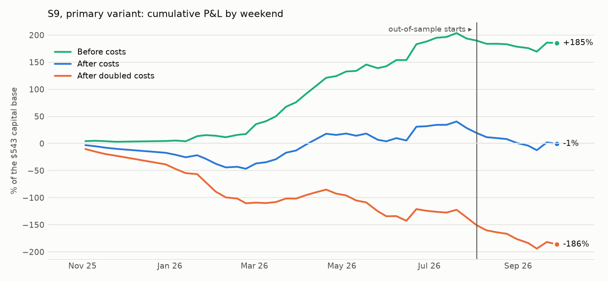
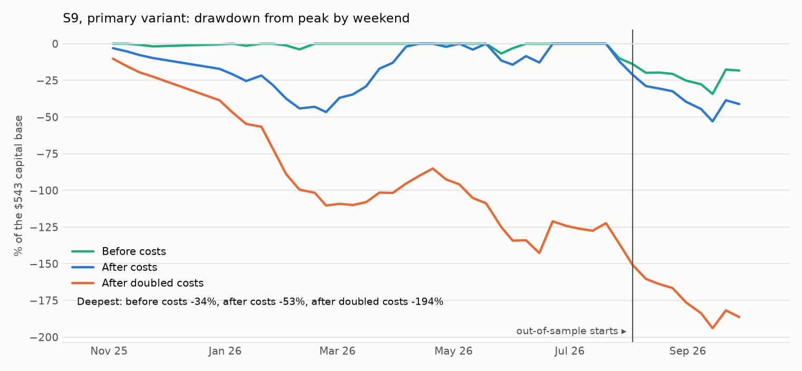

# S9: Polymarket's own price markets over the weekend, while the asset is shut

Method, pre-registered before any price of these markets was pulled: [`research/s9_weekend_price_markets/METHOD.md`](../../s9_weekend_price_markets/METHOD.md) (commit `6e1876a`, amendment 1 `deb2e65`). Data: 391 markets in 25 events (253 live on at least one weekend), 1,054 market-weekends on 44 weekends from 2025-11-03 to 2026-09-28. Files: [`metrics.csv`](metrics.csv), [`tests.csv`](tests.csv), [`trades.csv`](trades.csv), [`weekends.csv`](weekends.csv), [`capacity.md`](capacity.md), [`RUN_LOG.md`](RUN_LOG.md).

## Answer

**What holds up 1: on a weekend, oil's reaction to the news can be seen on Polymarket itself.** While oil futures are shut, Polymarket's oil price markets ("Will WTI hit $100?") move 0.86 points for every point the odds of oil-linked events move the same weekend (t = 5.85; 357 market-weekends on 36 weekends, errors clustered by weekend). After the reopen nothing more follows: -0.19 by Monday 09:40 (t = -1.12). The link between an event question and an asset holds inside the weekend, in a market that is open.

**What holds up 2: part of the weekend move is given back by Monday.** After a weekend move of 5 points or more, these markets move back 2.94 points by Monday 09:40 (401 market-weekends on 44 weekends, weekend-bootstrap 95% interval [-4.66, -1.14]); oil 4.18 [-7.22, -1.56]; after 10 points or more 4.02 [-6.97, -1.52]. About 18% of a weekend move is undone (slope -0.18, t = -2.33). It does not happen when futures reopen: by Sunday 19:00 the change is -0.39 [-1.05, +0.36].

**It does not pay after costs, and it is gone in the last two months.** A round trip costs 3.29 points here. Selling every weekend move of 5 points or more earns +3.28 before costs and -0.01 after [-1.78, +1.77] on 307 trades; -3.29 at doubled costs. Out-of-sample (9 weekends from 2026-08-03): -3.77 [-7.56, +1.87] on 42 trades, and before costs the give-back is absent (-1.07).

**Verdict on the pre-registered criterion: not a pass.**

**The oil-only variant is positive in-sample and negative out-of-sample.** V2: +3.77 points per trade [+0.74, +7.08] on 154 in-sample trades (Sharpe 2.72), then -4.49 [-8.46, +2.69] on 37 out-of-sample trades; over the whole year +2.17 [-0.69, +5.46] and -0.14 at doubled costs. It is one of five variants and it failed the part of the sample it was not chosen on. It is not an edge.

## Headline numbers (primary V0: weekend move of 5+ points, sold Sunday 17:55, closed at the next session's 09:40)

| Segment | Variant | Costs | Trades | Weekends | Net, points per trade | 95% interval | Before costs | Costs, points | Winners | Net P&L | Sharpe | Deflated Sharpe prob. | Max DD | Worst month | Turnover / yr | Print-verified |
|---|---|---|---|---|---|---|---|---|---|---|---|---|---|---|---|---|
| IS | V0 (primary) | 1× | 265 | 35 | +0.59 | [-1.07, +2.39] | +3.97 | 3.38 | 50% | +$155 | 0.77 | 0.000 | 46.6% | -18.4% | 26.7× | 52 of 253 checkable |
| OOS | V0 (primary) | 1× | 42 | 9 | -3.77 | [-7.56, +1.87] | -1.07 | 2.70 | 26% | -$158 | -3.24 | 0.053 | 40.9% | -27.5% | 17.4× | 10 of 42 checkable |
| ALL | V0 (primary) | 1× | 307 | 44 | -0.01 | [-1.78, +1.77] | +3.28 | 3.29 | 47% | -$3 | -0.01 | 0.000 | 52.9% | -27.5% | 24.8× | 62 of 295 checkable |
| IS | V0 (primary) | 2× | 265 | 35 | -2.79 | [-4.59, -0.88] | +3.97 | 6.76 | 31% | -$740 | -3.51 | 0.000 | 141.2% | -38.4% | 27.2× | 61 of 253 checkable |
| OOS | V0 (primary) | 2× | 42 | 9 | -6.46 | [-10.16, -0.93] | -1.07 | 5.39 | 14% | -$271 | -5.25 | 0.018 | 57.0% | -39.5% | 17.5× | 13 of 42 checkable |
| ALL | V0 (primary) | 2× | 307 | 44 | -3.29 | [-5.10, -1.43] | +3.28 | 6.57 | 29% | -$1,012 | -3.88 | 0.000 | 191.9% | -39.5% | 25.2× | 74 of 295 checkable |

100 contracts per trade; a point is one cent per contract. Capital base $543, the largest amount deployed on one weekend. Sharpe on weekend returns, 52 a year. 4 trades were settled at the market's result because the target was hit before the exit (amendment 1); all were losses for the fade.





## T1, the give-back (before costs)

The change in the price after the Sunday 17:55 entry, in points, signed so that a negative number is a give-back of the weekend move.

| Weekend move | Markets | Window | Market-weekends | Weekends | Change, signed by the move | 95% interval |
|---|---|---|---|---|---|---|
| 5+ points | All markets | to the next session 09:40 | 401 | 44 | -2.94 | [-4.66, -1.14] |
| 5+ points | All markets | to Sunday 19:00 | 401 | 44 | -0.39 | [-1.05, +0.36] |
| 5+ points | Crude oil | to the next session 09:40 | 221 | 36 | -4.18 | [-7.22, -1.56] |
| 5+ points | Crude oil | to Sunday 19:00 | 221 | 36 | -0.46 | [-1.54, +0.79] |
| 5+ points | Gold | to the next session 09:40 | 85 | 28 | -1.69 | [-3.18, -0.23] |
| 5+ points | Gold | to Sunday 19:00 | 85 | 28 | -0.61 | [-0.98, -0.24] |
| 5+ points | Silver | to the next session 09:40 | 66 | 23 | -1.70 | [-5.32, +1.13] |
| 5+ points | Silver | to Sunday 19:00 | 66 | 23 | -0.13 | [-0.97, +0.55] |
| 5+ points | S&P 500 | to the next session 09:40 | 15 | 4 | +1.08 | n/a |
| 5+ points | S&P 500 | to Sunday 19:00 | 15 | 4 | +0.46 | n/a |
| 5+ points | Stocks | to the next session 09:40 | 14 | 4 | -1.21 | n/a |
| 5+ points | Stocks | to Sunday 19:00 | 14 | 4 | -0.07 | n/a |
| 10+ points | All markets | to the next session 09:40 | 201 | 41 | -4.02 | [-6.97, -1.52] |
| 10+ points | All markets | to Sunday 19:00 | 201 | 41 | -0.40 | [-1.55, +0.82] |
| 10+ points | Crude oil | to the next session 09:40 | 116 | 28 | -4.91 | [-9.38, -0.96] |
| 10+ points | Crude oil | to Sunday 19:00 | 116 | 28 | -0.38 | [-2.18, +1.56] |
| 10+ points | Gold | to the next session 09:40 | 34 | 16 | -3.67 | [-5.51, -1.42] |
| 10+ points | Gold | to Sunday 19:00 | 34 | 16 | -0.86 | [-1.40, -0.41] |
| 10+ points | Silver | to the next session 09:40 | 29 | 14 | -3.54 | [-9.54, +0.77] |
| 10+ points | Silver | to Sunday 19:00 | 29 | 14 | -0.37 | [-2.04, +0.98] |
| 10+ points | S&P 500 | to the next session 09:40 | 11 | 3 | +1.08 | n/a |
| 10+ points | S&P 500 | to Sunday 19:00 | 11 | 3 | +0.45 | n/a |
| 10+ points | Stocks | to the next session 09:40 | 11 | 3 | -2.09 | n/a |
| 10+ points | Stocks | to Sunday 19:00 | 11 | 3 | -0.09 | n/a |

## T2, the link (oil price markets against oil-linked event odds)

| Relation | Slope | t | Market-weekends | Weekends |
|---|---|---|---|---|
| The oil price markets' weekend move, per point of weekend move in the event odds | +0.86 | 5.85 | 357 | 36 |
| Their move from Sunday 17:55 to the next session 09:40, per point | -0.19 | -1.12 | 357 | 36 |
| Their move from Sunday 17:55 to Sunday 19:00, per point | -0.04 | -0.69 | 357 | 36 |

The event odds are the mean weekend move of the 44 S5 and S4 questions whose agreed links name USO, XLE, XOP, XOM, CVX or OXY, each signed by its link direction. The price markets are signed by their own side (a "hit high" market is +1). Both legs are Polymarket mid prices over the same weekend, so this is co-movement, not a lead.

## Pre-registered success criterion

| Criterion | Result | Evidence |
|---|---|---|
| At least 30 OOS trades on at least 5 OOS weekends | pass | 42 trades on 9 weekends |
| OOS mean net P&L per trade above zero, weekend-bootstrap interval excluding zero (1× costs) | **fail** | -3.77 points [-7.56, +1.87] |
| OOS above zero at 2× costs | **fail** | -6.46 points |
| In-sample above zero at 1× costs | pass | +0.59 points [-1.07, +2.39] on 265 trades |

**Verdict: not a pass.**

## Looked at after the run (not pre-registered)

Two splits that explain the result. Neither was in the method; they are description, not tests.

| After a weekend move of 5+ points | Market-weekends | Weekends | Mean weekend move | Change to the next session 09:40 | 95% interval |
|---|---|---|---|---|---|
| Markets that rose over the weekend | 192 | 37 | +12.46 | -4.90 | [-7.11, -2.62] |
| Markets that fell over the weekend | 209 | 43 | -13.49 | +1.15 | [-0.27, +2.80] |
| Oil, "hit high" markets that rose | 92 | 22 | +11.95 | -7.85 | [-11.52, -4.38] |
| Oil, "hit high" markets that fell | 40 | 11 | -17.21 | -1.60 | [-4.58, +1.77] |
| Oil, "hit low" markets that rose | 22 | 9 | +19.44 | -0.79 | [-6.34, +5.45] |
| Oil, "hit low" markets that fell | 64 | 26 | -12.32 | +3.49 | [-0.41, +7.78] |

- **The give-back is on the side that rose.** Markets that rose over the weekend fall back; markets that fell barely recover. For oil the pattern is a weekend scare: "hit high" markets that jumped are lower by Monday, and "hit low" markets that dropped are higher.
- **These markets drift down anyway.** Over all 1,054 live market-weekends the price falls 1.05 points from Sunday 17:55 to Monday 09:40 [-1.75, -0.34]: a "hit" market loses value as time passes without a hit. Part of the give-back after rises is this drift.

## The oil-only variant by month (V2, 1× costs)

| Month | Trades | Weekends | Before costs | Net, points per trade |
|---|---|---|---|---|
| 2026-01 | 5 | 3 | +10.60 | +7.73 |
| 2026-02 | 2 | 2 | -0.00 | -2.98 |
| 2026-03 | 36 | 5 | +8.45 | +6.71 |
| 2026-04 | 37 | 4 | +6.94 | +4.43 |
| 2026-05 | 28 | 4 | +2.29 | -0.16 |
| 2026-06 | 35 | 5 | +7.05 | +4.73 |
| 2026-07 | 11 | 4 | +0.56 | -1.73 |
| 2026-08 | 22 | 5 | -4.69 | -7.05 |
| 2026-09 | 15 | 4 | +1.74 | -0.74 |

## Costs

- **Half-spread per fill:** crude oil 0.5 point, S&P 500 1.0, gold 1.25, silver 2.0, stocks 2.5: half of the median spreads on the live books of Sat 2026-10-03 22:13 New York time. Historical books are not published.
- **Fee:** each market's own schedule from the catalogue: 0.04 × P × (1 − P) for takers on 263 of the 391 markets, nothing on the rest.
- **Round trip:** 3.29 points per trade on average; 1,246 bp of the capital of a trade at 1×, 2,321 bp at 2×.
- **Print check:** 295 of the 307 primary entries are recent enough for the data API to serve their prints; 62 have a print at the assumed price or better within 10 minutes of Sunday 17:55, averaging +1.50 points [-3.25, +6.22].

## Capacity

See [`capacity.md`](capacity.md).

## Every variant tried

| Segment | Variant | Costs | Trades | Weekends | Net, points per trade | 95% interval | Before costs | Costs, points | Winners | Net P&L | Sharpe | Deflated Sharpe prob. | Max DD | Worst month | Turnover / yr | Print-verified |
|---|---|---|---|---|---|---|---|---|---|---|---|---|---|---|---|---|
| IS | V0 (primary) | 1× | 265 | 35 | +0.59 | [-1.07, +2.39] | +3.97 | 3.38 | 50% | +$155 | 0.77 | 0.000 | 46.6% | -18.4% | 26.7× | 52 of 253 checkable |
| OOS | V0 (primary) | 1× | 42 | 9 | -3.77 | [-7.56, +1.87] | -1.07 | 2.70 | 26% | -$158 | -3.24 | 0.053 | 40.9% | -27.5% | 17.4× | 10 of 42 checkable |
| ALL | V0 (primary) | 1× | 307 | 44 | -0.01 | [-1.78, +1.77] | +3.28 | 3.29 | 47% | -$3 | -0.01 | 0.000 | 52.9% | -27.5% | 24.8× | 62 of 295 checkable |
| IS | V0 (primary) | 2× | 265 | 35 | -2.79 | [-4.59, -0.88] | +3.97 | 6.76 | 31% | -$740 | -3.51 | 0.000 | 141.2% | -38.4% | 27.2× | 61 of 253 checkable |
| OOS | V0 (primary) | 2× | 42 | 9 | -6.46 | [-10.16, -0.93] | -1.07 | 5.39 | 14% | -$271 | -5.25 | 0.018 | 57.0% | -39.5% | 17.5× | 13 of 42 checkable |
| ALL | V0 (primary) | 2× | 307 | 44 | -3.29 | [-5.10, -1.43] | +3.28 | 6.57 | 29% | -$1,012 | -3.88 | 0.000 | 191.9% | -39.5% | 25.2× | 74 of 295 checkable |
| IS | V1 | 1× | 164 | 34 | +1.84 | [-0.89, +5.14] | +5.18 | 3.34 | 54% | +$302 | 1.47 | 0.000 | 30.6% | -12.1% | 21.0× | 38 of 156 checkable |
| OOS | V1 | 1× | 17 | 7 | -4.58 | [-11.51, +6.48] | -1.93 | 2.65 | 29% | -$78 | -2.63 | 0.034 | 26.4% | -21.0% | 7.9× | 8 of 17 checkable |
| ALL | V1 | 1× | 181 | 41 | +1.24 | [-1.38, +4.18] | +4.52 | 3.28 | 51% | +$224 | 0.93 | 0.000 | 41.3% | -21.0% | 18.3× | 46 of 173 checkable |
| IS | V1 | 2× | 164 | 34 | -1.50 | [-4.39, +1.90] | +5.18 | 6.68 | 38% | -$246 | -1.15 | 0.000 | 81.7% | -30.8% | 21.5× | 44 of 156 checkable |
| OOS | V1 | 2× | 17 | 7 | -7.23 | [-13.93, +4.18] | -1.93 | 5.30 | 18% | -$123 | -3.33 | 0.003 | 36.0% | -30.1% | 8.0× | 9 of 17 checkable |
| ALL | V1 | 2× | 181 | 41 | -2.04 | [-4.76, +0.98] | +4.52 | 6.55 | 36% | -$368 | -1.46 | 0.000 | 97.0% | -30.8% | 18.7× | 53 of 173 checkable |
| IS | V2 | 1× | 154 | 27 | +3.77 | [+0.74, +7.08] | +6.04 | 2.28 | 64% | +$580 | 2.72 | 0.001 | 11.2% | -3.3% | 15.6× | 46 of 140 checkable |
| OOS | V2 | 1× | 37 | 9 | -4.49 | [-8.46, +2.69] | -2.08 | 2.41 | 19% | -$166 | -3.13 | 0.051 | 40.2% | -27.3% | 13.9× | 9 of 36 checkable |
| ALL | V2 | 1× | 191 | 36 | +2.17 | [-0.69, +5.46] | +4.47 | 2.30 | 55% | +$414 | 1.49 | 0.000 | 50.6% | -27.3% | 15.3× | 55 of 176 checkable |
| IS | V2 | 2× | 154 | 27 | +1.49 | [-1.51, +4.89] | +6.04 | 4.56 | 51% | +$229 | 1.11 | 0.000 | 28.2% | -12.8% | 15.7× | 53 of 140 checkable |
| OOS | V2 | 2× | 37 | 9 | -6.90 | [-10.85, +0.19] | -2.08 | 4.82 | 8% | -$255 | -4.55 | 0.020 | 52.9% | -36.1% | 14.0× | 10 of 36 checkable |
| ALL | V2 | 2× | 191 | 36 | -0.14 | [-3.02, +3.16] | +4.47 | 4.61 | 43% | -$26 | -0.10 | 0.000 | 64.7% | -36.1% | 15.4× | 63 of 176 checkable |
| IS | V3 | 1× | 251 | 31 | -2.95 | [-3.89, -2.07] | +0.36 | 3.31 | 18% | -$741 | -7.46 | 0.000 | 136.5% | -26.3% | 25.8× | 52 of 239 checkable |
| OOS | V3 | 1× | 42 | 9 | -2.51 | [-3.65, -1.45] | +0.25 | 2.76 | 14% | -$105 | -8.79 | 0.000 | 19.4% | -10.8% | 17.4× | 10 of 42 checkable |
| ALL | V3 | 1× | 293 | 40 | -2.89 | [-3.68, -2.11] | +0.34 | 3.23 | 17% | -$846 | -7.28 | 0.000 | 155.9% | -26.3% | 24.1× | 62 of 281 checkable |
| IS | V3 | 2× | 251 | 31 | -6.25 | [-7.27, -5.26] | +0.36 | 6.61 | 9% | -$1,570 | -11.49 | 0.000 | 286.2% | -50.5% | 26.2× | 61 of 239 checkable |
| OOS | V3 | 2× | 42 | 9 | -5.26 | [-6.31, -4.27] | +0.25 | 5.51 | 7% | -$221 | -12.51 | 0.000 | 40.3% | -23.3% | 17.5× | 13 of 42 checkable |
| ALL | V3 | 2× | 293 | 40 | -6.11 | [-7.01, -5.25] | +0.34 | 6.45 | 9% | -$1,791 | -10.85 | 0.000 | 326.4% | -50.5% | 24.4× | 74 of 281 checkable |
| IS | V4 | 1× | 265 | 35 | -7.35 | [-9.17, -5.78] | -3.97 | 3.38 | 17% | -$1,947 | -8.69 | 0.000 | 258.1% | -58.8% | 33.4× | 56 of 253 checkable |
| OOS | V4 | 1× | 42 | 9 | -1.63 | [-7.39, +2.39] | +1.07 | 2.70 | 52% | -$68 | -1.45 | 0.013 | 14.2% | -10.8% | 19.6× | 16 of 42 checkable |
| ALL | V4 | 1× | 307 | 44 | -6.56 | [-8.31, -4.83] | -3.28 | 3.28 | 21% | -$2,015 | -6.83 | 0.000 | 261.3% | -58.8% | 30.5× | 72 of 295 checkable |
| IS | V4 | 2× | 265 | 35 | -10.71 | [-12.62, -9.07] | -3.97 | 6.75 | 9% | -$2,839 | -11.21 | 0.000 | 369.3% | -75.6% | 33.6× | 68 of 253 checkable |
| OOS | V4 | 2× | 42 | 9 | -4.32 | [-10.16, -0.18] | +1.07 | 5.39 | 36% | -$181 | -3.76 | 0.000 | 23.3% | -16.5% | 19.6× | 20 of 42 checkable |
| ALL | V4 | 2× | 307 | 44 | -9.84 | [-11.65, -8.00] | -3.28 | 6.56 | 12% | -$3,020 | -8.97 | 0.000 | 388.5% | -75.6% | 30.8× | 88 of 295 checkable |

V1: 10 points or more. V2: crude oil only. V3: exit on Sunday at 19:00. V4: follow the move instead of fading it. The deflated Sharpe probability uses 5 trials.

## What didn't work

- **The primary fade.** -0.01 points per trade [-1.78, +1.77]; out-of-sample -3.77.
- **Closing an hour after futures reopen (V3).** +0.34 before costs, -2.89 after: the give-back is not there yet on Sunday evening.
- **Following the move (V4).** -6.56 points per trade.
- **Oil only (V2).** Positive in-sample, -4.49 out-of-sample.
- **Concentration.** The primary's best weekend made $138 and its worst lost $65, against a total of -$3.

## Caveats

- One year and one theme: 393 of the 1,054 market-weekends are oil, most of them from March to June 2026.
- Prices are mids. The half-spreads come from one night of much smaller markets than last spring's.
- The strikes of one asset on one weekend are one bet; intervals resample weekends for that reason.
- T2's link directions are model judgements (S4 and S5).

## Reproduce

```
cd research
python -m s9_weekend_price_markets.universe      # catalogue only; already committed
python -m s9_weekend_price_markets.run --pull
python -m s9_weekend_price_markets.run
python -m s9_weekend_price_markets.report
python -m pytest s9_weekend_price_markets/tests -q
```
