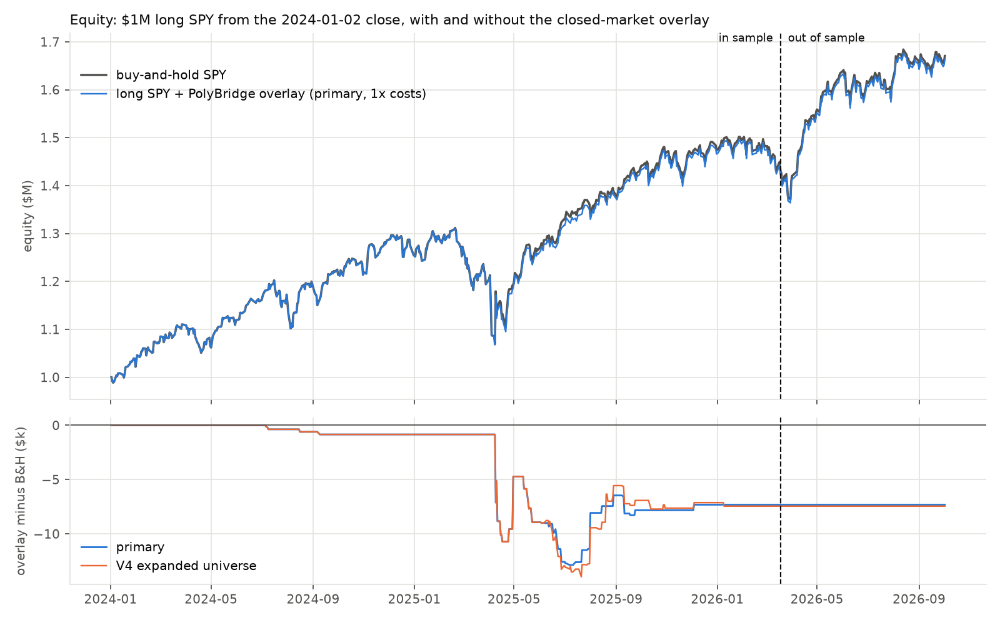
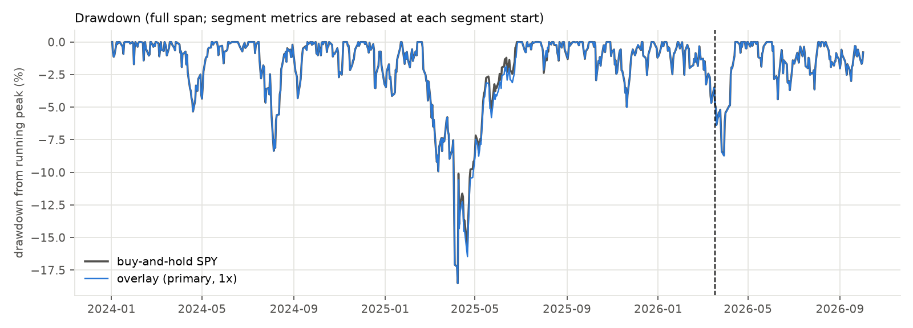

# Strategy backtest: the PolyBridge closed-market overlay on a long SPY book

Rules fixed in [METHOD.md](../../strategy_backtest/METHOD.md) and committed before any data for this study was fetched (commit 3c6b280); run once at commit `8466aab`. A $1,000,000 book is long SPY throughout; on each closure the overlay reads prediction-market moves and, when a market that has earned trust from earlier closures points to an adverse open, sells SPY short at the 09:30 open and covers at 10:00, sized by the product's rule. All results are net of costs (1x = 1 bp per side, 2x stress).

## Verdict (METHOD.md section 8: primary, out of sample, 1x costs)

- **Fail**: the overlay never trades in OOS, so there is no effect to judge (section 8: no OOS trade means Fail). No primary-universe market was trusted on any OOS day; the only market alive in OOS with enough records, `will-china-invade-taiwan-before-2027`, never passed the gate. The two OOS books still differ slightly because the in-sample hedge loss (-$7,318) is carried into OOS as negative cash, which leaves the strategy marginally more than fully invested: OOS max drawdown -5.43% vs -5.40% for buy-and-hold (-0.51% relative, i.e. deeper), volatility 13.25% vs 13.18% (-0.48% relative, i.e. higher), Sharpe 2.032 vs 2.031. Pass needs a 1% relative cut in drawdown or volatility and a Sharpe no lower than buy-and-hold.
- The overlay traded on 0 of 138 out-of-sample days and 37 of 552 in-sample days; net hedge P&L $0 OOS and -$7,318 IS on the $1M book.
- Span: 690 return days, 2024-01-03 to 2026-10-02 (last session with complete SPY minute bars at run time). Out of sample = the last 138 return days, from 2026-03-18 (L = min(ceil(0.2 N), days in the last 730 calendar days)).

## Primary metrics

Daily returns of book equity (SPY at the official close + dividend cash + hedge cash), risk-free rate 0. Max drawdown and worst month are measured within the segment, rebased at its start. Turnover = traded hedge notional (entry + exit) / mean equity / years. Mean hedge fraction is over hedge days. Hit rate = hedge days with positive net hedge P&L.

| Segment | Book | Ann. return | Ann. vol | Sharpe | Max DD | Worst month | Turnover (x/yr) | Hedge days | Mean hedge fraction | Hit rate | Hedge P&L |
|---|---|---|---|---|---|---|---|---|---|---|---|
| OOS (2026-03-18 to 2026-10-02, 138 d) | buy-and-hold | 29.57% | 13.18% | 2.031 | -5.40% | -2.72% | 0 | 0 | - | - | - |
| OOS | strategy 1x | 29.73% | 13.25% | 2.032 | -5.43% | -2.74% | 0.00 | 0 | - | - | $0 |
| OOS | strategy 2x | 29.79% | 13.27% | 2.032 | -5.44% | -2.74% | 0.00 | 0 | - | - | $0 |
| IS (2024-01-03 to 2026-03-17, 552 d) | buy-and-hold | 18.47% | 15.81% | 1.151 | -18.51% | -5.50% | 0 | 0 | - | - | - |
| IS | strategy 1x | 18.20% | 15.63% | 1.148 | -18.52% | -5.51% | 9.20 | 37 | 27.5% | 41% | -$7,318 |
| IS | strategy 2x | 18.10% | 15.63% | 1.142 | -18.52% | -5.51% | 9.21 | 37 | 27.5% | 38% | -$9,858 |
| full (2024-01-03 to 2026-10-02, 690 d) | buy-and-hold | 20.61% | 15.32% | 1.300 | -18.51% | -5.50% | 0 | 0 | - | - | - |
| full | strategy 1x | 20.42% | 15.17% | 1.300 | -18.52% | -5.51% | 7.00 | 37 | 27.5% | 41% | -$7,318 |
| full | strategy 2x | 20.35% | 15.18% | 1.296 | -18.52% | -5.51% | 7.00 | 37 | 27.5% | 38% | -$9,858 |

## Variants (METHOD.md section 7; reported, not part of the verdict)

Vol and max DD columns are relative to buy-and-hold in the same segment (negative = lower risk).

| Variant | Segment | Hedge days | Mean hedge fraction | Hedge P&L 1x | Hedge P&L 2x | Sharpe 1x (B&H) | Vol 1x vs B&H | Max DD 1x vs B&H | Hit rate | Turnover 1x |
|---|---|---|---|---|---|---|---|---|---|---|
| primary | OOS | 0 | - | $0 | $0 | 2.032 (2.031) | +0.48% | +0.51% | - | 0.00 |
| primary | IS | 37 | 27.5% | -$7,318 | -$9,858 | 1.148 (1.151) | -1.17% | +0.06% | 41% | 9.20 |
| primary | full | 37 | 27.5% | -$7,318 | -$9,858 | 1.300 (1.300) | -0.93% | +0.06% | 41% | 7.00 |
| V1_premarket | OOS | 0 | - | $0 | $0 | 2.033 (2.031) | +2.30% | +2.46% | - | 0.00 |
| V1_premarket | IS | 38 | 27.3% | -$34,760 | -$39,885 | 1.099 (1.151) | -1.98% | +0.09% | 39% | 9.37 |
| V1_premarket | full | 38 | 27.3% | -$34,760 | -$39,885 | 1.265 (1.300) | -1.33% | +0.09% | 39% | 7.14 |
| V2_no_gating | OOS | 0 | - | $0 | $0 | 2.032 (2.031) | +0.97% | +1.03% | - | 0.00 |
| V2_no_gating | IS | 84 | 24.7% | -$14,774 | -$19,914 | 1.130 (1.151) | -0.94% | +2.72% | 45% | 18.65 |
| V2_no_gating | full | 84 | 24.7% | -$14,774 | -$19,914 | 1.286 (1.300) | -0.65% | +2.72% | 45% | 14.20 |
| V3_unwind_close | OOS | 0 | - | $0 | $0 | 2.034 (2.031) | +5.11% | +5.46% | - | 0.00 |
| V3_unwind_close | IS | 37 | 27.5% | -$75,104 | -$77,651 | 1.052 (1.151) | -6.02% | +6.87% | 46% | 9.43 |
| V3_unwind_close | full | 37 | 27.5% | -$75,104 | -$77,651 | 1.238 (1.300) | -4.29% | +6.87% | 46% | 7.21 |
| V4_expanded | OOS | 0 | - | $0 | $0 | 2.032 (2.031) | +0.48% | +0.52% | - | 0.00 |
| V4_expanded | IS | 53 | 24.7% | -$7,448 | -$10,777 | 1.148 (1.151) | -1.22% | +0.06% | 42% | 12.05 |
| V4_expanded | full | 53 | 24.7% | -$7,448 | -$10,777 | 1.301 (1.300) | -0.96% | +0.06% | 42% | 9.17 |

## Where the trades come from

| Variant | Segment | days with a participating market | days with a trusted market | hedge days | skipped (missing price) | trusted markets |
|---|---|---|---|---|---|---|
| primary | OOS | 138 | 0 | 0 | 0 | none |
| primary | IS | 549 | 245 | 37 | 0 | `us-recession-in-2025`, `will-china-invade-taiwan-in-2024` |
| V1_premarket | OOS | 138 | 0 | 0 | 0 | none |
| V1_premarket | IS | 549 | 244 | 38 | 0 | `us-recession-in-2025`, `will-china-invade-taiwan-in-2024` |
| V2_no_gating | OOS | 138 | 138 | 0 | 0 | `will-china-invade-taiwan-before-2027` |
| V2_no_gating | IS | 549 | 519 | 84 | 0 | `israel-x-hamas-ceasefire-before-july-2025`, `israel-x-hamas-ceasefire-in-2024`, `russia-x-ukraine-ceasefire-in-2025`, `us-government-shutdown-before-2025`, `us-recession-in-2025`, `us-x-venezuela-military-engagement-by-december-31-391-819-722-945-174-285-817-971-353-859-836-598-255-382-192-983`, `will-a-nuclear-weapon-detonate-in-2024`, `will-china-invade-taiwan-before-2027`, `will-china-invade-taiwan-in-2024`, `will-donald-trump-win-the-2024-us-presidential-election`, `will-israel-invade-syria-in-2024`, `will-the-supreme-court-rule-in-favor-of-trumps-tariffs` |
| V3_unwind_close | OOS | 138 | 0 | 0 | 0 | none |
| V3_unwind_close | IS | 549 | 245 | 37 | 0 | `us-recession-in-2025`, `will-china-invade-taiwan-in-2024` |
| V4_expanded | OOS | 138 | 0 | 0 | 0 | none |
| V4_expanded | IS | 552 | 256 | 53 | 0 | `china-x-taiwan-military-clash-by-december-31`, `israel-x-turkey-military-clash-by`, `us-recession-in-2025`, `us-x-iran-nuclear-deal-in-2025`, `will-china-invade-taiwan-in-2024`, `will-russia-invade-a-nato-country-by-june-30-2026`, `will-the-us-invade-venezuela-in-2025` |

V4 universe: 47 of 47 markets have at least 40 closures in the span quoted at both ends; primary universe: 12 markets.

| Market | source | closures in span | quoted both ends | fetch failed | in V4 |
|---|---|---|---|---|---|
| `will-donald-trump-win-the-2024-us-presidential-election` | panel_A | 211 | 211 | 0 | yes |
| `us-recession-in-2025` | panel_A | 245 | 245 | 0 | yes |
| `russia-x-ukraine-ceasefire-in-2025` | panel_B | 251 | 251 | 0 | yes |
| `us-government-shutdown-before-2025` | panel_B | 79 | 79 | 0 | yes |
| `us-x-venezuela-military-engagement-by-december-31-391-819-722-945-174-285-817-971-353-859-836-598-255-382-192-983` | panel_B | 82 | 82 | 0 | yes |
| `will-china-invade-taiwan-before-2027` | panel_B | 299 | 299 | 0 | yes |
| `will-israel-invade-syria-in-2024` | panel_B | 69 | 69 | 0 | yes |
| `israel-x-hamas-ceasefire-before-july-2025` | panel_B | 70 | 69 | 0 | yes |
| `will-china-invade-taiwan-in-2024` | panel_B | 242 | 242 | 0 | yes |
| `will-the-supreme-court-rule-in-favor-of-trumps-tariffs` | panel_B | 117 | 117 | 0 | yes |
| `will-a-nuclear-weapon-detonate-in-2024` | panel_B | 126 | 126 | 0 | yes |
| `israel-x-hamas-ceasefire-in-2024` | panel_B | 101 | 101 | 0 | yes |
| `will-russia-invade-a-nato-country-by-june-30-2026` | candidate | 191 | 191 | 0 | yes |
| `us-government-shutdown-in-2025` | candidate | 180 | 180 | 0 | yes |
| `us-strikes-yemen-by-december-31` | candidate | 66 | 66 | 0 | yes |
| `nuclear-weapon-detonation-in-2025` | candidate | 251 | 251 | 0 | yes |
| `us-x-iran-nuclear-deal-in-2025` | candidate | 227 | 227 | 0 | yes |
| `will-the-us-invade-venezuela-in-2025` | candidate | 80 | 80 | 0 | yes |
| `ukraine-signs-peace-deal-with-russia-in-2025` | candidate | 98 | 98 | 0 | yes |
| `us-recession-by-end-of-2026` | candidate | 253 | 253 | 0 | yes |
| `will-china-blockade-taiwan-by-june-30` | candidate | 194 | 194 | 0 | yes |
| `will-china-invades-taiwan-before-gta-vi-716-644` | candidate | 312 | 312 | 0 | yes |
| `will-the-us-officially-declare-war-on-iran-in-2025` | candidate | 133 | 133 | 0 | yes |
| `israel-strikes-iran-before-2026` | candidate | 131 | 131 | 0 | yes |
| `china-x-taiwan-military-clash-by-december-31` | candidate | 231 | 231 | 0 | yes |
| `will-north-korea-invade-south-korea-in-2024` | candidate | 247 | 246 | 0 | yes |
| `another-us-military-action-against-iran-before-2026` | candidate | 129 | 129 | 0 | yes |
| `israel-military-action-against-iran-by-end-of-2024` | candidate | 101 | 101 | 0 | yes |
| `us-recession-in-2024-1` | candidate | 103 | 103 | 0 | yes |
| `will-the-us-invade-iran-in-2025` | candidate | 135 | 135 | 0 | yes |
| `nato-x-russia-military-clash-in-2025` | candidate | 68 | 68 | 0 | yes |
| `will-the-eu-impose-new-tariffs-on-us-goods-in-2025` | candidate | 90 | 90 | 0 | yes |
| `us-x-russia-nuclear-deal-by-december-31` | candidate | 95 | 95 | 0 | yes |
| `next-israel-x-hamas-ceasefire-in-december` | candidate | 85 | 85 | 0 | yes |
| `us-x-russia-military-clash-by-december-31` | candidate | 149 | 149 | 0 | yes |
| `will-north-korea-invade-south-korea-in-2025` | candidate | 230 | 230 | 0 | yes |
| `north-korea-x-south-korea-military-clash-by-december-31` | candidate | 231 | 231 | 0 | yes |
| `israel-x-turkey-military-clash-by` | candidate | 189 | 189 | 0 | yes |
| `china-x-philippines-military-clash-by-december-31` | candidate | 230 | 230 | 0 | yes |
| `russian-strike-on-poland-by-december-31` | candidate | 65 | 65 | 0 | yes |
| `us-agrees-to-a-new-trade-deal-with-south-korea` | candidate | 110 | 109 | 0 | yes |
| `east-coast-port-strike-in-january` | candidate | 67 | 67 | 0 | yes |
| `us-defaults-on-debt-in-2025` | candidate | 184 | 184 | 0 | yes |
| `will-a-nuclear-weapon-detonate-by-june-30-2024` | candidate | 123 | 123 | 0 | yes |
| `china-x-india-military-clash-by-december-31` | candidate | 230 | 230 | 0 | yes |
| `will-trump-impose-large-tariffs-in-2025` | candidate | 74 | 74 | 0 | yes |
| `canada-recession-in-2025` | candidate | 79 | 79 | 0 | yes |

## Sanity checks (METHOD.md section 9)

- No Sharpe ratio above 3 in any segment, book or cost case.

R1 reconciliation on 380 panel-A closures that overlap `closures_hedged.csv`:

| Quantity | both present | equal within 0.01 | max abs diff | corr | only R1 | only here |
|---|---|---|---|---|---|---|
| gap (bp) | 380 | 377 | 1.452 | 1.0000 | 0 | 0 |
| 09:30 to 10:00 return (bp) | 380 | 380 | 0.000 | 1.0000 | 0 | 0 |
| oriented PM move (pp; here to 09:29, R1 to 09:30) | 380 | 367 | 1.000 | 0.9989 | 0 | 0 |
| R1 hedge-B P&L recomputed with this study's legs (bp) | 346 | 346 | 0.000 | 1.0000 | 0 | 0 |

The 3 gap differences are early-close days, where this study ends the session at 13:00 (fix `404f23c`) and R1 read the post-market 15:59 bar; the 13 oriented-move differences come from this study's 09:29 signal instant vs R1's 09:30.

- Official daily close vs the close of the last regular minute bar (books use the official close, the gap uses the minute bar as in R1): median 0.73 bp, max 95.69 bp over 691 sessions. The large differences are closing-auction days (2025-04-09, the tariff-pause rally, 96 bp; 2025-04-03, 18 bp; 2026-06-25, 14 bp), where the auction printed away from the last continuous trade.

## Capacity

- At the 09:30 open, a hedge of the maximum size (50% of the book) stays below 1% of the dollar volume of the first five regular minutes for books up to $19.0M on the median session and $9.7M on a 5th-percentile session (690 sessions). The actual primary hedges (37) stay below 1% on 95% of hedge days up to a book of $17.2M.
- Details per hedge day in [capacity.md](capacity.md).

## Caveats

- The in-sample segment overlaps closure panels whose relation was already known (METHOD.md section 0); only the 2026 out-of-sample prices were unseen.
- The overlay is small by construction (at most 50% of the book, only after an adverse expected gap of at least 10 bp from a trusted market, for 30 minutes), so book-level metrics can differ from buy-and-hold only slightly.
- Hedge B trades only the 09:30-10:00 move (to the close in V3); it cannot recover the overnight gap.
- Fills are simulated at minute-bar prices plus a fixed cost; the opening auction can print away from the first minute bar's open.
- One path, one book; no confidence intervals are attached to the book-level metrics.

## Files

`metrics.csv` (every segment x cost x book), `daily.csv` (equity of every book and variant, hedge fraction and net hedge P&L per day), `trades.csv` (every hedge day of every variant: trusted markets, E, f, prices, notional, gross and net P&L at 1x and 2x), `records.csv` (every training record with the instant it became known), `capacity.md`, `equity_curve.png`, `drawdown.png`, `RUN_LOG.md`. Code in `research/strategy_backtest/`, synthetic tests in `research/strategy_backtest/tests/`.
